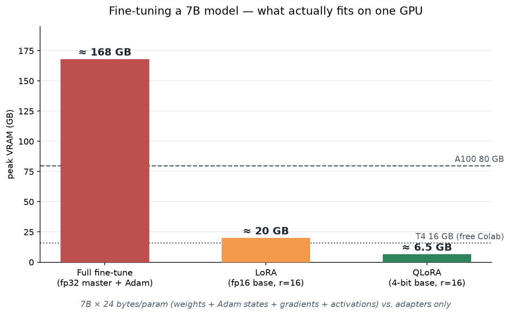
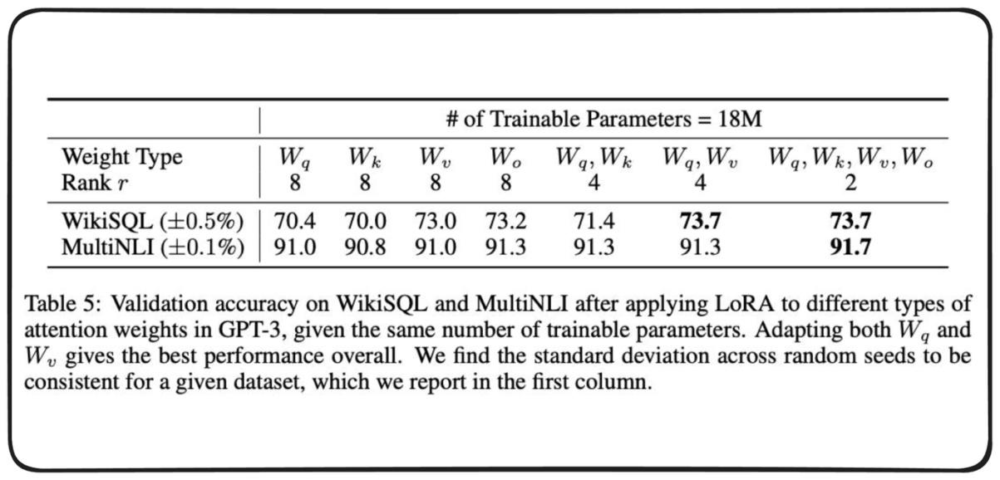
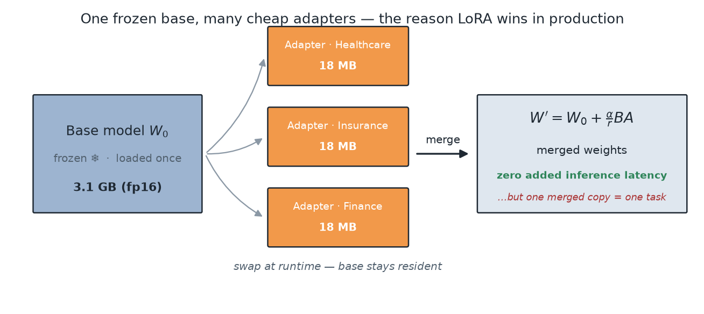
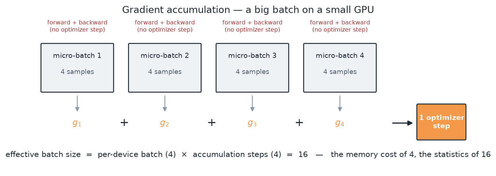

# Fine-Tuning LLMs — changing the weights when prompting and retrieval can't buy the behavior you need

> **TL;DR.** Prompting changes the *context*; fine-tuning changes the **weights**. You reach for it when you need a **behavior, format, or domain style** baked in — not when you need facts, which is [RAG](RAG.md)'s job. The lifecycle is **pre-training** (next-token prediction on web-scale text → a *base* model that completes, not converses) → **SFT / instruction tuning** (supervised `(prompt, response)` pairs → a model that follows instructions) → **alignment** (RLHF/DPO → a model that follows them *the way humans prefer*). Full fine-tuning is off the table for most people on arithmetic alone: a 7B model needs ≈ **24 bytes/param** once you count fp32 master weights, Adam's two states, gradients and activations — ≈ **168 GB**, or two A100s, to train a model that *infers* in 14 GB. **PEFT** dodges this: freeze `W₀`, learn a low-rank update `ΔW = BA`, and train **~0.1–2%** of the parameters. **LoRA** is the one that won — `W' = W₀ + (α/r)·BA` — and it buys three things beyond memory: **cheap task switching** (18 MB adapters over one resident base), **composability** (quantize the base → **QLoRA**, 7B on a free T4), and **zero added inference latency** *if* you merge. 🎯 The sentence that wins the question: *"Fine-tuning teaches the model **how to behave**; RAG gives it **what to know** — if your failure is a wrong fact, fine-tuning is the wrong tool."* `(certain)`

**Where it fits:** Lecture 4 of the *Advanced AI Agents* track (the session opened with an [MCP](Model%20Context%20Protocol.md) recap, then pivoted). It is the first lecture in this track that touches **model weights** rather than orchestration — everything before it ([Prompt Engineering](Prompt%20Engineering.md), [RAG](RAG.md), [AI Agents — Foundations](AI%20Agents%20%E2%80%94%20Foundations.md), [Agentic Workflows](Agentic%20Workflows.md), [MCP](Model%20Context%20Protocol.md)) improves the model's *inputs and scaffolding*. Its sequel is [Distributed Training for LLMs](Distributed%20Training%20for%20LLMs.md), which picks up exactly where the single-GPU memory wall stops you.
**Prereqs:** [LLM](LLM.md) (tokens, context window, decoding), [RNN · LSTM · Transformers](../Machine%20Learning/NLP/RNN%20%C2%B7%20LSTM%20%C2%B7%20Transformers.md) (attention, `Wq/Wk/Wv`, decoder-only stack), [Weight Initialization & Optimizers](../Machine%20Learning/Neural%20Networks/Weight%20Initialization%20&%20Optimizers.md) (Adam's state, learning-rate schedules), [RAG](RAG.md) (the alternative you must rule out first).

> 🧠 **Start here, not at the top.** Jump straight to the [Self-Test](#-self-test), answer cold, then read **only** the sections you missed — a 5-minute pass instead of 30. *([why](../_STUDY%20LOOP.md))*

---

> ### ⚡ Fast Pass — 5 minutes
> **Model:** Freeze the giant pre-trained matrix `W₀`. Learn a **skinny correction** beside it — two thin matrices `B` (d×r) and `A` (r×k) whose product is the same shape as `W₀`. Train ~1% of the parameters, add the result back at inference.
> **Core:**
> - `W' = W₀ + (α/r)·B·A`, rank `r ≪ d,k`; `A` ~ Gaussian, **`B` = 0** so training starts as an exact no-op.
> - Trainable params per layer = `r·(d + k)` instead of `d·k`. For 1024×1024 at r=8: **16,384 vs 1,048,576 = 1.6%**.
> - Full FT memory ≈ **24 bytes/param** (4 weights + 8 Adam + 4 grads + 8 activations). 7B ⇒ ≈168 GB.
> - `effective batch = per-device batch × grad-accum steps × #GPUs`.
> - SFT loss = next-token cross-entropy **masked to the response tokens only**.
> **Traps:** ① fine-tuning to inject *facts* (use RAG); ② forgetting to mask the prompt out of the loss; ③ training a **base** model but evaluating with an **instruct** chat template; ④ thinking `α` is a learning rate — it's a fixed scale on `ΔW`.
> 🎯 **Kill-shot:** *"LoRA works because the **update** is low-rank, not the model — adaptation moves the weights along a tiny intrinsic subspace, so you can parameterize `ΔW` with two thin matrices and lose almost nothing."*

---

## Table of Contents
1. [Intuition / Mental Model — the LLM lifecycle](#1-intuition--mental-model--the-llm-lifecycle)
2. [When to Fine-Tune — and When Not To](#2-when-to-fine-tune--and-when-not-to)
3. [The Formal Core — the SFT objective](#3-the-formal-core--the-sft-objective)
4. [The Memory Wall — why full fine-tuning is off the table](#4-the-memory-wall--why-full-fine-tuning-is-off-the-table)
5. [PEFT and LoRA — the mechanism](#5-peft-and-lora--the-mechanism)
6. [QLoRA — quantization on top](#6-qlora--quantization-on-top)
7. [The Data — formats, templates, and quality](#7-the-data--formats-templates-and-quality)
8. [Worked Example — rank arithmetic by hand](#8-worked-example--rank-arithmetic-by-hand)
9. [Code / Implementation](#9-code--implementation)
10. [When It Breaks](#10-when-it-breaks)
11. [Production & LLMOps Notes](#11-production--llmops-notes)
12. [Interview Lens](#12-interview-lens)
13. [Alternatives & How to Choose](#13-alternatives--how-to-choose)
- [🧠 Self-Test](#-self-test)

---

## 1. Intuition / Mental Model — the LLM lifecycle

A model you download is not one artifact; it is a **stage in a pipeline**, and which stage you got determines what you must do next.


*Source: Scaler lecture deck.*

| Stage | Data | What it produces | What it can't yet do |
|---|---|---|---|
| **1. Pre-training** | trillions of tokens of raw web text, self-supervised | a **base model** — a next-token predictor with a world model inside it | follow an instruction; hold a conversation; know when to stop |
| **2. SFT / instruction tuning** | curated `(prompt, response)` pairs, human-written | a model that **answers the question you asked** in the format you asked for | reliably prefer the *better* of two acceptable answers |
| **3. Alignment (RLHF / DPO)** | human **preference** rankings over model outputs | a model tuned to what humans actually rate highly — helpful, harmless, honest | — |

**The single most useful thing to internalize: a base model is not broken, it's just literal.** Ask `Qwen2.5-1.5B` (no `-Instruct` suffix) *"What are three benefits of regular exercise?"* and a good base model may well continue with *"What are three benefits of a Mediterranean diet? What are three benefits of…"* — because on the internet, that string is most often followed by more questions in a list. It is doing its job perfectly. **Instruction tuning is what teaches it that a question is a request, not a pattern to continue.** `(certain)`

```
 base model  ──SFT──▶  instruct model  ──RLHF/DPO──▶  aligned chat model
 "completes"          "obeys"                        "obeys the way people prefer"
     ▲                    ▲
     │                    └── this is the step this note is about
     └── someone else spent $10M+ here; you almost never redo it
```

🎯 *"Pre-training buys knowledge, SFT buys obedience, alignment buys taste."*

---

## 2. When to Fine-Tune — and When Not To

This is the question interviewers actually ask, and the one most people get backwards. Work **down** this ladder and stop at the first rung that solves your problem — each step down costs an order of magnitude more effort.

```
1. Prompt engineering ──▶ 2. Few-shot examples ──▶ 3. RAG ──▶ 4. Fine-tuning ──▶ 5. Pre-training
   hours                    hours                   days       weeks              never (for you)
```

**The decisive test — is your failure a *knowledge* failure or a *behavior* failure?**

| Symptom | Right tool | Why |
|---|---|---|
| "It doesn't know our Q3 policy / this API / today's price" | **RAG** | facts change; weights are a terrible place to store things that go stale, and you can't cite a weight |
| "It won't reliably emit our JSON schema / SQL dialect / house tone" | **Fine-tune** | this is a *format and style* prior — exactly what weights encode well |
| "It's great but the prompt is 4,000 tokens of instructions and examples" | **Fine-tune** | you can distil that prompt into the weights and cut cost/latency on every call |
| "It hallucinates citations" | **RAG + guardrails** | fine-tuning on more examples teaches it to hallucinate *more fluently* |
| "It's too slow / too expensive at 400B" | **Fine-tune a small model** | a well-tuned 1.5–8B often matches a giant general model *on one narrow task* |

⚠️ **The trap, stated plainly: fine-tuning is bad at teaching facts.** A fact seen a handful of times in a fine-tuning set does not reliably become retrievable knowledge — but it *does* reliably teach the model the **style of confidently asserting things in that shape**. That is the mechanism behind "fine-tuning increased my hallucinations." If the answer must be *current* or *citable*, it belongs in the context window, not the weights. `(certain)`

**And they compose.** The strongest production pattern is usually **fine-tune for the format + RAG for the facts**: tune a small model to emit your exact schema and follow your tool-calling conventions, then feed it retrieved context at run time.

---

## 3. The Formal Core — the SFT objective

**Pre-training and SFT use the same loss.** That surprises people, and it's the cleanest thing to be able to say.


*Source: Scaler lecture deck.*

For a token sequence `x₁…x_T`, both stages minimize **causal cross-entropy**:

```
L = − Σ_t  log P(x_t | x_<t ; θ)
```

Every position predicts the next token; the softmax runs over the whole vocabulary (~152k for Qwen2.5, ~50k for GPT-2-era models); the loss compares that distribution against the token that actually came next. Masked self-attention is what makes this legal in parallel — position `t` cannot see `t+1`.

**What changes between pre-training and SFT is not the loss — it's the data and the mask.**

- **Pre-training:** `x` is raw text (`"The cat sat on the mat"`). Loss on **every** token.
- **SFT:** `x` is a formatted `(prompt, response)` pair. Loss on the **response tokens only**.

```
  <|im_start|>user
  Classify the sentiment: "this movie was great"<|im_end|>     ← prompt: masked out (label = -100)
  <|im_start|>assistant
  Positive<|im_end|>                                            ← response: loss computed HERE
```

**Why mask the prompt?** You are not trying to teach the model to *generate user questions* — that capability it already has, and spending gradient on it dilutes the signal you care about. Training on completions only is typically the difference between a model that answers and a model that rambles into a new question. TRL exposes this as `completion_only_loss` and applies it by default for prompt–completion datasets — but **verify it on your version and dataset shape** rather than assuming. `(likely — behavior has moved across TRL releases)`

> ⚠️ **The subtle version of this trap:** in a *multi-turn* conversation, the assistant's earlier turns are legitimate training targets but the user's turns never are. If your masking is naive ("everything after the first assistant tag"), you will train on user turns 2..N. Check what your collator actually masks.

**The three symbols that carry the rest of this note:**

| Symbol | Meaning |
|---|---|
| `W₀` | a frozen pre-trained weight matrix, shape `d × k` |
| `ΔW` | the update fine-tuning wants to apply — same shape `d × k` |
| `r` | the **rank** of the low-rank factorization of `ΔW`, with `r ≪ d, k` |

Full fine-tuning learns `ΔW` directly, with `d·k` free parameters. Everything in §5 is a way of not doing that.

---

## 4. The Memory Wall — why full fine-tuning is off the table

Do the arithmetic once and you'll never forget why PEFT exists. **Inference memory is not training memory** — this is where the intuition breaks.


*Source: Scaler lecture deck.*

| Component | Bytes / param | Why it exists |
|---|---|---|
| **fp32 master weights** | 4 | mixed-precision training keeps an fp32 copy so tiny updates don't vanish in fp16 rounding |
| **Adam optimizer states** | 8 | momentum `m` *and* variance `v`, both fp32, both the full size of the model |
| **Gradients** | 4 | one per weight |
| **Activations + temp** | ~8 | cached forward values needed by backprop — scales with **batch × sequence length**, not just params |
| **TOTAL** | **≈ 24** | |

```
7B model, full fine-tune:  7 × 10⁹ × 24 B  ≈  168 GB      →  2× A100-80GB, minimum
7B model, fp16 inference:  7 × 10⁹ × 2 B   ≈   14 GB      →  one consumer card
```



**Three consequences worth stating out loud:**

1. **Training costs ~12× inference**, and the multiplier is dominated by the *optimizer*, not the weights. Swapping Adam for SGD-momentum halves the optimizer term — which is why 8-bit and paged optimizers (`paged_adamw_8bit`) are standard PEFT hygiene.
2. **Activations are the term you control at run time.** They scale with `batch × seq_len`, so the first lever when you OOM is a smaller micro-batch (recovered via gradient accumulation, §11) or **gradient checkpointing** — recompute activations in the backward pass instead of storing them, trading ~30% extra compute for a large memory win.
3. **"Spilling to system RAM" is not a solution.** It technically runs; over PCIe it is slow enough that the job stops being worth doing.

> 🚩 **The lecture's framing, and it's the right one:** you don't pick PEFT because it's clever. You pick it because the alternative *does not fit on the hardware you can rent*, and you'd rather spend the next two hours training than shopping for an 8-GPU node.

---

## 5. PEFT and LoRA — the mechanism

**PEFT** (Parameter-Efficient Fine-Tuning) is the family; **LoRA** (Low-Rank Adaptation) is the member that won. The idea is a single move:

> Don't learn `ΔW`. Learn a **low-rank factorization** of `ΔW`, and leave `W₀` frozen.

```
W' = W₀ + ΔW        →        W' = W₀ + (α/r)·B·A
     ↑                                  ↑
   d×k, frozen ❄               B: d×r,  A: r×k,   r ≪ d,k
```


### 5.1 Why the initialization is what it is

`A` is drawn from a Gaussian; **`B` is initialized to exactly zero**. Therefore `BA = 0` at step 0, so `W' = W₀` and **the adapted model is bit-identical to the base model before the first gradient step**. Training starts from the pre-trained function and departs smoothly — no random perturbation to recover from.

🎯 *"`B` is zero-initialized so the adapter starts as an exact no-op — you begin at the pre-trained model, not near it."* This is a very common interview probe. `(certain)`

> ⚠️ **Don't zero-init *both*.** If `A = B = 0` the gradient of the product is zero in both factors and the adapter never leaves the origin. You need exactly one side zero and one side random — the asymmetry is load-bearing.
>
> ⚠️ **Naming warning:** the LoRA paper uses `B ∈ ℝ^{d×r}` (zero-init) and `A ∈ ℝ^{r×k}` (Gaussian), and applies `BA`. Plenty of material — including some lecture whiteboards — swaps the letters and writes `A·B`. **The letters don't matter; which side is zero does.** Say "the one that touches the output is zero-initialized" and you're always right.

### 5.2 What `r` and `α` actually do

| Knob | What it is | How to set it |
|---|---|---|
| **`r` (rank)** | capacity of the update — how many independent directions `ΔW` may move in | 4–8 for style/format; 16–32 for a real domain shift; 64+ rarely pays. Typical default **16** |
| **`α` (alpha)** | a **fixed scalar** on the update: the effective delta is `(α/r)·BA` | conventionally `α = 2r` (so the scale stays ~2 as you sweep `r`). Notebook uses `r=16, α=32` |
| **`dropout`** | regularization on the adapter input | 0.05–0.1 on small datasets, 0 on large ones |

**The point of dividing by `r`:** it decouples the two knobs. Without it, raising `r` would silently raise the *magnitude* of the update too, and every rank sweep would also be an unintended learning-rate sweep. With `α/r`, you can change capacity without re-tuning everything else. `(certain)`

> **`α` is not a learning rate.** It scales `ΔW` at every forward pass, including at inference after merging. A learning rate scales the *step*; `α` scales the *result*.

### 5.3 Why low rank is enough — the intrinsic-dimension argument

This is the "why does this even work" question, and there is a real answer.


*Source: Li et al., "Measuring the Intrinsic Dimension of Objective Landscapes" (2018), as reproduced in the lecture deck.*

Constrain optimization to a **random low-dimensional subspace** of the full parameter space and measure how big that subspace has to be before the task is solvable. The answer is repeatedly *far* smaller than the parameter count. Aghajanyan et al. (2020) then showed the same holds for **fine-tuning pre-trained language models** — larger pre-trained models have *lower* intrinsic dimension for downstream adaptation.

**So the claim LoRA rests on is narrow and specific:** the *weights* `W₀` are genuinely high-rank and information-dense; the ***update*** needed to specialize them to one task is not. Adaptation is a nudge along a thin manifold, and a rank-`r` factorization is enough to express that nudge. `(likely — strong empirical support, not a theorem)`

### 5.4 Which matrices to adapt


*Source: Hu et al., "LoRA: Low-Rank Adaptation of Large Language Models" (2021), Table 5.*

At a **fixed budget of 18M trainable parameters**, the paper sweeps *where* to spend it. The result: spreading a *smaller* rank across **more matrices** beats a large rank on one. `Wq + Wv` at `r=4` (73.7 / 91.3) beats `Wq` alone at `r=8` (70.4 / 91.0); all four at `r=2` is the best MultiNLI number (91.7).

**Modern practice has moved past the paper's attention-only setting:** the common default now is to target **every linear layer**, attention *and* MLP — which is what the lecture notebook does:

```python
target_modules = ["q_proj", "k_proj", "v_proj", "o_proj",     # attention
                  "gate_proj", "up_proj", "down_proj"]        # MLP / feed-forward
```

The MLP block holds roughly ⅔ of a transformer's parameters, so excluding it leaves most of the model's capacity untouched. If you're memory-bound, `q_proj`+`v_proj` remains the highest-value pair to keep. `(certain)`

### 5.5 The three wins that aren't memory

Memory is the headline, but these are what make LoRA a *production* choice:

1. **Cheap task switching.** One frozen base stays resident; adapters are ~10–100 MB files you swap per request. Serving 20 fine-tuned variants no longer means 20 copies of a 14 GB model.
2. **Composability.** The base is frozen and untouched, so you can quantize it independently → **QLoRA** (§6).
3. **Zero added inference latency — but only if you merge.** `W' = W₀ + (α/r)BA` collapses back into a single matrix of the original shape, so a merged model runs at *exactly* base-model speed. Keep the adapter separate and you pay an extra small matmul per layer.



> **The trade-off is real, not free:** merging gives you speed and costs you flexibility — a merged checkpoint serves *one* task. Keeping adapters separate costs a few percent latency and buys you multi-tenancy. Modern serving stacks (vLLM, TGI) support **multi-LoRA**: one base in VRAM, many adapters batched together across concurrent requests. That's usually the right answer above ~3 variants. `(certain)`

---

## 6. QLoRA — quantization on top

LoRA shrinks the *trainable* parameters. The **frozen base is still sitting in VRAM in fp16** — 14 GB for a 7B — and that's now the dominant cost. QLoRA attacks it: **quantize the frozen base to 4-bit, keep the LoRA adapters in higher precision, and train as usual.**

```
QLoRA  =  4-bit frozen base  +  fp16/bf16 LoRA adapters  +  paged optimizer
          ↑ 14 GB → ~3.5 GB     ↑ the only thing with gradients
```

Three ingredients, each solving a specific problem:

| Ingredient | What it does | Problem solved |
|---|---|---|
| **NF4** (4-bit NormalFloat) | a data type whose quantization levels are spaced to be information-theoretically optimal for **normally distributed** weights — which pre-trained weights approximately are | naive int4 wastes levels on ranges the weights never occupy |
| **Double quantization** | quantizes the *quantization constants* themselves | reclaims ~0.4 bits/param of pure bookkeeping overhead |
| **Paged optimizers** | NVIDIA unified memory pages optimizer state to CPU RAM on spikes | the OOM crash at a long-sequence batch, hours into a run |

**Gradients flow *through* the frozen 4-bit weights to reach the adapters** — the base is dequantized to bf16 on the fly per layer during the forward/backward pass, used, and discarded. It is never stored dequantized. That's the whole trick.

**Cost:** slower per step (dequantization is real work — expect ~20–40% throughput loss vs fp16 LoRA), and a small quality gap that the QLoRA paper argues is close to zero at matched settings. **Benefit:** a 7B fine-tune fits on a **free-tier 16 GB T4**.

> 🎯 *"LoRA reduces what you **train**; QLoRA reduces what you **store**. They're orthogonal, which is why they stack."*

For quantization as a topic in its own right — post-training quantization, GPTQ/AWQ, and the serving-side story — see [Model Quantization](Model%20Quantization.md).

---

## 7. The Data — formats, templates, and quality

**The dataset is the fine-tune.** Hyperparameters are a rounding error next to data quality; this is the part that is actually hard.

### 7.1 What an SFT example looks like


*Source: Touvron et al., "Llama 2: Open Foundation and Fine-Tuned Chat Models" (2023), Table 5.*

Note what the annotator wrote: **both the prompt and the answer**. And note the second row — a *safety* demonstration is structurally identical to a *helpfulness* one. Refusal behavior is taught the same way as any other behavior: by showing it.

### 7.2 The three formats you'll meet

**Alpaca** — the classic instruction-tuning triple:
```json
{"instruction": "Classify the sentiment of this review.",
 "input": "This movie was a complete waste of time.",
 "output": "Negative"}
```
`instruction` is the task, `input` is the optional payload it operates on, `output` is the target. When `input` is empty, the instruction stands alone.

**ShareGPT / conversational** — multi-turn, closer to real chat:
```json
{"conversations": [{"from": "human", "value": "..."}, {"from": "gpt", "value": "..."}]}
```

**ChatML / `messages`** — the modern default, and what HF tooling expects:
```json
{"messages": [{"role": "system",    "content": "You are a helpful, accurate, concise assistant."},
              {"role": "user",      "content": "Classify the sentiment: ..."},
              {"role": "assistant", "content": "Negative"}]}
```

Converting Alpaca → `messages` is a one-function `.map()` (§9). Do it, because `messages` is what `apply_chat_template` consumes.

### 7.3 The chat template — the highest-yield detail in this whole note

A chat template is the **Jinja template stored on the tokenizer** that turns structured `messages` into the exact token string the model was trained on:

```
<|im_start|>system
You are a helpful assistant.<|im_end|>
<|im_start|>user
Classify the sentiment: ...<|im_end|>
<|im_start|>assistant
Negative<|im_end|>
```

🚩 **The bug that eats an afternoon: your training template and your inference template must be byte-identical.** Train with `<|im_start|>` and serve with `### Instruction:` and the model sees a distribution it has never encountered — output degrades in ways that look like "the fine-tune didn't work" rather than "I formatted the prompt wrong." **Always render one training example with `apply_chat_template(..., tokenize=False)` and read it with your eyes before launching a run.** `(certain)`

> A related gotcha: **base models often ship without a chat template at all** (or with a generic fallback), because they were never trained on one. When you SFT a base model you are *choosing* its template — so whatever you pick, you own it at inference. Also set `tokenizer.pad_token = tokenizer.eos_token` if it's missing, which base models frequently omit.

### 7.4 How much data, and of what quality

- **Quality ≫ quantity.** LIMA got strong instruction-following from **1,000** carefully curated examples. Thousands of good examples beat hundreds of thousands of scraped ones.
- **Rule of thumb:** ~1k for tone/format, ~10k for a genuine domain skill, and diminishing returns past ~50k for most narrow tasks. `(likely)`
- **Diversity of instructions matters more than volume of responses** — 1,000 different tasks teaches generalization; 1,000 paraphrases of one task teaches that one task.
- **Decontaminate.** If your eval set leaked into training, your eval measures memorization. Check n-gram overlap before you trust a number.
- The lecture used **`yahma/alpaca-cleaned`** — notable precisely because it is the *cleaned* variant; the original Alpaca set (generated by `text-davinci-003`) carries known label errors, empty outputs, and hallucinated references.

Building and curating these sets is its own discipline — see [[Dataset Engineering for LLMs]].

---

## 8. Worked Example — rank arithmetic by hand

Do this once with small numbers and LoRA's economics become obvious.

**Setup.** One weight matrix, `W₀`, of shape `10 × 10`. Choose rank `r = 2`.

```
Full fine-tuning:   train all of W₀            = 10 × 10          = 100 parameters

LoRA:               B is 10 × 2                = 20
                    A is  2 × 10               = 20
                                                 ────
                                                  40 parameters   = 40% of full
```

At toy sizes LoRA looks unimpressive — 40 vs 100. **The win is asymptotic**, because `d·k` grows quadratically while `r·(d+k)` grows linearly:

| `d × k` | Full (`d·k`) | LoRA at `r=8` (`r·(d+k)`) | Trainable share |
|---|---|---|---|
| 10 × 10 | 100 | 160 | **160%** — *worse* |
| 100 × 100 | 10,000 | 1,600 | 16% |
| 1,024 × 1,024 | 1,048,576 | 16,384 | **1.6%** |
| 4,096 × 4,096 | 16,777,216 | 65,536 | **0.4%** |

> ⚠️ **The break-even is real and worth knowing:** LoRA only saves parameters when `r < (d·k)/(d+k)`. At `d=k=10, r=8` the factorization is *larger* than the thing it replaces. Nobody hits this in practice at transformer dimensions — but being able to state the condition shows you understand it as a factorization, not a magic setting.

**Now the whole model.** Qwen2.5-1.5B, `r=16`, adapters on all 7 linear projections in all 28 layers:

```
trainable ≈ 18.5M  /  1.54B total  ≈  1.2%
```

That is the number the notebook prints — and the reason a 1.5B model fine-tunes comfortably inside a free Colab session.

---

## 9. Code / Implementation

The lecture build: **Qwen2.5-1.5B (base, not Instruct)** + **`yahma/alpaca-cleaned`** + **PEFT** + **TRL's `SFTTrainer`**.

> ⚠️ **API currency — read this before you copy any SFT snippet, including the lecture's.** TRL's `SFTTrainer` signature changed materially:
> - **`tokenizer=` was removed in v0.16** → use **`processing_class=`**.
> - **`max_seq_length` was deprecated (PR #2306) and removed in v0.20** → use **`max_length` on `SFTConfig`**.
> - `packing`, `dataset_text_field` and friends belong on **`SFTConfig`**, not on the trainer.
>
> As of **TRL 1.6.0 (June 2026)** that is the shape. The lecture notebook uses the pre-0.16 form (`tokenizer=`, `max_seq_length=` on the trainer) and will raise `TypeError: SFTTrainer.__init__() got an unexpected keyword argument` on any current install. Most SFT tutorials online are still on the old signature — check your installed version, don't trust the blog. `(certain — per the TRL docs and issue tracker; see Sources at the bottom of this section)`
>
> **`transformers` v5 moved three more things** (the corrected lecture notebook, *Finetuning_final*, broke on exactly these):
> - **`torch_dtype=` → `dtype=`** on `from_pretrained`.
> - **`warmup_ratio` was removed** → use **`warmup_steps`**, which now takes a *float < 1* as a ratio of total steps (same behavior) or an *int ≥ 1* as an absolute count.
> - **`logging_dir` was removed** → set the **`TENSORBOARD_LOGGING_DIR`** environment variable *before* building the config; the TensorBoard callback reads it at startup.
>
> **Pin your versions.** A working, verified-end-to-end set: `transformers==5.15.0`, `trl==1.10.0`, `peft==0.20.0`, `datasets==5.0.1`, `accelerate==1.14.0`. And **don't `pip install -U torch` on Colab** — the runtime already ships a driver-matched build, and reinstalling can pull a mismatched CUDA wheel.

### 9.1 Configuration

```python
MODEL_NAME   = "Qwen/Qwen2.5-1.5B"       # BASE model — no -Instruct suffix.
                                          # Fine-tuning an already-instruct model is also valid,
                                          # but then you're editing someone else's SFT, not doing your own.
DATASET_NAME = "yahma/alpaca-cleaned"
MAX_LENGTH   = 512                        # longest sequence the model will see; drives activation memory

# LoRA
LORA_R          = 16                      # rank — capacity of ΔW
LORA_ALPHA      = 32                      # = 2r, the conventional pairing
LORA_DROPOUT    = 0.05                    # regularization; 2k examples is a small dataset
TARGET_MODULES  = ["q_proj","k_proj","v_proj","o_proj",      # attention
                   "gate_proj","up_proj","down_proj"]         # MLP — ⅔ of the params live here

# Training
LEARNING_RATE   = 2e-4                    # ~10× a full fine-tune's LR: few params, freshly initialized,
                                          # and the frozen base can't be damaged by a big step
BATCH_SIZE      = 4
GRAD_ACCUM      = 4                       # effective batch = 4 × 4 = 16
WARMUP_RATIO    = 0.03                    # passed as `warmup_steps=0.03` on transformers v5:
                                          # a float < 1 is still read as a ratio of total steps
```

**Why `lr=2e-4` and not `2e-5`.** Full fine-tuning uses a tiny LR because you are perturbing pre-trained weights that took millions of dollars to produce — overshoot and you destroy them. In LoRA those weights are **frozen and unreachable**; you're training a small, randomly-initialized module from scratch. There is nothing delicate to break, so you can move ~10× faster. 🎯 `(certain)`

### 9.2 Data formatting

```python
def format_alpaca_to_chat(example):
    """Alpaca triple → ChatML messages. The `input` field is optional and must be
    folded into the user turn only when non-empty — a stray 'Input:' header on
    every example teaches the model to expect one."""
    user = example["instruction"]
    if example.get("input", "").strip():
        user = f"{example['instruction']}\n\nInput: {example['input']}"
    return {"messages": [
        {"role": "system",    "content": "You are a helpful, accurate, and concise assistant."},
        {"role": "user",      "content": user},
        {"role": "assistant", "content": example["output"]},
    ]}

dataset = (raw_dataset.shuffle(seed=42)
                      .select(range(2000))
                      .map(format_alpaca_to_chat, remove_columns=raw_dataset.column_names))

# ALWAYS eyeball the rendered template before training — this is the cheapest bug you'll ever catch.
print(tokenizer.apply_chat_template(dataset[100]["messages"], tokenize=False))
```

### 9.3 Applying LoRA

```python
from peft import LoraConfig, get_peft_model

peft_config = LoraConfig(
    r=LORA_R, lora_alpha=LORA_ALPHA, lora_dropout=LORA_DROPOUT,
    bias="none",                 # don't train biases — negligible capacity, breaks clean merging
    task_type="CAUSAL_LM",       # tells PEFT which head/wrapping to use
    target_modules=TARGET_MODULES,
)
lora_model = get_peft_model(model, peft_config)
lora_model.print_trainable_parameters()
# trainable params: 18,464,768 || all params: 1,562,179,072 || trainable%: 1.1820
```

That printed percentage is your sanity check. **If it reads 100%, your `target_modules` didn't match any module names and you're about to full-fine-tune by accident** (or OOM trying). If it reads 0.01%, you probably hit only one projection.

### 9.4 Training

```python
import os, torch
from trl import SFTConfig, SFTTrainer

os.environ["TENSORBOARD_LOGGING_DIR"] = "./sft-lora-qwen/runs"   # ← replaces logging_dir (v5)

args = SFTConfig(
    output_dir="./sft-lora-qwen",
    num_train_epochs=1,                    # 1–3; more overfits a 2k-example set fast
    per_device_train_batch_size=4,
    gradient_accumulation_steps=4,         # effective batch 16 at the memory cost of 4
    learning_rate=2e-4,
    lr_scheduler_type="cosine",
    warmup_steps=0.03,                     # ← was warmup_ratio; a float < 1 still means "ratio".
                                           # Avoids a huge first step into a fresh adapter.
    max_grad_norm=1.0,                     # clip — cheap insurance against an exploding step
    optim="paged_adamw_8bit",              # 8-bit states + CPU paging on spikes
    bf16=torch.cuda.is_bf16_supported(),   # prefer bf16; fall back to fp16 only on old cards
    fp16=not torch.cuda.is_bf16_supported(),
    gradient_checkpointing=True,           # trade ~30% compute for a large activation saving
    gradient_checkpointing_kwargs={"use_reentrant": False},
    max_length=512,                        # ← was max_seq_length; moved here
    packing=True,                          # concatenate short examples to fill the window —
                                           # big throughput win, but see the caveat below
    logging_steps=1,
    report_to="tensorboard",
    seed=42,
)

trainer = SFTTrainer(
    model=lora_model,
    processing_class=tokenizer,            # ← was tokenizer=
    train_dataset=dataset,
    args=args,
    peft_config=peft_config,
)
trainer.train()
```

> ⚠️ **`packing=True` deserves a second look.** It concatenates multiple short examples into one `max_length` sequence so you stop paying for padding — a large throughput win on short-example datasets like Alpaca. The cost is **cross-contamination**: without correct position-id resetting and block-diagonal attention masking, tokens from example *i* can attend to example *i−1*. Modern TRL handles this ([FlashAttention](../Machine%20Learning/NLP/RNN%20%C2%B7%20LSTM%20%C2%B7%20Transformers.md)-based masking), but it is worth knowing that "packing" is not free, and turning it off is the first thing to try if a packed run underperforms an unpacked one. `(likely)`

### 9.5 Merge and serve

```python
trainer.model.save_pretrained(OUTPUT_DIR)              # just the adapter: 18.5M params,
                                                       # ~37 MB in fp16 / ~74 MB in fp32

merged = lora_model.merge_and_unload()                 # W₀ + (α/r)BA, folded in place
merged.save_pretrained(f"{OUTPUT_DIR}/merged_model", safe_serialization=True)
tokenizer.save_pretrained(f"{OUTPUT_DIR}/merged_model")  # ← ship the tokenizer WITH it:
                                                         # the chat template lives here, and a merged
                                                         # model without its template is unusable
```

### 9.6 Evaluate honestly — the step the notebook gets right

```python
# Same prompts, before and after. Keep the base responses from BEFORE training.
for prompt, before in zip(test_prompts, base_responses):
    after = generate_response(fine_tuned_model, tokenizer, prompt)
    print(f"BEFORE: {before}\nAFTER:  {after}\n")
```

Capturing base-model outputs **before** you train and diffing them afterwards is the minimum bar. On instruction tuning the change is usually unmistakable: the base model continues the pattern (often emitting *more questions*), the tuned model answers and stops. Anything more rigorous — an eval set, LLM-as-judge, per-capability scoring — is in [Evaluating LLMs](Evaluating%20LLMs.md).

*Sources for the API-currency note: [TRL SFT Trainer docs](https://huggingface.co/docs/trl/en/sft_trainer) · [huggingface/trl#2649](https://github.com/huggingface/trl/issues/2649) · [SFTTrainer max_seq_length TypeError](https://github.com/arcee-ai/DistillKit/issues/23)*

---

## 10. When It Breaks

| Failure | What you see | Fix |
|---|---|---|
| **Fine-tuned to inject facts** | confident, fluent, *wrong* answers — worse than before | move facts to [RAG](RAG.md); fine-tune for format only |
| **Prompt not masked out of loss** | model answers, then generates the *next user question* | completion-only loss; verify what the collator masks |
| **Template mismatch train vs serve** | "the fine-tune did nothing" | render and diff both strings; ship the tokenizer with the model |
| **Catastrophic forgetting** | great at your task, noticeably worse at everything else | lower `r`, fewer epochs, lower LR, mix ~5–10% general instruction data back in |
| **Overfitting a small set** | train loss → ~0, outputs become verbatim regurgitation | 1–2 epochs, dropout 0.05–0.1, hold out a validation split and watch it |
| **`trainable% = 100`** | OOM, or a silent full fine-tune | `target_modules` matched nothing — print the module names |
| **Loss is `nan` in fp16** | dead run | use **bf16** on Ampere+ (far wider dynamic range); fp16 needs careful loss scaling |
| **OOM mid-run, not at start** | crashes hours in, on one long batch | it's *activations*, not weights — lower micro-batch + raise grad-accum, gradient checkpointing, paged optimizer |
| **Merged model is worse than the adapter** | subtle quality drop after merge | merging into a **quantized** base is lossy — merge into the fp16 base, then quantize |

**Catastrophic forgetting deserves a longer word**, because it's the failure people don't test for. Fine-tuning on 2,000 SQL examples will make a model better at SQL and *quietly worse* at the general reasoning it had before — you won't see it unless your eval covers capabilities you didn't train. LoRA is **more resistant** than full fine-tuning (the base weights literally cannot move), but low `r` + few epochs + a slice of general data in the mix is the standard mitigation. Always keep a small held-out set of *off-task* prompts and check them after training. `(certain)`

---

## 11. Production & LLMOps Notes

**Effective batch size — the knob that reconciles memory with statistics.**



```
effective_batch = per_device_batch × grad_accum_steps × num_gpus
                =        4         ×        4         ×    1      =  16
```

Run several micro-batches, **accumulate** their gradients, step the optimizer once. You get the gradient statistics of a batch of 16 while never holding more than 4 examples' activations in memory. It is the single most useful lever when you're memory-bound, and it costs only wall-clock time.

> ⚠️ Accumulation is a *sum*, so your loss normalization must divide by the number of accumulated tokens — otherwise the effective learning rate silently scales with `grad_accum_steps`. HF's `Trainer` handles this, but hand-rolled loops routinely get it wrong.

**Serving.**
- **Merge** for a single-purpose endpoint: base-model latency, one task per checkpoint.
- **Keep adapters separate** for multi-tenant: vLLM/TGI multi-LoRA holds one base in VRAM and batches requests across many adapters. Break-even is around 3+ variants.
- **Adapters are ~10–100 MB.** Version them like code: pin the exact base-model revision, the data snapshot, and the seed. **An adapter is meaningless without its base — record the base commit hash in the adapter's metadata.**

**Cost.** A 1.5B LoRA run on 2k examples is minutes on a free T4. A 7B QLoRA on 50k examples is hours on one A100. The expensive part of a fine-tuning project is almost never the GPU — it's building and cleaning the dataset, and building the eval that tells you whether the run helped.

**Evaluation and monitoring.** Fine-tuning is a *model change*, so it needs the discipline of one: a frozen eval set that predates the run, a base-model baseline, an off-task regression check (forgetting), and — in production — the same drift monitoring as any model. Prompt-injection surface doesn't shrink because you fine-tuned; see [Prompt Security](Prompt%20Security.md).

**Reproducibility.** Set `seed`, pin `transformers`/`peft`/`trl` versions (§9's currency warning is exactly why), and log the rendered template of example #0 into your run artifacts. Future-you will want to know what the model actually saw.

---

## 12. Interview Lens

**What the question is really testing:** whether you know that fine-tuning is *the expensive option you justify*, not the default. Reaching for it first is the junior answer.

**Likely follow-ups:**

| Question | Crisp answer |
|---|---|
| "Fine-tuning vs RAG?" | 🎯 *"Fine-tuning changes **how** the model behaves; RAG changes **what** it knows. Facts that change or need citing go in the context window."* |
| "Why does LoRA work?" | The **update** is low-rank even though the weights aren't — adaptation lives in a small intrinsic subspace, so `ΔW ≈ BA` with `r ≪ d,k` loses little. |
| "Why is `B` initialized to zero?" | So `BA = 0` at step 0 and the adapted model *is* the base model — training departs smoothly from pre-trained behavior. Zero-init both and nothing ever trains. |
| "What's `α`?" | A fixed scale on the update, `(α/r)·BA`. Dividing by `r` decouples capacity from magnitude so a rank sweep isn't also a step-size sweep. It is **not** a learning rate. |
| "Which modules do you target?" | Default to all linear layers (attention + MLP). If memory-bound, `q_proj`+`v_proj` — the paper's Table 5 shows spreading a smaller rank across more matrices beats a big rank on one. |
| "LoRA vs QLoRA?" | LoRA cuts what you **train**; QLoRA also cuts what you **store** (4-bit NF4 frozen base). Orthogonal, so they stack. QLoRA costs ~20–40% throughput. |
| "Does LoRA slow down inference?" | Not if you **merge** — `W₀ + (α/r)BA` is the same shape, so it's identical to the base. Unmerged costs one extra small matmul per adapted layer. |
| "Why a 10× higher LR than full FT?" | The pre-trained weights are frozen and can't be damaged; you're training a small freshly-initialized module. |
| "How much data?" | Quality ≫ quantity — LIMA got there on 1,000 curated examples. ~1k for format, ~10k for a domain skill. |
| "What breaks first in production?" | Template mismatch between training and serving. Then catastrophic forgetting on capabilities you didn't eval. |

**The senior move in any of these:** state the *cheaper* alternative you ruled out, and why. "We tried a system prompt with 6 exemplars first; it hit 82% schema compliance and the prompt cost 3k tokens a call, so we distilled it into a LoRA and got 97% at 400 tokens" is worth more than any amount of LoRA math.

---

## 13. Alternatives & How to Choose

| Approach | Trains weights? | Reach for it when | Cost |
|---|---|---|---|
| **Prompt engineering** | no | always try first | hours |
| **Few-shot / in-context** | no | you have a handful of exemplars and context budget | hours, then per-call tokens |
| **[RAG](RAG.md)** | no | the gap is *knowledge*, especially changing or citable knowledge | days |
| **Full fine-tuning** | all | you have >100k examples, a big domain shift, and a multi-GPU node | very high |
| **LoRA / QLoRA** | ~0.1–2% | the default whenever you genuinely need weight changes | hours on one GPU |
| **Prefix / prompt tuning** | ~0.01% | many tasks, extreme param budget | mostly superseded by LoRA |
| **DoRA, rsLoRA** | ~0.1–2% | LoRA variants: decompose magnitude/direction (DoRA), fix `α` scaling at high rank (rsLoRA) — modest gains, drop-in in PEFT | same as LoRA |
| **RLHF / DPO** | all or adapters | you need *preference* alignment, not demonstration-following | high; needs preference data |
| **Distillation** | all | you want a small model to imitate a big one you already trust | medium |

**How to choose, in one line each:**
- Failure is a **fact** → RAG.
- Failure is a **format or style** → LoRA.
- You need it to **prefer** one good answer over another good answer → preference tuning (DPO is the practical default now — no reward model, no RL loop, just a classification-style loss on preference pairs). Worth its own note: [[RLHF & Preference Alignment]].
- It works but costs too much → distil into a smaller model, then LoRA that.

---

## 🧠 Self-Test

1. **A colleague fine-tunes a model on your company's 500-page policy PDF and reports it now hallucinates policy details *more* confidently. Diagnose it.**
   <details><summary>answer</summary>Fine-tuning is being used to inject <b>knowledge</b>, which is the wrong tool. A fact seen a handful of times doesn't become reliably retrievable, but the training <i>does</i> teach the model the <b>style</b> of confidently asserting policy-shaped statements. Result: more fluent, more confident, still wrong. Fix: put the policy in a retrieval index (<a href="RAG.md">RAG</a>) and cite it; fine-tune only if you also need a specific output <i>format</i>.</details>

2. **Write the LoRA update rule, give the shapes, and say how each factor is initialized — and why.**
   <details><summary>answer</summary><code>W' = W₀ + (α/r)·B·A</code> with <code>W₀ ∈ ℝ^{d×k}</code> frozen, <code>B ∈ ℝ^{d×r}</code>, <code>A ∈ ℝ^{r×k}</code>, <code>r ≪ d,k</code>. <b>A</b> is Gaussian-initialized, <b>B</b> is <b>zero</b>-initialized, so <code>BA = 0</code> at step 0 and the adapted model is exactly the base model — training departs smoothly from pre-trained behavior instead of from a random perturbation. Zero-initializing <i>both</i> would leave the product's gradient at zero in both factors and nothing would ever train. (Letter conventions vary; what matters is that exactly one side is zero.)</details>

3. **A 7B model runs inference in 14 GB. Why does fully fine-tuning it need ~168 GB, and which term dominates?**
   <details><summary>answer</summary>≈24 bytes/param vs 2 for fp16 inference: 4 (fp32 master weights) + <b>8 (Adam's two states)</b> + 4 (gradients) + ~8 (activations/temp). The <b>optimizer state</b> is the biggest single term — hence 8-bit and paged optimizers. Activations are the term that scales with <code>batch × seq_len</code>, which is why OOMs often hit mid-run rather than at startup, and why gradient checkpointing helps.</details>

4. **You set `r=8` on a 1024×1024 matrix. How many trainable parameters, and what fraction? When would this factorization actually be a loss?**
   <details><summary>answer</summary><code>r·(d+k) = 8·2048 = 16,384</code> vs <code>d·k = 1,048,576</code> → <b>1.6%</b>. It's a loss whenever <code>r ≥ (d·k)/(d+k)</code> — e.g. a 10×10 matrix at <code>r=8</code> costs 160 parameters to replace 100. The saving is asymptotic: <code>d·k</code> grows quadratically, <code>r·(d+k)</code> linearly.</details>

5. **Your fine-tune shows a clean falling training loss, but the served model behaves as if nothing changed. What do you check first?**
   <details><summary>answer</summary>The <b>chat template</b>. If training rendered <code>&lt;|im_start|&gt;user…</code> and serving sends a different format (or a raw string), the model sees a distribution it never trained on. Render one training example with <code>apply_chat_template(..., tokenize=False)</code>, capture the exact string your serving path sends, and diff them. Related: make sure you saved the tokenizer alongside the merged model — the template lives on the tokenizer.</details>

6. **What does `α` do, and why divide by `r`?**
   <details><summary>answer</summary><code>α</code> is a <b>fixed scalar</b> on the low-rank update: the effective delta is <code>(α/r)·BA</code>. Dividing by <code>r</code> decouples <b>capacity</b> from <b>magnitude</b> — without it, raising the rank would also silently raise the size of the update, making every rank sweep an unintended step-size sweep. Convention is <code>α = 2r</code>. It is applied at every forward pass including after merging, so it is <b>not</b> a learning rate.</details>

7. **When is a merged model the wrong choice?**
   <details><summary>answer</summary>When you serve <b>more than one</b> fine-tuned variant. Merging bakes one adapter into the weights: base-model latency, but one task per checkpoint and a full model copy each. Keeping adapters separate costs one extra small matmul per adapted layer and lets a multi-LoRA server (vLLM/TGI) hold <i>one</i> base in VRAM while batching requests across many adapters. Above ~3 variants, unmerged wins. Also avoid merging into a <b>quantized</b> base — that's lossy; merge into fp16, then quantize.</details>

8. **You fine-tune on 2,000 SQL examples and SQL accuracy jumps. What should you measure before shipping, and why?**
   <details><summary>answer</summary><b>Off-task capabilities</b> — catastrophic forgetting. Specializing degrades general reasoning in ways your SQL eval can't see. Keep a held-out set of prompts you <i>didn't</i> train on and compare against the base model. Mitigations: lower <code>r</code>, fewer epochs, lower LR, and mixing ~5–10% general instruction data back into the training set. LoRA is more resistant than full fine-tuning because the base weights can't move — but "more resistant" isn't "immune."</details>
