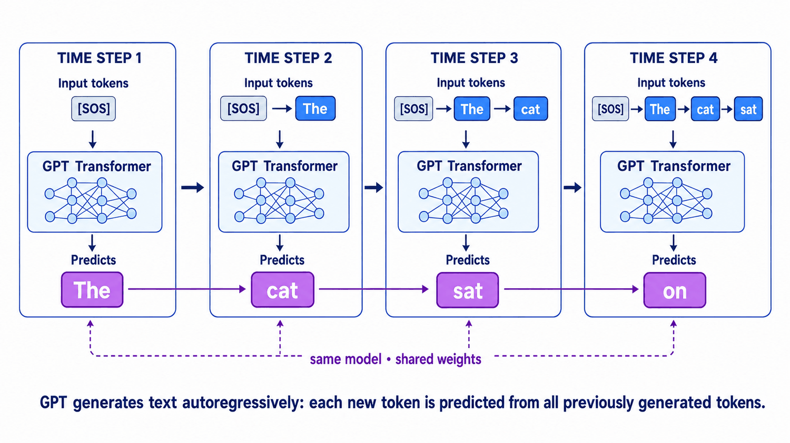
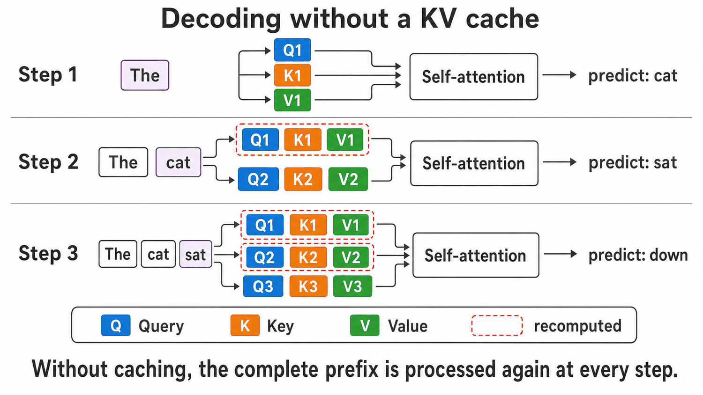
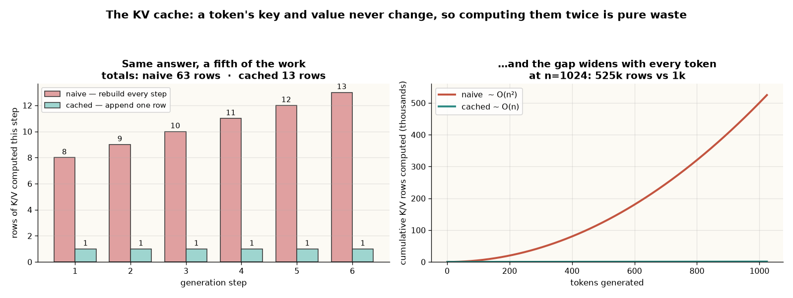
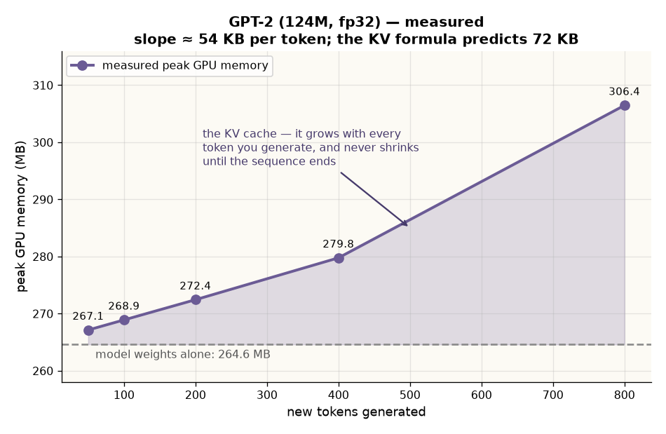
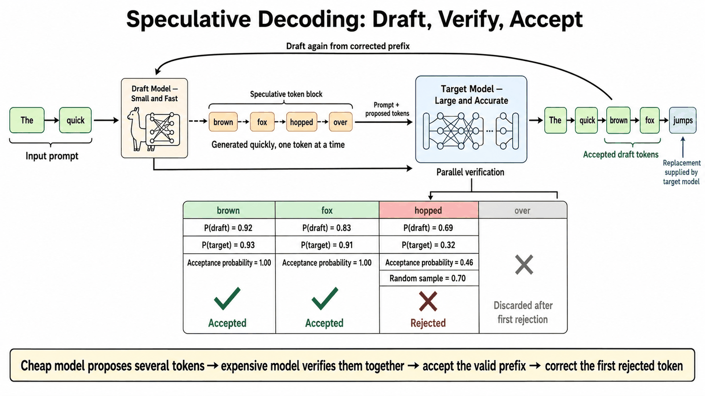
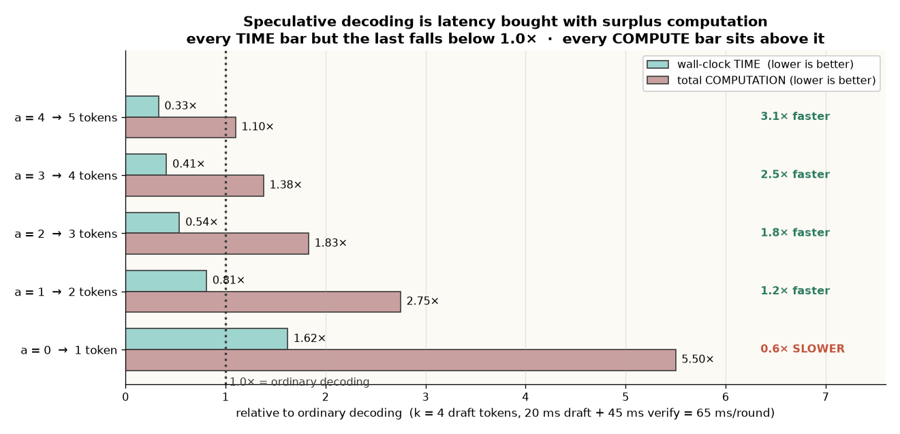

# LLM Inference Optimization — the KV cache and speculative decoding, from first principles

> **TL;DR.** Generation is slow for one reason: **to produce a single token the model reads every one of its weights out of memory**, and it cannot start the next token until this one exists. A 70 B model in 16-bit moves ~140 GB per token while the arithmetic units sit idle. Two optimisations attack that, and they are opposites. The **KV cache** removes *redundant computation* — a token's key and value never change, so computing them again every step is pure waste; caching turns `O(n²)` work into `O(n)` and **costs memory instead**. **Speculative decoding** removes *redundant memory sweeps* — a cheap draft model guesses the next `k` tokens, the target verifies all of them in **one** forward pass, and you commit `a + 1` tokens per sweep. It is **not** more efficient: it always does *more* arithmetic. It buys wall-clock latency with computation that was going to be wasted anyway. 🎯 The line that wins the question: *"A forward pass scoring one new position and a forward pass scoring five read exactly the same weights, exactly once — so four of those five positions are nearly free. Ordinary decoding throws that room away; speculative decoding finds something useful to put in it."* `(certain)`

**Where it fits:** The **algorithmic** half of inference speed — the companion to [Serving LLMs at Scale](Serving%20LLMs%20at%20Scale.md), which covers the *systems* half (prefill vs decode, TTFT/ITL, PagedAttention, continuous batching, TP/PP). That note tells you *why decode is memory-bound and how a server exploits it across many requests*; this note derives the two techniques that attack the bound *within a single request*, in enough depth to implement them. Third sibling: [Model Quantization](Model%20Quantization.md), which shrinks the bytes each sweep must move.
**Prereqs:** [RNN · LSTM · Transformers](../Machine%20Learning/NLP/RNN%20%C2%B7%20LSTM%20%C2%B7%20Transformers.md) (Q/K/V attention, the causal mask), [LLM](LLM.md) (autoregressive decoding, greedy vs sampling), [Serving LLMs at Scale](Serving%20LLMs%20at%20Scale.md) (the memory-bandwidth-bound argument — assumed, not re-derived).

> 🧠 **Start here, not at the top.** Jump straight to the [Self-Test](#-self-test), answer cold, then read **only** the sections you missed — a 5-minute pass instead of 40. *([why](../_STUDY%20LOOP.md))*

---

> ### ⚡ Fast Pass — 5 minutes
> **Model:** One token = one full sweep of every weight in the model. The chip is **waiting on memory**, not computing. Both optimisations below are moves against that one fact.
> **Core:**
> - **A token's `k` and `v` never change** (causal mask ⇒ nothing depends on the future), so cache them. Its `q` is read once and thrown away — hence **KV** cache, not QKV cache.
> - Naive decoding recomputes `O(n²)` K/V rows; cached is `O(n)`. Measured on a 13-token sequence: **63 rows vs 13**, identical outputs to float32 rounding (`2.4e-7`).
> - **`KV_bytes = 2 × layers × kv_heads × head_dim × ctx × batch × dtype_bytes`** — the cache trades compute for memory, and the memory is what caps concurrency.
> - Speculative decoding: draft `k` tokens cheaply → target verifies **all k in one pass** → accept the longest matching **prefix** → commit **`a + 1`** tokens (accepted run + the target's correction, *or* the bonus token on a full accept).
> - Break-even with `k=4`, 40 ms/pass, 5 ms/draft: `65/(a+1) < 40` ⇒ **`a ≥ 1`**.
> - **The output is exact** — identical token IDs to what the target alone would produce. A bad draft cannot corrupt it, only slow you down.
> **Traps:** ① thinking speculative decoding is an *efficiency* win — total computation always goes **up**; ② thinking the draft's tokens appear in the output — they are **inputs**, never outputs; ③ counting agreement past the first mismatch (everything after is unusable, not wrong); ④ expecting a speedup on a **fully batched server** — the whole mechanism assumes idle arithmetic; ⑤ pairing a draft and target with **different tokenizers** (the ID comparison becomes meaningless); ⑥ forgetting the KV cache in your memory budget and OOM-ing at long context.
> 🎯 **Kill-shot:** *"Speculative decoding is not compression and not approximation — it is **speculative execution**, the CPU branch-predictor trick applied to token generation. You spend arithmetic that was already idle to avoid a memory sweep, and you get the target model's exact output either way."*

---

## Table of Contents
1. [Intuition — one weight sweep, one token](#1-intuition--one-weight-sweep-one-token)
2. [The Cost Model — why a wide pass is nearly free](#2-the-cost-model--why-a-wide-pass-is-nearly-free)
3. [Attention, Just Far Enough — Q, K, V and the causal mask](#3-attention-just-far-enough--q-k-v-and-the-causal-mask)
4. [The KV Cache — derived, not memorised](#4-the-kv-cache--derived-not-memorised)
5. [What the KV Cache Costs — trading compute for memory](#5-what-the-kv-cache-costs--trading-compute-for-memory)
6. [Speculative Decoding — two dead ends, then the idea](#6-speculative-decoding--two-dead-ends-then-the-idea)
7. [The Verification Pass — and why a match *is* the target's token](#7-the-verification-pass--and-why-a-match-is-the-targets-token)
8. [The Acceptance Rule and the `a + 1` Law](#8-the-acceptance-rule-and-the-a--1-law)
9. [Worked Examples — the full range, `a = 4` down to `a = 0`](#9-worked-examples--the-full-range-a--4-down-to-a--0)
10. [The Ledger — time falls, computation rises](#10-the-ledger--time-falls-computation-rises)
11. [When Speculation Stops Helping](#11-when-speculation-stops-helping)
12. [The Knobs and the Variants](#12-the-knobs-and-the-variants)
13. [Code / Implementation](#13-code--implementation)
14. [When It Breaks](#14-when-it-breaks)
15. [Production & LLMOps Notes](#15-production--llmops-notes)
16. [Interview Lens](#16-interview-lens)
17. [Alternatives & How to Choose](#17-alternatives--how-to-choose)
- [🧠 Self-Test](#-self-test)

---

## 1. Intuition — one weight sweep, one token

A language model writes one token at a time. To produce the next token it runs a **forward pass** over everything written so far and reads the highest-scoring token off the output. To produce the token after that it runs again — and it **cannot start early**, because the token it just produced is part of the next pass's input.


*Source: Scaler lecture deck.*

A 200-token answer is therefore **200 forward passes, strictly one behind another**. There is no way to overlap them. This is why a large model feels slow to answer on hardware that is barely breaking a sweat.

Now the part that matters. To produce one token, the model reads **every one of its weights out of memory** and multiplies them against the current activations. For a 70 B-parameter model stored in 16-bit that is roughly **140 GB of data pulled from memory — for a single token.**

The arithmetic done with those weights is, by comparison, trivial. A modern accelerator performs hundreds of multiply-accumulates in the time it takes to fetch one weight. So during single-stream generation the hardware is not busy computing — it is **busy waiting for memory**, and the arithmetic units sit largely idle.

That is the **memory-bandwidth-bound** regime (derived in detail in [Serving LLMs at Scale](Serving%20LLMs%20at%20Scale.md#2-prefill-vs-decode--one-api-two-workloads)), and it has one enormous consequence:

> A forward pass that scores **one** new position and a forward pass that scores **five** read exactly the same weights, exactly once. The five-position pass does five times the arithmetic — but arithmetic was never the bottleneck. **In wall-clock terms the four extra positions are close to free.**

Ordinary decoding wastes that completely: it runs a full weight sweep and asks for a single token in return. Everything in §6–§12 is one idea — *find something useful to put in those spare positions.*

---

## 2. The Cost Model — why a wide pass is nearly free

Three numbers carry the rest of this note. They are illustrative, chosen to keep the arithmetic in your head, but the **shape** is real.

| Quantity | Value | Notes |
|---|---:|---|
| Target model, forward pass scoring **1** new position | **40 ms** | ordinary decoding: one pass, one token |
| Target model, forward pass scoring **5** new positions | **45 ms** | 5× the positions, **12% more time** |
| Draft model, forward pass scoring 1 new position | **5 ms** | a much smaller model, ~8× cheaper |

> **That 40 ms vs 45 ms row is where every saving in this note comes from.** If those two numbers were 40 and 200, speculative decoding would be pointless.

### Why the tokens still come out one at a time

None of this lets the target model *invent* five tokens at once. A forward pass over positions 1–5 predicts what follows *each* of positions 1–5 — but predicting what follows position 3 requires **the actual token at position 3 to already be sitting in the input**. The model can score positions in parallel; it cannot conjure their contents.

So the target can only run wide if something hands it candidates for those positions first. **That is the draft model's entire job** — and it is why the draft's tokens are *inputs*, a point §7 turns into a guarantee.

---

## 3. Attention, Just Far Enough — Q, K, V and the causal mask

You need exactly three facts about attention to derive the KV cache. Everything else is in [RNN · LSTM · Transformers](../Machine%20Learning/NLP/RNN%20%C2%B7%20LSTM%20%C2%B7%20Transformers.md).

**① The mechanism is three projections and a weighted average.**

```
scores  = Q @ K.T / sqrt(d_k)        # how much each query matches each key
weights = softmax(scores)            # normalised into a distribution per row
context = weights @ V                # a weighted average of the values
```

**② The causal mask stops a position reading the future.** Set the upper triangle to `-inf` (in practice `-1e9`) *before* the softmax, so those weights become exactly 0:

```python
mask = np.triu(np.ones_like(scores), k=1) * (-1e9)   # strictly-upper triangle
weights = softmax(scores + mask)
```

```
        the    cat    sat     on    the    mat
the   1.000  0.000  0.000  0.000  0.000  0.000     ← "the" sees only itself
cat   0.171  0.829  0.000  0.000  0.000  0.000
sat   0.138  0.086  0.776  0.000  0.000  0.000
on    0.271  0.040  0.055  0.634  0.000  0.000
the   0.354  ...
```

> ⚠️ **Use `-1e9`, not literal `-inf`.** `np.triu(ones, k=1) * -np.inf` gives `0 × -inf = nan` on the lower triangle, and the `nan` poisons the whole softmax. A large negative number behaves identically after the exponential and has no such edge case. *(A real bug from the lecture notebook, worth keeping.)*

**③ The consequence that the whole KV cache rests on:** because nothing attends forward, **a token's representation never depends on what comes after it.** `k` and `v` for `apple` are computed from `apple` (and its position) alone. Appending `red` to the sequence does not change them, now or ever.

---

## 4. The KV Cache — derived, not memorised

Watch what naive generation does. At every step it appends the new token, then rebuilds `K` and `V` for the **entire** sequence, scores, masks, and reads off the context vector for the newest position:


*Source: Scaler lecture deck.*

Run it on a 7-token prompt generating 6 tokens and count what it throws away:

```
after ' the': built K and V for  8 tokens, kept 1 row, threw away  7
after 'color': built K and V for  9 tokens, kept 1 row, threw away  8
after '  of': built K and V for 10 tokens, kept 1 row, threw away  9
after 'apple': built K and V for 11 tokens, kept 1 row, threw away 10
after '  is': built K and V for 12 tokens, kept 1 row, threw away 11
after ' red': built K and V for 13 tokens, kept 1 row, threw away 12

total rows of K/V computed: 63
```

Every one of those discarded rows came out **identical** to the previous step's, by fact ③ in §3. So keep them:

```python
K_cache = np.array([emb(w) for w in prompt])     # the prompt, processed ONCE
V_cache = K_cache.copy()

for word in to_generate:
    x_t = emb(word).reshape(1, -1)               # just the ONE new token
    K_cache = np.vstack([K_cache, x_t])          # one new key appended
    V_cache = np.vstack([V_cache, x_t])          # one new value appended

    q_t = x_t                                    # its query — used below, then gone
    weights_t = softmax(q_t @ K_cache.T / math.sqrt(d_k))
    context_t = weights_t @ V_cache
```

```
total rows of K/V computed: 13
same context vectors : True      (max difference 2.4e-07 — float32 rounding, nothing more)
```



**Identical answers for a fifth of the work — and that ratio is not fixed.** The naive loop's cost grows with sequence length (`O(n²)` cumulative), while the cached loop stays flat at one row per step (`O(n)`). At `n = 1024` that's ~525,000 rows against 1,024.

### Two details in that loop that interviews love

**There is no mask anywhere in it.** There doesn't need to be — the cache only ever holds tokens that have already arrived, so a query **physically cannot** reach forward. The mask was only ever needed because the naive version re-presented the whole sequence at once.

**Why "KV cache" and not "QKV cache"?** Look at how long each projection is useful:

| | Read by | Worth storing? |
|---|---|---|
| a token's **key** and **value** | **every future query**, at every future step | **yes** |
| a token's **query** | once, on the step that produced it | no — discard it |

🎯 **Say exactly that in an interview.** *"`k` and `v` are read by every future query, so they earn their storage; `q` is consumed on the step that produced it and never referenced again. That asymmetry is the whole reason it's a KV cache."*

---

## 5. What the KV Cache Costs — trading compute for memory

You did not get the `O(n²) → O(n)` for free. You bought it with memory, and the memory is real:

```
KV_bytes = 2 × layers × kv_heads × head_dim × ctx_len × batch × dtype_bytes
           │
           └─ the 2 is K and V
```

Measure it and the linear growth is unmistakable. GPT-2 (124 M, fp32) on a T4, peak GPU memory against tokens generated:



```
Baseline (model weights only): 264.61 MB
    50 new tokens → peak 267.13 MB
   100 new tokens → peak 268.89 MB
   200 new tokens → peak 272.43 MB
   400 new tokens → peak 279.76 MB
   800 new tokens → peak 306.45 MB

measured slope ≈ 54 KB / token
```

Check it against the formula: GPT-2 has 12 layers, `n_embd = 768`, fp32 ⇒ `2 × 12 × 768 × 4 = 73,728 B ≈ 72 KB/token`. The measured 54 KB is *lower* because `max_memory_allocated` is a peak over an allocator that reuses and grows blocks — it's a floor on the true per-token cost, not a contradiction. **Same scaling law, measurement noise in the constant.** `(certain)`

Three consequences you should be able to produce on demand:

- **Scale it up and it dominates.** Llama-3-70B, fp16, 8k context, batch 32: the KV cache runs to tens of GB — comparable to the weights themselves. It, not the weights, is what caps your concurrency.
- **The architectural fix is fewer KV heads.** **MQA** (one KV head shared by all query heads) and **GQA** (KV heads shared by groups) shrink `kv_heads` in that formula directly — which is why essentially every modern model ships GQA. **MLA** (DeepSeek) compresses the cache into a low-rank latent instead.
- **The systems fix is paging.** Naive contiguous allocation wastes 60–80% of the reserved cache to fragmentation and over-reservation; **PagedAttention** brings that under 4%. Covered in [Serving LLMs at Scale](Serving%20LLMs%20at%20Scale.md#6-pagedattention--continuous-batching--how-vllm-buys-throughput).
- **You can also shrink the bytes.** KV-cache quantization (fp8/int8 K and V) halves or quarters it for a small quality cost — the same trade as weight quantization in [Model Quantization](Model%20Quantization.md), applied to activations that live for the length of the sequence.

> The KV cache is the clearest compute-vs-memory trade in the whole stack. **You will be asked which way it goes:** it *removes* computation and *adds* memory, and the memory is what runs out first.

---

## 6. Speculative Decoding — two dead ends, then the idea

The KV cache removed redundant *computation*. Speculative decoding attacks the other waste: **one weight sweep per token**.

Start from two models answering `What is the color of the apple?`:

```
Target (40 ms/token):  The → color → of → THE → apple → is  → bright → red   → .   → <EOS>   400 ms
Draft  ( 5 ms/token):  The → color → of → AN  → apple → can → be     → green → .   → <EOS>    50 ms
                       yes    yes     yes   NO
                                            ^ the comparison ends here
```

The draft's sentence — *"The color of an apple can be green."* — is **not nonsense**. It is grammatical and true. But it is a **different model's** answer, and the contract of speculative decoding is not "produce a good answer quickly", it is **"produce *the target model's* answer quickly."** Judged against that, it failed from token 4 on.

### Why rows 5–10 score as `—`, not "agree"

Count naively and the columns match on rows 1, 2, 3, 5, 9, 10 — a respectable-looking 60%. **That number is meaningless**, and understanding why is the first real idea here. Look at what each model had in its input at step 5:

```
Target's step-5 input:   What is the color of the apple? The color of the
Draft's  step-5 input:   What is the color of the apple? The color of an
```

Different inputs. Whatever the draft produced from there on, it produced **while standing somewhere the target never stood**. Its also saying `apple` at step 5 is a coincidence of two unrelated computations.

> **A comparison between the two models is valid only up to and including the *first* point of disagreement.** After a mismatch, the draft's remaining tokens are not *wrong* — they are **unusable**, because they were computed from a prefix that no longer exists. They get **discarded, not judged.**

So the honest reading: the draft supplied **three usable tokens** and became irrelevant at the fourth.

### Dead end 1 — just use the draft model

Fast, wrong answer. If a cheap model's answer were acceptable you would not have deployed the expensive one. Rejected.

### Dead end 2 — have the target check the draft's tokens one at a time

Better instinct. But work the timing: ruling on draft token 1 needs a forward pass (40 ms). Token 2, another 40 ms. Four draft tokens cost four target passes:

```
40 + 40 + 40 + 40 = 160 ms      ← exactly what ordinary decoding cost,
                                  plus 20 ms of drafting on top
```

**Checking one token at a time is not cheaper than generating one token at a time, because it is the same operation with a different name.** Rejected.

### The idea that works

Dead end 2 fails because it treats the four draft tokens as four separate questions. They don't have to be. §2 established that a target pass has room for several positions at almost no extra cost, and that the only thing stopping ordinary decoding from using that room is **not knowing what to put in positions 2, 3 and 4**.

The draft knows what to put there. Its guesses may be wrong, but they are **concrete** — they fill the input slots, and that is all the target needs to run wide.

```
The blocker:   the target cannot score position 4 until positions 1-3 hold real tokens
The draft:     supplies plausible tokens for positions 1-3, in 15 ms
The result:    the target scores positions 1-4 in ONE pass and decides,
               position by position, how much of that guessed future it agrees with
```

---

## 7. The Verification Pass — and why a match *is* the target's token


*Source: NVIDIA Developer Blog, "An Introduction to Speculative Decoding for Reducing Latency in AI Inference", as reproduced in the lecture deck.*

Suppose the draft has produced four tokens for `The largest planet in our solar system is`:

```
Jupiter  ->  and  ->  it  ->  has
   d1        d2      d3     d4
```

**What does not happen:** four separate target passes. That was dead end 2.
**What happens:** the draft tokens are appended to the prompt to form **one sequence**, and that whole sequence goes into the target in **one forward pass**.

### What comes out of that one pass

A transformer produces a next-token prediction at **every** position it is given, not just the last. Ordinary decoding throws away all but the final one. Verification keeps them all:

| Prediction from position | The context that position could see | Target predicts |
|---|---|---|
| end of prompt | `…solar system is` | `Jupiter` |
| `Jupiter` | `…solar system is Jupiter` | `and` |
| `and` | `…is Jupiter and` | `it` |
| `it` | `…is Jupiter and it` | `has` |
| `has` | `…is Jupiter and it has` | `a` ← **bonus** |

**Five predictions. One weight sweep. 45 ms.** Note the fifth row: four draft tokens went in, five predictions came out, and the last sits *past the end of the draft entirely*. That is the **bonus token** (§8).

### The shifted-row picture — memorise this one

```
                              ONE FORWARD PASS

  input positions      [ prompt ]     d1        d2        d3        d4
                            |          |         |         |         |
                            v          v         v         v         v
  target predicts          y1         y2        y3        y4        y5
                            |          |         |         |         |
  compare against          d1         d2        d3        d4      (nothing —
                            |          |         |         |       the bonus
                            v          v         v         v       token)
                          match?     match?    match?    match?
```

Read left to right, stop at the first failure.

### Why the wide pass is not cheating

The natural objection: if all five positions are computed together, does the prediction at position 3 secretly see position 4? If it did, the whole thing would be worthless.

It does not, and the reason is the **causal mask** from §3 — the same mechanism that makes the model trainable in the first place:

```
prediction after the prompt   can see:  prompt
prediction after d1           can see:  prompt + d1
prediction after d2           can see:  prompt + d1 + d2
prediction after d3           can see:  prompt + d1 + d2 + d3
```

Each row is **exactly the context ordinary decoding would have assembled at that step**. The mask isn't an extra safeguard bolted on for verification; it is always there. Verification simply **harvests predictions that ordinary decoding computes and discards**.

### The step that trips people: a matching token *is* the target's token

The claim under suspicion: *when the draft's token matches the target's prediction, it can be treated as though the target produced it.* That sounds like a convenient assumption. **It is an identity**, and here is the short argument.

**① The draft token is an input, never an output.**

| | Where it comes from |
|---|---|
| The draft model's tokens | appended to the prompt, fed **into** the target as input |
| The committed output tokens | read **out** of the target's own prediction at each position |

The draft's tokens never reach the output. They fill input slots so the target has something to score. **Every token in the final text is read off the target's logits.** "Accepting" a draft token is not adopting it — it is a bookkeeping note saying *the target's prediction here happened to equal the guess, so the guess did not need overwriting and the sequence can continue without a restart.*

**② Same input, same weights, same rule ⇒ same output.** Suppose `d1` and `d2` matched. Compare what the target saw at verification position 3 against what ordinary decoding would have fed it at step 3:

```
verification pass, position 3 sees:   prompt + d1 + d2
ordinary decoding at step 3 sees:     prompt + t1 + t2      (t = the target's own tokens)
```

But `d1 = t1` and `d2 = t2` — that is precisely what "matched" means, **at the level of token IDs**. So the two input sequences **are the same sequence**: identical integers in identical order. Same input, same weights, same causal mask, same argmax ⇒ same output. Nothing probabilistic is left.

**③ The thought experiment.** Delete the draft model and run ordinary decoding on the same prompt with the target alone. **You get the same text, token for token.** The draft cannot change the answer; it can only change how long the answer takes. A better draft makes the system faster, a worse one slower, neither makes the output different.

**④ Two misreadings, named so they can be ruled out:**

| Misreading | What actually happens |
|---|---|
| "The draft token is accepted because it's *close enough*." | The test is **exact equality of token IDs**. `red` and `crimson` don't match. `The` and `the` don't match. There is no notion of similarity anywhere in the algorithm. |
| "The target *reviews* the draft's work." | The target is **never told what the draft produced**. It's handed a sequence and predicts a next token at each position, as it always does. The comparison happens **outside the model**, in ordinary Python, after the pass returns. |

The target model does not know it is verifying anything. **"Verification" describes what the surrounding program does with the results.**

---

## 8. The Acceptance Rule and the `a + 1` Law

With greedy decoding the rule is exact and mechanical:

```
for i = 1, 2, 3, ... k:
    if  d[i] == argmax(target's prediction y[i])   ->  accept, continue
    else                                           ->  reject d[i] and everything after it
                                                       commit y[i]; stop
```

Three consequences, and all three show up in §9:

1. **Accepted tokens form a prefix.** You cannot accept token 4 after rejecting token 2 — the context that produced token 4 was built on the rejected token.
2. **A rejection is not a wasted round.** The target's own prediction at the mismatch is a perfectly good token, and it is committed. A round accepting `a` draft tokens commits **`a + 1`**: the accepted run plus the correction.
3. **Full acceptance pays a bonus.** If all `k` are accepted nothing was corrected — and the prediction from *past the end* of the draft is still valid, because its context is entirely accepted tokens. So a fully accepted round also commits **`k + 1`**.

> Rules 2 and 3 collapse into one line: **every round commits `a + 1` tokens**, where `a` ∈ `[0, k]` is the number of accepted draft tokens. That single formula drives all the arithmetic in §10.

⚠️ **One caveat on the bonus.** When a mismatch occurs at position `i`, the predictions at positions *after* `i` are also computed — but they are thrown away, because they were conditioned on rejected draft tokens. **The bonus token is only usable at the end of a fully accepted draft.**

### Under sampling, not greedy

Everything above assumes greedy decoding. With temperature sampling the test becomes probabilistic:

```
accept d[i] with probability   min(1, p_target(d[i]) / p_draft(d[i]))
on rejection, resample from the adjusted distribution  norm(max(0, p_target − p_draft))
```

Worked from the figure in §7: the draft proposed `hopped` with `p_draft = 0.69`; the target gave it `p_target = 0.32`. Acceptance probability `= 0.32 / 0.69 = 0.46`. The random draw was `0.70 > 0.46` ⇒ **rejected**, and `over` was discarded with it.

**The guarantee is unchanged**: the tokens that come out are distributed **exactly as if sampled from the target model directly**. `(certain)`

---

## 9. Worked Examples — the full range, `a = 4` down to `a = 0`

One example is not enough to see the shape. The entire behaviour turns on `a`, and it can land anywhere. Each round below drafts `k = 4` tokens, so every round costs the same **20 ms drafting + 45 ms verification = 65 ms**. The only thing that varies is how many tokens that 65 ms buys.

| # | Prompt | Why this case | `a` | Committed | Outcome |
|---|---|---|:-:|:-:|---|
| 1 | `The largest planet in our solar system is` | maximally predictable — formulaic encyclopaedic prose | **4/4** | 5 | best case |
| 2 | `A healthy adult human normally has` | small models get the *shape* of a factual sentence, not the exact number | **3/4** | 4 | strong |
| 3 | `The boiling point of water is approximately` | both models agree on the fact, disagree on **word order** | **2/4** | 3 | fair |
| 4 | `When a computer runs out of RAM, it may` | open-ended; the target's probability is spread thin | **1/4** | 2 | marginal |
| 5 | `The opposite of victory is` | antonyms — a known small-model weakness (`victory`/`defeat` share contexts) | **0/4** | 1 | **slower than not bothering** |

### Example 1 — all four accepted

```
Draft:     Jupiter     and       it      has
              |         |         |        |
              v         v         v        v
Target:    Jupiter     and       it      has  ->  a
             yes       yes      yes      yes     bonus (context is all accepted tokens)

committed: Jupiter and it has a           ← 5 tokens, every one read off the TARGET's logits
ordinary : 5 × 40 ms = 200 ms
spec     : 4 × 5 ms draft + 45 ms verify =  65 ms      saved 135 ms   (13.0 ms/token)
```

Even in the best case the system did 4 draft passes that contributed **no token** to the answer. The target did exactly the work it would have done anyway; the draft work sits **on top**. This is the cheapest speculative decoding ever gets, and it is *still* more total computation than ordinary decoding.

### Example 2 — the fact is right, the digit is wrong

```
Draft:      two     hundred     and     five
Target:     two     hundred     and      six
            yes       yes       yes      NO      ← first mismatch, round ends
committed: two hundred and six              ← `six` was the TARGET's token all along
```

The draft was wrong and **the output is unaffected**. The only thing the mistake cost was the fourth draft pass and the fifth target position. Target computed 5 predictions to commit 4; ordinary decoding would have computed 4 to commit 4.

### Example 3 — the coincidence trap

```
Draft:      one     hundred     Fahrenheit     degrees
Target:     one     hundred       degrees
            yes       yes           NO
committed: one hundred degrees
```

Look closely: the draft proposed `degrees` at position 4, and the target committed `degrees` at position 3. **The same word appears in both — and the draft gets no credit.**

```
draft's `degrees` came from:    ... approximately one hundred Fahrenheit
target's `degrees` came from:   ... approximately one hundred
```

Different prefixes ⇒ different computations ⇒ no relationship. A naive diff of the two token streams would have scored this round 3 of 4. **The correct score is 2**, because acceptance stops dead at the first mismatch and never resumes.

### Example 5 — the case that loses

```
Draft:      success     and     happiness     .
Target:      defeat
               NO        ← mismatch at the very FIRST position
committed: defeat                             ← 1 token

ordinary : 1 × 40 ms = 40 ms
spec     : 20 + 45   = 65 ms          LOST 25 ms — 62% slower
```

And notice the output is **still correct**: `defeat` is the target's token, exactly as it would have been with no draft in the system. **A bad draft model cannot corrupt the output. It can only waste time.**

This is not a pathological case that never happens. Any round beginning at a genuine fork — the start of a list, the choice of an example, the first word of a new sentence — has a real chance of looking like this.

---

## 10. The Ledger — time falls, computation rises

Every round above cost the same 65 ms. Only `a` varied, and it decided everything.

| Example | `a` | Committed | Ordinary | Speculative | Saved | ms/token | Speedup |
|---:|:-:|:-:|---:|---:|---:|---:|---:|
| 1 | 4 | 5 | 200 ms | 65 ms | **+135 ms** | 13.0 | **3.1×** |
| 2 | 3 | 4 | 160 ms | 65 ms | **+95 ms** | 16.3 | 2.5× |
| 3 | 2 | 3 | 120 ms | 65 ms | **+55 ms** | 21.7 | 1.8× |
| 4 | 1 | 2 | 80 ms | 65 ms | **+15 ms** | 32.5 | 1.2× |
| 5 | 0 | 1 | 40 ms | 65 ms | **−25 ms** | 65.0 | **0.6×** |

### One round, drawn to scale

```
       0        25       50       75      100      125      150      175      200 ms
       ├────────┼────────┼────────┼────────┼────────┼────────┼────────┼────────┤
plain  [── 40 ms ──][── 40 ms ──][── 40 ms ──][── 40 ms ──][── 40 ms ──]        200 ms
          token 1      token 2      token 3      token 4      token 5

spec   [][][][][──── 45 ms ────]                                                 65 ms
       └draft─┘└ one verify pass┘
```

Five separate weight sweeps on top; **one** weight sweep underneath producing the same five predictions.

### The break-even

Speculation pays whenever `65 / (a + 1) < 40`, which solves to `a > 0.625`. Since `a` is a whole number:

```
a ≥ 1   ->   faster than ordinary decoding
a  = 0   ->   slower
```

**One accepted draft token is enough to come out ahead.** For predictable text that bar is easy — which is why this works at all in practice.

### The graph most write-ups leave out



*(Computation counts target-model predictions, with the 4 draft passes converted at their relative cost — 5 ms against 40 ms, so ≈ 0.5 target positions.)*

> **Every TIME bar but the last falls below 1.0×. Every COMPUTE bar, without exception, sits above it.**

There is **no** row anywhere where speculative decoding did less computation. Not even the best case: Example 1 accepted every draft token, wasted no target prediction, and still came out at **1.10×**, because the four draft passes had to happen and contributed no token to the answer.

| | Ordinary decoding | Speculative decoding |
|---|---|---|
| Total arithmetic | less | **more, always** |
| Weight sweeps per token | 1 per token | 1 per round, amortised over `a + 1` |
| Wall-clock latency | higher | **lower, when `a ≥ 1`** |
| Energy per token | less | more |
| Output text | the target model's | **identical — the target model's** |

🎯 **Say it in these terms:** *"Speculative decoding is not an efficiency improvement. It is a **latency optimisation bought with surplus computation** — closer to speculative execution in a CPU branch predictor than to any kind of compression or approximation."*

---

## 11. When Speculation Stops Helping

This is the largest caveat, and it follows directly from §1–§2.

The whole mechanism assumes **the accelerator is memory-bound with idle arithmetic capacity.** That is true at **batch size 1** — the interactive single-user case. It is **not** true on a busy server batching many requests together: there the arithmetic units are already saturated, the extra draft-block positions are no longer close to free, and the surplus computation from §10 starts costing real time.

> **Speculative decoding can *reduce* total throughput on a fully loaded server even while it improves the latency of any one request.** `(certain)`

That is not a contradiction — it is the same latency-vs-throughput trade from [Serving LLMs at Scale](Serving%20LLMs%20at%20Scale.md#1-latency-vs-throughput--the-axis-everything-hangs-on), showing up one layer down. Which is exactly why production engines make it a **per-deployment** decision and some make it **adaptive**, disabling speculation as batch size climbs.

The other two limits:

- **It cannot help prefill.** Prefill is already compute-bound and already runs wide over the whole prompt. There is no idle capacity to spend.
- **Acceptance rate is workload-dependent, and it is the only thing that matters.** Boilerplate, code, formatted output, long factual clauses, and anything quoting the input accept well. Genuinely open generative text accepts poorly. **Measure `a` on your traffic before you ship it** — the system-level speedup is an average over rounds like Example 1 and rounds like Example 5.

---

## 12. The Knobs and the Variants

### Draft length `k`

Raising `k` raises the ceiling — more tokens per round when the draft holds. But each extra draft token costs a draft pass **whether or not it is ever reached**, and it widens the verification pass. Since acceptance stops at the first mismatch, the probability of *reaching* draft token `k` falls off geometrically, so past some point the extra tokens are almost never used.

```
P(reach token k) ≈ α^(k-1)          α = per-token acceptance rate

α = 0.8  →  token 8 is reached  21% of the time
α = 0.5  →  token 8 is reached 0.8% of the time
```

**Values between 4 and 8 are typical**, and the optimum is workload-dependent. Some engines tune `k` adaptively from the recent acceptance rate.

### Draft model choice

> ⚠️ **Hard constraint: the draft and target must share a tokenizer.** Otherwise the token-ID comparison in §7 is meaningless — you would be comparing integers from two different vocabularies. Ideally they share training data and architecture too; in practice you pick the smallest member of the same family (the lecture's framing: `GPT-5.5 Sol` as target, `GPT-5.5 Nano` as draft; the runnable version uses `gpt2-medium` / `gpt2`).

Beyond that it's a balance: a larger draft accepts more often but costs more per draft token *and* per round, and it competes with the target for memory and bandwidth.

### Where the idea leads

The verification trick — commit `a + 1` tokens from one target pass, guaranteed exact — **does not depend on the candidates coming from a separate neural network.** Anything that produces a plausible continuation cheaply will do:

| Approach | Where the draft tokens come from | Shines when |
|---|---|---|
| **Standard speculative decoding** | a separate small model | general text, and you can afford the second model |
| **Prompt lookup / n-gram** | copied from earlier in the prompt — **no model at all** | **summarisation, editing, RAG** — anywhere the output quotes the input. Free, and often the best ROI in the table `(likely)` |
| **Medusa** | extra prediction heads bolted onto the target itself | no second model to serve; needs a training step |
| **EAGLE** | a lightweight head predicting in the target's own feature space | higher acceptance than Medusa at similar cost `(likely)` |

All of them use the **identical acceptance rule** and inherit the **identical guarantee**. They differ only in how cheaply and how accurately they fill those spare input positions.

---

## 13. Code / Implementation

`transformers` 5.x, `torch` 2.x.

### KV cache — it's already on, and here's what turning it off costs

```python
outputs = model.generate(
    inputs["input_ids"], attention_mask=inputs["attention_mask"],
    max_new_tokens=50,
    use_cache=True,        # ← the default. Set False only to measure the difference.
    do_sample=False,
)
```

Measuring the memory it costs (the §5 data):

```python
def peak_mb():
    return torch.cuda.max_memory_allocated() / (1024 ** 2)

torch.cuda.reset_peak_memory_stats()
baseline = peak_mb()                                  # model weights only
for length in [50, 100, 200, 400, 800]:
    torch.cuda.reset_peak_memory_stats()
    with torch.no_grad():
        model.generate(inputs["input_ids"], max_new_tokens=length,
                       use_cache=True, do_sample=False)
    torch.cuda.synchronize()
    print(f"  {length:4d} new tokens → peak {peak_mb():.2f} MB")
```

### Speculative decoding, written out — one round

```python
K_DRAFT = 5
target_model = AutoModelForCausalLM.from_pretrained("gpt2-medium").to(device).eval()
draft_model  = AutoModelForCausalLM.from_pretrained("gpt2").to(device).eval()
tok = AutoTokenizer.from_pretrained("gpt2")          # SAME tokenizer — non-negotiable

ctx = tok.encode("There are different ways to optimize LLM inference. One",
                 return_tensors="pt").to(device)

# 1 · DRAFT — k cheap sequential passes
with torch.no_grad():
    draft_out = draft_model.generate(ctx, max_new_tokens=K_DRAFT,
                                     pad_token_id=tok.eos_token_id, do_sample=False)
draft_ids = draft_out[:, ctx.shape[1]:]              # → ' is to use a simple'

# 2 · VERIFY — ONE wide target pass over prompt + draft
verify_in = torch.cat([ctx, draft_ids], dim=1)
with torch.no_grad():
    logits = target_model(verify_in).logits          # (1, seq, vocab) — a prediction PER POSITION

# logits at index t-1 predict the token at index t, hence the shift by one.
s, e = ctx.shape[1] - 1, verify_in.shape[1] - 1
target_pref = torch.argmax(logits[:, s:e, :], dim=-1)   # → ' is to use a single'

# 3 · ACCEPT the longest matching PREFIX — stop dead at the first mismatch
matched = 0
for i in range(draft_ids.shape[1]):
    if draft_ids[0, i] == target_pref[0, i]:
        matched += 1
    else:
        break                                        # everything after is UNUSABLE
# → accepted 4 / 5:  ' is to use a'   then draft 'simple' vs target 'single' ✗

# 4 · COMMIT accepted + the target's correction  →  a + 1 tokens
accepted   = draft_ids[0, :matched]
correction = target_pref[0, min(matched, target_pref.shape[1] - 1)].unsqueeze(0)
new_tokens = torch.cat([accepted, correction], dim=0).unsqueeze(0)
ctx = torch.cat([ctx, new_tokens], dim=1)
```

### The loop, and the number that proves it works

```python
@torch.no_grad()
def speculative_generate(prompt, max_new_tokens=60, k=5):
    ids = tok.encode(prompt, return_tensors="pt").to(device)
    start, target_calls = ids.shape[1], 0
    while ids.shape[1] - start < max_new_tokens:
        draft_ids = draft_model.generate(ids, max_new_tokens=k,
                                         pad_token_id=tok.eos_token_id,
                                         do_sample=False)[:, ids.shape[1]:]
        verify_in = torch.cat([ids, draft_ids], dim=1)
        logits = target_model(verify_in).logits;  target_calls += 1
        s, e = ids.shape[1] - 1, verify_in.shape[1] - 1
        pref = torch.argmax(logits[:, s:e, :], dim=-1)

        matched = 0
        for i in range(draft_ids.shape[1]):
            if draft_ids[0, i] == pref[0, i]: matched += 1
            else: break

        correction = pref[0, min(matched, pref.shape[1] - 1)].unsqueeze(0)
        ids = torch.cat([ids, torch.cat([draft_ids[0, :matched], correction]).unsqueeze(0)], dim=1)
    return ids[0, :start + max_new_tokens], target_calls
```

```
=== Speculative ===        target calls: 24    tokens/call: 2.50
=== Baseline (greedy) ===  target calls: 60    tokens/call: 1.00
```

**24 expensive passes instead of 60, and the two decoded strings are identical** — which is §7's guarantee, demonstrated rather than asserted.

> ⚠️ **Don't read a wall-clock speedup off a CPU run.** The 40-vs-45 ms asymmetry in §2 is a **GPU memory-bandwidth** property. On CPU the arithmetic is the bottleneck, so a wide pass costs proportionally more and the timing can show no gain — or a loss — while `target_calls` still drops from 60 to 24. **The call count is the real signal; the wall clock needs the right hardware.** `(certain)`

### In production, you don't write any of this

```python
# transformers — assisted generation
out = model.generate(**inputs, assistant_model=draft_model, max_new_tokens=256)

# transformers — prompt lookup, no draft model at all (great for summarisation/RAG)
out = model.generate(**inputs, prompt_lookup_num_tokens=10, max_new_tokens=256)

# vLLM — engine-level, plus n-gram and EAGLE backends
llm = LLM(model="meta-llama/Llama-3.1-70B-Instruct",
          speculative_config={"model": "meta-llama/Llama-3.2-1B-Instruct",
                              "num_speculative_tokens": 5})
```

*(Check the current vLLM docs for the exact config schema — it has moved between versions. `(likely)`)*

---

## 14. When It Breaks

| Symptom | Cause | Fix |
|---|---|---|
| OOM at long context, fine at short | **the KV cache**, not the weights | budget `2 × layers × kv_heads × head_dim × ctx × batch × dtype`; cap `max_model_len`; use a GQA/MQA model; quantize the cache |
| `nan` everywhere after masking | `np.triu(ones, k=1) * -np.inf` ⇒ `0 × -inf = nan` | use `-1e9`, not literal `-inf` |
| Cached and uncached outputs differ slightly | float32 rounding — the two paths do the same arithmetic in a different order | expected at ~`1e-7`; compare with `atol=1e-6`, not `np.allclose`'s default |
| Speculation gives **no** speedup | acceptance rate near 0, or you're on CPU, or batch is large | measure `a` on real traffic; check batch size; confirm the hardware is memory-bound |
| Speculation made the **server** slower | arithmetic already saturated at high batch | disable above a batch-size threshold, or use an adaptive engine |
| Output differs from the non-speculative run | a real bug — usually the **off-by-one** in the logit shift, or mismatched tokenizers | assert token-for-token equality against a greedy baseline in CI |
| Acceptance drops after a model swap | draft and target drifted apart | re-pair the draft (same family/tokenizer); re-tune `k` |
| `tokens/call` ≈ 1.0 | draft is being rejected at position 1 almost every round | wrong draft model for this workload — try prompt lookup instead |
| Throughput fell but latency improved | **working as designed** — §11 | it's a per-deployment choice, not a bug |

---

## 15. Production & LLMOps Notes

**Instrument the acceptance rate as a first-class metric.** `a` (mean accepted draft tokens per round) and `tokens/target-call` are the two numbers that tell you whether speculation is earning its keep. They are **workload-dependent and drift** — a prompt-template change can move them. Alert when `tokens/target-call` approaches 1.0; that is speculation costing you money for nothing.

**Make it a per-deployment decision, and revisit it under load.** Speculation is a win for interactive, low-batch, latency-sensitive traffic and can be a **throughput loss** on a saturated batching server (§11). If you run one cluster for both, gate speculation by route or by current batch size rather than enabling it globally.

**Pick the cheapest variant that fits the workload.** For summarisation, editing, code-completion-over-a-file and RAG answers that quote retrieved context, **prompt lookup / n-gram drafting needs no second model, no extra memory and no extra deployment** — it is usually the best ROI in §12's table and the first thing to try. Reach for a draft model only when the output doesn't quote the input.

**The draft model is a second deployment.** It needs its own memory, its own weights on every node, its own version pinning, and it must stay tokenizer-compatible with the target across upgrades. Upgrading the target without re-pairing the draft is a silent performance regression — acceptance falls, nothing errors.

**Regression-test exactness in CI.** The guarantee is that speculative output equals greedy output token-for-token. That is a cheap, decisive assertion — run it on a fixed prompt set on every change. It catches the off-by-one in the logit shift, which is the single most common implementation bug here and which otherwise degrades quality silently.

**Stack the optimisations; know what each one buys.** They are complementary and attack different things:

| Technique | Attacks | Cost | Quality impact |
|---|---|---|---|
| **KV cache** | redundant computation | **memory** | none — exact |
| **GQA/MQA/MLA** | KV cache size | needs model support | small, baked in at training |
| **KV quantization** | KV cache bytes | a little accuracy | small |
| **Speculative decoding** | redundant weight sweeps | **more arithmetic**, a second model | **none — exact** |
| [**Weight quantization**](Model%20Quantization.md) | bytes moved per sweep | accuracy | small |
| [**Continuous batching + PagedAttention**](Serving%20LLMs%20at%20Scale.md) | idle time and memory waste | integration | none |

**Budget the KV cache before you budget anything else.** At long context and any real batch size, it is the binding constraint — not the weights. See the sizing worked example in [Serving LLMs at Scale](Serving%20LLMs%20at%20Scale.md#11-worked-example--sizing-a-deployment-end-to-end).

---

## 16. Interview Lens

| Question | What it's really testing — and the answer that lands |
|---|---|
| *"Why is LLM generation slow?"* | Don't say "the model is big." Say: **decode is memory-bandwidth-bound** — producing one token requires reading every weight, so the ceiling is `HBM_BW / model_bytes` regardless of FLOPs. Then the three fixes: batch it, shrink it, or get more tokens per read. |
| *"What is the KV cache and why isn't it a QKV cache?"* | 🎯 *"A token's key and value are read by every future query, so they earn their storage; its query is consumed once, on the step that produced it."* Then the enabling fact: the **causal mask** means a token's k/v never depend on the future, so they're safe to reuse. |
| *"What does the KV cache cost?"* | It converts `O(n²)` recomputation into `O(n)` — and pays in **memory**: `2 × layers × kv_heads × head_dim × ctx × batch × dtype`. At scale that memory, not the weights, caps concurrency. Then name GQA/MQA/MLA and PagedAttention as the two families of fix. |
| *"Explain speculative decoding."* | Draft `k` → verify all `k` in **one** target pass → accept the longest matching **prefix** → commit **`a + 1`**. Then immediately state the guarantee: the output is **exactly** the target's, because the draft's tokens are inputs and every committed token is read off the target's logits. |
| *"Is speculative decoding an approximation?"* | **No.** Identical token IDs under greedy; identical distribution under sampling. This is the single most common misconception and getting it right is worth more than any other sentence here. |
| *"Why does it work at all?"* | The 40-vs-45 ms asymmetry. A pass scoring 5 positions reads the same weights once as a pass scoring 1 — so the extra positions are nearly free, and ordinary decoding throws that room away. |
| *"Is it more efficient?"* | **No — it always does more total arithmetic**, even in the best case (1.10× at `a = 4`). It's a **latency optimisation bought with surplus computation**. Volunteering this unprompted is the strongest signal you actually understand it. |
| *"When would you not use it?"* | On a **fully batched server** — the mechanism assumes idle arithmetic, and at high batch it can reduce throughput while improving per-request latency. Also: never for prefill; and never when measured `a ≈ 0`. |
| *"What's the break-even?"* | `round_cost / (a + 1) < per_token_cost`. With the worked numbers, `65/(a+1) < 40` ⇒ **`a ≥ 1`** — one accepted token is enough. And `a = 0` is a **62% slowdown** on that round. |
| *"What constrains the draft model?"* | **Same tokenizer** (or the ID comparison is meaningless); ideally same family and training data. Then the trade: bigger draft = higher acceptance but higher per-round cost and more memory contention. |
| *"Anything better than a draft model?"* | **Prompt lookup / n-gram** for summarisation, editing and RAG — free, no second model, same exactness guarantee. Then **Medusa** / **EAGLE** as the extra-heads family. |

---

## 17. Alternatives & How to Choose

### The decision, in order

```
Is this ONE request's latency the problem, or aggregate throughput?
   │
   ├── LATENCY (interactive, low batch)
   │      │
   │      ├── does the output quote the input? (summarise / edit / RAG / code)
   │      │        └── YES → PROMPT LOOKUP. No second model. Try this first.
   │      │        └── NO  → draft model (same family, smallest member), k = 4–8
   │      │                   └── can you afford a training step? → Medusa / EAGLE
   │      │
   │      └── also: quantize the weights (fewer bytes per sweep)
   │
   └── THROUGHPUT (batched serving)
          └── speculation is NOT your lever — it may hurt.
              Use continuous batching + PagedAttention, bigger batches,
              GQA/MQA, and more replicas.   → Serving LLMs at Scale
```

### What each technique actually attacks

| Want | Reach for | Not |
|---|---|---|
| less redundant computation per step | **KV cache** (already on) | anything else — this is free and exact |
| a smaller KV cache | GQA/MQA/MLA models · KV quantization · PagedAttention | a bigger GPU, as a first move |
| fewer weight sweeps per token | **speculative decoding** / prompt lookup / Medusa / EAGLE | quantization (it shrinks sweeps, doesn't remove them) |
| fewer **bytes** per sweep | [weight quantization](Model%20Quantization.md) | speculative decoding |
| more tokens per second across all users | [continuous batching + PagedAttention](Serving%20LLMs%20at%20Scale.md) | speculative decoding |
| lower TTFT on long prompts | chunked prefill, prefix caching | any of the above — prefill is compute-bound |

**The adjacent topic this note stops short of:** attention kernels themselves — **FlashAttention** and its successors, which make the attention computation IO-aware rather than changing what is computed. Different layer of the stack, and orthogonal to everything here. [[FlashAttention]]

---

## 🧠 Self-Test

1. **Why is generating one token slow, and what follows from it?**
   <details><summary>answer</summary> To produce one token the model reads <b>every weight out of memory</b> — ~140 GB for a 70 B model in fp16 — and does comparatively trivial arithmetic with them. The chip is <b>waiting on memory</b>, not computing; that's the <b>memory-bandwidth-bound</b> regime. What follows is the asymmetry the whole note rests on: a pass scoring <b>5</b> new positions reads the same weights <b>once</b>, exactly like a pass scoring 1, so it costs ~45 ms vs 40 ms. The extra positions are nearly free, and ordinary decoding throws that room away.</details>

2. **Derive the KV cache. Why is a token's key safe to reuse, and why isn't its query cached too?**
   <details><summary>answer</summary> The <b>causal mask</b> means no position attends forward, so a token's representation — and hence its <code>k</code> and <code>v</code> — <b>never depends on what comes after it</b>. Appending a token cannot change an earlier token's key. So recomputing them each step (naive: 63 rows for a 13-token sequence) is pure waste; cache and append instead (13 rows), with identical outputs to float32 rounding. The query isn't cached because of an asymmetry in <i>who reads what</i>: a token's <b>k and v are read by every future query</b>, at every future step, while its <b>q is consumed once</b>, on the step that produced it. Hence KV cache, not QKV cache.</details>

3. **What does the KV cache cost, and what breaks first at scale?**
   <details><summary>answer</summary> It trades computation for <b>memory</b>: <code>KV_bytes = 2 × layers × kv_heads × head_dim × ctx_len × batch × dtype_bytes</code> (the 2 is K and V). Measured on GPT-2 fp32: peak memory rose linearly from 264.6 MB of weights at ~54 KB/token, against a formula prediction of 72 KB/token. At production scale the cache reaches tens of GB — <b>comparable to the weights</b> — and it, not the weights, is what caps concurrency. Fixes: fewer KV heads (GQA/MQA) or a compressed one (MLA), KV quantization, and PagedAttention for the fragmentation.</details>

4. **A colleague says speculative decoding "approximates the big model with a small one." Correct them precisely.**
   <details><summary>answer</summary> It approximates nothing. <b>The draft's tokens are inputs, never outputs</b> — they fill input slots so the target can score several positions in one pass, and <b>every committed token is read off the target's own logits</b>. "Accepting" a draft token is bookkeeping meaning <i>the target's prediction here happened to equal the guess, so nothing needed overwriting</i>. The formal argument: if <code>d1 = t1</code> and <code>d2 = t2</code> as token IDs, then the verification pass at position 3 sees <b>literally the same integer sequence</b> ordinary decoding would have fed it — same input, same weights, same mask, same argmax ⇒ same output. Under greedy the token IDs are identical; under sampling the distribution is identical. A bad draft cannot corrupt the output, only slow you down.</details>

5. **State the acceptance rule and the `a + 1` law, including the bonus token and its caveat.**
   <details><summary>answer</summary> Compare left to right; accept <code>d[i]</code> iff it equals <code>argmax</code> of the target's prediction <code>y[i]</code>; at the first mismatch, <b>reject it and everything after it</b>, commit the target's <code>y[i]</code>, and stop. Accepted tokens form a <b>prefix</b> — you can't accept token 4 after rejecting token 2, because token 4's context was built on the rejected one. Every round commits <b><code>a + 1</code></b> tokens: on a partial accept that's the accepted run plus the correction; on a <i>full</i> accept it's <code>k</code> plus the <b>bonus token</b> — the prediction from past the end of the draft, valid because its context is entirely accepted tokens. <b>Caveat:</b> predictions after a mismatch are computed but discarded, so the bonus is only usable on a fully accepted draft.</details>

6. **Example 3: the draft proposed `degrees` at position 4 and the target committed `degrees` at position 3. Why does the draft get no credit?**
   <details><summary>answer</summary> Because they came from <b>different prefixes</b>: the draft's <code>degrees</code> followed "…one hundred <b>Fahrenheit</b>", the target's followed "…one hundred". Different inputs ⇒ unrelated computations ⇒ the matching word is coincidence. This is the general rule: <b>comparison is valid only up to and including the first mismatch</b>; after it the draft's tokens aren't <i>wrong</i>, they're <b>unusable</b>, because the prefix they were computed from no longer exists. A naive token-stream diff would have scored the round 3/4; the correct score is <b>2</b>.</details>

7. **Give the break-even condition, and explain why total computation still rises even in the best case.**
   <details><summary>answer</summary> With <code>k = 4</code>, 40 ms per ordinary pass, 5 ms per draft pass and 45 ms to verify, a round costs 65 ms and buys <code>a + 1</code> tokens. Speculation pays when <code>65/(a+1) &lt; 40</code> ⇒ <code>a &gt; 0.625</code> ⇒ <b><code>a ≥ 1</code></b>; <code>a = 0</code> is a 62% slowdown on that round. Computation rises even at <code>a = 4</code> (1.10×) because the target still computes <b>5 predictions</b> and the <b>4 draft passes happened regardless</b>, contributing no token to the answer. There is no case anywhere where it does less total arithmetic — it's <b>latency bought with surplus computation</b>.</details>

8. **When would you turn speculative decoding off, and what's the cheapest variant to try first?**
   <details><summary>answer</summary> Turn it off when the accelerator is <b>no longer memory-bound</b> — a fully batched production server, where the arithmetic units are already saturated, the extra draft-block positions stop being free, and speculation can <b>reduce total throughput</b> while still improving one request's latency. Also: never for <b>prefill</b> (already compute-bound and already wide), and never when measured <code>a ≈ 0</code>. Cheapest variant to try first: <b>prompt lookup / n-gram drafting</b> — candidates copied from earlier in the prompt, <b>no second model, no extra memory</b>, same exactness guarantee — which is ideal for summarisation, editing, code edits and RAG, where the output quotes the input.</details>

---

*Covers: the memory-bandwidth-bound argument and the wide-pass asymmetry · Q/K/V, the causal mask and the `-1e9` trap · deriving the KV cache from causality, `O(n²) → O(n)`, and why not QKV · KV-cache sizing, measured growth, GQA/MQA/MLA, KV quantization and paging · speculative decoding's two dead ends · the verification pass, the shifted-row picture and the four-part exactness argument · the acceptance rule, the `a + 1` law, the bonus token and the sampling variant · five worked rounds from `a=4` to `a=0` including the coincidence trap · the time-vs-compute ledger and the `a ≥ 1` break-even · why batching kills the advantage · `k`, the tokenizer constraint, prompt lookup, Medusa and EAGLE · assisted generation in transformers and vLLM · acceptance-rate monitoring, exactness regression tests and the stacking table.*
