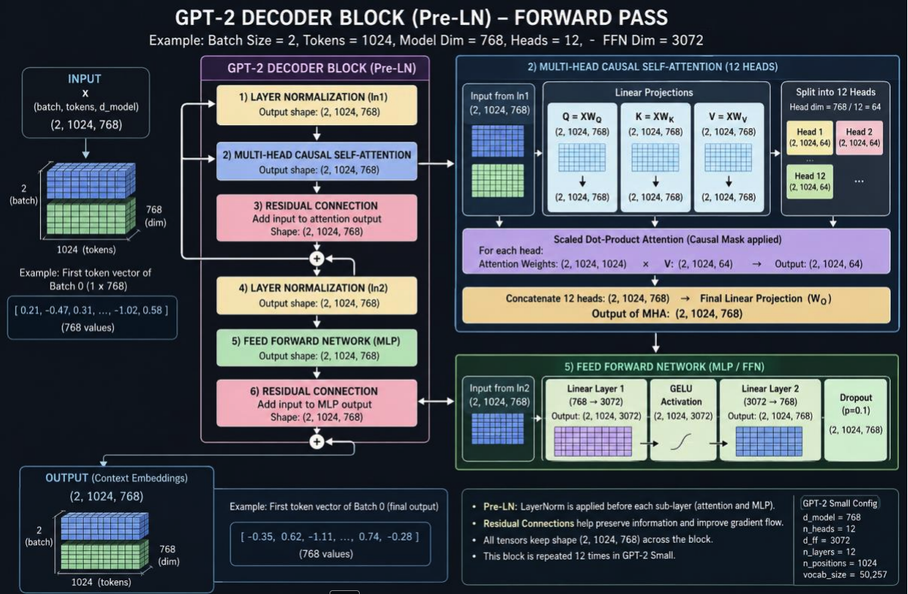
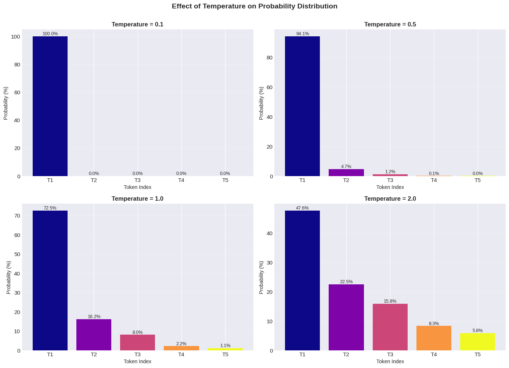

# LLMs — Decoder-Only Language Models (GPT-style)

> **TL;DR.** A modern LLM is a **decoder-only Transformer** trained to do one thing — predict the next token — at massive scale. That single self-supervised objective on internet-scale text yields a *base model* (a powerful autocomplete like GPT-2). Turning that into a helpful assistant (ChatGPT) is a **3-stage pipeline**: pretraining → **SFT / instruction tuning** → **RLHF** (preference alignment). At inference you turn its next-token probability distribution into text with a **decoding algorithm** (greedy / beam / top-k / top-p + temperature), and you talk to it through a **chat template** that encodes system/user/assistant roles.

**Where it fits:** The generative branch of NLP — builds directly on the Transformer. Read [[RNN · LSTM · Transformers]] first for attention, tokenization, positional encodings, and the KV cache; this note is the decoder-only + training-pipeline + decoding + deployment story on top of it.
**Prereqs:** [[RNN · LSTM · Transformers]] (self-attention, masking, tokenization), [[softmax]], [[reinforcement-learning-basics]].

---

## Table of Contents
1. [Intuition / Mental Model](#1-intuition--mental-model)
2. [The Three Architectures & the Goal of an LLM](#2-the-three-architectures--the-goal-of-an-llm)
3. [Why Decoder-Only?](#3-why-decoder-only)
4. [How a Decoder Works — Step by Step (GPT-2)](#4-how-a-decoder-works--step-by-step-gpt-2)
5. [Choosing the Next Token — Decoding Algorithms](#5-choosing-the-next-token--decoding-algorithms)
6. [Base Model → ChatGPT: the Training Evolution](#6-base-model--chatgpt-the-training-evolution)
7. [Chat Templates & Roles](#7-chat-templates--roles)
8. [When It Breaks](#8-when-it-breaks)
9. [How to Choose an LLM](#9-how-to-choose-an-llm)
10. [Interview Lens](#10-interview-lens)
- [🧠 Self-Test](#-self-test)

---

## 1. Intuition / Mental Model

```
An LLM is a next-token prediction machine:
   context tokens  →  [decoder-only Transformer]  →  P(next token | context)  →  pick one  →  append  →  repeat

Everything else (chat, QA, code, reasoning) is an emergent by-product of doing this
extremely well, at scale, then aligning it to follow instructions.
```
- The model never "plans a sentence." It repeatedly answers *"given everything so far, what token comes next?"* and feeds its own output back in (**autoregressive** generation).
- **Two separate things people conflate:** (1) *what the network computes* — one probability distribution over the vocabulary; (2) *how you sample from it* — the decoding algorithm (§5). Same model, different decoding → very different text.

---

## 2. The Three Architectures & the Goal of an LLM

All three are Transformers; they differ in **which tokens attend to which**.

```
ENCODER-ONLY  (BERT)   bidirectional self-attention — every token sees all others
                       Objective: masked LM ("the [MASK] sat")     
                       Use: UNDERSTANDING — classification, NER, embeddings
   ❌ Cannot generate text (it fills blanks, it doesn't continue).

DECODER-ONLY  (GPT, Llama)   CAUSAL (masked) self-attention — token t sees only tokens ≤ t
                        Objective: next-token prediction            
                        Use: GENERATION — chat, completion, agents  ← LLMs
   The whole model of this note.

ENCODER-DECODER (T5, original Transformer, NMT)
   Encoder reads input bidirectionally; decoder generates while CROSS-ATTENDING to the encoder.
   Use: SEQ2SEQ where input & output are distinct — translation, summarization.
```

**Goal of an LLM (state it precisely):** learn the probability distribution of language, `P(x₁, x₂, … , x_n)`, factorized autoregressively as
```
P(sequence) = ∏ₜ P(xₜ | x₁ … xₜ₋₁)
```
Master that conditional next-token distribution and *every* generative task reduces to sampling from it. `(certain)`

---

## 3. Why Decoder-Only?

The most-asked conceptual question. Five reasons, in order of weight:

1. **Generation is inherently autoregressive.** Producing text is left-to-right, one token at a time — a *causal* decoder is the natural match; you never have the "future" to attend to anyway.
2. **The objective is free, dense, and unlabeled.** Next-token prediction needs no human labels → train on ~all the internet. And **every position is a training target** (dense signal), so one document yields thousands of supervised examples — extremely data/compute-efficient. `(certain)`
3. **It scales cleanly.** One homogeneous stack (no encoder + decoder + cross-attention to balance) rides the **scaling laws** predictably as you add parameters/data/compute.
4. **Task unification + in-context learning.** Frame *any* task as text continuation via the prompt ("Translate to French: …") — no task-specific architecture. With scale, **few-shot in-context learning** emerges for free.
5. **Encoder pieces become redundant.** Encoder-only (BERT) *can't* generate. Encoder-decoder is great for fixed input→output (translation) but its bidirectional encoder + cross-attention add complexity that decoder-only + prompting matches or beats for open-ended generation at scale.

🎯 **Kill-shot:** *"Generation is autoregressive, and next-token prediction is a free, dense, self-supervised objective that turns raw internet text into training signal — so a single causal decoder is the simplest architecture that scales, and prompting lets it absorb every task an encoder-decoder was built for."*

---

## 4. How a Decoder Works — Step by Step (GPT-2)

**GPT-2 concretely** (the 124M "small" config): vocab **50,257** (byte-level BPE), context length **1024**, `d_model=768`, **12** decoder blocks, **12** heads, **learned** positional embeddings, **Pre-LN**, **GELU** activation, input-embedding ↔ output-projection **weight tying**. (Bigger siblings: 355M, 774M, 1.5B = up to 48 layers.)

```
INPUT TEXT  "The cat sat on the"
   │  1. TOKENIZE (BPE)                      → [464, 3797, 3332, 319, 262]
   │  2. TOKEN EMBEDDING  (50257×768 lookup) → 5 vectors of size 768
   │     + POSITIONAL EMBEDDING (learned)    → inject order (attention is order-blind)
   ▼
┌──────────────────────────────── × 12 decoder blocks ────────────────────────────────┐
│  LayerNorm → MASKED Multi-Head Self-Attention → + residual   (causal: token t sees ≤ t) │
│  LayerNorm → MLP (768 → 3072 → 768, GELU)     → + residual   (the non-linear "compute") │
└──────────────────────────────────────────────────────────────────────────────────────┘
   │  3. FINAL LayerNorm
   │  4. UNEMBED (tie weights) → LOGITS over the whole 50,257 vocab  (one score per token)
   │  5. SOFTMAX → P(next token | context)
   ▼
   6. PICK a token via a DECODING algorithm (§5)  → e.g. "mat"
   7. APPEND it and GO TO step 2  (autoregressive loop; cache past K,V so step t costs O(t) not O(t²))
```


*GPT-2 decoder block: token + positional embeddings → ×12 [Masked Multi-Head Attention + MLP, each with a residual + LayerNorm] → final LayerNorm → unembed → softmax over the vocab.*

- **Masked (causal) self-attention** is the one structural difference from BERT: future positions' attention scores are set to `−∞` before softmax → 0 weight → the model can't peek at the answer. Train and inference behave identically.
- Only the **last position's** logits matter when generating the next token; during training, *all* positions are scored in parallel (teacher forcing) — that's the density from §3.

---

## 5. Choosing the Next Token — Decoding Algorithms

The model gives a distribution; the decoder decides how to sample it. Running example — after *"The weather today is"* the model outputs:
```
P = { sunny: 0.50,  cloudy: 0.30,  rainy: 0.15,  windy: 0.04,  purple: 0.01, … }
```

### Temperature — reshape the distribution before sampling
Divide logits by `T` before softmax: `softmax(z / T)`.
```
logits z = [2.0, 1.0, 0.0]
 T=1.0 → [0.665, 0.245, 0.090]   (original)
 T=0.5 → [0.867, 0.117, 0.016]   (SHARPER — more confident, closer to greedy)
 T=2.0 → [0.506, 0.307, 0.186]   (FLATTER — more random, more diverse)
 T→0  = greedy (argmax)      T↑ = more creative/chaotic
```


*Same logits `[2, 1, 0]` under different temperatures: low T sharpens the distribution (toward greedy), high T flattens it (toward uniform).*

### Greedy search — always take the argmax
```
pick "sunny" every time.  Deterministic, fast.
```
**Problems with greedy** (the decoding-level ones):
- **Repetition / loops** — high-probability tokens reinforce themselves ("I think that I think that…").
- **Dull, deterministic output** — same prompt → same answer; no diversity or creativity.
- **Myopic** — locally best ≠ globally best; a lower-prob token now can lead to a far better full sentence.

> ⚠️ *Note:* the base model's **lack of roles / no behavioural control** is **not** a greedy-search problem — it's a *base-model* problem fixed by instruction tuning + chat templates (§6, §7). Keep the two straight.

### Beam search — keep the B best partial sequences
Track `B` hypotheses ranked by **cumulative log-probability**, expand each step, keep the top `B`.
```
B=3: explore several continuations, return the highest total-probability sequence.
```
- ✅ Great for **closed-ended** tasks with a "correct" output — translation, summarization.
- ❌ For **open-ended** chat it produces **generic, repetitive, bland** text (high-probability ≠ interesting); also `B×` the compute and needs **length normalization** (else it favors short sequences).

### Top-k sampling — sample from the k most likely tokens
```
k=2 → keep {sunny 0.50, cloudy 0.30}, renormalize → {sunny 0.625, cloudy 0.375}, then sample.
Cuts the long tail of absurd tokens ("purple") while keeping some diversity.
Weakness: k is fixed — too small when the model is unsure, too big when it's confident.
```

### Top-p (nucleus) sampling — sample from the smallest set covering probability p
```
p=0.9 → add tokens by descending prob until cumulative ≥ 0.9:
   peaky  case { sunny 0.92, … }        → nucleus = {sunny}            (acts near-greedy)
   flat   case { sunny .5, cloudy .3, rainy .15 } → nucleus = those 3 (cumsum .95)  (stays diverse)
The set SIZE adapts to the model's confidence — why top-p is the practical default for chat.
```

| Method | Deterministic? | Diversity | Best for |
|---|---|---|---|
| Greedy | Yes | none (repetitive) | quick/factual, debugging |
| Beam | Yes | low (generic) | translation, summarization |
| Top-k | No | medium (fixed cutoff) | general generation |
| **Top-p + temperature** | No | adaptive | **chat / open-ended (default)** |

🎯 In practice: **temperature ≈ 0.7 + top-p ≈ 0.9** for chat; **temperature → 0 (greedy)** for deterministic/extraction tasks.

---

## 6. Base Model → ChatGPT: the Training Evolution

A base LLM and ChatGPT are the *same architecture* — the difference is three training stages.

```
STAGE 0 ── PRETRAINING (the base model, e.g. GPT-2/GPT-3) ──────────────────────────────
  Data: trillions of tokens of raw internet text.   Objective: next-token prediction (self-supervised).
  Result: a brilliant AUTOCOMPLETE with vast knowledge — but NOT an assistant.
  Base-model problems (this is where "no roles / no control" belong):
    ❌ No notion of system/user/assistant ROLES — it just continues text.
    ❌ Doesn't reliably FOLLOW INSTRUCTIONS — ask a question, it may continue with more questions.
    ❌ No BEHAVIOURAL CONTROL / not aligned — can be unhelpful, biased, or unsafe.
        │
        ▼
STAGE 1 ── SUPERVISED FINE-TUNING (SFT) / INSTRUCTION TUNING ───────────────────────────
  Data: curated (instruction → ideal response) pairs written by humans, formatted with ROLES.
  Method: ordinary supervised next-token training on these demonstrations.
  Teaches: follow instructions + speak in the assistant format/roles.
  Limit: only IMITATES the demonstrations; expensive to collect; no sense of "better vs worse".
        │
        ▼
STAGE 2 ── RLHF (Reinforcement Learning from Human Feedback) ───────────────────────────
  (a) Collect human PREFERENCES: for one prompt, humans RANK several model outputs (A > B > C).
  (b) Train a REWARD MODEL to predict that human preference score.
  (c) Optimize the SFT model with RL (PPO) to MAXIMIZE reward,
      + a KL penalty keeping it close to the SFT model (so it doesn't game the reward / go off the rails).
  Teaches: preference alignment — helpful, harmless, honest.   Result: InstructGPT / ChatGPT.
```

- **Why each stage exists:** pretraining gives **knowledge**; SFT gives **instruction-following + roles/format**; RLHF gives **preference alignment + safety**. You can't skip: RLHF needs an SFT policy to start from; SFT needs a pretrained base.
- **DPO (Direct Preference Optimization)** — `P1`, the modern shortcut: optimize *directly* on preference pairs with a simple classification-style loss, **no separate reward model and no RL/PPO**. Simpler, more stable, now common in place of full RLHF. `(likely)`

🎯 *"Pretraining teaches it to talk; SFT teaches it to follow instructions in a chat format; RLHF teaches it which answers humans actually prefer."*

---

## 7. Chat Templates & Roles

SFT/RLHF train the model on conversations wrapped in **special tokens** that delimit **roles**. At inference you MUST format your messages with the *exact* template the model was tuned on — mismatch degrades quality badly.

```
Roles:
  system    → sets behaviour/persona/rules ("You are a terse expert.")   ← the "role setting" a base model lacked
  user      → the human's message
  assistant → the model's reply (what it learns to generate)

Example (ChatML-style, used by GPT-family):
  <|im_start|>system\nYou are a helpful assistant.<|im_end|>
  <|im_start|>user\nWhat is entropy?<|im_end|>
  <|im_start|>assistant\n            ← the model generates from here
```
Different families use different delimiters (Llama-2 `[INST] … [/INST]`, others use `### Instruction`). Don't hand-format — use the tokenizer's built-in template:
```python
from transformers import AutoTokenizer
tok = AutoTokenizer.from_pretrained("meta-llama/Llama-3.1-8B-Instruct")
msgs = [{"role": "system", "content": "You are terse."},
        {"role": "user",   "content": "Define entropy."}]
prompt = tok.apply_chat_template(msgs, add_generation_prompt=True, tokenize=False)
```
This is the concrete fix for the base model's *"no roles / no behavioural control"*: the **system role** (from SFT) is how you steer behaviour.

---

## 8. When It Breaks

```
❌ Hallucination — fluent, confident, wrong. It optimizes plausibility, not truth → ground with [[rag]].
❌ Context window limit — can only attend to N tokens (GPT-2: 1024; modern: 8k–1M). Beyond it, info is dropped.
❌ Knowledge cutoff — frozen at training time; no new events without retrieval/tools.
❌ Decoding sensitivity — too-high temperature → incoherent; greedy → repetition loops.
❌ Prompt injection / jailbreaks — untrusted text in the context can override the system prompt (security risk).
❌ Cost & latency — autoregressive = one forward pass PER token; long outputs are slow/expensive.
❌ Tokenization artifacts — poor arithmetic/spelling, since it sees subword tokens, not characters.
```

---

## 9. How to Choose an LLM

Decide along these axes — there is no single "best":

| Axis | Question | Implication |
|---|---|---|
| **Capability** | Does it pass eval **on YOUR task**? | Trust your own eval set, not just public leaderboards |
| **Open vs closed** | API (GPT/Claude/Gemini) or open-weights (Llama/Mistral/Qwen)? | API = easiest/strongest; open = control, privacy, fine-tuning |
| **Cost / latency** | $ per 1M tokens, tokens/sec, SLA? | Autoregressive cost scales with output length |
| **Size vs hardware** | Fits your GPU/VRAM? | **Quantization** (8-/4-bit) shrinks open models to fit |
| **Context window** | How much input must fit? | Long docs/RAG need 32k–1M context |
| **Privacy / licensing** | Can data leave your org? Commercial license? | Sensitive data → self-host open weights |
| **Adaptability** | Fine-tunable? Good at **tool/function calling** & JSON? | Needed for agents / structured output |
| **Multilinguality / domain** | Your languages & domain covered? | Domain models (code, medical) may beat generalists |

**Practical recipe:** prototype on a strong **API** model to prove value → if cost/privacy/control demand it, move to an **open-weights** model (+ quantization) → **evaluate on your own task**, not leaderboards → prefer **RAG** (grounding, fresh knowledge) over fine-tuning unless you need a specific style/format the base model can't produce. 🎯 *"Don't fine-tune to add knowledge (use RAG); fine-tune to change behaviour/format."*

---

## 10. Interview Lens

> ⚡ **Golden rule:** separate *what the network computes* (one distribution) from *how you sample it* (decoding) — muddling them is the classic tell.

**"Why are LLMs decoder-only?"** → §3 kill-shot: autoregressive generation + free dense self-supervised objective + clean scaling + task unification via prompting.

**"Greedy vs sampling — when each?"** → Greedy/beam for deterministic, closed-ended tasks (extraction, translation); top-p + temperature for open-ended chat. Greedy's failure modes: repetition, dullness, myopia.

**"What does temperature do?"** → Scales logits by `1/T` before softmax; `T<1` sharpens (safer), `T>1` flattens (creative), `T→0` = greedy.

**"What does RLHF add over SFT?"** → SFT *imitates* demonstrations; RLHF learns from *preference rankings* via a reward model + PPO (with KL to SFT) → aligns to what humans prefer (helpful/harmless/honest). DPO does this without a reward model or RL.

**"Why a chat template?"** → The model was trained with role-delimiting special tokens; you must reproduce that exact format so the system/user/assistant structure (and the system prompt's behavioural control) works.

**"Base model vs ChatGPT?"** → Same architecture; ChatGPT = base + SFT + RLHF. The base model has knowledge but no instruction-following, roles, or alignment.

---

## 🧠 Self-Test
*Cover the answers; retrieve first.*

1. Write the LLM training objective as a factorized probability and name the architecture.
   <details><summary>answer</summary>`P(sequence) = ∏ₜ P(xₜ | x₁…xₜ₋₁)` — autoregressive next-token prediction on a **decoder-only (causal) Transformer**.</details>
2. Give the single strongest reason LLMs are decoder-only.
   <details><summary>answer</summary>Generation is autoregressive **and** next-token prediction is a free, dense, self-supervised objective that turns raw internet text into training signal and scales cleanly — no labels or encoder needed.</details>
3. What structurally distinguishes a GPT decoder block from a BERT encoder block?
   <details><summary>answer</summary>**Causal (masked) self-attention** — token t attends only to tokens ≤ t (future scores set to −∞), so it can generate; BERT is bidirectional and only fills masks.</details>
4. Logits `[2,1,0]` at `T=0.5` vs `T=2` — which is sharper and why?
   <details><summary>answer</summary>`T=0.5` is sharper (`[0.867,0.117,0.016]`) — dividing logits by a smaller T magnifies gaps; `T=2` flattens (`[0.506,0.307,0.186]`). `T→0` = greedy.</details>
5. Why is top-p often better than top-k?
   <details><summary>answer</summary>Top-p's nucleus **size adapts** to confidence — narrow when the model is sure, wide when unsure — whereas top-k's cutoff is fixed regardless of the distribution's shape.</details>
6. Name the three training stages from base model to ChatGPT and what each teaches.
   <details><summary>answer</summary>**Pretraining** (knowledge, next-token) → **SFT/instruction tuning** (follow instructions + roles/format) → **RLHF** (preference alignment via reward model + PPO; or **DPO**).</details>
7. Which limitations are base-model problems vs greedy-search problems?
   <details><summary>answer</summary>**Base-model:** no roles, no instruction-following, no behavioural control/alignment (fixed by SFT + chat templates + RLHF). **Greedy-search:** repetition/loops, deterministic dullness, myopia.</details>
8. You have private data and a fixed knowledge need. Fine-tune or RAG, and why?
   <details><summary>answer</summary>**RAG** — fine-tuning is for changing behaviour/format, not injecting knowledge; RAG grounds answers in retrieved docs, stays fresh, and (self-hosted) keeps data private.</details>

---

*Covers: encoder-only / decoder-only / encoder-decoder · goal of an LLM · why decoder-only · GPT-2 decoder walk-through · greedy / beam / top-k / top-p / temperature (with numeric examples) · greedy vs base-model problems · pretraining → SFT → RLHF → ChatGPT (+ DPO) · chat templates & roles · when it breaks · choosing an LLM · RAG vs fine-tune.*
