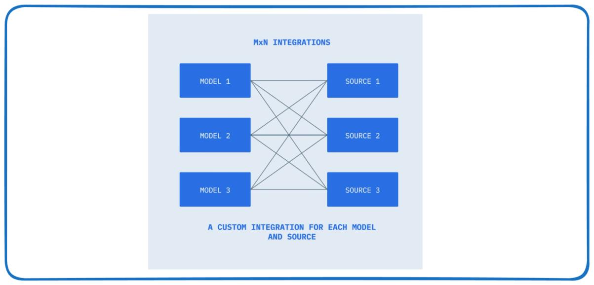

# Model Context Protocol — MCP: the M×N → M+N standard that turns tools into plug-ins

> **TL;DR.** Hand-wiring tools to models doesn't scale: `M` applications × `N` services = **M×N bespoke connectors**, each with its own auth, serialization and error handling. **MCP** is an open standard (originally from Anthropic, Nov 2024) that inserts one protocol layer in the middle so each app implements a **client** once and each service implements a **server** once — **M+N**. Three components: **Host** (the user-facing app; the trust boundary), **Client** (a protocol adapter, **one per server**), **Server** (a standalone process exposing capabilities). Servers expose exactly three primitives, distinguished by *who controls invocation*: **tools** (model-controlled), **resources** (application-controlled, read-only), **prompts** (user-controlled templates). Messages are **JSON-RPC 2.0** over **stdio** (local child process) or **Streamable HTTP** (remote). MCP does not eliminate integration work — it **relocates** it from every app developer to one server implementation everyone reuses. ⚠️ The protocol moved fast: the **2026-07-28 revision made MCP stateless** — no `initialize` handshake, no `Mcp-Session-Id`, and **Roots, Sampling and Logging are deprecated** — so learn the concepts, then check §7 before you build. `(certain)`

**Where it fits:** Lecture 3 of the *Advanced AI Agents* track. [AI Agents — Foundations](AI%20Agents%20%E2%80%94%20Foundations.md) taught **function calling** — the *capability* that lets one model call one app's hand-wired tools. [Agentic Workflows](Agentic%20Workflows.md) taught the *shapes* you build around that loop. MCP is the *interoperability layer* underneath both: it standardises how tools are declared, discovered and invoked, so a tool server written once works with every agent. **Function calling is the mechanism; MCP is the distribution model.** `(certain)`
**Prereqs:** [AI Agents — Foundations](AI%20Agents%20%E2%80%94%20Foundations.md) (the ReAct loop, tool schemas, the Text2SQL build), [LLM](LLM.md) (context window, tool-calling messages), basic client–server/RPC intuition and Python `async`.

> 🧠 **Start here, not at the top.** Jump straight to the [Self-Test](#-self-test), answer cold, then read **only** the sections you missed — a 5-minute pass instead of 30. *([why](../_STUDY%20LOOP.md))*

> ⚙️ *Format note: standard vault skeleton with three lecture-driven additions — **§6 Client Features**, **§7 Transports & the Wire Protocol** (with a currency box on the 2026-07-28 spec), and **§11 Security**, which gets its own home because MCP's whole value proposition is *connecting an LLM to more systems*, i.e. deliberately enlarging the attack surface.*

---

## Table of Contents
1. [Intuition / Mental Model](#1-intuition--mental-model)
2. [The Formal Core — the M×N Problem](#2-the-formal-core--the-mn-problem)
3. [Architecture — Host, Client, Server](#3-architecture--host-client-server)
4. [The Three Server Primitives](#4-the-three-server-primitives)
5. [How It Works — an End-to-End Request](#5-how-it-works--an-end-to-end-request)
6. [Client Features — Elicitation, Roots, Sampling, Notifications](#6-client-features--elicitation-roots-sampling-notifications)
7. [Transports & the Wire Protocol](#7-transports--the-wire-protocol)
8. [Worked Example — an MCP Text2SQL Agent](#8-worked-example--an-mcp-text2sql-agent)
9. [Code / Implementation](#9-code--implementation)
10. [When It Breaks](#10-when-it-breaks)
11. [Security — MCP's Specific Attack Surface](#11-security--mcps-specific-attack-surface)
12. [Production & LLMOps Notes](#12-production--llmops-notes)
13. [Interview Lens](#13-interview-lens)
14. [Alternatives & How to Choose](#14-alternatives--how-to-choose)
- [🧠 Self-Test](#-self-test)

---

## 1. Intuition / Mental Model

Before USB, every peripheral shipped its own port and its own cable: printer port, mouse port, serial, PS/2, FireWire. Every *device* × every *computer* was a separate compatibility question. USB replaced that with **one contract**: implement the port once, and any compliant device works.

MCP is that for AI applications. Today's equivalent of the cable drawer is: your agent needs GitHub, Postgres, Slack and Google Drive — so you hand-write four adapters. Your colleague's agent needs the same four — so they hand-write four more. Nobody's work is reusable, because there was never a contract.

🎯 **Kill-shot:** *"MCP is USB-C for AI tools. It doesn't make integration work disappear — it **relocates** it from every application developer to a single server implementation that all clients reuse."* `(certain)`

The key mental shift: **the tool schema and the execution code stop being your problem.** Without MCP you author a JSON schema for every GitHub operation *and* the function that calls the API, handles auth, parses the response — dozens of each, maintained forever as GitHub's API evolves. With MCP, GitHub (or the community) ships a GitHub MCP server, and your job collapses to "connect a client to it."

---

## 2. The Formal Core — the M×N Problem

Let **`M`** = the number of AI model endpoints / host applications, and **`N`** = the number of external tools, data sources or services.

**Without a protocol**, every `(model, service)` pair needs its own connector — a fully connected bipartite graph:

```
connectors = M × N
```


*Source: lecture deck, after the MCP documentation.*

Why that's *architectural*, not just a big number:

- **Linear growth in either dimension is multiplicative in effort.** Add one model to a stack with 20 services → 20 new connectors. Add one service to a stack with 5 models → 5 new connectors.
- **Maintenance scales with the product.** Each connector is an independent surface for bugs, CVEs, version drift. Schema drift in *one* API cascades into `M` separate breakage events.
- **Testing is combinatorial** — `M × N` paths, each exercising different code.
- **Zero reuse.** A connector for Model A → Service X shares no interface contract, serialization or auth flow with Model B → Service X. The work is duplicated `M` times per service.

**With MCP**, each side implements the contract **once**:

```
connectors = M + N        ← each model implements the client once
                            each service implements the server once
```


*Source: lecture deck, after the MCP documentation.*

This is a change in the **asymptotic scaling of integration complexity**, and it buys four things the lecture called out explicitly:

| Property | What it means |
|---|---|
| **Extensibility** | Add a capability by deploying a new server — **zero changes** to the model or host app. |
| **Vendor neutrality** | A tool exposed via MCP works with any compliant client — Anthropic, OpenAI, Google, open-weights. Reduces switching cost, enables multi-model strategies. |
| **Maintainability** | `M+N` connectors instead of `M×N`; each has one owner and one interface contract. A backend schema change updates **one** server, not `M` adapters. |
| **Composability** | Runtime **capability discovery** lets an agent chain operations across multiple servers in one workflow, none of them aware of each other. |

🎯 **Kill-shot:** *"M×N → M+N is the whole pitch. It's the same move HTTP made for the web and REST made for APIs: standardise at the right level of abstraction and the integration layer stops being rewritten every time you add a participant."* `(certain)`

---

## 3. Architecture — Host, Client, Server

Three components, strict separation of concerns.


*Source: lecture deck, after the MCP documentation.*

**MCP Host** — the top-level, user-facing AI application (Claude Desktop, an IDE like Claude Code or Cursor, your own orchestrator). It is the **process-level container and the trust boundary**.
- *Lifecycle management* — creates, configures and tears down Client instances.
- *LLM coordination* — routes the model's tool-invocation requests to the right Client and feeds results back into the model's context.
- *Security boundary enforcement* — decides which servers connect, what's exposed to the model, and whether user consent is required before execution.
- *Capability aggregation* — merges tools/resources/prompts from **all** connected servers into one interface for the model.

**MCP Client** — a protocol-level adapter *inside* the Host. **One Client ⇄ exactly one Server (1:1).** Need five servers? The Host instantiates five Clients.
- Protocol negotiation, message transport (stdio or HTTP), JSON-RPC serialization, capability-discovery relay.
- *It is not application logic.* It's infrastructure — a bridge that isolates the Host from transport and session concerns.

**MCP Server** — a standalone process or service exposing a defined capability set.
- *Capability exposure* via the three primitives, each declared with structured metadata (name, description, input schema) the model can introspect.
- *Backend abstraction* — translates MCP requests into safe, scoped operations against its system. The model and Client know nothing of backend internals.
- *Focused responsibility* — one integration domain per server (a Postgres server, a GitHub server, a filesystem server). Lightweight, independently deployable, composable.
- *Security scoping* — authenticates requests, enforces access control, constrains operations to its declared scope. **Never** touches the LLM or another server directly.


*Source: lecture deck.*

**The one architectural principle to remember — the Mediated Access Pattern:** *the LLM never directly reaches an external system.* Every request and response passes through the Host's control plane. That's what makes consent, allow-listing and audit possible at all.

🎯 **Kill-shot:** *"Host is the trust boundary and the aggregator; Client is a dumb 1:1 protocol bridge; Server is where the work happens. Adding a capability means deploying a server — no change to the Host, no change to any other server."* `(certain)`

---

## 4. The Three Server Primitives

Servers expose capabilities through exactly three primitive types, and the axis that separates them is **who controls invocation**. This is the single most-asked MCP question.


*Source: lecture deck.*

| Primitive | Controlled by | Purpose | Example |
|---|---|---|---|
| **Tools** | **the model** | executable functions the model decides to invoke | API POST, file write, code execution, `execute_sql` |
| **Resources** | **the application** | structured, read-only data the app fetches proactively | file contents, git history, a document list for a picker |
| **Prompts** | **the user** | pre-built templates the user triggers explicitly | slash commands, menu options, chat starters |

**Tools — serve the model.** Defined with `@mcp.tool()` on a typed function; the SDK **auto-generates the JSON schema from the signature** — no hand-authored schema. Pydantic `Field(description=...)` supplies parameter descriptions and validation. The server executes the logic and returns the result to the model.

**Resources — serve the application.** Defined with `@mcp.resource(uri)`. Two URI forms: **static** (`docs://documents` — always the same endpoint) and **templated** (`documents/{doc_id}` — placeholders map to function kwargs). Each declares a **MIME type** so the client knows how to deserialize. Design pattern: **one resource per distinct read operation**, mirroring REST's collection-vs-item split.

**Prompts — serve the user.** Defined with `@mcp.prompt(name=..., description=...)`. Accept parameterized args, return a **structured message sequence** (`user`/`assistant`) sent to the model. The point: the *server author* — who knows the domain and the tools — writes the optimal prompt once, and every client gets it for free. Claude's chat starter buttons are exactly this.

🎯 **Kill-shot (the tools-vs-resources line):** *"If the **LLM** needs to read a document mid-conversation, that's a **tool**. If the **application** needs a document list to render a picker *before* the conversation starts, that's a **resource**. Same data, different controller."* `(certain)`

> **Why the distinction is load-bearing:** anything you expose as a *tool* consumes context window in every request (its schema is in the prompt) and is subject to model whim. Anything you expose as a *resource* costs zero context until the app decides to fetch it. Over-exposing as tools is the #1 cause of MCP context bloat (§10).

---

## 5. How It Works — an End-to-End Request

The eight-step round trip, using "What repositories do I have?" against a GitHub server:


*Source: Anthropic, as reproduced in the lecture deck.*

1. **User request** — the user asks a question in the Host application.
2. **Capability discovery** — the Client sends `tools/list` (also `resources/list`, `prompts/list`); the Server replies with names, descriptions and JSON input schemas. The Client **passes them through unmodified** — it does not interpret schemas.
3. **LLM decides** — the Host sends the query *plus* the aggregated tool schemas to the model, which returns a tool-use request (name + JSON args).
4. **Host routes** — it picks the Client bound to the server that owns that tool.
5. **Client sends** — a JSON-RPC 2.0 `tools/call` request over the transport.
6. **Server executes** — validates arguments, performs the scoped operation against its backend (GitHub REST, a SQL query, a file read).
7. **Result returns** — a JSON-RPC result flows Server → Client → Host, which appends it to the model's context.
8. **LLM responds** — with enough information now in context, the model produces the final answer (or requests another tool, looping back to step 3).

Notice this is exactly the **ReAct loop** from [Foundations](AI%20Agents%20%E2%80%94%20Foundations.md) with steps 4–7 swapped from "call my local Python function" to "call a protocol". **MCP changes *where the tool lives*, not *how the agent thinks*.** `(certain)`

---

## 6. Client Features — Elicitation, Roots, Sampling, Notifications

Servers provide context to clients; less obviously, **clients provide features to servers**. This is what makes MCP a protocol rather than a tool registry.


*Source: lecture deck.*

| Feature | What it does | Why it exists |
|---|---|---|
| **Elicitation** | the server asks the **user** for specific information mid-operation, via the client's UI | avoids demanding every input up front or failing when data is missing — e.g. a travel-booking server asking for seat preference |
| **Roots** | the client tells the server **which directories/files it may operate on** | scopes filesystem access — "convert `bikin.mp4` to gif" works without the user typing a full path |
| **Sampling** | the server asks the **client** to run an LLM completion on its behalf | the server needs LLM capability (summarize, classify) but shouldn't hold API keys, billing or rate limits — especially for a public server |
| **Security & consent** | the client enforces user consent, access rules and boundaries for all server interactions | the human-in-the-loop control point |
| **Log & progress notifications** | the server pushes `info` messages and `report_progress(i, n)` during a long tool call | purely UX: without it, long operations look stalled |

**Sampling, in one line:** *"Could you call the LLM for me?"* — Option 1 is giving the server its own API key (auth, cost, rate limits, and anyone who connects can spend your money). Option 2 is sampling: the server sends messages, the client — which is already authenticated to a model — generates and returns the text. The server holds **no keys and no model config**.

**Roots have a trap worth memorising.** The SDK **does not automatically enforce root restrictions**. Roots are a *declaration*, not a sandbox: every tool that touches the filesystem must manually verify the requested path falls inside a granted root. A server that advertises roots as its boundary can still be instructed to read outside them. `(certain)`

> ### ⚠️ Currency check — the 2026-07-28 spec changed all of this
> These four features are what the lecture (and most tutorials) teach, and they describe the **handshake-era** protocol that the large installed base still speaks. As of the **2026-07-28** revision:
> - **Roots, Sampling and Logging are Deprecated** (still functional, minimum 12-month window, but new implementations should not adopt them). Suggested migrations: pass directories/files as **tool parameters, resource URIs or server config** instead of Roots; **integrate directly with an LLM provider API** instead of Sampling; log to **stderr** (stdio) or **OpenTelemetry** instead of Logging.
> - **Server-initiated requests are gone.** `roots/list`, `sampling/createMessage` and `elicitation/create` are replaced by the **Multi Round-Trip Request (MRTR)** pattern: the server returns an `InputRequiredResult` (`resultType: "input_required"`) carrying `inputRequests`, and the client **retries the original request** with `inputResponses`. Elicitation survives; the mechanism changed.
> - **Progress and log notifications** still flow, but on the response stream of the request they belong to, and log level is set **per request** via `_meta`.
>
> Learn the concepts here — they're what the ecosystem runs on today — but check the spec revision your SDK targets before building. `(certain — per the official 2026-07-28 changelog)`

---

## 7. Transports & the Wire Protocol

### 7.1 JSON-RPC 2.0 message taxonomy

All MCP traffic is JSON-RPC, in exactly three shapes:

| Type | Expects a response? | Used for |
|---|---|---|
| **Request** | yes — always part of a request/result pair | `tools/list`, `tools/call`, `resources/read`, `prompts/get` |
| **Result** | — it *is* the response | completes the pair |
| **Notification** | **no** — fire-and-forget | events, progress, status updates |

### 7.2 stdio — the local transport

The Client **spawns the Server as a child process** and talks over its stdin/stdout. Client → Server writes to the server's stdin; Server → Client writes to stdout. **No network, no HTTP, no ports.**

- **Fully bidirectional.** Either side can initiate at any time, so every server→client message type works without workarounds: progress notifications during long tools, real-time logging, sampling requests.
- **Limitation:** same machine only. The server is a child process; there's no network layer. Ideal for local dev and desktop apps, unusable for hosting a server at a URL.
- **Practical consequence:** never `print()` to stdout inside a stdio server — you'll corrupt the JSON-RPC stream. Log to **stderr**.

### 7.3 Streamable HTTP — the remote transport

Remote servers need HTTP, but **HTTP is inherently client-to-server** and MCP needs the reverse too. Streamable HTTP solves it with **Server-Sent Events (SSE)** — a persistent stream the server can push messages down.

Two flags change the behaviour drastically, and both are traps:

| Flag | Default | Set it to `True` and… |
|---|---|---|
| `stateless_http` | `False` | you get horizontal scaling behind a load balancer, at the cost of **all** server→client-initiated messages (sampling, progress, logging) |
| `json_response` | `False` | POST responses stop streaming; the client gets only the final result — **no intermediate progress or logs** |

🚩 **The deployment pitfall the lecture flagged:** an app built and tested on **stdio** has full bidirectional messaging. Deploy the *same* app on Streamable HTTP — especially with either flag on — and features that worked in development are **silently disabled**. 🎯 *"Develop against the transport you plan to deploy with."* `(certain)`

### 7.4 The initialize handshake (and why it's now history)

In the handshake-era protocol, three steps precede any real work:


*Source: Anthropic, as reproduced in the lecture deck.*

1. Client → `initialize` request (protocol version + client capabilities).
2. Server → `initialize` result; over HTTP it mints an **`Mcp-Session-Id`** header.
3. Client → `notifications/initialized` (a notification — no result comes back), echoing the session id.

Only then can the Client send `tools/list`, `tools/call`, `resources/read`, `prompts/get`.

> ### ⚠️ Currency check — the protocol went stateless on 2026-07-28
> | Revision | Headline changes |
> |---|---|
> | **2024-11-05** | initial spec: client–server model, JSON-RPC 2.0, tools/resources/prompts, **stdio** and **HTTP+SSE** |
> | **2025-03-26** | **Streamable HTTP** replaces HTTP+SSE; **OAuth 2.1** authorization; tool annotations; JSON-RPC batching |
> | **2025-06-18** | **structured tool output**; **elicitation**; resource links in tool results; batching removed |
> | **2025-11-25** | OIDC-based authorization discovery; icon metadata; elicitation enums; JSON Schema 2020-12 |
> | **2026-07-28** | **stateless core**, **MRTR**, extensions framework, formal deprecation policy |
>
> What 2026-07-28 actually removes: **protocol-level sessions and the `Mcp-Session-Id` header**; the **`initialize` / `notifications/initialized` handshake** (protocol version and client capabilities now travel in `_meta` on *every* request); the HTTP **GET** endpoint and `resources/subscribe` (replaced by a single `subscriptions/listen` stream); **`ping`**, **`logging/setLevel`**, and SSE **resumability** (`Last-Event-ID` — a broken stream now means re-issuing the request with a new id). What it adds: **`server/discover`** for up-front version/capability negotiation, a required **`resultType`** on every result, **cacheable list results** (`ttlMs`, `cacheScope`), OpenTelemetry trace-context conventions in `_meta`, and hardened authorization. HTTP+SSE is now formally **Deprecated**; migrate to Streamable HTTP. `(certain — per the official 2026-07-28 changelog)`
>
> **Why you should still learn the handshake:** most deployed servers and SDK examples predate this, backwards compatibility is explicit in the spec (`server/discover` doubles as a compatibility probe on stdio), and "sessions vs stateless" is exactly the trade-off an interviewer will poke at — **statefulness is what blocked horizontal scaling**, which is why it went.

---

## 8. Worked Example — an MCP Text2SQL Agent

Same question as [Foundations](AI%20Agents%20%E2%80%94%20Foundations.md) — *"How many customers pay in EUR?"* — but the three tools now live behind an MCP server instead of being local Python functions. Three files, one job each:

```
┌──────────────┐    stdio     ┌──────────────────┐
│  agent.py    │◄────────────►│  mcp_server.py   │
│  OpenAI LLM  │   JSON-RPC   │  list_tables     │──► SQLite
│  ReAct loop  │              │  get_table_schema│
└──────────────┘   results    │  execute_sql     │
                              └──────────────────┘
       mcp_client.py sits between them: spawns the server, speaks the protocol
```

The trace — 4 LLM calls, 3 MCP tool calls, ~$0.002:

```
Iteration 1  LLM: "discover the tables first"   → list_tables({})
             MCP server → SELECT name FROM sqlite_master
             ← ["customers", "employees", "orders"]

Iteration 2  LLM: "I need the customers schema" → get_table_schema({"table_name":"customers"})
             MCP server → PRAGMA table_info(customers)
             ← [id, name, country, currency, balance]

Iteration 3  LLM: "the column is 'currency'"    → execute_sql({"query":
                 "SELECT COUNT(*) AS eur_count FROM customers WHERE currency = 'EUR'"})
             ← "eur_count\n--------\n4"

Iteration 4  LLM: no tool call → "There are 4 customers who pay in EUR."
```

The `messages` list afterwards is the agent's **short-term memory** — system prompt, user question, then alternating `assistant(tool_calls)` / `tool(content)` pairs, ending in the final assistant text. On the *next* question the model can see it already knows the tables and the `customers` schema, so a well-prompted agent skips the redundant discovery calls.

**What MCP bought here, concretely:** the server never learns which LLM is on the other side. Swap OpenAI for Claude or Gemini and only `_mcp_tools_to_openai_schema` changes — `mcp_server.py` is untouched. That single sentence is the whole M+N argument made local.

---

## 9. Code / Implementation

> **API currency.** The lecture uses the v1 Python SDK (`from mcp.server.fastmcp import FastMCP`). In **MCP Python SDK v2 (July 2026)** `FastMCP` was **renamed `MCPServer`** (`from mcp.server import MCPServer`), transport config moved from the constructor to `run()`, and a unified `Client` class replaces the nested v1 client layers. Separately, the **standalone `fastmcp` package** (PrefectHQ) is a different, actively developed project — `pip install fastmcp` → `from fastmcp import FastMCP` — which is what the lecture notebook fell back to. The **decorator API below is essentially unchanged across all three**; only the import and the runner differ. `(certain — per the SDK v2 migration docs)`

### 9.1 The server — three tools, two resources, one prompt

```python
from mcp.server.fastmcp import FastMCP        # v2: from mcp.server import MCPServer
from pydantic import Field
import sqlite3, re

mcp = FastMCP("Text2SQL-MCP", log_level="INFO")

# ── TOOL 1 — discovery. The description is what the LLM reads to decide WHEN
#    to call this. "database stuff" would confuse it; "call this first" guides it.
@mcp.tool(
    name="list_tables",
    description="Get all table names from the SQLite database. Call this first to "
                "discover which tables are available before writing any queries.",
)
def list_tables() -> list[str]:
    conn = _get_connection()
    try:
        cur = conn.cursor()
        cur.execute("SELECT name FROM sqlite_master WHERE type='table' ORDER BY name;")
        return [row[0] for row in cur.fetchall()]   # ORDER BY → deterministic output
    finally:
        conn.close()                                 # try/finally: closes even on error


# ── TOOL 2 — inspection. table_name comes FROM THE LLM, which is non-deterministic,
#    so the tool boundary is where validation happens. Never trust model output.
@mcp.tool(name="get_table_schema",
          description="Get column names and types for a specific table. Use after list_tables.")
def get_table_schema(
    table_name: str = Field(description="The exact name of the table to inspect"),
) -> list[dict]:
    if not re.match(r"^[A-Za-z_][A-Za-z0-9_]*$", table_name):
        # Blocks "employees; DROP TABLE employees" before it reaches the DB.
        raise ValueError(f"Invalid table name: {table_name!r}")
    conn = _get_connection()
    try:
        rows = conn.cursor().execute(f"PRAGMA table_info(`{table_name}`);").fetchall()
        if not rows:
            raise ValueError(f"Table '{table_name}' not found.")
        return [{"name": r[1], "type": r[2], "nullable": not r[3], "primary_key": bool(r[5])}
                for r in rows]
    finally:
        conn.close()


# ── TOOL 3 — the dangerous one. Two layers: keyword blocking, and errors returned
#    as TEXT rather than raised — a failed query is information the agent can act on.
@mcp.tool(name="execute_sql",
          description="Execute a SQL SELECT query and return results as rows. ONLY SELECT "
                      "queries are allowed — no INSERT, UPDATE, DELETE, DROP, or ALTER.")
def execute_sql(query: str = Field(description="A valid SQL SELECT query to execute")) -> str:
    normalized = query.strip().upper()
    for kw in ("INSERT", "UPDATE", "DELETE", "DROP", "ALTER", "CREATE", "TRUNCATE", "REPLACE"):
        if normalized.startswith(kw) or f" {kw} " in f" {normalized} ":
            raise ValueError(f"Only SELECT queries are allowed. Forbidden keyword: {kw}")
    conn = _get_connection()
    try:
        cur = conn.cursor(); cur.execute(query)
        cols = [d[0] for d in cur.description] if cur.description else []
        rows = cur.fetchall()
        if not rows:
            return "(no rows returned)"
        # Return a formatted TABLE, not JSON: the LLM reads tool output as text and
        # summarises a table far more reliably than nested objects.
        return (" | ".join(cols) + "\n"
                + "-+-".join("-" * max(len(c), 8) for c in cols) + "\n"
                + "\n".join(" | ".join(str(v) for v in r) for r in rows))
    except sqlite3.Error as e:
        return f"SQL Error: {e}"     # ← NOT raised: the agent reads this and self-corrects
    finally:
        conn.close()


# ── RESOURCES — application-controlled, read-only. Static URI + templated URI.
@mcp.resource("db://tables", mime_type="application/json")
def resource_list_tables() -> list[str]:
    return list_tables()

@mcp.resource("db://schema/{table_name}", mime_type="application/json")
def resource_table_schema(table_name: str) -> list[dict]:   # {table_name} → kwarg
    return get_table_schema(table_name)


# ── PROMPT — user-controlled. The SERVER author owns the prompt engineering,
#    so every client that connects gets the tested version for free.
from mcp.server.fastmcp.prompts import base

@mcp.prompt(name="text2sql_analyst", description="Generate a system prompt for a Text2SQL analyst.")
def text2sql_analyst_prompt(question: str = Field(description="The user's question")) -> list[base.Message]:
    return [base.UserMessage(f"""You are a Senior SQL Developer and Data Analyst.
Workflow: 1. list_tables  2. get_table_schema  3. write SQLite SELECT  4. execute_sql
RULES: Only use confirmed names. Never modify data. Use SQLite syntax.
USER QUESTION: {question}""")]


if __name__ == "__main__":
    mcp.run(transport="stdio")    # reads JSON-RPC from stdin, writes to stdout
```

What the decorator generates for tool 1 — the **only** thing the client and model ever see:

```json
{"name": "list_tables",
 "description": "Get all table names from the SQLite database...",
 "inputSchema": {"type": "object", "properties": {}, "required": []}}
```

**That's the contract.** Your Python never crosses the boundary.

### 9.2 The client — connection lifecycle done right

```python
from contextlib import AsyncExitStack
from mcp import ClientSession, StdioServerParameters, types
from mcp.client.stdio import stdio_client

class MCPClient:
    def __init__(self, command: str, args: list[str], env: dict | None = None):
        self._command, self._args, self._env = command, args, env
        self._session: ClientSession | None = None
        # AsyncExitStack tracks every async resource we open — subprocess, transport,
        # session — and closes them in REVERSE order. A stack of `async with` blocks
        # built up one at a time.
        self._exit_stack = AsyncExitStack()

    async def connect(self) -> None:
        params = StdioServerParameters(command=self._command, args=self._args, env=self._env)
        read, write = await self._exit_stack.enter_async_context(stdio_client(params))  # spawn
        self._session = await self._exit_stack.enter_async_context(ClientSession(read, write))
        await self._session.initialize()      # handshake / version negotiation

    async def cleanup(self) -> None:
        await self._exit_stack.aclose()       # session closed, then subprocess killed
        self._session = None

    async def __aenter__(self):  await self.connect();  return self
    async def __aexit__(self, *exc): await self.cleanup()   # runs even on exception

    @property
    def session(self) -> ClientSession:
        if self._session is None:
            raise ConnectionError("Not connected. Use 'async with MCPClient(...)'.")
        return self._session

    # Thin pass-throughs. The client NEVER executes a tool — it relays the invocation.
    async def list_tools(self) -> list[types.Tool]:
        return (await self.session.list_tools()).tools

    async def call_tool(self, name: str, args: dict) -> types.CallToolResult:
        return await self.session.call_tool(name, args)

    async def read_resource(self, uri: str):
        from pydantic import AnyUrl
        res = (await self.session.read_resource(AnyUrl(uri))).contents[0]
        # The ONLY interpretation the client does: MIME-based deserialization.
        if getattr(res, "mimeType", None) == "application/json":
            return json.loads(res.text)
        return res.text

    async def get_prompt(self, name: str, args: dict[str, str]):
        return (await self.session.get_prompt(name, args)).messages
```

### 9.3 The bridge — MCP schemas → OpenAI function-calling format

```python
def _mcp_tools_to_openai_schema(tools) -> list[dict]:
    """THE M+N ARGUMENT IN 10 LINES: the server defines tools once; this adapter is the
    only thing you rewrite to target a different provider. Server code never changes."""
    return [{"type": "function",
             "function": {"name": t.name,
                          "description": t.description or "",
                          "parameters": t.inputSchema or {"type": "object", "properties": {}}}}
            for t in tools]
```

### 9.4 The agent loop — ReAct over MCP

```python
MAX_ITERATIONS = 15    # hard safety cap: a loop without one is an outage waiting to happen

async def run_agent_loop(client, openai_client, question: str) -> str:
    mcp_tools    = await client.list_tools()               # discovery, once per session
    openai_tools = _mcp_tools_to_openai_schema(mcp_tools)
    messages = [{"role": "system", "content": SYSTEM_PROMPT},
                {"role": "user",   "content": question}]

    for _ in range(MAX_ITERATIONS):
        resp = openai_client.chat.completions.create(
            model=OPENAI_MODEL, temperature=0.0,
            messages=messages, tools=openai_tools, tool_choice="auto")
        msg = resp.choices[0].message

        if not msg.tool_calls:                              # CASE A — final answer
            messages.append({"role": "assistant", "content": msg.content})
            return msg.content

        messages.append(msg.model_dump())                   # CASE B — tool call(s)
        for tc in msg.tool_calls:
            args = json.loads(tc.function.arguments)
            try:
                result = await client.call_tool(tc.function.name, args)   # → over stdio
                output = result.content[0].text if result.content else "(empty)"
            except Exception as e:
                output = f"Error: {e}"       # feed the error back; the agent can recover
            messages.append({"role": "tool", "tool_call_id": tc.id, "content": output})
    raise RuntimeError("max iterations reached")
```

### 9.5 Progress and log notifications (handshake-era API)

```python
@mcp.tool()
async def process_large_file(file_id: str = Field(description="File to process"), context=None):
    await context.info("Starting file processing")          # → notifications/message
    for i in range(10):
        ...
        await context.report_progress(i + 1, 10)            # → notifications/progress
    return "Processing complete"

# Client side: log callback is registered on the SESSION (all logs);
# progress callback is passed PER INVOCATION (scoped to that call).
session = ClientSession(log_callback=log_callback)
result  = await client.call_tool("process_large_file", {"file_id": "data.csv"},
                                 progress_callback=progress_callback)
```

Both are **server→client notifications**, so both die if you deploy with `stateless_http=True` or `json_response=True` (§7.3). See the currency box in §6 for the 2026-07-28 replacements.

---

## 10. When It Breaks

| Failure | Cause | Fix |
|---|---|---|
| **Context bloat / tool confusion** | 6 servers × 15 tools = 90 schemas in every prompt; the model picks wrong or you blow the window | expose fewer tools per server; enable only the servers a task needs; move read-only data from tools to **resources**; prefer one coarse tool over ten fine ones |
| **Extra latency hop** | every tool call is now an IPC/network round trip plus a process boundary | keep hot tools in-process; batch what you can; measure — for a DB query the LLM call dominates anyway |
| **Roots not enforced** | the SDK treats roots as a declaration, not a sandbox | manually validate every path against granted roots in **every** filesystem tool |
| **stdout corruption** | a `print()` inside a stdio server injects garbage into the JSON-RPC stream | log to **stderr** only |
| **Works locally, breaks deployed** | stdio is fully bidirectional; Streamable HTTP with `stateless_http`/`json_response` silently kills sampling, progress, logging | **develop against the transport you deploy with** |
| **Version skew** | client targets one spec revision, server another; SDK v1 vs v2 rename | pin protocol + SDK versions; use `server/discover` (2026-07-28) or the initialize handshake to negotiate |
| **Vague tool descriptions** | "database stuff" → the model never calls it, or calls it wrongly | descriptions are prompt engineering: say *what it does* **and** *when to call it* |
| **Leaked connections / zombie processes** | manual `connect()` without cleanup | `AsyncExitStack` + `async with`, always |
| **Server is a SPOF** | one flaky server stalls the whole agent | timeouts per tool call, circuit-break a failing server, degrade gracefully |
| **Not everything should be MCP** | a single internal function used by one app | plain function calling is simpler; MCP pays off at **reuse across hosts** |

---

## 11. Security — MCP's Specific Attack Surface

MCP's value is connecting an LLM to more systems, which is definitionally an expansion of attack surface. Everything in [Prompt Security](Prompt%20Security.md) applies; these are the **MCP-specific** additions.

**The lethal trifecta, assembled by config file.** Private data access + exposure to untrusted content + an outbound channel = exfiltration. MCP makes all three trivially easy to assemble: connect a Postgres server (private data), a web-fetch or issue-reader server (untrusted content), and a Slack or HTTP server (egress) — and you've built the vulnerability without writing a line of code. **Audit the *combination* of connected servers, not each one alone.** `(certain)`

**Tool descriptions are untrusted input in the model's context.** A malicious server can put instructions inside a tool *description* or *schema* — the model reads them as part of its prompt ("**tool poisoning**"). Worse, a server can serve a benign definition at approval time and change it later (a "**rug pull**"), since descriptions are fetched at runtime. Mitigations: pin/allow-list servers, review tool definitions, alert on definition changes.

**A local stdio server is arbitrary code execution.** The client *spawns it as a child process* with your user's privileges. Installing a random MCP server from the internet is equivalent to running a random binary — same trust decision, and people make it far too casually.

**Confused deputy over OAuth.** A remote server holding a user's delegated token can be induced by injected content to act with that authority. The spec has hardened this repeatedly (OAuth 2.1 in 2025-03-26; issuer validation, credential binding and Client ID Metadata Documents by 2026-07-28) — but the design rule stands: **scope tokens narrowly and per-server**.

**Defence-in-depth for the Text2SQL server above, in the order that actually bounds damage:**
1. **Read-only, least-privilege DB credential.** `DROP` becomes impossible regardless of what the model is convinced to write. Hard control beats soft persona rules — the persona lives in a prompt, and prompts are injectable.
2. **Egress control.** Restrict where results can go; that's what breaks the exfiltration leg of the trifecta.
3. **Validate at the tool boundary** — the identifier regex and SELECT-only check in §9.1 are defence-in-depth, *not* the primary control (keyword blocklists are famously bypassable).
4. **Human-in-the-loop consent at the Host** for state-changing tools, because the Host is the only component that sees the whole picture.
5. **Per-server scoping and audit logging** of every `tools/call` with arguments.

🎯 **Kill-shot:** *"MCP doesn't add a new *class* of vulnerability — it makes the existing one **easy to assemble by config**. Three safe servers connected to one host can be an exfiltration pipeline, so the unit of review is the **server combination**, not the server."* `(likely)`

---

## 12. Production & LLMOps Notes

**Choose the transport deliberately.** stdio for local/desktop and dev; **Streamable HTTP** for anything remote or multi-user. If you need horizontal scaling behind a load balancer you want statelessness — historically the `stateless_http` flag, and as of 2026-07-28 it's the **protocol default** (sessions were removed precisely because they blocked scaling).

**Tool-count budget.** Treat exposed tools like a context budget line item: every schema is tokens on every request. Audit periodically, delete unused tools, and prefer resources for anything the app can fetch itself. `(likely)`

**Caching.** From 2026-07-28, `tools/list`/`prompts/list`/`resources/list` results carry `ttlMs` and `cacheScope`, and servers *should* return tools in deterministic order — both exist to let clients cache and to improve **LLM prompt-cache hit rates**. Deterministic tool ordering is a free latency/cost win.

**Observability.** Log every `tools/call` with `{server, tool, args_hash, latency, ok/err}`. The 2026-07-28 spec documents **OpenTelemetry trace-context propagation** (`traceparent`, `tracestate`, `baggage` in `_meta`) — use it, so an agent trace spans host → client → server → backend as one distributed trace.

**Versioning and registries.** Pin server versions like any dependency. Servers are independently deployable, which is the upside *and* the operational risk: a server updated underneath you changes your agent's behaviour with no deploy on your side.

**Failure isolation.** Per-call timeouts, a circuit breaker per server, and graceful degradation ("the GitHub tools are unavailable") beat a hung agent. One server ≠ one point of failure for the whole host.

**Cost.** MCP itself is nearly free; the cost is **context** (tool schemas in every prompt) and **latency** (an extra hop). Both are managed by exposing less, not by tuning the protocol.

---

## 13. Interview Lens

The trade-off being tested: **standardisation vs. directness** — when is a protocol layer worth the indirection?

- 🎯 *"MCP turns **M×N** bespoke connectors into **M+N**: each app implements the client once, each service implements the server once. Same move HTTP made for the web."*
- 🎯 *"It doesn't remove integration work — it **relocates** it from every app developer to one server implementation everyone reuses."*
- 🎯 *"Host is the trust boundary and aggregator, Client is a **1:1** protocol bridge, Server is where execution happens. The LLM never touches an external system directly — that's the Mediated Access Pattern."*
- 🎯 *"Three primitives, split by **who controls invocation**: tools = model, resources = application, prompts = user."*
- 🎯 *"Function calling is the capability; MCP is the distribution model for it."*

**Likely follow-ups:**
- *"Tools vs resources?"* → LLM needs it mid-conversation → tool; the app needs it to render UI before the conversation → resource. Also a context-cost argument: tool schemas are in every prompt, resources cost nothing until fetched. `(certain)`
- *"Why one client per server?"* → each session is stateful and negotiates capabilities with exactly one peer; 1:1 keeps isolation, independent failure and independent auth. The Host is what aggregates. `(certain)`
- *"stdio vs Streamable HTTP?"* → stdio: child process, same machine, fully bidirectional, zero network. HTTP: remote, scalable, but server→client messaging needs SSE and disappears under stateless/JSON-response modes. `(certain)`
- *"What is sampling and why does it exist?"* → the server asks the client to run an LLM completion, so the server needs no API key, no billing and no rate-limit handling — critical for public servers. **Deprecated as of 2026-07-28**; integrate with a provider API directly. `(certain)`
- *"Do roots sandbox the server?"* → **No.** They're a declaration; the SDK doesn't enforce them. Every filesystem tool must validate paths itself. `(certain)`
- *"Biggest MCP security risk?"* → not a new vulnerability class — the ease of assembling the **lethal trifecta** by connecting servers, plus tool-description poisoning and rug pulls, plus the fact that a local server is arbitrary code running as you. `(likely)`
- *"When would you NOT use MCP?"* → one app, a handful of private in-process functions, latency-critical paths. Plain function calling is simpler; MCP pays for itself at **reuse across hosts**. `(certain)`
- *"What changed in the 2026-07-28 spec?"* → sessions and the initialize handshake removed (stateless core, `server/discover`, `_meta`-carried version/capabilities), server-initiated requests replaced by **MRTR**, and Roots/Sampling/Logging deprecated. Driver: statefulness blocked horizontal scaling. `(certain)`

---

## 14. Alternatives & How to Choose

| Approach | Use when | Don't |
|---|---|---|
| **Plain function calling** ([Foundations](AI%20Agents%20%E2%80%94%20Foundations.md)) | a handful of tools, one app, no reuse | you'll need the same tools from a second host |
| **Framework-native tools** (LangChain/LlamaIndex tool classes) | you're already all-in on that framework | you need cross-framework or cross-vendor portability |
| **OpenAPI / plugin specs** | the capability is already a documented REST API and read-mostly | you need stateful sessions, prompts, or client-provided features |
| **MCP** | the tool should be reusable across hosts/vendors; you want discovery, resources and prompts in one contract | a single private in-process function, or a latency-critical hot path |
| **Direct SDK integration** | one deep, high-throughput integration where every millisecond counts | you're building the fifth such integration — that's the M×N smell |

**Complementary, not competing:** MCP standardises **agent ↔ tool**. A separate class of protocol (e.g. A2A-style agent-to-agent messaging) standardises **agent ↔ agent**. They compose: an agent can speak MCP downward to its tools and an agent protocol sideways to peers. `(likely)`

**The decision rule:** *"Would a second application want this exact capability?"* If yes, write a server. If no, write a function.

---

## 🧠 Self-Test

1. **State the M×N problem formally and explain why M+N is a structural change rather than an optimisation.**
   <details><summary>answer</summary> With <code>M</code> host applications and <code>N</code> services, direct integration needs a connector per pair — the Cartesian product, <code>M × N</code> — each with its own auth, serialization, error handling and tests. Under MCP each model implements the <b>client</b> once and each service implements the <b>server</b> once, giving <code>M + N</code>. It's structural because it changes the <b>asymptotic scaling</b>: adding a model costs exactly one integration regardless of N, and adding a service costs exactly one regardless of M — linear, not quadratic. Maintenance, testing and breakage all scale with the count, not the product. </details>

2. **Name the three components and say precisely what each is responsible for. What's the cardinality between client and server?**
   <details><summary>answer</summary> <b>Host</b> — user-facing app; process container, lifecycle management, LLM coordination, <b>trust boundary</b> (consent + what's exposed), and capability aggregation across servers. <b>Client</b> — protocol-level adapter inside the host: protocol negotiation, transport, JSON-RPC serialization, capability-discovery relay; infrastructure, not business logic. <b>Server</b> — standalone process exposing capabilities, abstracting a backend, scoped to one integration domain, enforcing its own access control. <b>Cardinality: 1:1</b> — one client per server; five servers means five clients, all managed by one host. The principle: the LLM never reaches an external system directly (Mediated Access Pattern). </details>

3. **Three primitives — what's the axis that separates them, and where does each example belong: (a) run a SQL query mid-chat, (b) populate a file picker before the chat starts, (c) a `/format` slash command?**
   <details><summary>answer</summary> The axis is <b>who controls invocation</b>. (a) <b>Tool</b> — model-controlled, the LLM decides to call it. (b) <b>Resource</b> — application-controlled, read-only, the app fetches it proactively; the model isn't involved. (c) <b>Prompt</b> — user-controlled, triggered explicitly, returns a pre-authored message sequence written by the server author. Secondary consequence worth stating: tool schemas occupy context on <i>every</i> request; resources cost nothing until fetched. </details>

4. **stdio vs Streamable HTTP: what does each enable, and what's the deployment pitfall?**
   <details><summary>answer</summary> <b>stdio</b>: the client spawns the server as a child process and talks over stdin/stdout — no network, no ports, and <b>fully bidirectional</b>, so progress, logging and sampling all work. Limitation: same machine only. <b>Streamable HTTP</b>: remote hosting over the network, using <b>SSE</b> to give the server a push channel, because HTTP is natively client→server only. <b>Pitfall</b>: an app developed on stdio has full bidirectional messaging; deployed on HTTP with <code>stateless_http=True</code> (for load-balanced scaling) or <code>json_response=True</code>, server→client messages are <b>silently disabled</b>. Develop against the transport you deploy with. Also: never <code>print()</code> in a stdio server — it corrupts the JSON-RPC stream. </details>

5. **What is sampling, what problem does it solve, and what's its status today?**
   <details><summary>answer</summary> Sampling inverts LLM access: instead of the server calling a model itself, it asks the <b>client</b> — which already has an authenticated model connection — to generate a completion and return the text. It solves the problem that a server needing LLM capability would otherwise hold its own API keys, handle auth and billing, and manage rate limits — a security and cost liability for a publicly reachable server (anyone connecting could spend your money). <b>Status: Deprecated in the 2026-07-28 spec</b> (along with Roots and Logging), with a minimum 12-month window; the suggested migration is integrating directly with an LLM provider API. </details>

6. **Your agent connects a Postgres MCP server, a web-fetch MCP server, and a Slack MCP server. Each was individually reviewed and looks safe. What's the problem?**
   <details><summary>answer</summary> You've assembled the <b>lethal trifecta</b> — private data (Postgres) + untrusted content (fetched web pages, which can carry indirect prompt injection) + an outbound channel (Slack) — which is an exfiltration pipeline. The unit of security review is the <b>combination</b> of connected servers, not each server alone. Bound the damage with least-privilege read-only credentials, egress control, per-server token scoping, host-level consent on state-changing tools, and audit logs of every <code>tools/call</code>. Related MCP-specific risks: tool-description poisoning, rug pulls (definitions change after approval), and the fact that a local stdio server is arbitrary code running with your privileges. </details>

7. **The 2026-07-28 revision made MCP stateless. What concretely disappeared, and why was statefulness a problem?**
   <details><summary>answer</summary> Gone: <b>protocol-level sessions and the <code>Mcp-Session-Id</code> header</b>, the <b><code>initialize</code> / <code>notifications/initialized</code> handshake</b> (protocol version and client capabilities now ride in <code>_meta</code> on every request), the HTTP GET endpoint and <code>resources/subscribe</code> (replaced by <code>subscriptions/listen</code>), <code>ping</code>, <code>logging/setLevel</code>, and SSE resumability via <code>Last-Event-ID</code>. Added: <code>server/discover</code>, a required <code>resultType</code>, cacheable list results (<code>ttlMs</code>/<code>cacheScope</code>), OTel trace context, and MRTR replacing server-initiated requests. <b>Why</b>: per-connection state is what prevents a request being served by any node behind a load balancer — statefulness blocked horizontal scaling, which is also why the old <code>stateless_http</code> flag existed as an opt-in. </details>

---

*Sources for version-sensitive facts: [Anthropic — Introducing MCP](https://www.anthropic.com/news/model-context-protocol) (Nov 2024); [MCP 2026-07-28 changelog](https://modelcontextprotocol.io/specification/2026-07-28/changelog) (stateless core, MRTR, Roots/Sampling/Logging deprecation, spec revision history); [MCP Python SDK v2 — what's new](https://py.sdk.modelcontextprotocol.io/whats-new/) (`FastMCP` → `MCPServer`, unified `Client`). Lecture: Scaler, Advanced AI Agents — "Agents & MCP Intro" + "MCP Continued" + the MCP Theory notebook and the MCP Text2SQL server/client tutorial. Figures from the lecture deck; the two sequence diagrams are Anthropic's.*
