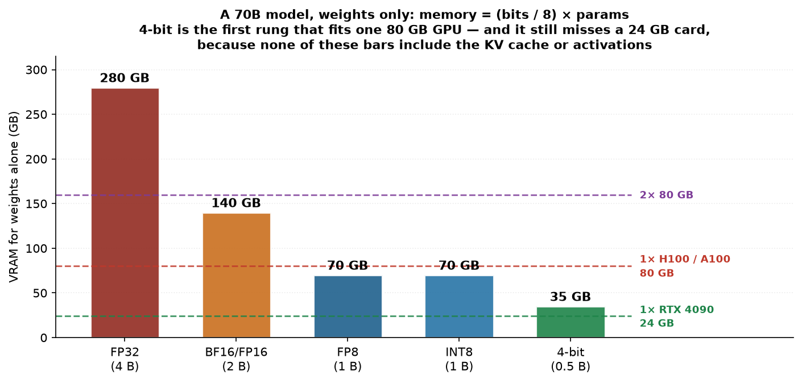
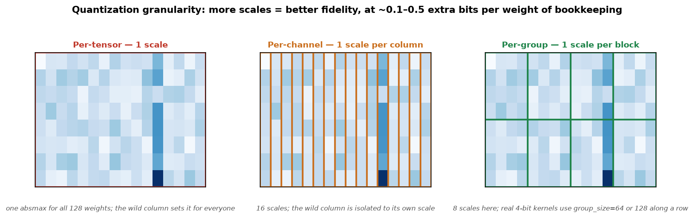
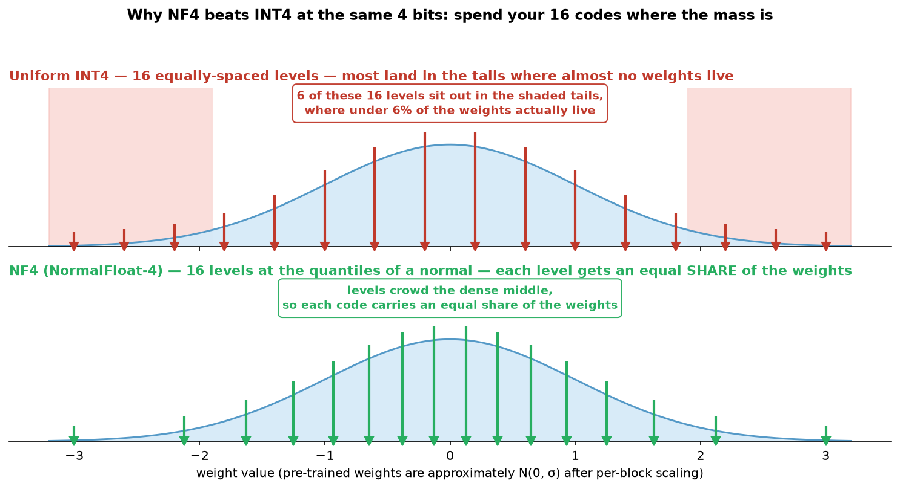

# Model Quantization — buying memory and speed with bits you can prove you don't need

> **TL;DR.** A model's weights are just numbers, and **FP32 stores each one far more precisely than the network can actually use**. Quantization spends fewer bits per parameter: `memory = (bits / 8) × params`, so a 70B model is **280 GB in FP32, 140 GB in FP16, 35 GB in 4-bit**. The bit budget splits two ways — **exponent buys RANGE, mantissa buys PRECISION** — which is why **BF16 replaced FP16 for training** (same range as FP32, so gradients stop overflowing) while **FP16 lost** despite having more mantissa bits. Below 16 bits you leave floating point entirely and *map* floats onto an integer grid via a **scale** (and optionally a **zero-point**), which works fine for weights and fails spectacularly for activations, because transformers past ~6.7B grow **outlier channels ~50× everything else** that drag the scale and crush all the ordinary values into 2–3 codes. The whole 4-bit zoo — **NF4, GPTQ, AWQ, GGUF** — is four different answers to "where do I spend my 16 codes?". 🎯 The sentence that wins the question: *"Quantization is lossy compression of the weights, and the only question that matters is **where you put the error** — every method is a different bet about which weights you're allowed to be wrong about."* `(certain)`

**Where it fits:** Lecture 5 of the *Advanced AI Agents* track, which opened by recapping [Distributed Training for LLMs](Distributed%20Training%20for%20LLMs.md) (DDP/FSDP, the NCCL collectives, ZeRO stages) and then pivoted here. It is the **other** answer to the memory wall: [Fine-Tuning LLMs](Fine-Tuning%20LLMs.md) shrinks what you *train* (LoRA), distributed training splits what you *store* across GPUs, and quantization shrinks **every byte of the model itself** — which is why it's the only one of the three that also helps at **inference**, where you'll spend 99% of your compute budget.
**Prereqs:** [LLM](LLM.md) (parameters, KV cache, decoding), [Fine-Tuning LLMs](Fine-Tuning%20LLMs.md) (LoRA, and the QLoRA sketch this note completes), [Distributed Training for LLMs](Distributed%20Training%20for%20LLMs.md) (the memory arithmetic), [RNN · LSTM · Transformers](../Machine%20Learning/NLP/RNN%20%C2%B7%20LSTM%20%C2%B7%20Transformers.md) (why a transformer is mostly `nn.Linear`).

> 🧠 **Start here, not at the top.** Jump straight to the [Self-Test](#-self-test), answer cold, then read **only** the sections you missed — a 5-minute pass instead of 30. *([why](../_STUDY%20LOOP.md))*

---

> ### ⚡ Fast Pass — 5 minutes
> **Model:** A weight is a point on the real line. Quantization throws away the fine ruler and keeps a **coarse grid**, storing only *which grid point* each weight snapped to, plus **one shared scale** to get back. Fewer bits = fewer grid points = more snapping error.
> **Core:**
> - `memory_bytes = (bits / 8) × params`. 70B: **280 GB fp32 → 140 GB fp16 → 70 GB int8 → 35 GB 4-bit**.
> - A float is `(−1)^S × 2^(exp − bias) × (1 + mantissa)`, with `bias = 2^(e−1) − 1`. **Exponent → range, mantissa → precision.**
> - **BF16 = FP32's 8 exponent bits + 7 mantissa bits.** Same range as FP32, so no loss-scaling. **FP16 = 5 + 10**, max **65,504** — overflows.
> - Symmetric/absmax: `s = absmax/127`, `q = round(w/s)`, `ŵ = q·s`. Affine adds a zero-point `z`.
> - **Outliers:** past ~6.7B a few activation channels run ~50× the rest and wreck a shared scale. LLM.int8() splits them out; SmoothQuant migrates the difficulty into the weights; AWQ scales the ~1% salient channels first.
> **Traps:** ① quoting a memory number that ignores the **KV cache** (at long context it can exceed the weights); ② assuming 4-bit is *faster* — it speeds up **decode** (memory-bound) and can **slow down** prefill (compute-bound); ③ picking FP16 for training in 2026; ④ judging a quantized model by perplexity alone; ⑤ quantizing a 1B model as aggressively as a 70B one.
> 🎯 **Kill-shot:** *"Weight-only 4-bit doesn't make the math cheaper — it makes the **memory traffic** cheaper, and single-stream decoding is bandwidth-bound, so that's exactly the bottleneck it removes."*

---

## Table of Contents
1. [Intuition / Mental Model — precision is a budget](#1-intuition--mental-model--precision-is-a-budget)
2. [The Formal Core — how a float is actually stored](#2-the-formal-core--how-a-float-is-actually-stored)
3. [Below 16 Bits — the quantization map](#3-below-16-bits--the-quantization-map)
4. [Why Naive INT8 Breaks LLMs — the outlier problem](#4-why-naive-int8-breaks-llms--the-outlier-problem)
5. [The 4-bit Zoo — NF4, GPTQ, AWQ, GGUF](#5-the-4-bit-zoo--nf4-gptq-awq-gguf)
6. [PTQ, QAT, and Where QLoRA Sits](#6-ptq-qat-and-where-qlora-sits)
7. [Worked Example — decoding an FP16 bit pattern by hand](#7-worked-example--decoding-an-fp16-bit-pattern-by-hand)
8. [Code / Implementation](#8-code--implementation)
9. [When It Breaks](#9-when-it-breaks)
10. [Does It Actually Make You Faster?](#10-does-it-actually-make-you-faster)
11. [Production & LLMOps Notes](#11-production--llmops-notes)
12. [Interview Lens](#12-interview-lens)
13. [Alternatives & How to Choose](#13-alternatives--how-to-choose)
- [🧠 Self-Test](#-self-test)

---

## 1. Intuition / Mental Model — precision is a budget

You have a number line and a fixed number of bits. **Every bit you spend is a promise about which numbers you can name.** FP32 can name ~4 billion distinct values between −3.4e38 and +3.4e38 — vastly more resolution than a neural network needs, because the network was trained with noisy gradients on noisy data and its *decisions* are robust to small perturbations of any individual weight.

The trade is not one-dimensional, and this is the thing people get wrong. A float format splits its bits into two jobs:

```
        ┌── how BIG / how SMALL can I go?  ── exponent ── RANGE
 bits ──┤
        └── how FINE are the steps?        ── mantissa ── PRECISION
```


**This picture explains the whole history of mixed-precision training.** FP16 was tried first — it has *more* mantissa bits than BF16, so it's "more precise". It was a nightmare: gradients in a deep network are routinely around `1e-8`, which is below FP16's smallest normal value, so they **underflow to zero** and the layer stops learning. The fix was *loss scaling* — multiply the loss by ~1024 before backward, divide it out after — a fiddly hack with its own overflow failure mode. BF16 deleted the problem by keeping FP32's exponent. You lose mantissa bits nobody was using and gain a range that never overflows. `(certain)`

> 🎯 *"FP16 and BF16 are both 2 bytes. FP16 spends them on precision, BF16 on range — and in deep learning, range is what you actually run out of."*


*Source: Scaler lecture deck.*

Notice the last row. **INT8 isn't a float at all** — it has no exponent, so it has no dynamic range to speak of, just 256 evenly spaced integers. That's the cliff: at 16 bits you are still doing floating-point arithmetic, and below 16 bits you are doing something categorically different, which §3 is about.

---

## 2. The Formal Core — how a float is actually stored

IEEE 754 stores a number as **sign, exponent, mantissa**:

```
value = (−1)^S × 2^(E − bias) × (1 + M)

  S    = the sign bit
  E    = the exponent field read as an unsigned integer
  bias = 2^(e−1) − 1        (e = number of exponent bits)
  M    = Σ mᵢ · 2^(−i)      (the mantissa bits, as a binary fraction)
```

The `bias` exists so a single unsigned field can express **negative** exponents (tiny numbers) as well as positive ones — with `e = 5`, `bias = 15`, so a stored `E` of 16 means an actual exponent of `+1` and a stored `E` of 3 means `−12`. The leading `1 +` is the **implicit bit**: normalized binary always starts with a 1, so it isn't stored, and you get a free bit of precision. `(certain)`

| Format | Bits | S / E / M | bias | Max | Smallest normal |
|---|---|---|---|---|---|
| FP64 | 64 | 1 / 11 / 52 | 1023 | ~1.8e308 | ~2.2e−308 |
| FP32 | 32 | 1 / 8 / 23 | 127 | ~3.4e38 | ~1.2e−38 |
| **BF16** | 16 | 1 / 8 / 7 | 127 | ~3.4e38 | ~1.2e−38 |
| **FP16** | 16 | 1 / 5 / 10 | 15 | **65,504** | ~6.1e−5 |
| FP8 E4M3 | 8 | 1 / 4 / 3 | 7 | 448 | ~2^−6 |
| FP8 E5M2 | 8 | 1 / 5 / 2 | 15 | 57,344 | ~6.1e−5 |

**The memory formula** — the one you must be able to produce instantly:

```
memory_bytes = (nr_bits / 8) × nr_params
```



The lecture's arithmetic for a 70B model, worth memorizing as anchors:

| Precision | Bytes/param | 70B weights | 7B weights |
|---|---|---|---|
| FP64 | 8 | 560 GB | 56 GB |
| FP32 | 4 | 280 GB | 28 GB |
| FP16 / BF16 | 2 | **140 GB** | **14 GB** |
| FP8 / INT8 | 1 | 70 GB | 7 GB |
| 4-bit | 0.5 | **35 GB** | **3.5 GB** |

> ⚠️ **This table is weights only, and the trap is quoting it as if it were the whole story.** For *training* you also carry gradients, Adam's two optimizer states, and activations — roughly **`24 bytes/param` in the classic fp32 recipe** (see [Fine-Tuning LLMs §4](Fine-Tuning%20LLMs.md#4-the-memory-wall--why-full-fine-tuning-is-off-the-table)). For *inference* you also carry the **KV cache**, which grows with `batch × context × layers` and at long context can exceed the quantized weights outright (§11). `(certain)`

---

## 3. Below 16 Bits — the quantization map

At 8 bits and below you stop storing a float and start storing an **index into a grid**. You need two things: the integer code `q`, and enough metadata to reconstruct an approximate `ŵ`.

**Symmetric (absmax) — the default for weights.** Weights are roughly zero-centered, so use one scale and let the grid straddle zero:

```
s = absmax(W) / 127          # absmax = max(|w|) over the block
q = round(w / s)             # → int8 in [−127, 127]
ŵ = q · s                    # dequantize
```

**Asymmetric (affine) — for lopsided ranges.** Post-activation tensors (ReLU, GELU) sit mostly on one side of zero. A symmetric grid would waste half its codes on a range that never occurs, so add a **zero-point** `z` that shifts the grid:

```
s = (max − min) / 255
z = round(−min / s)          # the integer code that means "exactly 0.0"
q = round(w / s) + z         # → uint8 in [0, 255]
ŵ = (q − z) · s
```


Keeping `0.0` exactly representable matters more than it looks: padding, masks, and ReLU outputs are *full of* exact zeros, and a grid that rounds zero to `0.4·s` injects error into every padded position. Symmetric gets this free; affine gets it via `z`. `(certain)`

### 3.1 Granularity — how many scales you're willing to store

One scale for a whole tensor is cheapest and worst. The more scales, the better each one fits its local range — at the cost of storing them:



| Granularity | Scales stored | Overhead | Used for |
|---|---|---|---|
| **Per-tensor** | 1 | ~0 | INT8 activations, where you need one scale to fuse kernels |
| **Per-channel** | one per output channel | ~0.03 bits/w | INT8 weights — the standard |
| **Per-group / block** | one per 64 or 128 weights | **~0.25–0.5 bits/w** | **all 4-bit methods** |

That overhead is why "4-bit" models are really ~4.3–4.5 bits/param on disk. QLoRA's **double quantization** attacks exactly this: it quantizes the *block scales themselves* (fp32 → fp8, blocks of 256), reclaiming ~0.37 bits/param of pure bookkeeping. `(certain)`

### 3.2 Weight-only vs weight-and-activation — the distinction that decides everything

This is the axis most people miss, and it's the one that determines whether you get a **speedup** or only a **memory saving**.

```
W4A16 / W8A16  "weight-only"   weights stored 4/8-bit, dequantized to fp16
                                just before the matmul, which runs in fp16.
                                → saves memory + memory BANDWIDTH
                                → the arithmetic is unchanged
                                → bitsandbytes, GPTQ, AWQ, NF4, most GGUF

W8A8           "full integer"  weights AND activations int8; the matmul
                                itself runs on int8 tensor cores.
                                → saves memory AND does 2× the FLOPs/clock
                                → but activations are where the outliers are (§4)
                                → SmoothQuant, LLM.int8(), FP8 on H100
```

Weight-only is easy and safe. Full-integer is where the real compute speedup lives and where all the difficulty is.

---

## 4. Why Naive INT8 Breaks LLMs — the outlier problem

Take a trained 13B transformer, quantize weights *and* activations to INT8 per-tensor, and the model produces fluent-looking garbage. Perplexity explodes. The cause is specific and famous.

**Past roughly 6.7B parameters, transformers develop emergent outlier features:** a small number of hidden dimensions — on the order of 0.1% of channels — carry activation magnitudes **~20–100× larger** than every other channel, and they appear in **essentially every token**. They aren't noise; ablate them and the model's performance collapses, so you can't just clip them.


The arithmetic of the disaster: a shared scale is `absmax/127`. One channel at 50× drags `absmax` up 50×, so every *ordinary* value — which is what almost all of the tensor is — now maps into the bottom `127/50 ≈ 2.5` codes. **You have quantized 99.9% of your tensor to three distinct values.** `(certain)`

Three families of answer, and it's worth knowing which is which:

| Fix | Idea | Cost |
|---|---|---|
| **LLM.int8()** (Dettmers 2022) | *Isolate.* Detect outlier dimensions at runtime, do those columns in fp16, the rest in int8, sum the two partial matmuls | mixed-precision path is slower than pure int8; often ~no speedup, memory only |
| **SmoothQuant** (Xiao 2022) | *Migrate.* Divide activations by a per-channel factor `s` and multiply the corresponding weight rows by `s` — mathematically identical output, but the difficulty moves from the hard-to-quantize activations into the easy-to-quantize weights | needs calibration to pick `s`; enables genuine W8A8 |
| **AWQ** (Lin 2023) | *Protect.* Don't quantize activations at all; instead use activation statistics to find the ~1% of **weight** channels that matter most and scale them up before quantizing, so they survive rounding | calibration; weight-only, so no int8-tensor-core speedup |

> 🎯 *"The outliers are in the **activations**, not the weights — which is why weight-only 4-bit quantization is nearly free while INT8 activation quantization needed three papers to make work."*

Note what this implies about **which layers to leave alone**. The `lm_head` / output projection, the token embeddings, and every LayerNorm are disproportionately sensitive, and they're a small fraction of the parameters. Nearly every production recipe keeps them in fp16. Quantizing them buys ~2% memory and costs real quality. `(likely)`

---

## 5. The 4-bit Zoo — NF4, GPTQ, AWQ, GGUF

At 4 bits you have **16 codes** for a whole block of weights. Every method is a different answer to *where to put them*.

### 5.1 NF4 — put the codes at the quantiles

Pre-trained weights are approximately **normally distributed** around zero. Uniform INT4 spreads its 16 levels evenly across the range, which means a large share of them sit far out in the tails where hardly any weights live. **NF4 (4-bit NormalFloat)** instead places its levels at the **quantiles of a standard normal**, so each code is used by roughly the same number of weights — information-theoretically optimal for normally-distributed data.



It's a **fixed** codebook — no calibration data, no search, it just assumes normality (which per-block absmax normalization makes approximately true). That's why it's the default for QLoRA: zero setup cost.

### 5.2 GPTQ — round each weight, then fix the damage

GPTQ (Frantar 2022) descends from Optimal Brain Quantization. Quantize weights **one column at a time**; after each column is rounded, use approximate **second-order (Hessian) information** to *update the not-yet-quantized weights* so they compensate for the error just introduced. The layer's output on the calibration set stays close to the original even though its weights have moved a lot.

- Needs a **calibration set** (~128 sequences) and a real quantization pass — roughly **20 minutes for an 8B on one A100**.
- Excellent accuracy at 4-bit. Enormous pre-quantized library on the Hub.
- Risk: it optimizes for the calibration distribution, so a mismatched calibration set (English wiki text, then you serve code) leaves accuracy on the table. `(certain)`

### 5.3 AWQ — protect the channels the activations say matter

AWQ's observation is that **weight magnitude is the wrong saliency signal**. What matters is which weight channels get multiplied by large activations. It finds those (~1%) from calibration statistics and applies a per-channel scaling that effectively gives them more effective precision before rounding — no mixed precision, no reordering, so the kernels stay simple and fast.

- Calibration is **~10 minutes for an 8B**, about half of GPTQ.
- Generally matches or beats GPTQ at 4-bit, and is the common default on inference servers.

### 5.4 GGUF / k-quants — the laptop format

GGUF is **llama.cpp's** container format, built for CPU and Apple-Silicon inference with memory-mapped loading. Its "**k-quant**" schemes (`Q4_K_M`, `Q5_K_M`, `Q6_K`…) mix bit-widths *within* a model — more bits for attention and the sensitive layers, fewer for the bulk feed-forward weights. `Q4_K_M` is the community's default sweet spot.

### 5.5 Picking between them

| Method | Bits | Calibration | Speedup? | Fine-tune on it? | Best for |
|---|---|---|---|---|---|
| **bnb NF4** | 4 | none | memory only | **yes — QLoRA** | training on a small GPU |
| **bnb INT8** | 8 | none | memory only | yes | quick safe memory cut |
| **AWQ** | 4 | ~10 min | **yes** | no | GPU serving |
| **GPTQ** | 4 | ~20 min | **yes** | no | GPU serving; huge Hub library |
| **HQQ / SINQ** | 8/4/3/2 | **none** | yes | limited | quantizing on the fly, no calib data |
| **GGUF k-quants** | 2–8 mixed | none | yes (CPU) | no | laptop / CPU / Apple Silicon |
| **torchao** | int8/int4/fp8 | none | yes, with `torch.compile` | QAT supported | PyTorch-native pipelines |
| **FP8 (compressed-tensors)** | 8 | none | **yes, natively** | yes | H100/Blackwell serving |

**Quality, roughly** `(likely)` — 8-bit is essentially free (indistinguishable from bf16 on most benchmarks); 4-bit with a good method costs low single-digit percent; **sub-4-bit degrades noticeably**, and 2-bit is a research posture, not a production one.

---

## 6. PTQ, QAT, and Where QLoRA Sits


**PTQ (post-training quantization)** is everything in §5: take a finished model, optionally show it a few hundred calibration samples, emit quantized weights. No gradients, minutes to hours. **This is what you should try first, always.**

**QAT (quantization-aware training)** puts a **fake-quantize** op in the forward pass during training — quantize then immediately dequantize, so the network computes in fp16 but *sees* the rounding error and learns weights that are robust to it. The obvious problem is that `round()` has a derivative of zero almost everywhere, which would kill the gradient. The fix is the **straight-through estimator (STE)**: on the backward pass, pretend the rounding was the identity function and pass the gradient through unchanged.

```
forward:   w_fake = dequant(quant(w))    # rounding error is real and visible to the loss
backward:  ∂L/∂w = ∂L/∂w_fake            # STE — pretend round() was identity
```

QAT wins at aggressive bit-widths (torchao reports recovering a large share of the 4-bit degradation on small models) but costs a training run, so it's reserved for cases where PTQ demonstrably isn't good enough — typically **small models at ≤4-bit**, where there's no redundancy to spare.

**QLoRA is neither, and this is a favorite interview trip-wire.** Its quantization isn't a deployment step — it's there so **training** fits in VRAM. The 4-bit NF4 base is **frozen** and never updated; only the fp16 LoRA adapters have gradients. The base is dequantized to bf16 **per layer, on the fly**, used, and discarded — never stored dequantized. And gradients flow *through* those frozen 4-bit weights to reach the adapters.

> 🎯 *"In QLoRA the quantized weights are frozen and the trainable adapters are full precision — so it's not quantization-aware training, it's training **around** a quantized base."*

After training you have a choice with a real trade-off: **merge** the adapter into the base (you must dequantize to fp16 first, so you lose the 4-bit footprint) or **serve base + adapter separately** (keep 4-bit, pay a small latency cost and a PEFT dependency). Merging *into* the 4-bit weights and re-quantizing is possible but introduces a second round of error. `(certain)`

---

## 7. Worked Example — decoding an FP16 bit pattern by hand

This is the lecture's own example, and it is worth doing once with a pen because it makes the format concrete.

**Given** the 16-bit pattern `0 10000 1001001000`. What number is it?

**Step 1 — split the fields.** FP16 is 1 sign / 5 exponent / 10 mantissa.

```
S = 0                  E = 10000                M = 1001001000
```

**Step 2 — the sign.** `(−1)^0 = +1`.

**Step 3 — the exponent.** Read `10000` as an unsigned integer: `1×2⁴ = 16`.
The bias for a 5-bit exponent is `2^(5−1) − 1 = 15`.

```
actual exponent = E − bias = 16 − 15 = 1     →     2¹ = 2
```

**Step 4 — the mantissa.** Bit `i` (1-indexed from the left) contributes `2^(−i)`. Bits 1, 4 and 7 are set:

```
M = 2⁻¹ + 2⁻⁴ + 2⁻⁷
  = 0.5 + 0.0625 + 0.0078125
  = 0.5703125
```

**Step 5 — assemble**, remembering the implicit leading 1:

```
value = +1 × 2¹ × (1 + 0.5703125)
      = 2 × 1.5703125
      = 3.140625
```

That's **π, to the resolution FP16 can afford** (π = 3.14159…, so the error is ~0.001). The same bits in FP32 would land on 3.1415927. **That gap is quantization error, and you just computed it.**

### 7.1 The other half of the lesson — range failures

Now run three numbers through three precisions and watch the format break in *two different directions*:

| Value | FP64 | FP32 | FP16 |
|---|---|---|---|
| `75505` | 75505 | 75505 | **`inf`** ← overflow: FP16 maxes at 65,504 |
| `1.8e−42` | 1.8e−42 | 1.8006e−42 | **`0.0`** ← underflow: below FP16's smallest subnormal |

Both failures are **exponent** failures, not mantissa failures — note that FP32 already loses precision on the tiny value (`1.8` → `1.8006`, because it's a subnormal) but at least keeps it nonzero. **This is the entire argument for BF16 in one table**: a format with FP32's exponent has neither failure mode, and gradients near `1e−8` are exactly the `0.0` column waiting to happen. `(certain)`

---

## 8. Code / Implementation

> ⚠️ **Version drift is severe in this stack.** `transformers` crossed **v5** and `trl` crossed **v1.0** in 2026, and both rename or remove arguments frequently (`torch_dtype` → `dtype`; `warmup_ratio` → `warmup_steps`; `logging_dir` → the `TENSORBOARD_LOGGING_DIR` env var). **Pin your versions** — the lecture notebook does, after breaking on exactly these. Verified working set: `transformers==5.15.0`, `trl==1.10.0`, `peft==0.20.0`, `datasets==5.0.1`, `accelerate==1.14.0`, `torchao>=0.16.0`.

### 8.1 From scratch — the whole idea in 15 lines

```python
import torch

def quantize_absmax(w: torch.Tensor, n_bits: int = 8, group_size: int = 64):
    """Symmetric per-group absmax quantization — the core of every 4/8-bit method."""
    qmax = 2 ** (n_bits - 1) - 1                    # 127 for int8, 7 for int4
    w_g = w.reshape(-1, group_size)                 # one scale per group, not per tensor
    scale = w_g.abs().amax(dim=1, keepdim=True) / qmax   # THE metadata you must store
    q = torch.clamp(torch.round(w_g / scale), -qmax, qmax).to(torch.int8)
    return q, scale

def dequantize(q, scale, shape):
    return (q.float() * scale).reshape(shape)

w = torch.randn(4096, 4096)
q, s = quantize_absmax(w, n_bits=4, group_size=64)
err = (w - dequantize(q, s, w.shape)).abs().mean()
print(f"mean abs error: {err:.5f}  |  mean |w|: {w.abs().mean():.5f}")
# Rule of thumb: relative error ~2-4% at 4-bit, ~0.2% at 8-bit.
# Now re-run with group_size=4096 (per-tensor) and watch it get worse —
# that single change is the whole granularity argument from §3.1.
```

### 8.2 Loading a quantized model — bitsandbytes (the QLoRA path)

```python
from transformers import AutoModelForCausalLM, BitsAndBytesConfig
import torch

bnb_config = BitsAndBytesConfig(
    load_in_4bit=True,
    bnb_4bit_quant_type="nf4",              # "nf4" beats "fp4" — §5.1. Don't leave this default.
    bnb_4bit_compute_dtype=torch.bfloat16,  # dequantize to bf16 for the matmul, NOT fp16
    bnb_4bit_use_double_quant=True,         # quantize the scales too: ~0.37 bits/param back
)

model = AutoModelForCausalLM.from_pretrained(
    "Qwen/Qwen2.5-7B",
    quantization_config=bnb_config,
    device_map="auto",
    dtype=torch.bfloat16,                   # `dtype` replaced `torch_dtype` in transformers v5
)
print(f"{model.get_memory_footprint() / 1024**3:.2f} GB")   # ~4 GB instead of ~14 GB
```

To fine-tune on top of this, add `prepare_model_for_kbit_training(model)` before attaching LoRA — it casts LayerNorms to fp32 and enables gradient checkpointing correctly. That, plus a `LoraConfig`, **is** QLoRA; see [Fine-Tuning LLMs §9](Fine-Tuning%20LLMs.md#9-code--implementation).

### 8.3 Serving-grade PTQ — AWQ / GPTQ / torchao

```python
# Simplest path by far: load someone else's. Thousands are on the Hub.
model = AutoModelForCausalLM.from_pretrained("<org>/<model>-AWQ", device_map="auto")

# Quantizing yourself with torchao. NOTE: the old string-based API
# ("int4_weight_only") was REMOVED — you must pass an AOBaseConfig object,
# and transformers requires torchao >= 0.15.
from transformers import TorchAoConfig
from torchao.quantization import Int4WeightOnlyConfig

model = AutoModelForCausalLM.from_pretrained(
    "Qwen/Qwen2.5-7B",
    quantization_config=TorchAoConfig(quant_type=Int4WeightOnlyConfig(group_size=128)),
    device_map="auto",
    dtype=torch.bfloat16,
)
model = torch.compile(model, mode="max-autotune")  # torchao's speedup LIVES here — don't skip it
```

### 8.4 The evaluation you must actually run

```python
# Perplexity is necessary but NOT sufficient — it is an average over easy tokens and
# hides exactly the reasoning/long-context damage quantization causes (§9).
# Always pair it with a task eval on YOUR distribution.
import torch

def perplexity(model, tokenizer, text, stride=512, max_len=2048):
    enc = tokenizer(text, return_tensors="pt").input_ids.to(model.device)
    nlls, prev = [], 0
    for begin in range(0, enc.size(1), stride):
        end = min(begin + max_len, enc.size(1))
        trg_len = end - prev
        ids = enc[:, begin:end]
        targets = ids.clone()
        targets[:, :-trg_len] = -100          # only score the NEW tokens in this window
        with torch.no_grad():
            nlls.append(model(ids, labels=targets).loss * trg_len)
        prev = end
        if end == enc.size(1):
            break
    return torch.exp(torch.stack(nlls).sum() / enc.size(1))

# Ship only if: Δppl small AND your task metric holds AND p99 latency improved.
```

---

## 9. When It Breaks

| Failure | Why | What to do |
|---|---|---|
| **Fluent garbage after INT8** | activation outliers dragged the scale (§4) | weight-only int8, or SmoothQuant/LLM.int8() for W8A8 |
| **Small model falls apart at 4-bit** | a 1–3B model has little redundancy; a 70B has plenty. Damage is roughly inverse to parameter count | use 8-bit for small models, or QAT |
| **Fine at 4-bit on benchmarks, bad in production** | perplexity and short QA hide the damage; **reasoning chains and long-context retrieval degrade first**, because errors compound over many autoregressive steps | eval on long-context and multi-step tasks specifically |
| **GPTQ model worse than expected** | calibration set didn't match serving distribution | recalibrate on your own traffic |
| **4-bit is *slower* than fp16** | you're compute-bound (large batch, or prefill), and dequantization is added work | see §10 — use fp16/fp8 for throughput serving |
| **QLoRA loss is NaN** | fp16 compute dtype with 4-bit base | set `bnb_4bit_compute_dtype=torch.bfloat16` |
| **Merged QLoRA adapter is worse than the unmerged one** | you trained against the *quantized* base but merged into the *dequantized* one — a train/serve mismatch | evaluate merged **and** unmerged; keep whichever wins |
| **Quantized model won't load in your server** | format ≠ runtime. GGUF needs llama.cpp; AWQ/GPTQ need the right kernels | pick the format your serving stack supports **first** |
| **Sudden quality cliff at long context** | KV cache quantized too aggressively (int4 KV is much harsher than int4 weights) | keep KV at fp8/int8, not int4 |

---

## 10. Does It Actually Make You Faster?

The most common misconception in this topic is that fewer bits automatically means faster. **It depends entirely on whether you are memory-bound or compute-bound**, and LLM inference is both — in different phases.

```
PREFILL (processing the prompt)      COMPUTE-bound
  one big matmul over all prompt tokens; the GPU's FLOPs are the limit.
  → weight-only 4-bit ADDS work (dequantize on every use) → can be SLOWER
  → real speedup here needs int8/fp8 TENSOR CORES (W8A8, FP8)

DECODE (generating, one token at a time)      MEMORY-BANDWIDTH-bound
  each token must stream EVERY weight from HBM to do a tiny amount of math.
  Arithmetic intensity is terrible; the GPU idles waiting on memory.
  → 4× fewer weight bytes = ~4× less traffic = near-linear speedup
  → this is where weight-only 4-bit shines
```

So: **weight-only 4-bit is a decode optimization.** At batch size 1 (a chat assistant) it's a large win. At batch size 128 (a throughput-oriented batch job) the weight read is amortized across many sequences, you become compute-bound, and the dequantization overhead can make you *slower* than fp16. `(certain)`

This is also why **FP8 on H100/Blackwell is a different kind of win**: it's supported natively by the tensor cores, so it cuts memory *and* doubles arithmetic throughput, with no dequantization step. Where the hardware supports it, FP8 is usually the better answer than INT8. `(likely)`

> 🎯 *"Ask which phase you're optimizing. Weight-only 4-bit halves your time-to-token in single-stream decode and does nothing for a large-batch prefill — the bottleneck moved, so the fix has to move too."*

---

## 11. Production & LLMOps Notes

**Don't forget the KV cache — it is frequently the real constraint.** Quantizing weights from 140 GB to 35 GB is worthless if your cache needs 100 GB.

```
kv_bytes ≈ 2 (K and V) × layers × kv_heads × head_dim × context × batch × bytes_per_elem
```

For a 70B (80 layers, 8 KV heads with GQA, head_dim 128) at 32k context, batch 1, fp16:
`2 × 80 × 8 × 128 × 32768 × 2 ≈ 10.7 GB` — **for a single request.** At batch 16 it's ~170 GB, dwarfing the 35 GB of 4-bit weights. Mitigations, in order of leverage: **GQA/MQA** (architectural, already in most modern models), **paged attention** (vLLM — fixes fragmentation, not size), and **KV-cache quantization to fp8/int8**. Go to int4 KV only with careful eval; the cache is far more sensitivity-sensitive than the weights. `(certain)`

**Quantization is a model version.** A 4-bit build is a *different model* with different outputs — it needs its own eval run, its own entry in the model registry, and its own row in whatever you use to track prompt/model versions ([Evaluating LLMs](Evaluating%20LLMs.md)). Never silently swap the quantization of a model already serving traffic; you will get a quality regression that no prompt change explains.

**Match the format to the runtime before you quantize anything.** This is the ordering mistake that costs a day:

| Runtime | Formats |
|---|---|
| **vLLM / SGLang** | AWQ, GPTQ, FP8, compressed-tensors, bitsandbytes (slower) |
| **TensorRT-LLM** | its own build; INT8/FP8/INT4-AWQ, best NVIDIA perf, least flexible |
| **llama.cpp / Ollama / LM Studio** | GGUF only |
| **HF transformers** | almost everything, none of it maximally fast |

**Prefer someone else's quantization.** For any popular model there are already community AWQ/GPTQ/GGUF builds that have been used by thousands of people. Quantizing yourself is for private fine-tunes and unusual configs.

**Cost framing that lands in a design review:** quantization is the cheapest lever you have. Going 70B-fp16 (2× A100) → 70B-AWQ (1× A100) halves your inference bill with a single-digit-percent quality cost, and needs no retraining, no data, and no architecture change. Compare that with distilling to a smaller model (weeks) or moving to a smaller base (a real quality drop). `(likely)`

**Monitor after you ship.** Track output-length distribution and refusal/failure rates alongside your task metric — a subtly damaged quantized model often shows up first as *drifting response length* or a rise in degenerate repetition, well before an offline metric moves.

**Calibration data is production data.** If you quantize with GPTQ/AWQ yourself, draw the calibration set from **real traffic** (scrubbed), not from wikitext. It's a few hundred sequences; it's the cheapest accuracy you'll ever buy.

---

## 12. Interview Lens

**The trade-off being tested:** can you reason about *where the error goes* and *what the actual bottleneck is* — rather than reciting that "4-bit is smaller".

| Question | What wins it |
|---|---|
| *"Why did BF16 replace FP16?"* | 🎯 *"Same exponent as FP32, so the same dynamic range. Deep-net gradients underflow FP16's range long before they need its extra mantissa bits — BF16 deletes loss-scaling."* |
| *"Why does INT8 break big transformers?"* | 🎯 *"Emergent outlier channels past ~6.7B — ~0.1% of dimensions at ~50× magnitude, present in every token. They drag a shared absmax scale so far that everything else collapses into two or three codes."* |
| *"Does 4-bit make inference faster?"* | 🎯 *"For decode, yes — it's memory-bandwidth-bound, so 4× fewer weight bytes is nearly 4× less traffic. For prefill, it can be slower, because that's compute-bound and dequantization is extra work."* |
| *"What's the difference between QLoRA and QAT?"* | 🎯 *"QLoRA freezes the quantized base and trains full-precision adapters beside it. QAT trains the model *through* fake-quantize ops with a straight-through estimator so the weights themselves become robust to rounding."* |
| *"GPTQ or AWQ?"* | Both 4-bit PTQ with calibration. GPTQ compensates for rounding error using Hessian info, column by column; AWQ protects the ~1% of channels that activations say are salient. AWQ calibrates ~2× faster and is usually at least as accurate. |
| *"Why is NF4 better than INT4?"* | Weights are ~Gaussian; NF4's levels are the normal's quantiles so each code carries equal probability mass, while uniform INT4 wastes levels on empty tails. |
| *"How would you quantize a 70B for a single 80 GB GPU?"* | Weights 4-bit AWQ ≈ 35 GB → then the honest part: **budget the KV cache**, quantize it to fp8, size max context and batch against the ~40 GB left, serve on vLLM, and validate on long-context tasks, not just perplexity. |

**Follow-ups worth pre-loading:**
- *"What would you not quantize?"* — `lm_head`, embeddings, LayerNorms. Tiny share of parameters, outsized share of the damage.
- *"How do you know it still works?"* — perplexity **and** a task eval on your own distribution, weighted toward long-context and multi-step reasoning, which degrade first.
- *"What if it's a 1.5B model?"* — expect much worse relative damage; small models have less redundancy. Use 8-bit, or QAT if 4-bit is mandatory.

---

## 13. Alternatives & How to Choose

Quantization is one of four ways to make a model cheaper, and they compose:

| Lever | What it removes | Cost to you | Quality risk |
|---|---|---|---|
| **Quantization** | bits per weight | minutes–hours, no data | low at 8-bit, low-moderate at 4-bit |
| **Pruning / sparsity** | whole weights | needs retraining to recover; 2:4 structured sparsity for real speedup | moderate |
| **Distillation** | parameters (train a small student) | weeks + a big data pipeline | high, but the ceiling is best |
| **Better serving** (paged attention, continuous batching, speculative decoding) | wasted memory & idle time | integration only, **no quality cost** | none |

> **The order to try things:** better serving first (free), then quantization (cheap), then distillation (expensive). Pruning is a distant fourth for LLMs — the accuracy/speedup ratio is worse than quantization's and the tooling is thinner. `(likely)`

**The decision tree the lecture drew, completed:**

```
Does the model + training state fit on one GPU?
├─ YES → plain DDP  (see: Distributed Training for LLMs)
└─ NO  → Do you have the budget for FULL training memory across GPUs?
         ├─ YES → FSDP / ZeRO-3
         └─ NO  → LoRA  ──(base still doesn't fit?)──→  QLoRA (NF4)

Serving, not training?
├─ Fits in fp16 and you're throughput-bound → stay fp16, or FP8 on H100+
├─ Latency-bound single-stream chat        → 4-bit AWQ/GPTQ, weight-only
├─ CPU / laptop / Apple Silicon            → GGUF Q4_K_M
└─ Model under ~3B                         → 8-bit; 4-bit will hurt
```

**And the one-line default:** *serve* with **AWQ 4-bit on vLLM** (or FP8 if you have H100s and are throughput-bound); *train* with **QLoRA NF4 + bf16 compute**; *prototype on a laptop* with **GGUF Q4_K_M**.

---

## 🧠 Self-Test

1. **State the memory formula, and compute the VRAM for a 13B model's weights in fp16 and in 4-bit.**
   <details><summary>answer</summary><code>memory_bytes = (bits / 8) × params</code>. fp16: <code>2 × 13e9 = 26 GB</code>. 4-bit: <code>0.5 × 13e9 = 6.5 GB</code> (really ~7 GB once you count the per-group scales, which add ~0.25–0.5 bits/param). Both numbers are <b>weights only</b> — inference also needs the KV cache, and training needs gradients plus optimizer states plus activations (~24 bytes/param in the classic fp32 recipe).</details>

2. **BF16 and FP16 are both 16 bits. Why did BF16 win for training?**
   <details><summary>answer</summary>The bits are split differently: BF16 is 1/<b>8</b>/7 and FP16 is 1/<b>5</b>/10. BF16 keeps FP32's full 8-bit exponent, so it has FP32's <b>dynamic range</b> (±3.4e38) and simply drops mantissa bits. FP16 caps at <b>65,504</b> and its smallest normal is ~6e−5 — so deep-net gradients around 1e−8 <b>underflow to zero</b> and large activations overflow to <code>inf</code>. FP16 training needs loss scaling to work at all; BF16 needs nothing. 🎯 <i>Range is what deep learning runs out of, not precision.</i></details>

3. **Decode the FP16 pattern `0 10000 1001001000`.**
   <details><summary>answer</summary>S=0 → positive. E = <code>10000</code> = 16; bias = 2<sup>5−1</sup>−1 = 15; so the exponent is 16−15 = <b>1</b> → 2¹ = 2. Mantissa bits 1, 4, 7 are set → 2⁻¹+2⁻⁴+2⁻⁷ = 0.5+0.0625+0.0078125 = <b>0.5703125</b>. With the implicit leading 1: <code>2 × (1 + 0.5703125)</code> = <b>3.140625</b> — π, at FP16's resolution.</details>

4. **Why does naive per-tensor INT8 destroy a 13B model but barely dent a 350M one?**
   <details><summary>answer</summary><b>Emergent activation outliers.</b> Past roughly 6.7B parameters, transformers develop a small set of hidden dimensions (~0.1% of channels) whose activations run 20–100× larger than everything else, in essentially every token — and they're functionally important, so you can't clip them. A shared scale is <code>absmax/127</code>, so one 50× channel pushes every ordinary value into the bottom ~2–3 codes. Smaller models don't have them. Fixes: <b>LLM.int8()</b> isolates outliers into an fp16 matmul; <b>SmoothQuant</b> migrates the difficulty from activations into weights; <b>AWQ</b> sidesteps it by staying weight-only.</details>

5. **Does 4-bit weight-only quantization make inference faster? Be precise.**
   <details><summary>answer</summary>It depends on the phase. <b>Decode</b> (one token at a time) is <b>memory-bandwidth-bound</b> — every weight is streamed from HBM to do very little math — so 4× fewer weight bytes gives a near-linear speedup. <b>Prefill</b> (and large-batch serving) is <b>compute-bound</b>, and weight-only quantization <i>adds</i> a dequantization step before an unchanged fp16 matmul, so it can be <b>slower</b>. Real compute speedups need integer/FP8 <b>tensor cores</b> (W8A8, FP8), which means quantizing activations too — which is exactly what the outlier problem makes hard.</details>

6. **What's the difference between NF4, GPTQ and AWQ — in one sentence each?**
   <details><summary>answer</summary><b>NF4</b>: a fixed codebook whose 16 levels sit at the quantiles of a normal distribution, so each code carries equal probability mass for approximately-Gaussian weights — no calibration needed. <b>GPTQ</b>: quantizes column by column and uses approximate Hessian (second-order) information to update the remaining weights so they compensate for the error just introduced — needs calibration (~20 min for 8B). <b>AWQ</b>: uses activation statistics to identify the ~1% of <i>salient</i> weight channels and scales them before rounding to protect them — needs calibration (~10 min for 8B) and usually matches or beats GPTQ.</details>

7. **You're asked to serve a 70B model on a single 80 GB GPU. Walk through it.**
   <details><summary>answer</summary>Weights at 4-bit AWQ: <code>0.5 × 70e9 ≈ 35 GB</code>. That leaves ~45 GB, and the honest next step is <b>budgeting the KV cache</b>: <code>2 × layers × kv_heads × head_dim × context × batch × bytes</code> — for this model at 32k context that's ~10.7 GB <i>per request</i> in fp16, so quantize the cache to fp8 and size max-context × batch against what's left. Serve on vLLM (supports AWQ + paged attention + continuous batching). Then validate: perplexity <i>plus</i> a task eval weighted toward long-context and multi-step reasoning, since those degrade before perplexity moves.</details>

8. **QLoRA quantizes the model to 4-bit and then trains it. What's wrong with that sentence?**
   <details><summary>answer</summary>It never trains the 4-bit weights. The NF4 base is <b>frozen</b>; the only parameters with gradients are the <b>fp16/bf16 LoRA adapters</b> beside it. Gradients flow <i>through</i> the frozen quantized weights (which are dequantized to bf16 per layer on the fly, used, and discarded — never stored dequantized) to reach the adapters. That also makes it <b>not</b> QAT: QAT trains the weights themselves to be robust to rounding via fake-quantize ops and a straight-through estimator. In QLoRA, quantization is a <b>training-memory</b> trick, not a deployment format.</details>
