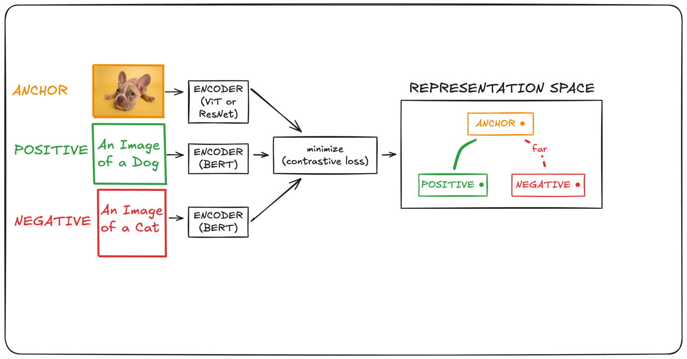
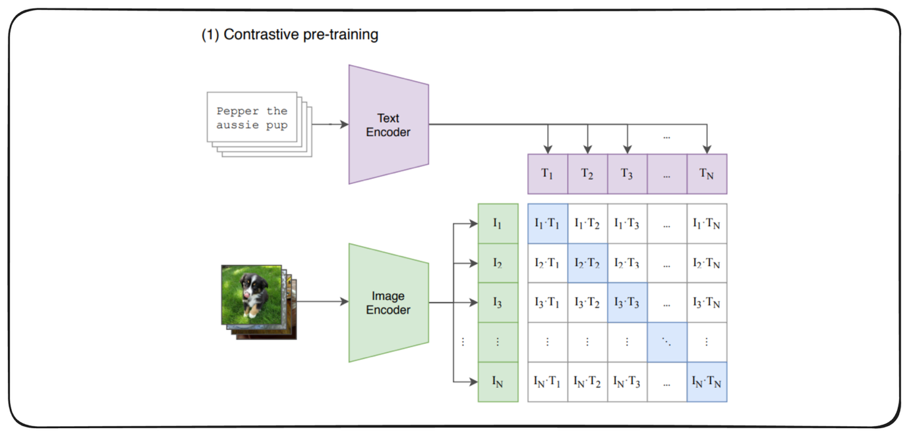

# Multimodal RAG — Retrieval Over Images & Document Pages (CLIP, ColPali, VLMs)

> **TL;DR.** Multimodal RAG extends [RAG](RAG.md) to corpora where the meaning lives in **pixels, not text** — diagrams, charts, scanned pages, and image-heavy manuals. Two retriever families dominate: **CLIP** embeds text and images into **one shared vector space** so you can search across modalities (text→image, image→image, image→text) — cheap, great for a **POC**; **ColPali** skips OCR entirely, treats **each document page as an image**, and scores it with **late-interaction (MaxSim)** multi-vector matching — heavier, but the **production choice** for real documents because it keeps every diagram, table, and layout cue. The reader is a **VLM** (vision-language model) that answers from the *retrieved* text **and** images — and a RAG system **surfaces the real manual images verbatim; it never generates hypothetical ones**. The running case is **IKEA assembly manuals**: "how do I attach the legs?" → retrieve the exact page → VLM explains it and shows the real diagram.

**Where it fits:** The multimodal rung of [RAG](RAG.md). When your knowledge base is *visual* (product manuals, invoices, slide decks, medical scans, financial reports full of charts), text-only RAG throws away most of the signal. Builds directly on [RAG](RAG.md) (chunk → embed → index → retrieve → ground), [Embeddings](Embeddings.md) (bi-encoders, cosine, contrastive fine-tuning), and [LLM](LLM.md) (hallucination, context window).
**Prereqs:** [RAG](RAG.md) and [Embeddings](Embeddings.md) (dense vectors, cosine, bi- vs cross-encoder), plus the **contrastive / dual-encoder** idea from [Siamese Networks & Image Similarity](../Machine%20Learning/Computer%20Vision/Siamese%20Networks%20&%20Image%20Similarity.md) and the ViT/transformer backbone in [RNN · LSTM · Transformers](../Machine%20Learning/NLP/RNN%20%C2%B7%20LSTM%20%C2%B7%20Transformers.md).

> ⚙️ *Format note: this adapts the vault's standard skeleton for a **pipeline with two competing retrievers** — "How It Works" fans out into §5 (CLIP), §6 (ColPali), and §7 (VLM generation), with the end-to-end run in §8. The **tabular** half of the old `[[Multimodal & Tabular RAG]]` placeholder wasn't taught here — it gets its own future note, `[[Tabular RAG]]`.*

---

## 🗺️ The whole system on one page


*Same two phases as text RAG. **Pre-production (offline):** embed the knowledge base once — with CLIP (embed text + images) or ColPali (render each page to an image, patch-embed it) — into a vector index. **In-production (online):** query → retriever scores it against the index → ranked top-k pages/images become the **VLM prompt** (retrieved text + the real page images) → the VLM generates the grounded answer. Swap "ColPali" for "CLIP" and the skeleton is identical; only the retriever changes.*

---

## Table of Contents
1. [Why Multimodal RAG Exists — When the Answer Is a Picture](#1-why-multimodal-rag-exists--when-the-answer-is-a-picture)
2. [OCR vs Vision-Based Extraction from PDFs](#2-ocr-vs-vision-based-extraction-from-pdfs)
3. [Intuition — One Shared Embedding Space](#3-intuition--one-shared-embedding-space)
4. [The Four Retrieval Directions (Cross-Modal Search)](#4-the-four-retrieval-directions-cross-modal-search)
5. [CLIP — The Dual-Encoder Contrastive Model](#5-clip--the-dual-encoder-contrastive-model)
6. [ColPali — Page-as-Image Retrieval with Late Interaction](#6-colpali--page-as-image-retrieval-with-late-interaction)
7. [Generation — VLMs That Show the Real Manual](#7-generation--vlms-that-show-the-real-manual)
8. [Worked Example — "How Do I Attach the Legs?" (IKEA)](#8-worked-example--how-do-i-attach-the-legs-ikea)
9. [Code / Implementation](#9-code--implementation)
10. [When It Breaks](#10-when-it-breaks)
11. [Production & MLOps Notes](#11-production--mlops-notes)
12. [Interview Lens](#12-interview-lens)
13. [Alternatives & How to Choose](#13-alternatives--how-to-choose)

---

## 1. Why Multimodal RAG Exists — When the Answer Is a Picture

Text-only [RAG](RAG.md) assumes the knowledge is *in the text*. For a huge class of real documents that assumption is false:

- **IKEA assembly manuals** — almost **no prose**. The instructions *are* numbered exploded-view diagrams. OCR gets you "1", "2", "3" and a screw icon it can't name.
- **Financial reports, slide decks** — the answer is a **chart or a table**, not a sentence.
- **Invoices, forms, scans** — meaning lives in **layout** (which number sits in which box).
- **Medical / engineering** — X-rays, schematics, circuit diagrams.

The failure is concrete: run a text-RAG pipeline over an IKEA PDF and the retriever has **nothing meaningful to embed**, so it retrieves nothing useful, so the LLM answers from parametric memory and **bluffs**. Multimodal RAG fixes this by making **images first-class** in both retrieval (embed the picture, or the whole page) and generation (a VLM that can *see* the retrieved image).

🎯 *"Multimodal RAG is what you reach for the moment your corpus's information lives in diagrams, tables, or scanned layout — where OCR-then-text-RAG silently discards the very signal the user is asking about."*

---

## 2. OCR vs Vision-Based Extraction from PDFs

The first fork in any document-RAG design: **how do you turn a PDF page into something retrievable?**

```
                         ┌─ OCR path ──────────────────────────────────────┐
   PDF page (pixels) ──► │ Tesseract / AWS Textract / Google Document AI    │
                         │   page → OCR → plain text → chunk → text-embed   │──► text index
                         └──────────────────────────────────────────────────┘
                         ┌─ Vision path ───────────────────────────────────┐
   PDF page (pixels) ──► │ render page → image                              │
                         │   ColPali: patch-embed the image directly        │──► image/patch index
                         │   or VLM: caption the image → text-embed          │
                         └──────────────────────────────────────────────────┘
```

**OCR (Optical Character Recognition).** Detects and transcribes characters, converting the page to a text string you then run through normal text RAG.
- ✅ Cheap, mature, perfect when the page is **mostly clean digital text** (a contract, an article).
- ❌ **Throws away everything that isn't a character**: diagrams, icons, arrows, spatial layout. A table becomes a jumbled line of numbers with the row/column structure gone. A hand-drawn assembly step becomes empty. OCR errors on scans/handwriting **compound downstream** — a mis-read digit poisons the embedding. IKEA manuals are near-**unindexable** this way.

**Vision-based (image) extraction.** Render each page to a raster image and work with the *pixels*.
- **ColPali** embeds the page image **directly** — **OCR-free**. Nothing is transcribed; the diagram, the table grid, and the text-in-the-image are all preserved in the embedding.
- **VLM captioning** is the middle path: pass each page to a vision-language model, get a rich textual description ("exploded diagram showing four legs bolting to a tabletop with cam locks"), then embed *that* with a text model. Recovers diagram semantics, but adds an LLM call per page and can hallucinate the caption.

🎯 *"OCR asks 'what characters are on this page?'; vision-based retrieval asks 'what does this page look like?' — and for manuals, charts, and forms the second question is the one the user actually cares about."* `(certain)`

**Rule of thumb:** clean digital text → OCR + [text RAG](RAG.md) is cheapest and fine. Diagrams / tables / scans / layout → go vision-based (ColPali, or VLM captioning). In practice production systems often run **both** and merge — OCR text for exact keyword hits, image embeddings for the visual semantics.

---

## 3. Intuition — One Shared Embedding Space

The trick that makes *cross-modal* search possible: force a picture of the Eiffel Tower and the words "the Eiffel Tower" to land at **the same spot** in one vector space. Then a single cosine similarity works **regardless of modality** — text can find images, images can find text, images can find images.



*Contrastive learning in one picture: encode each modality, then **pull matched pairs together and push mismatched pairs apart** in a shared space. After training, "distance = semantic mismatch" holds **across** modalities, not just within one.*

```
   Two separate encoders, ONE shared space:

   "a photo of a dog" ─► text encoder  ─┐
                                        ├─► same ℝ^d ──► cosine works across modalities
    🐕  (dog image)    ─► image encoder ─┘

   matched (dog text ↔ dog image): pulled CLOSE
   mismatched (dog text ↔ cat image): pushed APART
```

Contrast this with a **bi-encoder for text** ([Embeddings §4](Embeddings.md#4-bi-encoder-vs-cross-encoder--the-two-architectures)): same idea (two towers, shared space, cosine), just **both towers are text**. Multimodal simply makes one tower an image encoder. The whole edifice rests on the shared space existing — which is exactly what **contrastive pretraining** builds.

---

## 4. The Four Retrieval Directions (Cross-Modal Search)

Once text and images share a space, four query→result directions fall out for free — pick by what the user *has* and what they *want*:

| Query (you have) | Result (you want) | Example | Who does it |
|---|---|---|---|
| **text → image** | reference pictures for a phrase | "aurora borealis" → photos of it | CLIP |
| **image → image** | visually similar images | upload a chair photo → similar chairs | CLIP |
| **image → text** | captions/descriptions for a picture | scan a landmark → its Wikipedia blurb | CLIP |
| **text → document-page** | the page that answers a question | "attach the legs" → the IKEA page image | ColPali |

The first three are **CLIP's** home turf — it's symmetric, so any modality queries any modality by embedding both sides and taking cosine. The fourth is where **ColPali** shines: the "document" is a rendered page image, and the query is text. (`text → text` is just ordinary [text RAG](RAG.md).)

🎯 *"A shared embedding space turns retrieval into a single cosine lookup that doesn't care which modality the query or the corpus is in — that's the whole superpower of CLIP-style models."*

---

## 5. CLIP — The Dual-Encoder Contrastive Model

**CLIP** = **C**ontrastive **L**anguage–**I**mage **P**retraining (Radford et al., OpenAI, 2021). Two encoders, one space, trained by contrast.



*Source: CLIP (Radford et al., 2021, OpenAI). A batch of N (image, text) pairs is encoded into N image vectors and N text vectors; the N×N dot-product matrix should be **bright on the diagonal** (the true pairs) and dark everywhere else. That single objective is what fuses the two modalities into one space.*

**Architecture.**
- **Text encoder** — a Transformer (max **77 tokens**). **Image encoder** — a ViT (e.g. ViT-B/32) or ResNet.
- Each encoder projects to a shared **`d`-dim** space (`d = 512` for ViT-B/32 — you'll see this exact number in the code), then the vector is **L2-normalized** so **dot product = cosine similarity**.

**Contrastive objective (InfoNCE / symmetric cross-entropy).** For a batch of `N` matched pairs, build the `N×N` similarity matrix `S = I · Tᵀ` (scaled by a learned temperature `τ`). The loss maximizes the **diagonal** (each image with *its* caption) and minimizes the **off-diagonal** (that image with everyone else's caption), averaged over rows *and* columns:

```
L = ½ [ CE(softmax(S/τ), diagonal)  over images
      + CE(softmax(Sᵀ/τ), diagonal) over texts ]
```

Trained on **~400M image–text pairs** scraped from the web, this yields astonishing **zero-shot** ability: classify an image by embedding candidate labels as text ("a photo of a {cat}") and taking the nearest — no task-specific training. (This is the same contrastive machinery behind [Siamese Networks & Image Similarity](../Machine%20Learning/Computer%20Vision/Siamese%20Networks%20&%20Image%20Similarity.md); CLIP is a cross-modal siamese network at web scale.)

**The key limitation (and why ColPali exists).** CLIP squashes an entire image (or page) into **one global vector**. That's perfect for "what is this a picture *of*?" but **lossy for documents**: a page with 12 diagram steps and a table becomes a single 512-d point, so fine-grained "which step shows the cam lock?" detail is averaged away. CLIP is also weak at **reading dense text inside an image** and capped at **77 text tokens**. `(certain)`

**Why it's still the POC choice:** ViT-B/32 is ~150 MB, runs on a **free-tier CPU/GPU**, embeds in milliseconds, and needs no exotic index — just cosine in any vector DB. For a demo or a natural-image corpus, CLIP is the fast, cheap win.

---

## 6. ColPali — Page-as-Image Retrieval with Late Interaction

**ColPali** = **Col**BERT-style late interaction + **Pali**Gemma (Faysse et al., 2024). It's built for **documents**, and it makes two moves CLIP doesn't.

**Move 1 — the page IS the document (no OCR, no chunking).** You render each PDF page to an image and index the **image**. No text extraction, no chunk-size tuning, no layout parser. The diagram, the table, the caption, the handwriting — all retained as pixels.

**Move 2 — multi-vector late interaction (MaxSim), not one global vector.** ColPali is built on **PaliGemma-3B** (a SigLIP ViT vision encoder + a Gemma language model). A page image is split into ~**1,000 patches**; ColPali emits **one contextualized vector per patch** (projected to ~128-d, ColBERT-style) — so a page is **~1,000 vectors**, not one. The query text becomes a handful of **token** vectors. Scoring is **late interaction / MaxSim** (borrowed from **ColBERT** — "Contextualized Late Interaction over BERT"):

```
score(query, page) = Σ over query tokens q  [  max over page patches p  (q · p)  ]
                       └── each query word finds its BEST-matching patch, then sum ──┘
```

```
  query: "attach"  "legs"  "table"
             │        │        │
             ▼        ▼        ▼        (each query token scans ALL page patches,
   page patches: ▢▢▢▢▢▢▢▢▢▢▢▢…          keeps its single best match — MaxSim)
             │        │        │
           max      max      max   ──► Σ = relevance score
```

Because each query token can latch onto the **specific region of the page** that matches it, ColPali captures the fine-grained, spatially-local detail that CLIP's single vector blurs away. This is why it dominates the **ViDoRe** (Visual Document Retrieval) benchmark and beats OCR→text-RAG pipelines on real documents. `(likely)`

**The costs are real.** ~1,000 vectors/page means the index is **~1,000× larger** than a single-vector store (96 IKEA pages ≈ **~100k vectors**), MaxSim is **more compute** than one dot product, and the 3B model needs a **GPU** (the notebook 4-bit-quantizes it just to fit a free T4's ~15 GB). That storage/latency bill is the price of the accuracy — and exactly why the instructor's rule is **ColPali for production, CLIP for POC**.

🎯 *"CLIP gives a page one vector and asks 'what is this page about?'; ColPali gives it a thousand and asks 'which patch answers each word of the query?' — late interaction is what buys document-grade precision."*

---

## 7. Generation — VLMs That Show the Real Manual

Retrieval hands you the **top-k real page images** (plus any text). The reader is a **Vision-Language Model** (VLM) — LLaMA-4-Scout via Groq in the notebook, or GPT-4o / Gemini / Claude — that ingests a **multimodal prompt**: the question, the retrieved text context, and the retrieved **images** (as base64 `image_url` parts). It *sees* the diagram and explains it.

**The non-negotiable rule: surface the retrieved images verbatim — never generate new ones.** This is the single most important design point for a manual/product RAG:

- A RAG system's job is to be **grounded in ground truth**. The correct assembly diagram already exists in the retrieved page — so the UI **displays that exact retrieved image**.
- You must **not** hand the query to an image-*generation* model (DALL·E / diffusion). A generated "assembly diagram" is a **plausible hallucination** — it will invent screws, steps, and orientations that don't match the real product. For a manual, that's not a cosmetic error; it's **wrong instructions that break the furniture or injure the user**.

```
   RIGHT:  query ─► retrieve REAL page image ─► VLM explains it ─► UI shows the SAME real image
   WRONG:  query ─► VLM/diffusion GENERATES a new "diagram" ─► hallucinated, unsafe
```

So the VLM's role is **explain + point at**, not **draw**. Prompt discipline mirrors [text RAG](RAG.md)'s grounded prompt (see [Prompt Engineering](Prompt%20Engineering.md)): *"Answer only from the provided context and images; if the images don't show it, say so; cite the page."* The generative model produces **words**; the **images in the answer are the retrieved originals**, passed through untouched.

🎯 *"In multimodal RAG the model generates the explanation, but the images it shows are retrieved, not invented — a manual assistant that draws its own diagrams is a safety bug, not a feature."* `(certain)`

---

## 8. Worked Example — "How Do I Attach the Legs?" (IKEA)

Straight from the ColPali notebook — five IKEA manuals, no OCR anywhere:

1. **Ingest.** Download 5 assembly PDFs (MALM, BILLY, BOAXEL, ADILS, MICKE) → `pdf2image` renders **96 pages** to PIL images.
2. **Index (pre-production).** Feed each page image to ColPali → multi-vector patch embeddings, one page at a time, embeddings moved to CPU to free GPU memory. Result: **96 page-embeddings** (each itself ~1,000 patch vectors).
3. **Query (in-production).** `"How do I attach the legs to the table?"` → ColPali embeds the query into token vectors.
4. **Score (MaxSim).** `score_multi_vector` runs late interaction of the query tokens against every page's patches → a relevance score per page → `top-k`:

```
   #1  BILLY.pdf  page 3   score 17.41
   #2  ADILS.pdf  page 7   score 17.39   ← ADILS is literally a table-leg product
   #3  BILLY.pdf  page 4   score 17.38
```

5. **Fetch the real images.** Map `(doc_id, page_num)` back to the actual page images.
6. **Generate.** Send those page images + the question to the VLM → it reads the exploded diagram and answers *"Align each leg with the pre-drilled corner holes and fasten with the provided screws, as shown"* — and the app **displays page 7 of ADILS itself**. The observation the notebook prints says it all: *"ColPali retrieved pages that visually show leg attachment instructions, even without OCR text extraction."*

Note the retrieval landed on **ADILS (a leg product)** and **BILLY** pages purely from the **visual** match between the query and the diagram regions — no page contained clean extractable prose describing "attach the legs."

---

## 9. Code / Implementation

**Path A — CLIP (POC): shared-space cross-modal search + VLM answer.**

```python
import clip, torch, chromadb
from PIL import Image

device = "cuda" if torch.cuda.is_available() else "cpu"
model, preprocess = clip.load("ViT-B/32", device=device)   # ~150MB, dim=512

def embed_text(txt):                                        # text tower
    tok = clip.tokenize([txt], truncate=True).to(device)    # 77-token cap
    with torch.no_grad(): f = model.encode_text(tok)
    return (f / f.norm(dim=-1, keepdim=True)).cpu().numpy() # L2-norm ⇒ dot = cosine

def embed_image(img):                                       # image tower, SAME space
    x = preprocess(img).unsqueeze(0).to(device)
    with torch.no_grad(): f = model.encode_image(x)
    return (f / f.norm(dim=-1, keepdim=True)).cpu().numpy()

# One index, cosine space — text and image vectors are interchangeable (cross-modal)
col = chromadb.Client().create_collection("kb", metadata={"hnsw:space": "cosine"})
col.add(ids=["eiffel"], embeddings=embed_image(Image.open("eiffel.jpg")).tolist())
hits = col.query(query_embeddings=embed_text("iron tower in Paris").tolist(), n_results=3)
#     ↑ text query retrieves an IMAGE — the shared space makes this "just work"
```

**Path B — ColPali (production): OCR-free page retrieval with late interaction.**

```python
from colpali_engine.models import ColPali, ColPaliProcessor
from transformers import BitsAndBytesConfig
from pdf2image import convert_from_path
import torch

# 4-bit quantize the 3B model so it fits a free T4 (~15GB); T4 has no bf16 → fp16 compute
bnb = BitsAndBytesConfig(load_in_4bit=True, bnb_4bit_quant_type="nf4",
                         bnb_4bit_use_double_quant=True, bnb_4bit_compute_dtype=torch.float16)
model = ColPali.from_pretrained("vidore/colpali-v1.2", quantization_config=bnb,
                                device_map="cuda:0", torch_dtype=torch.float16).eval()
proc  = ColPaliProcessor.from_pretrained("vidore/colpali-v1.2")

pages = convert_from_path("ADILS.pdf")                      # PDF → page images (NO OCR)
doc_embeddings = []
for pg in pages:                                            # one page at a time = tiny GPU footprint
    batch = proc.process_images([pg]).to(model.device)
    with torch.no_grad(): emb = model(**batch)              # multi-vector: ~1000 patch vectors/page
    doc_embeddings.extend(list(emb.to("cpu").float()))      # offload to CPU, free GPU for next page

q = proc.process_queries(["How do I attach the legs to the table?"]).to(model.device)
with torch.no_grad(): q_emb = model(**q)
scores = proc.score_multi_vector(q_emb.cpu().float(), doc_embeddings)[0]  # ← MaxSim late interaction
top = torch.topk(scores, k=3)                               # best pages, as images to hand the VLM
```

**Path C — VLM generation (both paths converge here).** Pack retrieved **text + real images** into one multimodal message; the answer's images are the retrieved originals:

```python
from groq import Groq
def image_to_data_url(img):   # resize to cap tokens, then base64
    import base64, io; b = io.BytesIO(); img.convert("RGB").save(b, "JPEG")
    return "data:image/jpeg;base64," + base64.b64encode(b.getvalue()).decode()

content = [{"type": "text", "text": f"Answer ONLY from the context and images. Cite the page.\n\nQ: {query}"}]
for pg in retrieved_page_images:                            # the REAL pages, not generated ones
    content.append({"type": "image_url", "image_url": {"url": image_to_data_url(pg)}})

resp = Groq().chat.completions.create(
    model="meta-llama/llama-4-scout-17b-16e-instruct",      # a VLM: it can SEE the images
    messages=[{"role": "user", "content": content}], max_tokens=500, temperature=0.3)
# UI then displays retrieved_page_images verbatim alongside resp — never a generated diagram
```

---

## 10. When It Breaks

**CLIP.**
- **Single global vector = lost detail.** Fine on natural photos, weak on **dense documents** — multi-step diagrams and tables blur into one point. Don't use raw CLIP as a document retriever in production.
- **Can't read text-in-image well** and is capped at **77 text tokens** — long queries get truncated.
- **Domain shift.** CLIP trained on web photos; IKEA line-drawings, radiology, or schematics are out-of-distribution, so cosine gets noisy. Note the notebook's own Great-Barrier-Reef pair scored only **0.116** — CLIP genuinely struggled on that image. Fine-tune or switch models for a specialized domain.

**ColPali.**
- **Storage & latency.** ~1,000 vectors/page explodes the index and makes MaxSim costlier than a single dot product; naïvely it's `O(query_tokens × page_patches)` per page. Mitigations: **PLAID**-style approximate late interaction, vector **pooling/quantization**, a cheap first-stage filter then MaxSim rerank.
- **Needs a GPU** and non-trivial indexing time; page-render **resolution** matters (too low → the diagram's fine lines vanish).

**VLM generation.**
- **Hallucination if the prompt isn't grounded** — it'll confidently describe a step that isn't in the image. Enforce "answer only from provided images; else say you can't."
- **Image tokens are expensive** — each retrieved page costs hundreds of tokens; retrieving top-10 full pages blows the context/budget. Cap `k`, downscale images.
- **The cardinal sin:** wiring a **generative image model** into the answer path → invented, unsafe "instructions." Always show **retrieved** images.

**System-level.** Retrieval **evaluation is harder** — there's no clean text ground truth, so you lean on human-labeled page relevance and [Embeddings §7](Embeddings.md#7-evaluating-retrieval--precision-recall-mrr-ndcg) metrics (Recall@k, MRR, nDCG) computed over *pages*. Deeper end-to-end faithfulness scoring is deferred to `[[RAG Evaluation]]`.

---

## 11. Production & MLOps Notes

- **The core decision — ColPali vs CLIP (the instructor's rule):** **ColPali for production product/document RAG** (manuals, invoices, decks — anywhere layout and diagrams carry the meaning); **CLIP for POCs and natural-image corpora** where compute is the constraint. CLIP is cheap and CPU-friendly; ColPali needs a GPU and a fat index but *retrieves what actually matters* on documents. `(certain — stated by instructor from experience)`
- **Storage & index.** Budget for multi-vector blow-up: quantize (PQ/scalar), pool patch vectors, or two-stage retrieve (single-vector shortlist → MaxSim rerank). A single-vector CLIP store fits in memory trivially; a ColPali store may not.
- **Latency.** ColPali's late interaction is the bottleneck; precompute/cache page embeddings **offline** (they never change), keep only query encoding + scoring online. Cache frequent queries.
- **Serving the VLM.** Cost scales with **image tokens** — downscale retrieved pages (e.g. long side ≤ 512–1024 px), cap `k`, and consider a cheap text-first pass that only escalates to the VLM when images are needed.
- **Ingestion.** Page-render DPI is a real hyperparameter; version your renderer + model. **Incremental indexing** — new pages add without a full rebuild (same as [RAG §6](RAG.md#6-vector-databases--ann-indexing-hnsw)).
- **Guardrails.** Hard-enforce "**show retrieved images, never generate**." Log which page each answer cites so you can audit groundedness and catch drift when the manual catalog updates.
- **Hybrid is often best.** OCR text (exact keyword/serial-number hits) **+** image/patch embeddings (visual semantics), merged with RRF — the multimodal analogue of hybrid search in [RAG §5.4](RAG.md#5-stage-2--retrieval--generation-online).

---

## 12. Interview Lens

The question behind the questions: *do you know when meaning lives in pixels, and which retriever pays for itself?*

- **"Why not just OCR the PDF and use normal RAG?"** 🎯 *Because OCR only transcribes characters — it discards diagrams, tables, icons, and layout, which is exactly where a manual's or a report's information lives; you retrieve nothing useful and the LLM bluffs.*
- **"CLIP vs ColPali — when each?"** 🎯 *CLIP = one global vector per image, cheap, CPU-friendly → POCs and natural images. ColPali = ~1,000 patch vectors per page + late-interaction MaxSim, OCR-free, GPU-heavy → production document retrieval where layout/diagrams matter.*
- **"What is late interaction / MaxSim?"** For each query token, take its **max** similarity over all document patches, then **sum** across query tokens — ColBERT's idea, applied to image patches. It preserves token-level, region-level detail a single pooled vector destroys. `(certain)`
- **"How do you stop the system inventing assembly diagrams?"** 🎯 *You never put an image-generation model in the answer path. Retrieval returns the real page image; the VLM only explains it; the UI shows the retrieved original. A drawn diagram is a hallucination, and for a manual that's a safety bug.*
- **"What makes the shared embedding space possible?"** Contrastive pretraining (CLIP's InfoNCE) that pulls matched text–image pairs together and pushes mismatched apart — after which a single cosine works across modalities. `(certain)`
- **Follow-up: "ColPali's downside?"** Multi-vector storage and MaxSim latency — mitigate with pooling/quantization, PLAID, or a single-vector first stage. `(likely)`

---

## 13. Alternatives & How to Choose

| Approach | Retrieval unit | Best when | Cost |
|---|---|---|---|
| **OCR + text RAG** | extracted text chunks | clean **digital text**, exact keyword needs | cheapest |
| **CLIP** (single-vector) | one vector / image | **POC**, natural images, cross-modal search, tight compute | low (CPU-OK) |
| **VLM captioning + text RAG** | LLM-written captions | want text-search but need diagram *semantics* | +1 LLM call/page |
| **ColPali** (multi-vector) | ~1,000 patch vectors / page | **production** docs: manuals, invoices, decks, tables | high (GPU, big index) |
| **Unified multimodal embeddings** | one vector, both modalities | one API for text+image, managed | API cost |

- **Unified embedding models** worth knowing by name: **Cohere Embed v4**, **Jina-CLIP**, **Nomic Embed Vision**, **SigLIP**, **Voyage multimodal** — single models that embed text and images into one space (CLIP's idea, productized). Good default when you don't want to run ColPali yourself.
- **ColBERT / ColQwen2** — the same late-interaction family; ColQwen2 swaps PaliGemma for a Qwen2-VL backbone and often tops ViDoRe. `(likely)`
- **GraphRAG / long-context** — orthogonal; they change *how you reason over* retrieved context, not how you retrieve images.
- **Decision one-liner:** *digital text → OCR; visual documents in production → ColPali; a quick cross-modal demo or a compute budget → CLIP; want diagram meaning in a text index → VLM-caption then embed.*

Structured **tables/spreadsheets** are their own problem (SQL/text-to-SQL, row-serialization, schema-linking) — deferred to `[[Tabular RAG]]`. Retrieval metrics live in [Embeddings §7](Embeddings.md#7-evaluating-retrieval--precision-recall-mrr-ndcg); end-to-end faithfulness in `[[RAG Evaluation]]`.

---

## 🧠 Self-Test

1. Why does OCR-then-text-RAG fail on an IKEA manual, and what does the vision-based path do instead?
   <details><summary>answer</summary> The manual's information is in <b>diagrams and layout</b>, not characters — OCR transcribes "1, 2, 3" and loses the exploded-view instructions, so the retriever has nothing meaningful to match. The vision path <b>renders each page to an image and embeds the pixels</b> (ColPali) or captions them with a VLM, preserving diagrams, tables, and spatial cues. OCR-free retrieval.</details>

2. What single objective lets CLIP put "a photo of a dog" and a dog image at the same point in space?
   <details><summary>answer</summary> <b>Contrastive pretraining (InfoNCE)</b>: over a batch of N image–text pairs, maximize the similarity of the N <b>matched</b> pairs (the diagonal of the N×N matrix) and minimize all off-diagonal mismatches, symmetric over rows and columns. After training, both encoders share one space where cosine = semantic match across modalities.</details>

3. What are the four cross-modal retrieval directions, and which model owns each?
   <details><summary>answer</summary> <b>text→image, image→image, image→text</b> — all CLIP (symmetric shared space). <b>text→document-page</b> — ColPali (query text vs rendered page image). (text→text is plain text RAG.)</details>

4. Explain late-interaction MaxSim and why ColPali beats CLIP on documents.
   <details><summary>answer</summary> CLIP pools a page into <b>one vector</b>, blurring fine detail. ColPali emits <b>one vector per image patch</b> (~1,000/page) and scores by <b>MaxSim</b>: for each query token, take its max dot-product over all page patches, then sum across query tokens. Each query word latches onto the specific page region that matches it, capturing layout/diagram/table detail a single pooled vector destroys — at the cost of a much larger index and more compute.</details>

5. A teammate wants to call an image-generation model to draw the assembly step for the user. What do you say?
   <details><summary>answer</summary> No. A RAG system must be <b>grounded in ground truth</b> — the correct diagram already exists in the retrieved page, so <b>display that retrieved image verbatim</b>. A generated diagram is a plausible <b>hallucination</b> that invents screws/steps/orientations; for a manual that's wrong, unsafe instructions. The VLM <i>explains</i> the real image; it never draws a new one.</details>

6. The instructor's rule: ColPali for production, CLIP for POC — why?
   <details><summary>answer</summary> CLIP is a ~150 MB single-vector model, CPU-friendly, millisecond cosine, trivial index → perfect for demos and natural-image corpora on a compute budget. ColPali is a quantized 3B model needing a GPU with a ~1,000×-larger multi-vector index and costlier MaxSim — but it <b>retrieves the layout/diagram detail that real documents depend on</b>, so it wins in production despite the cost.</details>
