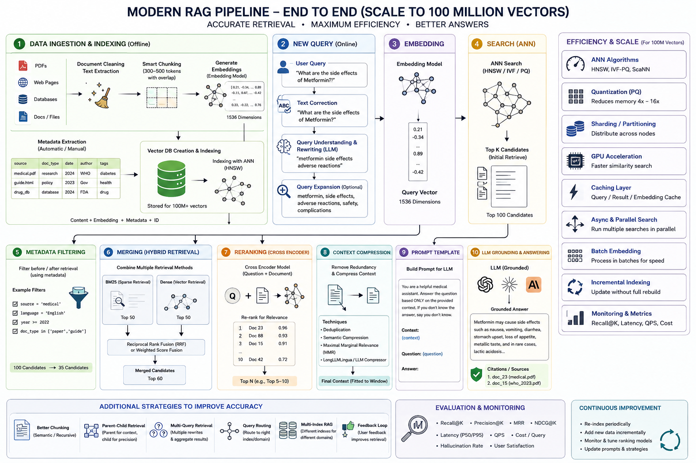

# RAG — Retrieval-Augmented Generation (Grounding an LLM in Your Own Documents)

> **TL;DR.** RAG bolts a **search engine onto an LLM**: instead of answering from frozen parametric memory, the model first **retrieves** relevant chunks from *your* corpus and answers **grounded in that text**. It fixes the four things a bare LLM can't do — knowledge cutoff, private/internal data, hallucination, and context-window limits — *without retraining a single weight*. Two phases: **offline** you chunk → embed → index your documents into a vector DB; **online** you embed the query → ANN-search for candidates → (filter → hybrid-merge → **cross-encoder rerank** → compress) → stuff the top chunks into a **grounded prompt** → generate with citations. The whole game is **retrieval quality**: garbage in, garbage answer.

**Where it fits:** The default production pattern for *knowledge-grounded* LLM apps (Q&A over docs, support bots, search copilots). It's the middle rung of the adaptation ladder from [Prompt Engineering](Prompt%20Engineering.md): **prompt first → RAG for knowledge → fine-tune for behavior**. Builds on [LLM](LLM.md) (hallucination, context window, decoding) and the embeddings/attention machinery in [RNN · LSTM · Transformers](../Machine%20Learning/RNN%20%C2%B7%20LSTM%20%C2%B7%20Transformers.md).
**Prereqs:** [LLM](LLM.md) (why models hallucinate, what a context window is), [Prompt Engineering](Prompt%20Engineering.md) (the grounded/"answer only from context" prompt), and **embeddings + cosine similarity** (vectors as meaning).

> ⚙️ *Format note: this adapts the vault's standard topic skeleton for a **pipeline** — the skeleton's "How It Works" fans out into the two RAG stages (§4 indexing, §5 retrieval+generation), and vector-DB internals get their own home (§6). **Evaluation is deliberately deferred** — the instructor hasn't taught RAG eval yet; a stub pointer sits in §11 → [[RAG Evaluation]]. The faithfulness idea already lives in [Evaluating LLMs](Evaluating%20LLMs.md).*

---

## 🗺️ The whole system on one page



*Keep this open while revising — every numbered block below maps to it. Offline path (block 1): ingest → clean → chunk → embed → index. Online path (blocks 2–10): query → correct/rewrite/expand → embed → ANN search → metadata filter → hybrid merge (RRF) → cross-encoder rerank → context compression → grounded prompt → answer + citations. The right rail is the "scale to 100M vectors" toolbox (§6).*

---

## Table of Contents
1. [Why RAG Exists — The Four LLM Failures](#1-why-rag-exists--the-four-llm-failures)
2. [Intuition / Mental Model](#2-intuition--mental-model)
3. [The Formal Core — Embeddings, Similarity, Encoders](#3-the-formal-core--embeddings-similarity-encoders)
4. [Stage 1 — Indexing the Corpus (Offline)](#4-stage-1--indexing-the-corpus-offline)
5. [Stage 2 — Retrieval & Generation (Online)](#5-stage-2--retrieval--generation-online)
6. [Vector Databases & ANN Indexing (HNSW)](#6-vector-databases--ann-indexing-hnsw)
7. [Worked Example — End-to-End on Three Chunks](#7-worked-example--end-to-end-on-three-chunks)
8. [Code / Implementation](#8-code--implementation)
9. [When It Breaks](#9-when-it-breaks)
10. [Production & MLOps Notes](#10-production--mlops-notes)
11. [Beyond Naive RAG — Where the Field Is Going](#11-beyond-naive-rag--where-the-field-is-going)
12. [Interview Lens](#12-interview-lens)
13. [Alternatives & How to Choose](#13-alternatives--how-to-choose)
- [🧠 Self-Test](#-self-test)

---

## 1. Why RAG Exists — The Four LLM Failures

An LLM is a next-token predictor over **frozen weights** (see [LLM](LLM.md)). That single fact creates four hard limits. RAG is the answer to all four *at once*, and the interviewer wants you to name them cleanly:

```
LLM failure                     RAG's fix
─────────────────────────────   ───────────────────────────────────────
1. Knowledge cutoff             retrieve fresh/latest docs at query time
   (trained up to a date)       → update the index, not the model

2. Private / internal data      point the retriever at YOUR corpus
   (never in pretraining)       (contracts, wikis, tickets) — no training

3. Hallucination                constrain the answer to retrieved text
   (fluent, confident, wrong)   → "answer only from context" + citations

4. Context-window limit         don't paste the 500-page PDF; retrieve
   (can't fit the whole corpus) only the ~5 relevant chunks per query
```

**Why not just fine-tune?** Fine-tuning bakes *behavior/style* into weights; it's a poor way to inject **facts** — it's expensive, forgets, can't cite, and goes stale the moment the data changes. **Why not just paste everything into the prompt?** Cost scales with tokens, latency balloons, you hit the window, and the model gets **lost-in-the-middle** (§9). RAG decouples *knowledge* (an index you can update hourly) from *reasoning* (the frozen model).

🎯 **Kill-shot:** *"RAG separates knowledge from the model — you update an external index instead of retraining, so the LLM answers from fresh, private, citable text instead of stale parametric memory that hallucinates."*

The name unpacks the pipeline: **Retrieval** (Information Retrieval — find relevant docs) **Augmented** (inject them into the prompt) **Generation** (LLM writes the grounded answer).

---

## 2. Intuition / Mental Model

**Open-book exam.** A bare LLM is a student answering from memory — fluent, but bluffs when unsure. RAG hands them the **textbook, opened to the right page**. The model still has to *write* the answer, but now it's copying from evidence, not guessing. Two sub-systems, straight from the HuggingFace "Advanced RAG" mental model:

```
                 ┌───────────────── OFFLINE (pre-production, done once / on update) ─────────────────┐
   documents ──► clean/extract ──► CHUNK ──► embed each chunk ──► store [vector + text + metadata]
   (PDF,web,DB)                    (split)     (embedding model)        in a VECTOR DB (indexed w/ ANN)
                 └───────────────────────────────────────────────────────────────────────────────────┘

                 ┌───────────────── ONLINE (in production, per query) ────────────────────────────────┐
   user query ─► RETRIEVER: embed query ─► ANN search ─► top-k chunks ─► (rerank/filter/compress)
                                                                              │
                 READER: build prompt = [instructions + retrieved context + query] ─► LLM ─► answer+cites
                 └───────────────────────────────────────────────────────────────────────────────────┘
```

- **Retriever** = the search half (embed + ANN + rerank). Cheap, fast, the part that decides whether the answer is even *possible*.
- **Reader** = the generation half (prompt + LLM). It can only be as good as what the retriever handed it.

The single most important intuition: **RAG is a search problem wearing an LLM costume.** Most "the LLM gave a bad answer" bugs are actually *retrieval* bugs — the right chunk was never fetched. `(certain)`

---

## 3. The Formal Core — Embeddings, Similarity, Encoders

**Embedding.** A function `E: text → ℝ^d` mapping text to a dense vector where *semantic closeness = geometric closeness*. Typical `d`: 384 (`all-MiniLM-L6-v2`), 768 (`bge-base`), 1536 (OpenAI `text-embedding-3-small`, the cheatsheet's number). "How do I load a model?" and "loading a pretrained checkpoint" land near each other even with **zero shared words** — that's the point.

**Similarity = cosine.** Rank chunks by closeness to the query vector:
```
cos(q, d) = (q · d) / (‖q‖ ‖d‖)          ∈ [−1, 1], higher = more similar
```
Cosine ignores magnitude (direction = meaning). Many DBs store L2-normalized vectors and use **dot product** (identical ranking to cosine once normalized) or **L2 distance**. 🎯 *Pick the metric your embedding model was trained with — mismatch silently wrecks recall.*

**Sparse vs dense representations** — you need both later (§5 hybrid):
```
Sparse (lexical):  BM25 / TF-IDF — vector over the VOCABULARY, mostly zeros.
                   Matches exact words. Great for codes, IDs, rare terms, names.
Dense (semantic):  embedding — 384–1536 real numbers. Matches MEANING.
                   Great for paraphrase; BLIND to exact tokens it never learned.
```

**Bi-encoder vs cross-encoder** — the retrieval/reranking division of labor (the crux of §5):
```
BI-ENCODER (retrieval):     encode(query) and encode(doc) SEPARATELY → two vectors → cosine.
   • doc vectors PRECOMPUTED at index time → query is one forward pass + fast ANN.
   • scales to millions. Weakness: query & doc never "see" each other → coarse.

CROSS-ENCODER (reranking):  feed [query ⊕ doc] TOGETHER through a transformer → one relevance score.
   • full token-level attention between query and doc → far more accurate.
   • CANNOT precompute (score depends on the pair) → one forward pass PER candidate → slow.
   • so you only run it on the top ~20–100 the bi-encoder already found.
```
🎯 *"Bi-encoder for recall at scale, cross-encoder for precision on the shortlist — that two-stage split is the backbone of every serious retriever."*

---

## 4. Stage 1 — Indexing the Corpus (Offline)

Done once (and incrementally on updates). Five steps: **ingest → clean → chunk → embed → store**. The one with all the leverage is **chunking**.

### 4.1 Ingest & clean
Pull from PDFs, web pages, databases, docs. Extract text, strip boilerplate/nav/HTML, normalize whitespace, keep structure signals (headings, tables) where you can — they feed better chunking.

### 4.2 Chunking — the highest-leverage decision in RAG
You can't embed a 100-page doc as one vector (it'd average away all meaning) and you can't retrieve a whole book to answer one question. **Chunking = splitting a document into retrieval-sized units**, then each chunk becomes one embedding = one row in the DB. It's a *preprocessing* step borrowed from NLP.

The size trade-off is the whole ballgame:
```
chunk TOO LARGE  → blows the context budget, dilutes the relevant sentence
                   in noise, embedding is a mushy average of many topics.
chunk TOO SMALL  → loses context: "it grew 3%" — but WHAT grew, and vs what?
                   the referent lived in a sentence that's now in another chunk.
```
Typical sweet spot: **256–512 tokens with ~10–20% overlap** (tune per corpus). The ladder of strategies, simplest → smartest:

| # | Strategy | How it splits | When to use |
|---|----------|---------------|-------------|
| 1 | **Fixed-size** | every *N* tokens/chars, structure-blind | baseline; fast; splits mid-sentence/mid-fact |
| 2 | **Fixed + overlap** | *N* tokens, repeat last ~32 in the next | cheap fix so a fact split at a boundary survives in *one* chunk |
| 3 | **Semantic** | new chunk when adjacent-sentence embedding similarity **drops** | topic-shifting prose (essays, notes); ~14× slower than recursive |
| 4 | **Recursive / structure-aware** | split on biggest natural boundary first (`\n\n` → `\n` → `.` → space), then pack | **the 2026 default**; respects paragraphs/headings; LangChain `RecursiveCharacterTextSplitter` |
| 5 | **Late chunking** | embed the **whole document first** with a long-context model, *then* pool per-chunk vectors | very long docs/contracts — each chunk's embedding carries **global context**, fixing dangling references |
| 6 | **LLM-based** | an LLM reads the text and picks topic boundaries | highest quality, highest cost/latency; e.g. Chonkie `SlumberChunker` |

**Overlap** (why it matters): with a hard cut, a fact spanning the boundary is *half in chunk A, half in chunk B* and retrievable from neither. Overlap duplicates the seam so the fact lives intact in at least one chunk.

**Contextual Retrieval** (Anthropic, the pragmatic upgrade over "smart" splitters): before embedding, prepend a 1–2 sentence **LLM-generated blurb that situates the chunk in the whole doc** ("This chunk is from the Q3 earnings section discussing Product X…"). Fixes the "it grew 3% — *it* = which product?" failure and reportedly cuts failed retrievals ~35%+. One cached LLM call per chunk, layerable on any splitter. `(likely)`

### 4.3 Embed & attach metadata
Run each chunk through the **embedding model** (same one you'll use for queries — non-negotiable, §9). Store alongside the vector: **content + embedding + metadata (source, doc_type, date, author, tags) + a unique ID**. Metadata is what powers filtering (§5.3) and **citations**.

### 4.4 Store & index
Write to a **vector DB**, which builds an **ANN index** (HNSW, §6) so search is sub-linear. In ChromaDB the unit is a **collection** (≈ a table); you `add(ids, documents, embeddings, metadatas)` and later `query(...)`. Adding new documents later = **incremental indexing**, no full rebuild.

---

## 5. Stage 2 — Retrieval & Generation (Online)

Per query. The naive version is "embed query → top-k → prompt." Everything below is the difference between a demo and a system.

```
query ─► ①correct ─► ②rewrite/expand ─► ③embed ─► ④ANN search ─► ⑤metadata filter
                                                                         │
      ⑥hybrid merge (dense+sparse, RRF) ─► ⑦cross-encoder rerank ─► ⑧compress
                                                                         │
                            ⑨build grounded prompt ─► ⑩LLM ─► answer + citations
```

### 5.1 Query processing — closing the *semantic gap*
The user's query is short, typo-ridden, and phrased *nothing like* the documents. That mismatch — a 5-word question vs verbose formal docs — is the **semantic gap**, and it's the #1 retrieval killer. Fixes:

- **Text correction** — fix typos/spelling before embedding ("metfornin" → "metformin").
- **Query rewriting** — an LLM turns a messy/conversational/follow-up query into a clean **standalone** one (resolves "and its side effects?" using chat history).
- **Query expansion** — an LLM adds synonyms/related terms so short queries match more phrasings: `"metformin side effects" → metformin, side effects, adverse reactions, safety, complications`. 🎯 *When the query is too short to retrieve well, use a second LLM call to expand it, retrieve on the richer query, then pass the retrieved docs + the **original** query to the answering LLM.*
- **HyDE (Hypothetical Document Embeddings)** — the sharper version used in the lab: ask an LLM to *write a fake answer* to the query, then **embed and search with that hypothetical document**. A hypothetical answer looks like a real doc (same style/length/vocabulary), so it lands closer to the true chunks than the bare question does. (It can hallucinate — you're only using it as a *search probe*, never as the answer.)
- **Multi-query** — generate several query variants, retrieve for each, union the results (higher recall).

### 5.2 Embed the query
Same embedding model as indexing → a query vector in the *same space* as the chunks.

### 5.3 ANN search + metadata filtering
Approximate-nearest-neighbor search (§6) returns the top-K candidates (e.g. 100) in ~milliseconds. **Metadata filtering** narrows by structured predicates — `where source = 'medical' AND year >= 2022 AND doc_type IN (...)` — either *pre-filter* (restrict the search space) or *post-filter* (prune results). Turns "100 candidates → 35" and enforces **access control** (only search chunks this user may see).

### 5.4 Hybrid search — dense **+** sparse
Dense retrieval misses **exact tokens** it never learned (error codes, product SKUs, rare names, acronyms); BM25 nails those but misses paraphrase. **Run both and merge.** The standard fusion is **Reciprocal Rank Fusion (RRF)** — rank-based, so it needs no score calibration between the two systems:
```
RRF(d) = Σ_retrievers  1 / (k + rank_r(d))          k ≈ 60
```
A doc ranked high by *either* retriever floats up. (Weighted score fusion is the alternative but needs normalized scores.) 🎯 *"Hybrid search covers the blind spots: dense for meaning, sparse/BM25 for exact terms, fused by rank so you don't have to reconcile their score scales."*

### 5.5 Reranking — the cross-encoder precision pass
The bi-encoder's top-N is high-*recall* but noisy; the truly-best chunk might sit at rank 18. A **cross-encoder** (`cross-encoder/ms-marco-MiniLM-L-6-v2` in the lab) scores each `[query, doc]` pair with full cross-attention and re-sorts, so you feed the LLM the **best 5** not the *first* 5. This is the **two-stage retrieval** pattern: bi-encoder recall over millions → cross-encoder precision over ~20–100.
> ⚠️ The lab's code comments call the reranker "ColBERT" — that's mislabeled. `ms-marco-MiniLM` is a **cross-encoder**; **ColBERT** is a *different* method (multi-vector **late interaction** — a middle ground that precomputes per-token vectors for cheaper-than-cross-encoder scoring). Know the distinction; it's a classic interview trap. `(certain)`

### 5.6 Context compression
Retrieved chunks are redundant and may overflow the window. Trim before prompting: **deduplication**, **MMR** (Maximal Marginal Relevance — pick chunks that are relevant *and* diverse, not five near-copies), semantic compression, and prompt compressors (**LongLLMLingua** / LLMLingua). Goal: maximum signal per token, **fitted to the context window**.

### 5.7 Grounded prompt + generation
Assemble `system instructions + retrieved context + user question`. The instruction is the anti-hallucination contract (straight from the lab):
```
Answer using ONLY the information in the documents below.
If the documents don't contain the answer, say you don't know.
Do NOT use training knowledge. Do NOT invent facts.

DOCUMENTS: {context}
QUESTION:  {question}
```
Generate at **temperature 0** (deterministic, factual) and return **citations** (the source/ID metadata of the chunks used). The out-of-corpus test — ask "what's the weather in San Francisco?" over a docs corpus — should yield *"I don't know,"* not a confident guess. That refusal is the proof grounding works. 🎯 *"The grounding prompt plus temperature-0 plus citations is what converts retrieval into a **faithful**, auditable answer instead of a fluent guess."*

---

## 6. Vector Databases & ANN Indexing (HNSW)

A vector DB does one hard thing fast: **nearest-neighbor search over millions–billions of vectors.** Naive exact search compares the query to *every* vector — `O(N·d)`, hopeless at scale. So we accept **Approximate** Nearest Neighbors (ANN): trade a sliver of recall for orders-of-magnitude speed.

### 6.1 HNSW — the graph the interviewer asks about
**Hierarchical Navigable Small World.** Build a **multi-layer proximity graph**: each vector is a node linked to its near neighbors; upper layers are sparse "express lanes," lower layers dense. Search = **greedy descent**: enter at the top, hop to the neighbor closest to the query, drop a layer, repeat.
```
Layer 2 (sparse):   ●───────────────●            ← long hops: cross the space fast
                     │               │
Layer 1:        ●──●─●────●──────●───●──●
                    │      │          │
Layer 0 (all):  ●●●●●●●●●●●●●●●●●●●●●●●●●●●●●●●    ← dense: refine to the true neighbors
                          ▲ greedy hop toward the query, layer by layer
```
Result: **~logarithmic** search instead of linear. Key knobs: **M** (neighbors per node — bigger = better recall, more memory), **ef_construction** (build-time candidate breadth), **ef_search** (query-time breadth — *the* recall↔latency dial). ChromaDB uses HNSW under the hood. 🎯 *"HNSW turns similarity search into greedy walks over a layered small-world graph — near-logarithmic recall of neighbors without touching most of the vectors."*

**Other families** (name them):
- **IVF** (inverted file) — cluster vectors, at query time probe only the nearest `nprobe` clusters.
- **PQ** (product quantization) — compress each vector into codes → **4–16× less memory**, slight recall loss; often combined as **IVF-PQ**.
- **ScaNN** (Google), **DiskANN** (billion-scale on SSD). HNSW/IVF-PQ/ScaNN is the cheatsheet's shortlist.

### 6.2 Deployment modes (scalability & distribution)
The instructor's three-way split — how the DB *runs* determines how it scales:
```
1. In-memory   — vectors in RAM, single process (FAISS, ephemeral Chroma).
                 fastest; lost on restart; capped by one machine's RAM.
2. Persistent  — memory-mapped / on-disk, survives restart, still single-node.
3. Service/API — networked server or managed cloud (Pinecone, Milvus, Weaviate,
                 Qdrant, pgvector). Multi-client, horizontally scalable, the
                 real production choice.
```
**Scaling to 100M+ vectors** (the cheatsheet's right rail): **sharding/partitioning** across nodes, **replication** for throughput/HA, **quantization (PQ)** to fit memory, **GPU** acceleration, a **caching layer** (query/result/embedding), **async & parallel** search, **batch embedding**, and **incremental indexing** (add without full rebuild). The DB landscape: **FAISS, Chroma, Pinecone, Milvus, Weaviate, Qdrant, pgvector** (and Zilliz, the managed Milvus).

> 📌 **Reality check:** the vector DB is *rarely* the bottleneck in a RAG system. Retrieval quality usually dies at **chunking and query understanding** long before the index does. Tune those first.

---

## 7. Worked Example — End-to-End on Three Chunks

Corpus of 3 chunks (toy 2-D embeddings; real ones are 384–1536-D):
```
c1 "load a pretrained model with from_pretrained"   → [0.9, 0.1]
c2 "fine-tune a transformer on your dataset"         → [0.6, 0.5]
c3 "the weather in Paris is mild in spring"          → [0.1, 0.95]
```
Query **"how do I load a pretrained checkpoint?"** → embed → `q = [0.85, 0.2]` (note: *zero* word overlap with c1's "from_pretrained" — dense embedding still places it near c1).

**Cosine to each** (`q·d / (‖q‖‖d‖)`):
```
cos(q,c1) = (0.85·0.9 + 0.2·0.1)/(0.874·0.906) = 0.785/0.792 ≈ 0.991  ✅ top
cos(q,c2) = (0.85·0.6 + 0.2·0.5)/(0.874·0.781) = 0.610/0.683 ≈ 0.893
cos(q,c3) = (0.85·0.1 + 0.2·0.95)/(0.874·0.955)= 0.275/0.835 ≈ 0.330  ❌ off-topic
```
Bi-encoder ranks **c1 > c2 > c3**. Take top-2 `{c1, c2}` → **cross-encoder** reads `[query, c1]` and `[query, c2]` jointly and confirms c1 ≫ c2 (0.96 vs 0.41). Build the grounded prompt with c1 (+ its citation `doc_1`) → LLM answers *"Use `AutoModel.from_pretrained(...)`…"* citing `doc_1`. Ask about the **weather** and the best cosine is 0.33 (junk) → grounding prompt makes the model say **"I don't know."** That last step is the whole value of RAG.

---

## 8. Code / Implementation

The lab stack: **Chonkie** (chunking) · **sentence-transformers** (embeddings + cross-encoder) · **ChromaDB** (vector store) · **LangChain** (retriever glue) · **Groq/Llama-3.3-70B** (generation).

```python
# ---- STAGE 1: index (offline) ------------------------------------------------
from chonkie import TokenChunker, RecursiveChunker      # + Semantic/Late/SlumberChunker
from sentence_transformers import SentenceTransformer, CrossEncoder
import chromadb

chunker  = TokenChunker.from_recipe(tokenizer="gpt2", chunk_size=256, chunk_overlap=32)
embedder = SentenceTransformer("all-MiniLM-L6-v2")      # 384-dim bi-encoder
chunks   = [c.text for doc in corpus for c in chunker.chunk(doc)]
vecs     = embedder.encode(chunks)                       # precompute doc vectors

db = chromadb.Client().create_collection("docs")         # HNSW index built automatically
db.add(ids=[f"doc_{i}" for i in range(len(chunks))],
       documents=chunks,
       embeddings=vecs.tolist(),
       metadatas=[{"source": "hf_doc", "chunk_index": i} for i in range(len(chunks))])

# ---- STAGE 2: retrieve + generate (online) -----------------------------------
def hyde(query, llm):                                    # query expansion via a fake answer
    return llm.chat(f"Write a short doc-style answer to: {query}")

def rag(query, db, embedder, reranker, llm, k_initial=20, k_final=5):
    probe = hyde(query, llm)                              # HyDE search probe (optional)
    hits  = db.query(query_embeddings=[embedder.encode(probe).tolist()],
                     n_results=k_initial,
                     where={"chunk_index": {"$gte": 0}})  # metadata filter / access control
    cands = hits["documents"][0]

    scores = reranker.predict([[query, d] for d in cands])          # cross-encoder rerank
    top    = [d for d, _ in sorted(zip(cands, scores),
                                   key=lambda x: x[1], reverse=True)[:k_final]]

    context = "\n\n---\n\n".join(top)
    prompt  = (f"Answer using ONLY the documents. If absent, say you don't know.\n"
               f"DOCUMENTS:\n{context}\n\nQUESTION: {query}")
    return llm.chat(prompt, temperature=0.0)              # grounded, deterministic

reranker = CrossEncoder("cross-encoder/ms-marco-MiniLM-L-6-v2")
```

**From-scratch chunkers** (`chunking_lab.py`) — the point is to *see the boundaries move*; each splitter tracks `(text, start, end)` char offsets so you can cite/highlight the source span:
```python
def fixed_size_chunk(text, size=512, overlap=64):        # structure-blind baseline
    step, out = size - overlap, []
    for s in range(0, len(text), step):
        out.append(Chunk(text[s:s+size], s, min(s+size, len(text))))
        if s + size >= len(text): break
    return out

def semantic_chunk(text, embed, threshold=0.5, max_size=512):
    spans = _sentence_spans(text); vecs = embed([s for s,_,_ in spans]); cur=[spans[0]]
    for k in range(1, len(spans)):                       # new chunk when meaning SHIFTS
        if _cosine(vecs[k-1], vecs[k]) < threshold or over(cur, max_size):
            emit(cur); cur = [spans[k]]
        else: cur.append(spans[k])
    # recursive_chunk: split on '\n\n' first, then pack sentences (LangChain-style)
    # contextualize:   prepend an LLM blurb situating each chunk BEFORE embedding
```
Run it and you *watch* fixed-size cut mid-sentence while recursive respects paragraphs — that's the whole chunking lesson made visible.

---

## 9. When It Breaks

**Retrieval failures** (most "LLM" bugs are really these):
- **Embedding-model mismatch** — query and index embedded by *different* models → vectors live in different spaces → garbage neighbors. The #1 silent bug. *Same model, always.* `(certain)`
- **Semantic gap** — short/misworded query vs verbose docs → nothing relevant retrieved. Fix with rewriting/expansion/HyDE/hybrid (§5.1, §5.4).
- **Chunk-boundary splits** — a fact severed across two chunks, retrievable from neither. Fix with overlap / recursive / contextual retrieval.
- **Wrong k** — too small misses the answer; too large floods the prompt with distractors *and* triggers lost-in-the-middle.
- **Lost-in-the-middle** — LLMs attend most to the **start and end** of a long context and skim the middle (Liu et al. 2023). Put the best reranked chunk near the top; keep context tight.
- **Stale index** — corpus changed, index didn't → confidently outdated answers. Needs a re-index trigger (§10).

**Generation failures:**
- **Ignores context** — falls back on parametric memory (contradicts the docs) or **hallucinates despite** good retrieval. Mitigate with the strict grounding prompt, temperature 0, and (deferred) faithfulness eval.
- **Over-refusal** — says "I don't know" though the answer *was* retrieved (prompt too strict / context too noisy).

🎯 **The line that wins it:** *"In RAG, debug retrieval before generation — check whether the right chunk was even fetched; the answer can't beat the context you gave the model."*

---

## 10. Production & MLOps Notes

- **Latency budget.** Query-embed (~ms) + ANN (~ms) + rerank (~10–100 ms, scales with candidate count) + **LLM generation (dominant)**. Rerank fewer, cache aggressively, stream tokens.
- **Caching.** Cache embeddings (per unique text), retrieval results (per query), and even final answers for hot/repeat queries.
- **Incremental indexing.** Add/delete chunks without a full rebuild; keep the index live as the corpus changes.
- **Re-embedding = a migration.** Changing the embedding model means **re-embedding and re-indexing the entire corpus** (old and new vectors are incomparable). Version your index by embedding model; plan the backfill.
- **Embedding/data drift.** Query distribution or corpus vocabulary shifts over time → recall decays; monitor and periodically re-index / re-tune.
- **Freshness.** TTLs and re-index schedules for time-sensitive corpora; a stale index is a correctness bug, not just a perf one.
- **Security — this is where RAG is uniquely exposed:**
  - **Indirect prompt injection.** Retrieved documents are *untrusted input*; a poisoned chunk ("ignore instructions and…") can hijack generation. Sanitize, sandbox tool use, keep the system prompt authoritative.
  - **Access control.** Enforce per-user permissions via **metadata filters** at retrieval time (row-level security) — never retrieve a chunk the user isn't allowed to see. Leaks happen in retrieval, not the model.
  - **PII / compliance** in what you index and log.
- **Cost.** Per query = embedding + (optional HyDE LLM call) + rerank + generation tokens. HyDE and LLM-based chunking add LLM calls — justify them with an eval, not vibes.
- **Monitoring.** Track retrieval hit-rate, "I don't know" rate, latency P50/P95, and cost/query as ops signals. *(Formal retrieval + faithfulness metrics: deferred, §11.)*

---

## 11. Beyond Naive RAG — Where the Field Is Going

Everything so far is "naive/linear" RAG. The frontier makes retrieval **adaptive**:
- **Agentic RAG** — an agent *decides* whether, what, and how many times to retrieve; supports **multi-hop** questions (retrieve → reason → retrieve again).
- **Query routing** — classify the query and send it to the **right index/tool** (docs vs SQL vs web), i.e. **multi-index RAG** across domains.
- **Parent-child / small-to-big** — retrieve a *small* precise chunk for matching, then feed the LLM its *larger parent* for context. (Sentence-window is the same idea.)
- **GraphRAG** (Microsoft) — build a knowledge graph + community summaries over the corpus; strong on *global* "what are the themes?" questions plain RAG can't answer.
- **Corrective / Self-RAG (CRAG)** — the model **grades** retrieved chunks and re-retrieves or web-searches when they're weak; **RAG-Fusion** = multi-query + RRF.
- **Fine-tuned retrievers** — adapt the embedding model to your domain when generic embeddings under-retrieve.
- **RAG vs long-context** — million-token windows don't kill RAG: stuffing everything is expensive, slow, and hits lost-in-the-middle; you *still* need retrieval to choose what's worth putting in the window, plus citations. They're complementary. `(likely)`

**Not covered yet — forward pointers:**
- **[[Embeddings]]** — the embedding-model deep dive (training, contrastive learning, model choice, dimensions) — *next lecture*.
- **[[Multimodal & Tabular RAG]]** — retrieval over images/tables/structured data — *next lecture*.
- **[[RAG Evaluation]]** — retrieval metrics (Recall@k, MRR, NDCG) + **faithfulness/groundedness, context precision/recall (RAGAS)**. Deferred until taught; the faithfulness concept is previewed in [Evaluating LLMs](Evaluating%20LLMs.md).

---

## 12. Interview Lens

The trade-off the question is really testing: **RAG buys you fresh, private, citable, hallucination-resistant knowledge — at the cost of a retrieval pipeline whose quality now gates everything.**

**🎯 Kill-shots**
- *"RAG separates knowledge from the model: update an index, not the weights, so answers are fresh, private, and citable."*
- *"Bi-encoder for recall at scale, cross-encoder for precision on the shortlist — two-stage retrieval is the backbone."*
- *"Most RAG failures are retrieval failures — the answer can't beat the context you fetched."*
- *"HNSW = greedy search over a layered small-world graph → near-logarithmic ANN."*

**Likely follow-ups**
- *"Why not fine-tune instead?"* → facts don't belong in weights: expensive, forgets, can't cite, goes stale; fine-tune for *behavior/style*, RAG for *knowledge*. `(certain)`
- *"Chunk too big vs too small?"* → big = diluted/over-budget; small = lost referents; 256–512 tokens + overlap, recursive by default. `(certain)`
- *"Dense retrieval missed an error code — why?"* → embeddings blur exact tokens; add **BM25 hybrid + RRF**. `(certain)`
- *"Query and index used different embedding models — what happens?"* → different vector spaces → nonsense neighbors; the classic silent bug. `(certain)`
- *"Bi- vs cross-encoder — and is ms-marco-MiniLM ColBERT?"* → no: cross-encoder scores pairs jointly (slow, precise); ColBERT is multi-vector late interaction — a different, middle-ground method. `(certain)`
- *"Model still hallucinated with good context — fix?"* → strict grounding prompt, temperature 0, require citations, and (eval) measure faithfulness. `(likely)`

---

## 13. Alternatives & How to Choose

RAG is one rung on the adaptation ladder — pick the cheapest tool that solves *your* problem:

| Need | Reach for | Why |
|------|-----------|-----|
| Answer from a **fixed, private, changing** knowledge base, with citations | **RAG** | update the index, ground + cite, kill hallucination |
| A durable new **behavior / style / format / domain skill** | **Fine-tuning** | bakes behavior into weights; *not* for facts |
| Knowledge fits in the prompt and rarely changes | **Just stuff the context** | no infra; simplest thing that works |
| **Live actions / real-time** data (search, calc, API) | **Tools / agents (ReAct)** | RAG reads a corpus; tools *do* things — see [Prompt Engineering](Prompt%20Engineering.md) |
| Behavior *and* knowledge | **Fine-tune + RAG** | orthogonal; combine freely |

Decision rule: **prompt → RAG → fine-tune**, escalating only when the cheaper rung fails. Most production "AI apps" are RAG + a good prompt, with tools bolted on for actions.

---

## 🧠 Self-Test

1. Name the four LLM limitations RAG fixes, and the one thing RAG changes that fine-tuning doesn't.
   <details><summary>answer</summary>Knowledge cutoff, private/internal data, hallucination, context-window limit. RAG updates an **external index** (knowledge) instead of the **weights** — fresh, private, citable, no retraining; fine-tuning changes behavior and can't cheaply/faithfully inject changing facts.</details>

2. Why is retrieval a **two-stage** (bi-encoder → cross-encoder) process instead of just using the more accurate model everywhere?
   <details><summary>answer</summary>Cross-encoders score each `[query, doc]` pair jointly → very accurate but *can't precompute* and cost one forward pass **per candidate** → too slow over millions. Bi-encoders precompute doc vectors → fast ANN recall. So bi-encoder shortlists ~20–100, cross-encoder reranks that shortlist for precision.</details>

3. A query about "error code E-4021" returns semantically-related but wrong chunks; the exact code is never retrieved. Diagnose and fix.
   <details><summary>answer</summary>Dense embeddings blur exact/rare tokens. Add **sparse BM25** retrieval and fuse with dense via **Reciprocal Rank Fusion** (hybrid search) so exact-term matches surface. Also check chunking didn't split the code from its context.</details>

4. Explain HNSW in two sentences, and name the knob that trades recall for latency at query time.
   <details><summary>answer</summary>A multi-layer proximity graph where you greedily hop toward the query from a sparse top layer down to the dense bottom layer, giving ~logarithmic ANN. **`ef_search`** widens the query-time candidate list → higher recall, higher latency (`M` and `ef_construction` are build-time).</details>

5. What is HyDE, why does it beat embedding the raw query, and why is it safe that the hypothetical doc may be wrong?
   <details><summary>answer</summary>HyDE has an LLM write a *hypothetical answer document*, then embeds/searches with **that** instead of the short question. A doc-shaped probe sits closer to real chunks than a terse query (closes the semantic gap). It's safe because the hypothetical is only a **search probe** — the final answer is still generated from the *retrieved* chunks, not from it.</details>

6. The model produced a confident answer that contradicts the retrieved documents. Where do you look first, and what three levers reduce it?
   <details><summary>answer</summary>Check retrieval first (was the right chunk even fetched?), then generation. Levers: (1) strict **grounding prompt** ("only from context; else say you don't know"), (2) **temperature 0**, (3) require **citations** — and measure **faithfulness** in eval. Root cause is often the model falling back on parametric memory or lost-in-the-middle.</details>

7. You swap `all-MiniLM-L6-v2` (384-d) for `bge-base` (768-d) to improve quality. What must you do, and what breaks if you don't?
   <details><summary>answer</summary>**Re-embed and re-index the entire corpus** with the new model. Query and stored vectors must come from the *same* model/space; mixing them means cosine compares incomparable vectors → recall collapses. Treat it as a versioned index migration/backfill.</details>
