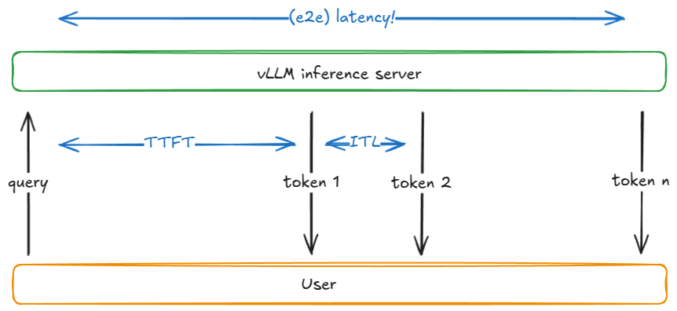
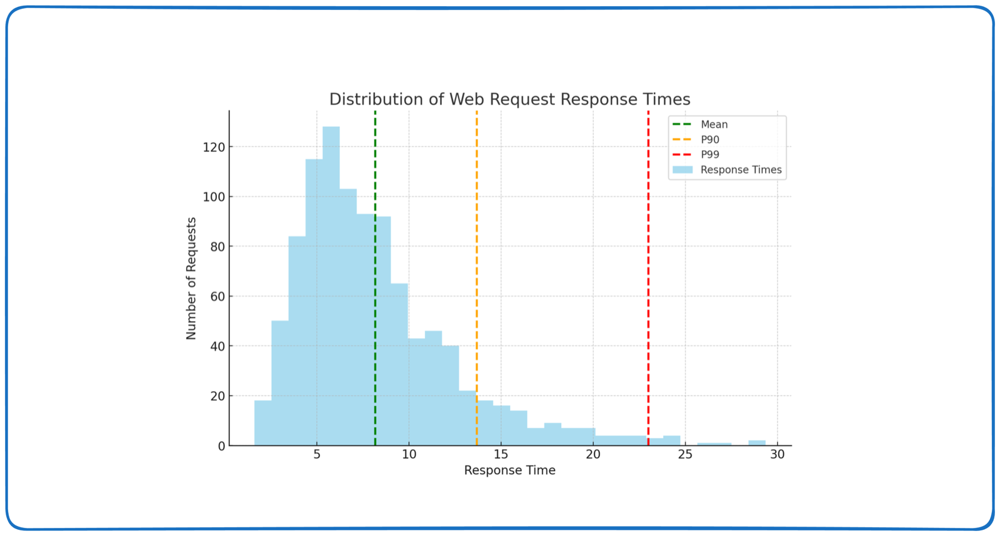
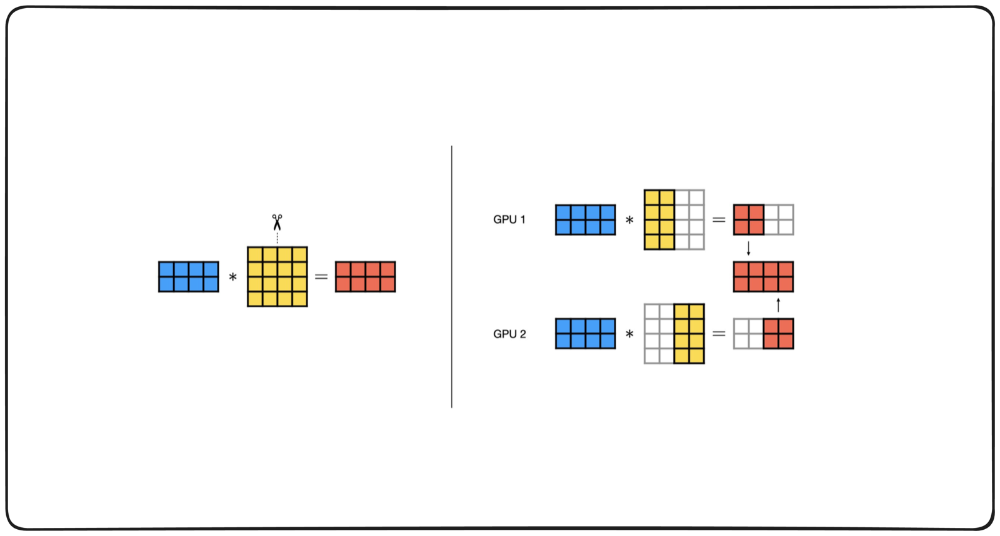
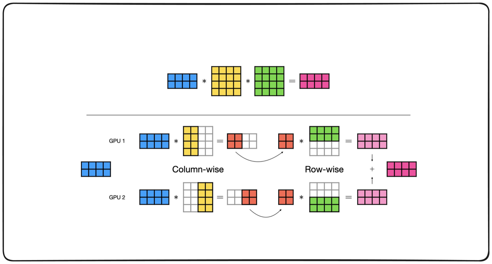

# Serving LLMs at Scale — the two phases, the metrics that price them, and the engine that buys you both

> **TL;DR.** Inference is **two different workloads wearing one API**. **Prefill** runs the whole prompt through the model at once — a big GEMM, **compute-bound**, and it sets **TTFT**. **Decode** produces one token per sequence per step — a skinny GEMV that re-reads *every weight in the model* to emit *one token*, so it is **memory-bandwidth-bound**, and it sets **ITL**. Almost every serving technique you will ever be asked about is a move against one of those two facts: **continuous batching** and **PagedAttention** attack decode's wasted bandwidth by amortising one weight-read across many sequences; **chunked prefill** stops a long prompt from stalling everyone's decode; **quantization** shrinks the bytes that decode must move; **speculative decoding** buys several tokens per weight-read. And you cannot claim any of it without measuring the **tail** — `TTFT`, `ITL`, `TPOT`, `E2E` at **P95/P99**, rolled up into **goodput** (throughput that actually met the SLO). 🎯 The line that wins the question: *"Prefill is compute-bound and decode is memory-bound, so batching is nearly free for decode and nearly useless for prefill — that single asymmetry explains continuous batching, chunked prefill, and why your GPU can be at 100% utilisation and still be wasting 95% of its FLOPs."* `(certain)`

**Where it fits:** The serving half of LLM engineering — the sequel to [Distributed Training for LLMs](Distributed%20Training%20for%20LLMs.md) (which splits GPUs to *fit and train* a model) and to [Model Quantization](Model%20Quantization.md) (which shrinks the bytes). This note asks the question the other two don't: **once the model exists, how do you put it in front of users at a price you can afford?**
**Prereqs:** [LLM](LLM.md) (decoder-only generation, decoding strategies), [RNN · LSTM · Transformers](../Machine%20Learning/NLP/RNN%20%C2%B7%20LSTM%20%C2%B7%20Transformers.md) (attention, the KV cache), [Distributed Training for LLMs](Distributed%20Training%20for%20LLMs.md) (TP / PP / DP and the collectives — this note reuses the mechanisms and only re-derives what changes at inference).

> 🧠 **Start here, not at the top.** Jump straight to the [Self-Test](#-self-test), answer cold, then read **only** the sections you missed — a 5-minute pass instead of 40. *([why](../_STUDY%20LOOP.md))*

---

> ### ⚡ Fast Pass — 5 minutes
> **Model:** One request = **prefill** (whole prompt, one big GEMM, compute-bound, sets TTFT) then **N × decode** (one token each, GEMV, memory-bound, sets ITL). Serving is the art of keeping the decode phase from wasting bandwidth.
> **Core:**
> - `E2E = TTFT + Σ ITL`, `TPOT = (E2E − TTFT) / output_tokens`. **Goodput** = throughput counting only SLO-compliant requests.
> - **Decode ceiling at batch 1** is bandwidth, not FLOPs: `tok/s ≈ HBM_BW / model_bytes`. A 7 B fp16 model on a 2 TB/s GPU ⇒ `2000/14 ≈ 140 tok/s` **no matter how fast the GPU computes**.
> - Batching is free for decode (same weight read, B× the tokens) and useless for prefill (already saturating compute).
> - `KV_bytes = 2 × layers × kv_heads × head_dim × ctx × batch × dtype_bytes` — the thing that actually caps your concurrency.
> - **PagedAttention** = OS paging for the KV cache; waste drops from ~60–80% to <4%. **Continuous batching** = evict a finished sequence and admit a new one at the *next decode step*, not the next batch.
> - `Little's Law: concurrency = throughput × latency` — you can't pick all three.
> **Traps:** ① reporting mean latency instead of P99; ② benchmarking with a fixed batch instead of a Poisson request-rate sweep; ③ leaving prefix caching on and calling the second run a speedup; ④ believing high GPU utilisation means efficiency (decode pegs the SM clock while moving mostly weights); ⑤ quoting model-weight memory and forgetting the KV cache; ⑥ reaching for pipeline parallelism to cut latency (it doesn't).
> 🎯 **Kill-shot:** *"Throughput and latency are traded, not co-optimised — every serving knob picks a point on that curve, and the only honest metric is **goodput**, because a system at 3× throughput and a blown P99 has made itself faster and its users slower."*

---

## Table of Contents
1. [Latency vs Throughput — the axis everything hangs on](#1-latency-vs-throughput--the-axis-everything-hangs-on)
2. [Prefill vs Decode — one API, two workloads](#2-prefill-vs-decode--one-api-two-workloads)
3. [The Metric Vocabulary — TTFT, ITL, TPOT, E2E, goodput](#3-the-metric-vocabulary--ttft-itl-tpot-e2e-goodput)
4. [Percentiles — why the average is a lie](#4-percentiles--why-the-average-is-a-lie)
5. [The KV Cache — the thing that actually caps concurrency](#5-the-kv-cache--the-thing-that-actually-caps-concurrency)
6. [PagedAttention & Continuous Batching — how vLLM buys throughput](#6-pagedattention--continuous-batching--how-vllm-buys-throughput)
7. [Chunked Prefill & the Scheduler — the TTFT/ITL referee](#7-chunked-prefill--the-scheduler--the-ttftitl-referee)
8. [Benchmarking — the sweep that finds your real limit](#8-benchmarking--the-sweep-that-finds-your-real-limit)
9. [Scaling Across GPUs — TP, PP, DP, EP *at inference*](#9-scaling-across-gpus--tp-pp-dp-ep-at-inference)
10. [The Other Throughput Levers](#10-the-other-throughput-levers)
11. [Worked Example — sizing a deployment end to end](#11-worked-example--sizing-a-deployment-end-to-end)
12. [Code / Implementation](#12-code--implementation)
13. [When It Breaks](#13-when-it-breaks)
14. [Production & LLMOps Notes](#14-production--llmops-notes)
15. [Interview Lens](#15-interview-lens)
16. [Alternatives & How to Choose](#16-alternatives--how-to-choose)
17. [Formula Sheet](#17-formula-sheet)
- [🧠 Self-Test](#-self-test)

---

## 1. Latency vs Throughput — the axis everything hangs on

Two numbers, and they are **not** reciprocals.

- **Latency** — wall-clock time for *one* unit of work, request in to response out. Units: seconds.
- **Throughput** — sustained *rate* of completed work. Units: requests/s, or tokens/s across all concurrent users.

A fleet can push 10,000 req/s while every individual user waits four seconds. A single GPU serving one user at a time can answer in 200 ms and do 5 req/s. Neither system is "fast" in the other's sense.

The relationship that ties them is **Little's Law**, and it is the single most useful sentence in capacity planning:

```
concurrency  =  throughput  ×  latency        (N = X · R)
```

You get to pick **two**. Hold latency fixed and throughput only grows by raising concurrency (more requests in flight). Hold concurrency fixed at the hardware's limit and pushing more throughput *must* raise latency. This is why "make it faster" is an under-specified request and why every serving config is a point on a curve, never a win on both axes.

```
                          ▲ throughput
                          │            ┌──── ceiling (hardware / KV-cache bound)
                          │        ┌───┘
                          │     ┌──┘        ← the knee: past here, added load
                          │   ┌─┘             becomes queueing, not work
                          │ ┌─┘
                          └─┴──────────────────────────────► offered load
                                              (and latency ↗ exponentially)
```

**Is training a latency or a throughput problem? What about inference?** `(certain)`
- **Training is pure throughput.** Nobody is waiting on step 4,182. You will happily accept a *slower* step if the run finishes sooner — which is exactly why gradient accumulation and enormous global batches are free wins there. See [Distributed Training for LLMs](Distributed%20Training%20for%20LLMs.md).
- **Inference is both, and which one dominates is a *product* decision.** A chat UI is latency-first (a human is watching tokens appear). A nightly batch-classification job over 40 M documents is throughput-first (nobody is watching). An agent loop is latency-first *and* fans out to many calls, so it suffers tail latency worst of all — see §4.

> 🎯 *"The first question I ask about a serving workload isn't which GPU — it's whether a human is waiting. That decides whether I'm optimising TTFT or tokens-per-dollar, and those two configs are not the same config."*

---

## 2. Prefill vs Decode — one API, two workloads

This section is the load-bearing one. Everything after it is a consequence.

A generation request runs in two phases:

```
  PREFILL                                  DECODE  (× N output tokens)
  ─────────────────────────────────        ──────────────────────────────────
  the whole prompt, all at once            one token per sequence, per step
  [t1 t2 t3 … t512] ──► forward            [t513] ──► forward ──► [t514] ──► …
  matrix × MATRIX   (GEMM)                 matrix × VECTOR   (GEMV)
  writes the KV cache for 512 tokens       appends 1 KV entry per step
  ► COMPUTE-bound                          ► MEMORY-BANDWIDTH-bound
  ► sets TTFT                              ► sets ITL / TPOT
```

### Why decode is memory-bound — the arithmetic that proves it

To emit **one** token, the GPU must read **every weight in the model** out of HBM into the compute units. For a 7 B model in fp16 that is **14 GB of traffic**, and the arithmetic it performs on those bytes is only `2 × P ≈ 14 GFLOP`.

```
arithmetic intensity (batch 1)  =  14e9 FLOP / 14e9 bytes  ≈  2 FLOP/byte
ridge point of an A100-80G      =  312 TFLOP/s ÷ 2 TB/s     ≈ 150 FLOP/byte
```

You are **~75× below the ridge point.** The GPU spends its time waiting on memory; the tensor cores are idle in all but name. So the ceiling is bandwidth, not FLOPs:

```
decode tok/s (batch 1)  ≈  HBM_bandwidth / model_bytes  =  2000 GB/s / 14 GB  ≈  140 tok/s
```

**And that number does not move if you buy a GPU with twice the FLOPs.** It moves if you buy more bandwidth — or if you make the model smaller ([quantization](Model%20Quantization.md): 4-bit 7 B is ~3.5 GB ⇒ ~570 tok/s ceiling) — or if you **make that one weight-read serve many sequences at once**.

That last option is batching, and it is why it is the highest-leverage move in serving:

| batch | weight bytes read per step | tokens produced per step | bytes per token |
|---|---|---|---|
| 1 | 14 GB | 1 | 14 GB |
| 16 | 14 GB | 16 | 0.9 GB |
| 64 | 14 GB | 64 | 0.22 GB |

Same read, 64× the output. Decode batching is **nearly free throughput** until you either hit the ridge point or run out of KV cache. `(certain)`


### Why prefill is compute-bound

Prefill pushes `L` prompt tokens through in one shot: `2 × P × L` FLOPs against the *same* one-time `2P` bytes of weight traffic. At `L = 1000` on a 7 B model that's **14 TFLOP** — arithmetic intensity in the thousands, comfortably past the ridge. The GPU is genuinely busy.

Two consequences an interviewer will probe: `(certain)`
1. **Batching does almost nothing for prefill.** It's already compute-saturated; two prompts just take twice as long. (Contrast with decode, where batching is the whole game.)
2. **Prefill and decode fight each other.** A single 8k-token prompt arriving mid-stream is a large GEMM that occupies the GPU for tens of milliseconds — during which every already-streaming user's ITL stalls. That is the origin of the tail-latency problem in §4 and the reason **chunked prefill** exists (§7).

> 🎯 **The sentence that reframes the whole topic:** *"Prefill is compute-bound and decode is memory-bound. So they want opposite things from the scheduler, and every serving feature — continuous batching, chunked prefill, disaggregated prefill/decode — is a different treaty between them."*

> **Also worth knowing:** because decode is bandwidth-bound, **quantization speeds up decode and can *slow down* prefill** (dequantisation overhead on a phase that wasn't waiting on memory anyway). That's not a contradiction of the [Model Quantization](Model%20Quantization.md) note — it's the same fact viewed from the serving side. `(certain)`

---

## 3. The Metric Vocabulary — TTFT, ITL, TPOT, E2E, goodput

Get these exactly right; interviewers use them as a shibboleth.

| Metric | Definition | Set by | Typical SLO |
|---|---|---|---|
| **TTFT** — Time to First Token | request submitted → first output token received | **prefill** + queue wait | P95 < 200–500 ms (chat) |
| **ITL** — Inter-Token Latency | gap between consecutive output tokens `i−1 → i` | **one decode step** | P99 < 50 ms (smooth streaming) |
| **TPOT** — Time Per Output Token | mean ITL across the request | decode throughput | < 30–50 ms |
| **E2E latency** | submit → last token | `TTFT + Σ ITL` | P99 < 2–5 s |
| **Throughput** | output tok/s, total tok/s, or req/s | the whole system | as high as SLOs allow |
| **Goodput** | throughput counting **only** requests that met the SLO | scheduling + capacity | the number that matters |

```
E2E   = TTFT + Σ ITLᵢ
TPOT  = (E2E − TTFT) / output_tokens        ≈ mean(ITL)
```


*Source: Scaling AI Applications lecture notebook (Scaler).*

**Two traps.** `(certain)`
- **TPOT ≠ ITL.** TPOT is the *average*; ITL is the *distribution*. A stream with TPOT = 30 ms and P99 ITL = 400 ms looks fine on the mean and visibly stutters in the UI. Report both.
- **When you stream, you measure chunks, not tokens.** An SSE chunk may carry more than one token, so "chunk gaps" slightly overstate ITL and `count_tokens(text)` is an approximation of the true output length. Fine for comparisons, wrong for billing. (The measurement harness in §12 makes exactly this compromise — knowingly.)

**Goodput is the metric that keeps you honest.** Define it explicitly, e.g. *"requests with TTFT < 300 ms **and** P99 ITL < 50 ms"*, and count only those. A config that lifts raw throughput 40% while pushing a third of requests past the SLO has **lowered** goodput. Raw tokens/s is a vendor benchmark; goodput is a product metric.

---

## 4. Percentiles — why the average is a lie

Averages hide the users who are actually suffering.

- **P50 (median)** — the typical experience.
- **P90 / P95** — 1 in 10 / 1 in 20 users is slower than this.
- **P99** — 1 in 100. On a service doing 10 M requests/day that's **100,000 bad experiences daily**.


*Source: Scaling AI Applications lecture notebook (Scaler).*

### Why LLM serving is unusually tail-prone `(certain)`

1. **Prompt lengths vary wildly.** One 32k-token prefill is a GEMM that can hog the GPU for hundreds of milliseconds and stall every co-resident decode — classic **head-of-line blocking**.
2. **Output lengths vary wildly.** A batch mate generating 2,000 tokens holds a KV slot for the whole time.
3. **KV-cache pressure is dynamic.** As sequences lengthen, memory fills; when it's exhausted the scheduler **preempts** a request (recompute or swap), and that request's latency doubles.
4. **Prefill/decode contention** — §2. A burst of arrivals inflates ITL for everyone already streaming.

### Tail amplification — the reason agents feel slow

If a user-facing action fans out to `k` backend LLM calls and each independently has a 1% chance of being slow:

```
P(user sees no slow call)  =  0.99ᵏ
k = 5  → 95%      k = 10 → 90%      k = 50 → 61%
```

At `k = 10`, **10% of user actions hit a P99 path** — the service's P99 became the user's P90. This is why multi-step [agentic workflows](Agentic%20Workflows.md) and multi-query [RAG](RAG.md) pipelines feel far slower than the per-call numbers suggest, and why *their* SLO must be set on the tail, not the mean.

> **Rule of thumb:** if `P99 > 3–5 × P50`, you have a tail problem worth an investigation, not a bigger GPU. Look at scheduling policy, chunked prefill, and whether a handful of long-context requests are eating the GPU. `(likely — a heuristic, not a law)`

---

## 5. The KV Cache — the thing that actually caps concurrency

Attention caches every token's `K` and `V` so the next step doesn't recompute the prefix — turning generation from `O(n²)` to `O(n)` compute. *(Derived from the causal mask, with the measured memory growth, in [LLM Inference Optimization](LLM%20Inference%20Optimization.md#4-the-kv-cache--derived-not-memorised).)* The bill arrives as memory:

```
KV_bytes = 2 × layers × kv_heads × head_dim × ctx_len × batch × bytes_per_elem
           ↑
           K and V
```

**Llama-3-70B, fp16 KV, 32k context, one request:**
`2 × 80 × 8 × 128 × 32768 × 1 × 2 ≈ 10.7 GB` — **per request.**

That single number reorganises your intuition. On an 80 GB GPU with 4-bit weights (~35 GB), you have ~40 GB of KV room ⇒ **about 4 concurrent 32k-context requests.** The weights were never the binding constraint; the cache was.

```
      GPU memory budget
      ┌───────────────────────────────────────────────────────────┐
      │ model weights │ activations + │        KV CACHE           │
      │   (static)    │   workspace   │  (grows with batch × ctx) │
      └───────────────────────────────────────────────────────────┘
                                       └──── this is your max concurrency ────┘
```

**Levers, in order of leverage** `(certain)`:
1. **GQA / MQA** — architectural. Llama-3-70B has 64 query heads but only **8 KV heads**; that's an 8× cut in cache size, already baked into the checkpoint. (DeepSeek's **MLA** compresses further via a latent projection.) Nothing to configure — but know *why* your cache is smaller than a naive `num_heads` calculation suggests, because interviewers ask.
2. **Shorter `max_model_len`** — the cheapest real win. Serving 8k when your users send 2k prompts wastes nothing at runtime under PagedAttention, but it does cap the worst case you must plan for.
3. **KV quantization to fp8/int8** — halves the cache. Go to int4 KV only with long-context evals; the cache is more sensitive than the weights and the failure mode is a *late-in-the-output* quality cliff. See [Model Quantization](Model%20Quantization.md).
4. **Tensor parallelism** — shards KV heads across GPUs, so TP=4 gives each GPU a quarter of the cache (§9).

---

## 6. PagedAttention & Continuous Batching — how vLLM buys throughput

vLLM's two ideas, and they solve two different kinds of waste.

### PagedAttention — memory waste

The naive implementation reserves a **contiguous slab** per request sized for `max_model_len`, because the cache must grow and you can't know how long the output will be. A request that generates 200 tokens against a 4096-token reservation wastes 95% of its slab. Measured waste in pre-vLLM systems: **60–80% of the KV region.** `(certain — the vLLM/PagedAttention paper, Kwon et al., SOSP 2023)`

PagedAttention borrows **OS virtual-memory paging**: the cache lives in fixed-size **blocks** (e.g. 16 tokens each), a per-request **block table** maps logical positions → physical blocks, and blocks are allocated on demand and need not be contiguous. Internal waste falls to **under 4%** (bounded by the last partly-filled block), and the memory you get back becomes **more concurrent requests**, which is what actually buys throughput.


The paging indirection also unlocks **sharing**, which the naive layout cannot express at all:
- **Prefix caching** — two requests with the same system prompt point their block tables at the *same physical blocks*. The shared prefill is computed once. For a RAG or agent app with a 2,000-token system prompt, this is often the single biggest TTFT win available. (`--enable-prefix-caching`; on by default in vLLM's V1 engine.)
- **Copy-on-write for parallel sampling / beam search** — `n=4` samples share the prompt's blocks and only fork a block when they diverge.

### Continuous batching — time waste

**Static batching** freezes a batch until its slowest member finishes. Every sequence that finished early keeps burning a GPU slot on padding, and newly arrived requests wait at the batch boundary even though slots are idle. With output lengths varying 10×, that is most of your GPU.

**Continuous (in-flight) batching** works at **decode-step granularity**: after every step the scheduler evicts finished sequences and admits waiting ones. There is no batch boundary.


Together these two ideas are the bulk of vLLM's reported **2–4× throughput over the previous generation of servers at the same latency** `(certain — the same paper; treat the exact multiple as workload-dependent)`. Note the shape of the win: neither idea makes a single token faster. **They make more sequences fit and keep the GPU from idling** — throughput, not latency.

> 🎯 *"PagedAttention doesn't speed up attention. It removes the memory fragmentation that was capping batch size — and since decode throughput scales with batch size, recovering the memory is what recovers the throughput."*

---

## 7. Chunked Prefill & the Scheduler — the TTFT/ITL referee

Once prefill and decode share a GPU, someone has to arbitrate. That's the scheduler, and its policy is where your TTFT/ITL trade-off actually lives.

**The problem.** A prefill of 8,000 tokens is one enormous forward pass. Run it as a unit and every streaming user's next token waits for it — a single ITL spike of tens to hundreds of milliseconds, straight into your P99.

**Chunked prefill.** Split the prefill into pieces sized by a **token budget** (`--max-num-batched-tokens`) and co-schedule each piece with the decode work in the same step. The long prompt now arrives as several small compute bursts instead of one wall.

```
  without chunked prefill
  step: [D D D D] [------- PREFILL 8192 -------] [D D D D]
                   ▲ every decoding user stalls here

  with chunked prefill (budget 2048)
  step: [D D D D + P₁] [D D D D + P₂] [D D D D + P₃] [D D D D + P₄]
         ▲ ITL stays smooth; that request's TTFT is slightly later
```

**The trade is explicit:** smoother ITL and better P99, paid for with marginally higher TTFT for the chunked request — and better GPU utilisation overall, because a decode-only step (memory-bound, tensor cores idle) now carries compute-bound prefill work alongside it. That "free ride" is the underrated half of the feature.

In vLLM's **V1 engine, chunked prefill is on by default** wherever possible, with a default token budget of ~8192 for online serving; the scheduler batches pending **decodes first**, then fills the remaining budget with prefill, chunking a prompt that doesn't fit. `(likely — defaults move between releases; check `vllm serve --help` for your version)`

**Tuning it, in one line each:**
- **Latency-first (chat):** *lower* `--max-num-batched-tokens` → finer chunks → smoother ITL, slightly worse TTFT and throughput.
- **Throughput-first (batch jobs):** *raise* it → bigger, more efficient GEMMs.

**Preemption — the other scheduler behaviour to know.** When the KV cache fills, vLLM evicts a running request rather than OOM-ing: **recompute** (drop its blocks, redo the prefill later — the default, cheap in memory) or **swap** (move blocks to CPU RAM and back). Either way that request's latency roughly doubles. Seeing preemption warnings in the log is the signal that you are over-subscribed — lower concurrency, shorten `max_model_len`, or add a replica. `(certain)`

---

## 8. Benchmarking — the sweep that finds your real limit

A single number from a single config tells you nothing. The measurement that matters is a **sweep of offered load** with **Poisson arrivals**, because that's what production looks like.

vLLM ships three modes, and they answer three different questions:

| Command | Question it answers | Arrival pattern |
|---|---|---|
| `vllm bench latency` | best-case per-step latency, controlled conditions | fixed batch, no queueing |
| `vllm bench throughput` | peak **offline** throughput | all prompts submitted at once |
| `vllm bench serve` | what production will feel like | **Poisson at `--request-rate`** |

Only the third is a real benchmark. Sweep `--request-rate` from 1 → 2 → 4 → … → 32+ and plot throughput and P50/P99 together. You are looking for the **knee**: the point where added load stops producing completed work and starts producing queue.


**Operate below the knee.** Above it, throughput is flat, queueing latency is unbounded, and goodput collapses while your throughput dashboard still looks green — which is exactly how a service dies with healthy-looking metrics.

**Benchmark hygiene — the five ways people fool themselves** `(certain)`:
1. **Cold start contamination.** Download the weights first (`hf download …`) and run warmup iterations. Model load, CUDA graph capture, and torch.compile all land in your first numbers otherwise.
2. **Prefix caching.** A repeated prompt set is served from cache on run 2 and looks 10× faster. Either disable it for the measurement or randomise prompts — and if your *production* traffic really does share prefixes, measure with caching on and say so.
3. **Fixed-length synthetic prompts.** `--input-len 128 --output-len 128` measures a workload nobody has. Real traffic has a long-tailed length distribution, which is where the tail latency comes from; benchmark on a sample of your real logs (`--dataset-name`) before you trust a config.
4. **Comparing across dtypes/quantisation without matching quality.** A faster config that's worse is not a faster config. Pair every throughput claim with an eval — see [Evaluating LLMs](Evaluating%20LLMs.md).
5. **Reporting the mean.** See §4.

---

## 9. Scaling Across GPUs — TP, PP, DP, EP *at inference*

The mechanisms are the same as in [Distributed Training for LLMs](Distributed%20Training%20for%20LLMs.md) — read that note for how the collectives work and why the bubble formula is `(G−1)/(M+G−1)`. What follows is **only what changes when you're serving instead of training**, which is more than people expect.

**The structural difference:** at inference there are **no gradients, no optimizer states, and no backward pass.** The `16 bytes/param` model-state arithmetic collapses to `2 bytes/param` (or 0.5 at 4-bit). ZeRO/FSDP — the dominant *training* answer — is **irrelevant here**; there is nothing to shard but weights and cache. Offering ZeRO as the answer to "how would you serve a 175 B model?" is a tell.

### Tensor Parallelism — the inference default

Split each weight matrix across GPUs: **column-parallel** for the first MLP layer (each GPU owns a slice of the output; results are gathered), **row-parallel** for the second (each GPU computes a partial sum; an all-reduce combines them). Pairing them this way means the whole two-layer MLP costs **one** communication, not two.


*Source: Scaling AI Applications lecture notebook (Scaler).*


*Source: Scaling AI Applications lecture notebook (Scaler).*

**What's different at inference:** in training, TP is a *capacity* lever you accept a latency cost for. **At inference TP is a latency lever** — each GPU reads only `1/TP` of the weights, and since decode is bandwidth-bound (§2), per-token latency drops close to linearly with TP degree until the all-reduces dominate. It also shards the **KV heads**, which buys concurrency. `(certain)`

**The constraints:**
- **`tensor_parallel_size` must divide `num_kv_heads`.** A GQA model with 8 KV heads cannot cleanly do TP=16 — the engine must replicate KV heads, wasting cache. Check the config before you pick the degree.
- **Never span a node.** TP does an all-reduce **per block, per step, on the critical path**, with nothing to hide it behind. Over NVLink that's fine; over Ethernet it's catastrophic.
- Practical degrees are **2, 4, 8**.

### Pipeline Parallelism — capacity across nodes, not speed

Layers are split into stages across GPUs, with cheap point-to-point sends between them. That tolerance for slow interconnect is why **PP goes across nodes while TP stays inside one**.

**What's different at inference:** PP does **not** reduce per-token latency — a token still traverses all stages, now with hops added. Under continuous batching the pipeline stays reasonably full (there's always a stream of requests), so the training-style bubble is less punishing, but PP remains a **fit-the-model** tool, not a go-faster tool. Use it when the model doesn't fit in one node, or when GPUs lack NVLink (PP's point-to-point traffic survives a slow link where TP's collectives don't), or when the layer count doesn't divide evenly — PP tolerates uneven splits, TP doesn't.

### Data Parallelism — replicas

At inference, DP is just **N independent replicas behind a load balancer**. No gradient all-reduce, no synchronisation, nothing to tune — it's the boring, correct way to add throughput once one replica is at its knee. (For MoE models vLLM's `--data-parallel-size` is *not* just replication: it data-parallelises attention while the experts are expert-parallel.)

### Expert Parallelism — for MoE

MoE layers have many experts, of which each token activates a few. **EP** places different experts on different GPUs and routes tokens to them (an all-to-all), typically combined with DP over the attention layers. The serving pain is **load imbalance** — a hot expert becomes the straggler for the whole step. See `[[Mixture of Experts]]`.

### The decision guide

| Situation | Strategy | Flags |
|---|---|---|
| Model fits on 1 GPU | none | *(default)* |
| Model fits on 1 node, 4 GPUs | **TP = 4** | `--tensor-parallel-size 4` |
| Fits on 1 GPU, need more throughput | **DP** (replicas) | run N servers behind a LB |
| Needs 2 nodes × 8 GPUs | **TP = 8 within, PP = 2 across** | `--tensor-parallel-size 8 --pipeline-parallel-size 2` |
| 8 GPUs, throughput-bound, model fits in 4 | **TP = 4, DP = 2** | `--tensor-parallel-size 4 --data-parallel-size 2` |
| No NVLink between GPUs (e.g. L40S) | **prefer PP over TP** | `--pipeline-parallel-size N --tensor-parallel-size 1` |
| GPU count doesn't divide the layers/heads evenly | **PP** (tolerates uneven splits) | `--pipeline-parallel-size N` |
| MoE model | **EP for experts + DP for attention** | `--enable-expert-parallel --data-parallel-size N` |

**Rule of thumb:** `tensor_parallel_size` = GPUs per node; `pipeline_parallel_size` = number of nodes. Then *measure* — TP=8 is not always better than TP=4 with two replicas, because the eighth GPU's share of the all-reduce can cost more than it saves.

> 🎯 *"At training, tensor parallelism is how you make a model fit and you pay latency for it. At inference it's the reverse — it's how you make decode faster, because decode is bandwidth-bound and TP cuts each GPU's weight-read by the TP degree."*

---

## 10. The Other Throughput Levers

Batching and paging are the foundation. These are what you reach for next, roughly in order of leverage per unit of effort.

**Prefix caching** (§6) — the largest win for any app with a fixed system prompt, few-shot block, or shared RAG context. It converts repeated prefill into a block-table lookup. Pair it with **prefix-aware routing** at the load balancer (hash on the prompt prefix so the same conversation lands on the same replica) or you'll cache-miss your own cache across replicas.

**Quantization** — fewer bytes per weight is directly fewer bytes decode must move, so it is a *decode-latency* lever as much as a memory lever. AWQ/GPTQ 4-bit for memory-constrained serving, FP8 on Hopper+ for throughput. Full treatment in [Model Quantization](Model%20Quantization.md).

**Speculative decoding** — a cheap **draft** proposes `k` tokens; the target model **verifies all `k` in a single forward pass** and keeps the longest correct prefix. It works precisely *because* decode is memory-bound: verifying 5 tokens costs one weight-read, not five. Expected speedup rises with the **acceptance rate** `α`; a bad draft model is worse than none (you pay draft cost and reject). Flavours: separate small draft model, **n-gram / prompt lookup** (free, great when the output quotes the input — summarisation, code edit, RAG), **EAGLE / Medusa** (extra heads on the target model). Note it **cannot** help a compute-bound prefill, and gives up its advantage at large batch sizes, where you're already off the memory-bound floor. `(certain)` *(Full treatment — the exactness guarantee, the `a + 1` law, and the time-vs-compute ledger — in [LLM Inference Optimization](LLM%20Inference%20Optimization.md#6-speculative-decoding--two-dead-ends-then-the-idea).)*

**Disaggregated prefill/decode** — run prefill on one pool of GPUs and decode on another, streaming the KV cache between them (over RDMA, via NVIDIA's **NIXL** transfer library in current vLLM / Dynamo builds). Because the two phases stop competing, you can tune TTFT and ITL **independently** and give each phase its own parallelism degree. This is the frontier answer to §2's contention problem; it's operationally heavy (two clusters, a KV transport, a scheduler on top) and pays off at large scale. `(likely — moving fast; verify against current vLLM docs before quoting flags)`

**CUDA graphs & FlashAttention** — kernel-launch overhead is significant when each decode step is only a few milliseconds; capturing the step as a CUDA graph removes it. FlashAttention makes attention IO-aware (tiling in SRAM instead of materialising the `n×n` matrix). Both are on by default in vLLM; you don't configure them, you just need to be able to say why they matter.

**Multi-LoRA** — one base model in VRAM, many adapters batched across concurrent requests, instead of one full checkpoint per fine-tuned variant. Break-even is around 3+ variants. See [Fine-Tuning LLMs](Fine-Tuning%20LLMs.md).

**Cap the output.** The most overlooked lever: `max_tokens` is a **latency** parameter. Decode dominates E2E for anything but huge prompts, and an unbounded `max_tokens` is an unbounded latency SLO and an unbounded KV slot.

---

## 11. Worked Example — sizing a deployment end to end

*Serve Qwen2.5-14B-Instruct to a chat product. Target: P95 TTFT < 400 ms, P99 ITL < 50 ms, 8k context. Hardware available: a node of 4 × A100-40G (NVLink).*

**1. Will it fit?** fp16 weights: `2 × 14e9 = 28 GB`. One 40 GB card leaves ~12 GB for KV + workspace — technically possible, but thin. **TP=4** gives 7 GB of weights per GPU and, more importantly, shards the KV cache.

**2. KV budget.** Qwen2.5-14B: 48 layers, 8 KV heads (GQA), head_dim 128. Per token, fp16:
```
2 × 48 × 8 × 128 × 2 bytes  =  196,608 B  ≈  0.2 MB/token
```
At 8k context: `0.2 MB × 8192 ≈ 1.6 GB per request` (across the TP group; ~0.4 GB per GPU).

**3. Concurrency.** With TP=4, per GPU: 7 GB weights + ~4 GB workspace/activations out of 40 ⇒ ~29 GB usable for KV × 4 GPUs = **~116 GB of cache** ⇒ `116 / 1.6 ≈ 70` concurrent requests **at full 8k context**. Real chat sessions average far shorter, and PagedAttention only allocates what's used, so effective concurrency is several hundred. Set `--gpu-memory-utilization 0.90` and let the engine report the actual number of KV blocks at startup — that log line is your ground truth, not this arithmetic.

**4. TTFT check.** A 1,000-token prompt on a 14 B model: `2 × 14e9 × 1000 = 28 TFLOP`. Across 4 A100s at ~120 TFLOP/s effective each ⇒ ~58 ms of compute, plus queue wait. Comfortably inside 400 ms — **as long as the queue stays short**, which is what the request-rate sweep in §8 is for.

**5. ITL check.** Per decode step, per GPU: 7 GB of weights at ~1.5 TB/s ⇒ **~5 ms**, plus TP all-reduce overhead. Well inside the 50 ms budget, with room to batch heavily.

**6. Config.**
```bash
vllm serve Qwen/Qwen2.5-14B-Instruct \
  --tensor-parallel-size 4 \
  --max-model-len 8192 \
  --gpu-memory-utilization 0.90 \
  --enable-prefix-caching \
  --max-num-batched-tokens 4096 \      # chunked-prefill budget; lower = smoother ITL
  --host 0.0.0.0 --port 8000
```

**7. Then sweep** `vllm bench serve --request-rate {1,2,4,8,16,32}` on a sample of real prompts, find the knee, and set the autoscaler to add a replica at **70% of the knee** — not at 90% GPU utilisation, which as §14 explains is not a load signal at all.

---

## 12. Code / Implementation

*Ran on vLLM 0.24.0, Qwen2.5-0.5B-Instruct, single T4 (Colab) — the lecture's setup. `dtype=half` because a T4 has no bf16.*

### Offline inference — the `LLM` engine

```python
from vllm import LLM, SamplingParams

llm = LLM(
    model="Qwen/Qwen2.5-0.5B-Instruct",
    dtype="half",                    # T4 is fp16-only; use "bfloat16" on Ampere+
    max_model_len=2048,              # caps the KV cache you must plan for
    gpu_memory_utilization=0.82,     # fraction of VRAM the engine may claim;
)                                    #   the rest is left for the process + fragmentation

params = SamplingParams(temperature=0.2, top_p=0.95, max_tokens=64)
outputs = llm.generate(["Explain latency vs throughput in LLM serving."], params)
print(outputs[0].outputs[0].text)
```

> ⚠️ **`top_p=0.95` does not mean "the top 5% of tokens."** It means the smallest set of tokens whose *cumulative probability* reaches 0.95 — which may be 2 tokens on a confident step and 200 on an uncertain one. (The lecture notebook's inline comment gets this wrong and then corrects itself; the correction is the right one.) See [LLM §5](LLM.md#5-choosing-the-next-token--decoding-algorithms).

This is **offline**, synchronous, one process. It's the right tool for a batch job over a fixed dataset and the wrong tool for serving users.

### The throughput-vs-batch-size experiment

The single most instructive thing in the lecture notebook — it makes §2's table real:

```python
import time, pandas as pd

def run_offline_batch(num_requests: int, max_tokens: int = 64):
    prompts = [make_prompt(i) for i in range(num_requests)]
    params  = SamplingParams(temperature=0.0, max_tokens=max_tokens)  # greedy: no sampling noise

    t0 = time.perf_counter()
    outputs = llm.generate(prompts, params)
    wall = time.perf_counter() - t0

    out_tokens = sum(len(o.outputs[0].token_ids) for o in outputs)
    return {
        "batch": num_requests,
        "wall_s": wall,
        "output_tok_per_s": out_tokens / wall,          # ← throughput: rises steeply with batch
        "avg_e2e_per_request_s": wall / num_requests,   # ← per-request latency: barely moves
    }

df = pd.DataFrame([run_offline_batch(b) for b in [1, 2, 4, 8, 16, 32]])
```

On the T4 run, output throughput went **~165 → ~2,150 tok/s from batch 1 to 16** — a ~13× gain for 16× the work, while per-request latency stayed roughly flat. That is §2's "same weight read, B× the tokens" measured on real hardware, and it is the entire economic case for continuous batching.

### Online serving — the OpenAI-compatible server

```bash
vllm serve Qwen/Qwen2.5-0.5B-Instruct \
  --dtype half --max-model-len 2048 --gpu-memory-utilization 0.82 \
  --host 0.0.0.0 --port 8000
```

```python
from openai import OpenAI
client = OpenAI(base_url="http://127.0.0.1:8000/v1", api_key="EMPTY")  # local server ignores the key

resp = client.chat.completions.create(
    model="Qwen/Qwen2.5-0.5B-Instruct",
    messages=[{"role": "user", "content": "Explain TTFT and ITL."}],
    max_tokens=80, temperature=0.2,
)
```

> **A worthwhile aside from the lecture — and a hallucination, not a definition.** Asked to explain TTFT, the served 0.5 B model answered, fluently and with total confidence: *"TTFT stands for 'Time to First Test,' which is a method used in software testing to identify and fix bugs as soon as they are discovered."* **Every word of that is invented.** TTFT is **Time To First Token** (§3). The model wasn't hedging or confused-sounding — it was hallucinating in the register of an expert, which is exactly what makes small models dangerous as an answer source.
>
> The lesson: a 0.5 B model on a free T4 is a **latency fixture, not a quality fixture**. It exists in this notebook to emit tokens quickly so you can time them. **Never let a serving benchmark double as a quality check** — measuring TTFT and measuring whether the answer is true are different experiments, and the second one is [Evaluating LLMs](Evaluating%20LLMs.md).

### Measuring TTFT and ITL yourself

The instrument you should be able to write from memory in an interview — stream the response and timestamp every chunk:

```python
import time, statistics

def stream_once(prompt: str, max_tokens: int = 96):
    t_start = time.perf_counter()
    chunk_times, parts = [], []

    stream = client.chat.completions.create(
        model=MODEL, messages=[{"role": "user", "content": prompt}],
        max_tokens=max_tokens, temperature=0.0, stream=True,
    )
    for chunk in stream:
        delta = chunk.choices[0].delta.content or ""   # metadata-only chunks carry no text
        if delta:
            chunk_times.append(time.perf_counter())
            parts.append(delta)

    e2e  = time.perf_counter() - t_start
    text = "".join(parts)
    ttft = chunk_times[0] - t_start if chunk_times else None   # first *content* chunk, not first byte
    gaps = [b - a for a, b in zip(chunk_times[:-1], chunk_times[1:])]   # the ITL distribution

    n_out = count_tokens(text)
    return {
        "ttft_s":   ttft,
        "mean_itl": statistics.mean(gaps) if gaps else None,
        "p95_itl":  percentile(gaps, 95) if gaps else None,   # the number that matters
        "tpot_s":   e2e / max(n_out, 1),
        "e2e_s":    e2e,
    }
```

Measured on the T4: `ttft ≈ 86 ms`, `mean ITL ≈ 6.8 ms`, `p95 ITL ≈ 9.4 ms`, `e2e ≈ 0.72 s` for 96 tokens. Note `p95_itl ≈ 1.4 × mean` on an **idle** server — that ratio is what blows out under load, and watching it is how you detect contention before users complain.

Two honest caveats, both worth saying out loud: **chunks ≠ tokens** (a chunk may carry several), and `count_tokens(text)` re-tokenises the output rather than counting generated ids, so `tpot` here is an estimate. For exact numbers, take them from the server's `/metrics` endpoint.

### The benchmark CLI

```bash
# best-case per-step latency — fixed batch, no queueing
vllm bench latency  --model $MODEL --input-len 128 --output-len 64 \
                    --batch-size 1 --num-iters-warmup 2 --num-iters 5 \
                    --output-json latency_bench.json

# peak offline throughput — every prompt submitted at once
vllm bench throughput --model $MODEL --num-prompts 500 --input-len 128 --output-len 128

# the real one: Poisson arrivals against a running server
vllm bench serve --model $MODEL --host localhost --port 8000 \
                 --num-prompts 200 --request-rate 4 --input-len 128 --output-len 128
```

Sweep `--request-rate` across `1 2 4 8 16 32` and plot it. One rate is a data point; the sweep is the benchmark.

### Multi-GPU

```bash
# single node, 4 GPUs
vllm serve Qwen/Qwen2.5-14B-Instruct --tensor-parallel-size 4

# two nodes × 8 GPUs
vllm serve Qwen/Qwen2.5-72B-Instruct \
  --tensor-parallel-size 8 --pipeline-parallel-size 2 \
  --nnodes 2 --node-rank 0 --master-addr <HEAD_IP>          # worker adds --node-rank 1 --headless

# two replicas of a TP=4 model on 8 GPUs — throughput, not capacity
vllm serve Qwen/Qwen2.5-7B-Instruct \
  --tensor-parallel-size 4 --data-parallel-size 2 --data-parallel-size-local 2
```

> **Colab gotcha from the lecture:** the offline `LLM` object holds the GPU. Before starting a server in the same runtime you must `del llm; gc.collect(); torch.cuda.empty_cache()` — and verify with `nvidia-smi`, because vLLM's worker processes can outlive the Python object. Otherwise the server dies at startup on an OOM that reads like a config error. `(certain)`

---

## 13. When It Breaks

| Symptom | Real cause | Fix |
|---|---|---|
| **Server OOMs at startup** | `gpu_memory_utilization` too high, or a leftover process holding VRAM | lower to 0.85–0.90; `nvidia-smi` and kill stragglers; lower `--max-model-len` |
| **`ValueError: max_model_len > KV cache capacity`** | can't fit even one sequence at that context | lower `--max-model-len`, quantize the KV cache, or add TP |
| **P99 ITL spikes, P50 fine** | long-prefill head-of-line blocking | enable/tighten chunked prefill (lower `--max-num-batched-tokens`) |
| **Preemption warnings in the log** | KV cache exhausted; requests being recomputed | reduce concurrency, shorten context, add a replica |
| **Throughput flat, latency climbing** | past the knee — you're measuring queue, not compute | scale out; the GPU is not the fix |
| **TTFT fine, E2E terrible** | decode-bound with long outputs | cap `max_tokens`; batch harder; speculative decoding |
| **2nd benchmark run 10× faster** | prefix caching served the same prompts | randomise prompts or disable caching for the measurement |
| **TP=8 slower than TP=4** | all-reduce overhead exceeds the per-GPU savings; or TP crossed a node boundary | drop the degree; keep TP inside a node; try TP=4 × DP=2 |
| **Garbage output after a TP change** | `tensor_parallel_size` doesn't divide `num_kv_heads`/hidden size cleanly | pick a degree that divides the config |
| **Model far dumber than expected** | serving a base checkpoint, or the wrong chat template | use the `-Instruct` checkpoint; let the server apply the template (`/v1/chat/completions`, not `/v1/completions`) |
| **Great throughput, users complain** | you optimised throughput, not **goodput** | re-measure at P99 against the SLO |
| **First request of the day is slow** | cold start: weights load, CUDA graph capture, compile | keep a warm pool; pre-download weights; never scale to zero on a latency-SLO service |

---

## 14. Production & LLMOps Notes

**Autoscale on the right signal.** GPU utilisation is **not a load metric for LLM serving** — decode pegs the SMs while mostly waiting on memory, so a bandwidth-bound server can read 100% utilisation at 10% of its useful capacity. Scale on **queue depth / number of waiting requests**, **KV-cache utilisation**, or **P95 TTFT** against the SLO. vLLM exposes all of these on `/metrics` in Prometheus format (`vllm:num_requests_waiting`, `vllm:gpu_cache_usage_perc`, `vllm:time_to_first_token_seconds`), and `num_requests_waiting` is the closest thing to a correct autoscaling signal. `(certain)`

**Load-balance on prefix, not round-robin.** Round-robin destroys prefix-cache hit rates by scattering a conversation across replicas. Hash on the system prompt or conversation id so repeated prefixes land on the same replica. This is often a larger TTFT win than anything you do inside the engine.

**Admission control beats degradation.** Past the knee, accepting more work makes *everyone* slower. A bounded queue with fast rejection (429 + Retry-After) protects the users already in flight — a graceful "try again" is a better product than universal timeout. Cap `max_tokens` and prompt length at the gateway.

**Cost is a token-arithmetic problem.** `$/1M tokens = GPU_$/hr ÷ (tokens/s × 3600) × 1e6`. An A100 at $2/hr sustaining 2,000 output tok/s ⇒ `2 / (2000 × 3600) × 1e6 ≈ $0.28 per 1M output tokens`. Every throughput lever in §10 is a division on that denominator — and this is the calculation that decides self-hosting vs an API, not a feature checklist.

**Version everything that changes output.** Model checkpoint, quantisation method, engine version, sampling params, *and* the chat template. An engine upgrade can change tokenisation or default sampling and silently move your eval scores. Pin them, and re-run the eval set on every bump.

**Observability: trace per request, not per service.** You want `queue_wait`, `prefill_time`, `decode_time`, `output_tokens`, `preempted?` on every request — otherwise a P99 investigation has nowhere to start. Log the token counts too; they're your cost ledger.

**Deployment shape.** One model per pod, GPU-pinned, readiness gated on `/health` (not process start — the engine takes tens of seconds to load). Rolling updates need double capacity for the overlap window, so plan the node pool for `N+1` replicas. Canary a new checkpoint on a traffic slice with the eval suite running against it. The container/orchestration layer is its own topic — `[[Containers, Kubernetes & the Pipeline Engine]]`.

**Structured output and guardrails are latency too.** Constrained decoding (JSON schema, grammars) adds per-step masking cost, and a guardrail model in the path adds a whole second inference. Budget them into the SLO rather than discovering them in the P99. See [Prompt Security](Prompt%20Security.md).

---

## 15. Interview Lens

The question behind most serving questions is: **do you know that throughput and latency are traded, and can you name the specific mechanism that moves each one?**

| Question | What wins it |
|---|---|
| *"Why is LLM inference slow?"* | Don't say "the model is big." Say: **decode is memory-bandwidth-bound** — one token requires reading every weight, so the ceiling is `HBM_BW / model_bytes` (~140 tok/s for a 7 B fp16 model on a 2 TB/s GPU) regardless of FLOPs. Then name the three fixes: batch it, shrink it, or get more tokens per read (speculative decoding). |
| *"Why does batching help so much?"* | Because the weight-read is amortised: batch 64 reads the same 14 GB and emits 64 tokens. It barely helps **prefill**, which is already compute-bound. |
| *"What does PagedAttention actually do?"* | It does **not** speed up attention. It removes KV fragmentation (60–80% waste → <4%) so more sequences fit; batch size rises; throughput follows. Plus it enables prefix sharing and copy-on-write. |
| *"How do you size a deployment?"* | Weights, **then the KV cache** — `2 × layers × kv_heads × head_dim × ctx × batch × bytes`. Then a request-rate sweep to find the knee, and set capacity at ~70% of it. |
| *"Average latency is 50 ms — is that good?"* | 🎯 *"I don't know yet — show me P99 and the SLO. If P99 is 3–5× P50 there's a tail problem, and if this request fans out to 10 backend calls, my P99 is the user's P90."* |
| *"TTFT is fine but the stream stutters."* | ITL spikes from long-prefill head-of-line blocking. Enable/tighten **chunked prefill**. Then check for preemption in the logs. |
| *"You have 8 GPUs and a 7 B model. Config?"* | Not "TP=8." The model fits on one GPU, so **TP=1 × DP=8**, or TP=2 × DP=4 if you're latency-sensitive. Then measure. TP=8 on a 7 B model spends most of its time in all-reduce. |
| *"Would you use ZeRO to serve a 175 B model?"* | No — there are **no optimizer states at inference**. TP within the node, PP across nodes, plus quantization. ZeRO is a training answer. |
| *"How do you know your optimisation worked?"* | Goodput at the SLO, on a **replayed sample of production traffic**, with prefix caching in whichever state matches production — plus a quality eval, because a faster config that's dumber isn't faster. |
| *"GPU utilisation is 100%. Are we at capacity?"* | No. Decode pegs utilisation while bandwidth-bound. Look at `num_requests_waiting` and KV-cache usage instead. |

**Confidence flags:** the roofline reasoning, KV formula, and batching arithmetic are `(certain)`. Specific vLLM flags and defaults are `(likely)` — they move between releases; say *"as of the version I ran"* rather than asserting a default.

---

## 16. Alternatives & How to Choose

| Option | Pick it when | Watch out for |
|---|---|---|
| **vLLM** | the default for self-hosted GPU serving — best breadth of models/quantisation, OpenAI-compatible, PagedAttention + continuous batching | defaults shift between releases; pin the version |
| **SGLang** | heavy prefix sharing — agents, multi-turn, structured output (RadixAttention is a prefix *tree*, not just a cache); fast structured decoding | smaller ecosystem than vLLM |
| **TensorRT-LLM** | last 10–20% of performance on NVIDIA hardware, fixed model set, big fleet | per-model engine build, painful iteration, NVIDIA-only |
| **Hugging Face TGI** | already deep in the HF stack, Inference Endpoints | vLLM has generally overtaken it on throughput |
| **llama.cpp / Ollama / LM Studio** | laptops, CPUs, Apple Silicon, single-user local dev; GGUF | not a multi-tenant server; throughput is not the goal |
| **NVIDIA Dynamo** | multi-node orchestration with **disaggregated prefill/decode** and KV-aware routing at fleet scale | operational complexity; overkill below a large deployment |
| **Managed APIs** (Anthropic, OpenAI, Bedrock, Vertex, Together, Fireworks) | you don't have a reason to self-host | per-token cost, data residency, rate limits, model deprecation |

**The honest decision rule:** self-host when you have **sustained** load (a GPU idle 90% of the day is a terrible deal against per-token pricing), a model you can't get from an API (your own fine-tune), or a hard data-residency requirement. Otherwise an API is cheaper *and* faster to ship. The break-even is a utilisation calculation — run the `$/1M tokens` arithmetic from §14 against your actual duty cycle before arguing about engines.

**And the one-line default:** **vLLM, TP = GPUs-per-node, prefix caching on, chunked prefill on, AWQ 4-bit (or FP8 on Hopper+), autoscaled on queue depth** — then sweep the request rate and tune from the measurement, not from this table.

---

## 17. Formula Sheet

```
Little's Law           concurrency  =  throughput × latency
E2E latency            E2E   = TTFT + Σ ITLᵢ
TPOT                   TPOT  = (E2E − TTFT) / output_tokens
Decode ceiling (b=1)   tok/s ≈ HBM_bandwidth / model_bytes
Arithmetic intensity   AI    = FLOPs / bytes_moved       (decode ≈ 2, prefill ≈ 10³)
Roofline ridge point   ridge = peak_FLOP/s ÷ HBM_BW       (A100 ≈ 150 FLOP/byte)
Prefill FLOPs          ≈ 2 × params × prompt_tokens
Decode FLOPs / token   ≈ 2 × params
KV cache bytes         2 × layers × kv_heads × head_dim × ctx × batch × dtype_bytes
Weights bytes          (bits / 8) × params
Tail amplification     P(no slow call) = (1 − p99_rate)^k     for k fan-out calls
Cost                   $/1M tok = GPU_$/hr ÷ (tok/s × 3600) × 1e6
Pipeline bubble        (G − 1) / (M + G − 1)        [see Distributed Training]
```

---

## 🧠 Self-Test

1. **Why is decode memory-bandwidth-bound while prefill is compute-bound — and what is the numerical consequence for a 7 B fp16 model on a 2 TB/s GPU?**
   <details><summary>answer</summary>Decode produces <b>one</b> token per sequence per step: it reads <b>every weight</b> (14 GB for 7 B in fp16) to do only <code>2 × P ≈ 14 GFLOP</code> of arithmetic — an arithmetic intensity of ~2 FLOP/byte against an A100 ridge point of ~150, so it's ~75× below the roof and the GPU waits on memory. Ceiling: <code>2000 GB/s ÷ 14 GB ≈ 140 tok/s</code> at batch 1, <b>independent of the GPU's FLOP rating</b>. Prefill pushes all L prompt tokens through at once — <code>2 × P × L</code> FLOPs against the same one-time weight read — so intensity is in the thousands and it's genuinely compute-bound. 🎯 <i>This asymmetry is why batching is nearly free for decode and nearly useless for prefill.</i></details>

2. **A colleague says "PagedAttention makes attention faster." Correct them.**
   <details><summary>answer</summary>It doesn't touch the speed of the attention kernel. It changes how the <b>KV cache is allocated</b>: instead of one contiguous slab per request sized for <code>max_model_len</code> (60–80% of which is reserved and never used), the cache lives in fixed-size blocks with a per-request logical→physical block table. Internal waste drops to <4%. The recovered memory holds <b>more concurrent sequences</b>, and since decode throughput scales with batch size, that's where the 2–4× throughput comes from. The indirection also enables <b>prefix sharing</b> (two requests point at the same physical blocks) and copy-on-write for parallel sampling — neither is expressible in the contiguous layout.</details>

3. **Write the KV-cache formula and use it to explain why a 70 B model on an 80 GB GPU serves so few long-context users.**
   <details><summary>answer</summary><code>KV_bytes = 2 × layers × kv_heads × head_dim × ctx × batch × dtype_bytes</code> (the 2 is K and V). Llama-3-70B at 32k context in fp16: <code>2 × 80 × 8 × 128 × 32768 × 2 ≈ 10.7 GB <b>per request</b></code>. With 4-bit weights at ~35 GB, only ~40 GB is left for cache ⇒ roughly <b>4</b> concurrent full-context requests. The weights were never the binding constraint. Levers in order: GQA/MQA (already in the checkpoint — 8 KV heads not 64), shorter <code>max_model_len</code>, fp8/int8 KV quantization, and tensor parallelism (which shards KV heads).</details>

4. **Your P50 latency is 400 ms and P99 is 4 s. What do you investigate, and why does it matter more if this endpoint sits inside an agent loop?**
   <details><summary>answer</summary>P99/P50 = 10× — well past the 3–5× heuristic, so it's a scheduling/contention problem, not a "buy a bigger GPU" problem. Check, in order: (a) long-prefill <b>head-of-line blocking</b> → enable/tighten chunked prefill; (b) <b>preemption</b> warnings in the log → KV cache exhausted, reduce concurrency or add a replica; (c) whether you're past the <b>knee</b> of the request-rate curve, in which case you're measuring queue. It matters more in an agent loop because of <b>tail amplification</b>: with k fan-out calls, <code>P(no slow call) = 0.99ᵏ</code> — at k=10, 10% of user actions hit a P99 path, so the service's P99 becomes the user's P90.</details>

5. **You have 8 GPUs in one node and a 7 B model. What parallelism config, and what would make you wrong?**
   <details><summary>answer</summary>Not TP=8. The model fits comfortably on one GPU, so the throughput answer is <b>TP=1 × DP=8</b> — eight independent replicas behind a load balancer, zero communication. If latency (ITL) is the binding SLO, <b>TP=2 × DP=4</b> halves each GPU's weight-read and so roughly halves decode latency, at the cost of an all-reduce per block. What would make me wrong: a very long context (KV cache, not weights, is the constraint — TP shards the cache, so a higher TP degree buys concurrency), or a latency SLO tight enough to justify TP=4. Either way: <b>measure with a request-rate sweep</b>. High TP on a small model spends its time in all-reduce.</details>

6. **Define goodput, and give a config change that raises throughput while lowering goodput.**
   <details><summary>answer</summary>Goodput is throughput counting <b>only requests that met the SLO</b> (e.g. TTFT < 300 ms and P99 ITL < 50 ms). Example: raise <code>--max-num-batched-tokens</code> and admit far more concurrent requests. Bigger, more efficient GEMMs ⇒ total tokens/s goes up. But queue wait and prefill chunk size both grow, so TTFT and ITL blow past the SLO for a large slice of requests — those tokens no longer count. Raw throughput up, goodput down, users worse off. 🎯 <i>Raw tokens/s is a vendor benchmark; goodput is a product metric.</i></details>

7. **Why does chunked prefill improve P99 ITL, and what does it cost?**
   <details><summary>answer</summary>An 8k-token prefill run as a single forward pass occupies the GPU for tens to hundreds of ms, during which every already-streaming user's next token stalls — a head-of-line ITL spike straight into P99. Chunked prefill splits it into pieces sized by <code>--max-num-batched-tokens</code> and co-schedules each with the pending decodes, so the wall becomes several small bursts. Cost: slightly <b>later TTFT</b> for the chunked request. Bonus: a decode-only step is memory-bound with idle tensor cores, so riding compute-bound prefill work alongside it <b>improves utilisation</b>. In vLLM's V1 engine it's on by default; lower the budget for latency, raise it for throughput.</details>

8. **Why does speculative decoding work at all, and when does it stop helping?**
   <details><summary>answer</summary>Because decode is <b>memory-bound</b>: a forward pass costs one full weight-read regardless of how many token positions you evaluate. So a cheap draft proposes k tokens and the target model <b>verifies all k in a single pass</b>, keeping the longest correct prefix — several tokens for the price of one weight-read. It stops helping when (a) the acceptance rate α is low (a bad draft model costs you the draft compute and gets rejected), (b) you're doing <b>prefill</b>, which is already compute-bound, or (c) the batch is already large — batching has walked you up the roofline, so there's no spare bandwidth headroom to trade.</details>

9. **You run `vllm bench serve` twice and the second run is 10× faster. What happened, and how do you benchmark honestly?**
   <details><summary>answer</summary><b>Prefix caching</b> served the second run's identical prompts out of the KV block pool, skipping prefill entirely (and the first run also carried cold-start cost: weight load, CUDA-graph capture, compile). Honest benchmarking: pre-download weights, run warmup iterations, randomise or replay <b>real</b> prompts rather than a repeated synthetic set, and set prefix caching to whatever production actually does — then say which. Also: sweep <code>--request-rate</code> with Poisson arrivals rather than reporting one number, use a realistic long-tailed length distribution, and report P95/P99 alongside the mean.</details>

10. **Your dashboard shows 100% GPU utilisation. Are you at capacity? What should you autoscale on instead?**
    <details><summary>answer</summary>No. GPU "utilisation" measures whether kernels are resident, not whether the GPU is doing useful arithmetic — and decode keeps kernels resident while stalled on HBM, so a bandwidth-bound server reads 100% at a fraction of its useful capacity. Autoscale on <b>queue depth</b> (<code>vllm:num_requests_waiting</code>), <b>KV-cache utilisation</b> (<code>vllm:gpu_cache_usage_perc</code>), or <b>P95 TTFT against the SLO</b> — all exposed on <code>/metrics</code>. Set the trigger at ~70% of the measured knee, not at 90% of anything, and don't scale to zero on a latency-SLO service (cold start is tens of seconds).</details>

---

*Covers: latency vs throughput & Little's Law · prefill vs decode and the roofline · TTFT/ITL/TPOT/E2E/goodput · percentiles, tail amplification & SLOs · KV cache sizing, GQA/MQA/MLA · PagedAttention, prefix caching, copy-on-write · continuous batching · chunked prefill, scheduling & preemption · benchmarking methodology and the request-rate sweep · TP/PP/DP/EP at inference · speculative decoding, disaggregated prefill/decode, CUDA graphs, multi-LoRA · deployment sizing, autoscaling signals, prefix-aware routing, cost arithmetic · engine selection.*
