# Speech & Audio for AI Engineers — from air pressure to a talking agent

> **TL;DR.** A speech model never "hears" anything. It eats a **tensor**, and almost every audio bug in production is a bug in *how that tensor was made* — wrong sample rate, wrong shape, wrong number range. The pipeline is short and fixed: **microphone → array of numbers → log-mel spectrogram → Transformer → text** (ASR), and the same road in reverse for **TTS**. You need only three numbers to describe any audio (`sample rate`, `bit depth`, `channels`), one idea to understand spectrograms (*any sound is a sum of simple tones*), and one discipline to stay out of trouble (*resample to the model's rate and pass that same rate everywhere*). 🎯 The line that wins the question: *"Sample rate is not metadata — it is the meaning of the array. Hand a 16 kHz model 24 kHz audio and it does not error; it silently misreads every frequency in the clip and hands you a confident, wrong transcript."* `(certain)`

**Where it fits:** The **audio modality** of AI engineering — the sibling of [Video for AI Engineers](Video%20for%20AI%20Engineers.md) and the input half of every voice product (phone bots, meeting assistants, voice agents). Downstream of it sits everything you already know: the transcript goes into an [LLM](LLM.md), gets [embedded](Embeddings.md), gets [retrieved](RAG.md).
**Prereqs:** [LLM](LLM.md) (autoregressive decoding, token prefixes), [RNN · LSTM · Transformers](../Machine%20Learning/NLP/RNN%20%C2%B7%20LSTM%20%C2%B7%20Transformers.md) (encoder–decoder, cross-attention). **No signal-processing background assumed** — §2–§5 build it from zero, and you will not see a single Fourier-transform derivation.

> 🧠 **Start here, not at the top.** Jump straight to the [Self-Test](#-self-test), answer cold, then read **only** the sections you missed — a 5-minute pass instead of 40. *([why](../_STUDY%20LOOP.md))*

---

> ### ⚡ Fast Pass — 5 minutes
> **Model:** Sound is air pressure wobbling. Digitising it = **measuring that pressure N times a second**. The result is a 1-D array of floats. Everything else is bookkeeping on that array.
> **Core:**
> - **Sample rate** `sr` = measurements per second. 8k phone · **16k speech AI** · 24k TTS · 44.1/48k music.
> - **Nyquist:** a rate `sr` can only represent frequencies up to **`sr/2`**. Above that, a tone *folds down* into a false low tone — **aliasing**.
> - **Bit depth** = how precisely each measurement is stored. **~6 dB of dynamic range per bit.** Models want `float32` in `[-1, 1]`; files ship `int16`.
> - **Any sound = a sum of sine waves.** The **FFT** reads that recipe off a messy wave. A **spectrogram** is the FFT recomputed for each short slice of time.
> - Whisper's input is a **log-mel spectrogram**, shape `(80, ~100 × seconds)` — 25 ms window, 10 ms hop, 80 mel bands, 0–8 kHz.
> - **WER = (S + I + D) / N_ref**, reported **after** normalisation. Insertions count, so WER can exceed 100%.
> **Traps:** ① sample-rate mismatch — the #1 audio bug, and it never raises an exception; ② Whisper hallucinating *"Thank you."* / *"Thanks for watching!"* on silence — fix with **VAD before ASR**, not a bigger model; ③ `wav[::2]` instead of a real resampler (skips the anti-alias filter → metallic aliasing); ④ feeding 24 kHz TTS output straight into a 16 kHz ASR; ⑤ reporting raw WER and blaming the model for your punctuation; ⑥ hard-cutting long audio at 30 s and slicing words in half.
> 🎯 **Kill-shot:** *"Every audio failure I have debugged was a tensor-construction bug, not a model bug — the model was fine, it was just handed the wrong number of samples per second, the wrong channel count, or the wrong value range, and none of those three raise an error."*

---

## Table of Contents
1. [Intuition — a model never hears sound, it eats a tensor](#1-intuition--a-model-never-hears-sound-it-eats-a-tensor)
2. [The Two Axes — sample rate (time) and bit depth (amplitude)](#2-the-two-axes--sample-rate-time-and-bit-depth-amplitude)
3. [A Sound Is a Sum of Frequencies — and the FFT reads the recipe](#3-a-sound-is-a-sum-of-frequencies--and-the-fft-reads-the-recipe)
4. [Speech Specifically — pitch, formants, voiced vs unvoiced](#4-speech-specifically--pitch-formants-voiced-vs-unvoiced)
5. [What the Model Actually Sees — the log-mel spectrogram](#5-what-the-model-actually-sees--the-log-mel-spectrogram)
6. [Worked Example — one 5.86 s clip, end to end, in numbers](#6-worked-example--one-586-s-clip-end-to-end-in-numbers)
7. [Loading Audio Without Shooting Yourself in the Foot](#7-loading-audio-without-shooting-yourself-in-the-foot)
8. [ASR — Whisper, its knobs, and its two failure modes](#8-asr--whisper-its-knobs-and-its-two-failure-modes)
9. [VAD — find the speech before you transcribe it](#9-vad--find-the-speech-before-you-transcribe-it)
10. [Evaluating ASR — WER, and why you report the normalised one](#10-evaluating-asr--wer-and-why-you-report-the-normalised-one)
11. [Long Audio — chunking with stride, and timestamps](#11-long-audio--chunking-with-stride-and-timestamps)
12. [TTS — the other direction](#12-tts--the-other-direction)
13. [The Voice-Agent Loop — latency, barge-in, cascade vs audio-native](#13-the-voice-agent-loop--latency-barge-in-cascade-vs-audio-native)
14. [Code / Implementation](#14-code--implementation)
15. [When It Breaks](#15-when-it-breaks)
16. [Production & LLMOps Notes](#16-production--llmops-notes)
17. [Interview Lens](#17-interview-lens)
18. [Alternatives & How to Choose](#18-alternatives--how-to-choose)
- [🧠 Self-Test](#-self-test)

---

## 1. Intuition — a model never hears sound, it eats a tensor

Sound is **air pressure wobbling over time**. A speaker cone pushes air; the air pushes your eardrum; you hear something. That is the entire physical story, and you need nothing more from it.

To put that on a computer you **measure the pressure many times per second** and write each measurement down. That's it. The result is a 1-D array of floats — a list of numbers, nothing more exotic.

```
 air pressure over time          measured 16,000×/second
        ~~~~~~~                  ┌──────────────────────────────┐
      ~~       ~~      ──────►   │ 0.02  -0.11  0.30  0.28 ...  │  ← this is "audio"
    ~~           ~~              └──────────────────────────────┘
                                   shape (93680,)  float32  in [-1, 1]
```

Everything to the left of the model in the diagram below exists only to turn that 1-D pressure signal into a compact tensor. **Your whole job as an engineer is getting that conversion right.**

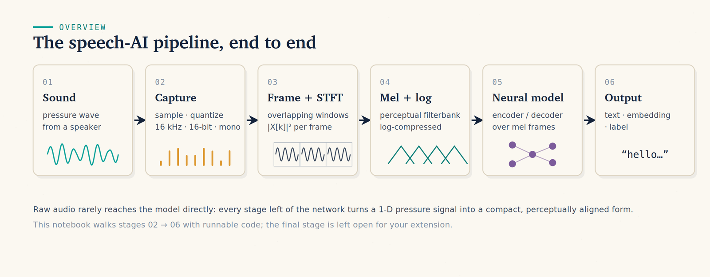

> 🎯 **The one sentence that organises this whole note:** *a model never "hears" sound — it consumes a tensor, and almost every audio bug in production is a bug in how that tensor was made.*

---

## 2. The Two Axes — sample rate (time) and bit depth (amplitude)

Only two knobs decide what your array of numbers *means*. Get both right and nothing downstream can surprise you.

| Knob | Which axis it controls | Typical values | Who gets burned |
|---|---|---|---|
| **Sample rate** (`sr`, Hz) | **time** — how *often* you measured | 8k phone · **16k speech AI** · 24k TTS · 44.1k/48k music | **everyone — the #1 footgun** |
| **Bit depth / dtype** | **amplitude** — how *precisely* each sample is stored | `float32` in `[-1, 1]` (models) · `int16` (files) | loaders, normalisation |

### 2.1 Sample rate — and why you cannot go as low as you like

A **frequency** is just *how fast something wobbles*, measured in **hertz (Hz)** = cycles per second. A 2 Hz wave completes two full up-and-down cycles in one second:

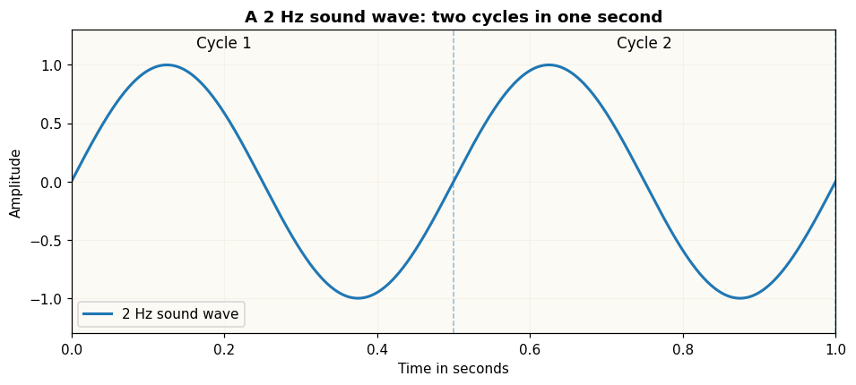

Two different numbers are in play and people mix them up constantly:

```
sound frequency  = how fast the SOUND itself vibrates       (a property of the sound)
sampling rate    = how fast the MICROPHONE measures it      (a choice you make)
```

Now the one rule that governs all of it:

> **You need at least two samples per cycle of the highest frequency you want to keep.** So a sample rate `sr` can faithfully represent frequencies only up to **`sr / 2`** — the **Nyquist limit**.

`16 kHz speech → max 8 kHz` · `44.1 kHz music → max 22.05 kHz` · `8 kHz phone line → max 4 kHz`.

Sample a tone **above** Nyquist and the measurements you get *also fit a slower wave*. The fast tone is mistaken for a slow one — a false low tone that was never played. That is **aliasing**:

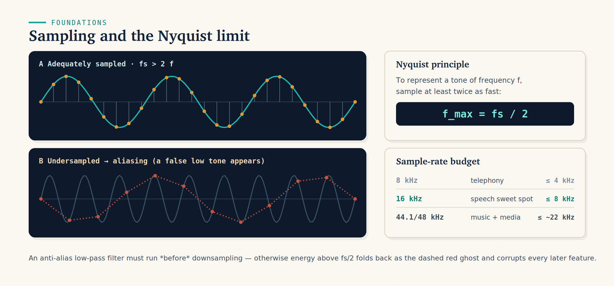

The fold-down frequency is arithmetic you can do in your head: a tone at `f` sampled at `sr` with no filter appears at **`|sr − f|`**. A 3 kHz tone sampled at 4 kHz shows up as a 1 kHz beep. A 5 kHz tone sampled at 8 kHz shows up at 3 kHz.

The fix is a **low-pass filter applied *before* you drop samples** — that's what a real resampler (`librosa.resample`, `torchaudio.transforms.Resample`, `soxr`) does for you, and what naive slicing (`wav[::2]`) does not. *(§7 makes this audible.)*

### 2.2 Bit depth — the other axis

Sample rate is resolution along **time**. **Bit depth** is resolution along **amplitude**: with `B` bits you only get `2^B` allowed levels, so every measurement is rounded to the nearest rung. That rounding error is **quantization noise**, and the rule of thumb is:

```
~6 dB of dynamic range per bit
16-bit → ~96 dB (CD, effectively transparent)   8-bit → ~48 dB (audibly hissy)
```

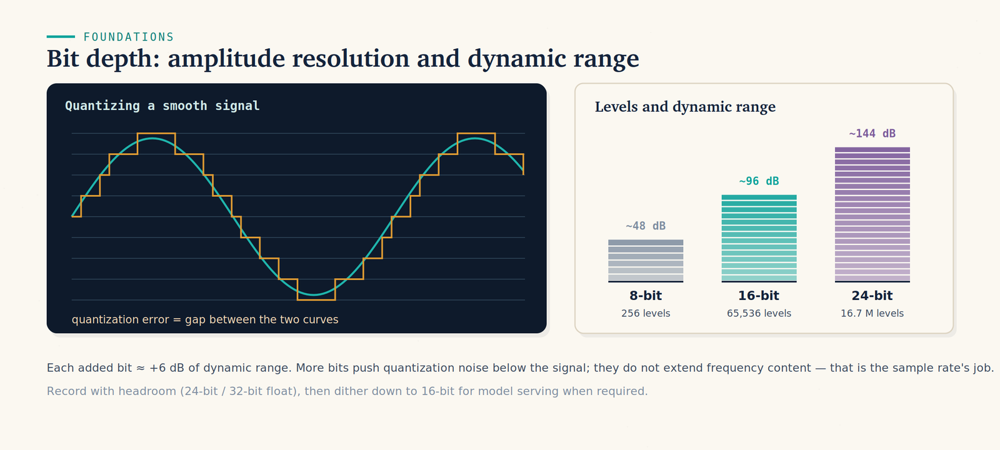

Two consequences worth carrying:
- Bit depth **does not add bandwidth**. Dropping from 24-bit to 16-bit costs you dynamic range, never frequency content — that's the sample rate's job. Confusing the two is a classic interview stumble.
- Files ship as `int16` (half the bytes of `float32`, still clean); models want `float32` in `[-1, 1]`. `librosa.load` and `soundfile.read(dtype="float32")` convert for you; `np.frombuffer` on raw bytes does not.

---

## 3. A Sound Is a Sum of Frequencies — and the FFT reads the recipe

This is the single idea that makes spectrograms obvious later, so it gets its own section.

> **Any sound is just many simple sine waves — different frequencies, different loudnesses — added together.** A flute note, a vowel, a chord, a whole orchestra: all of it is one big sum of pure tones.

A **pure tone** is one frequency: `sin(2π · f · t)`. Add three of them and you get a single, more complicated-looking wave — but the information is unchanged, it was just summed:

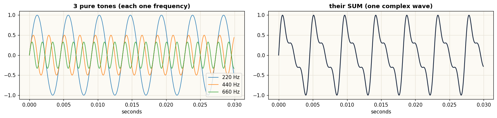

The interesting direction is the reverse: *given the messy wave on the right, which tones went into it?* That question has an exact answer, and the **FFT** (Fast Fourier Transform) computes it. You do not need the derivation — you need to know what it hands back:

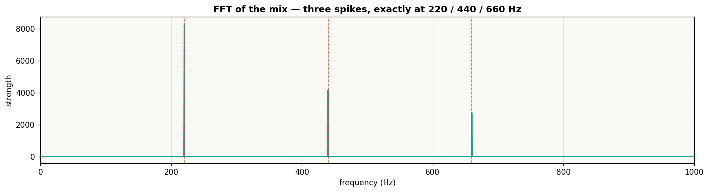

Three spikes, at exactly the three frequencies that were added. That picture is called the **spectrum**, and reading the tallest peaks off it recovers the recipe.

```
wave  ──FFT──►  spectrum        "which frequencies, how loud"
wave  ◄─iFFT──  spectrum        (and back again, losslessly)
```

Hold on to one sentence: **a spectrogram (§5) is just this, recomputed for every short slice of time.** That's the whole trick.

---

## 4. Speech Specifically — pitch, formants, voiced vs unvoiced

Apply "sound = sum of frequencies" to a human voice and you get the **source–filter model**, which is the only speech-science you need:

- **Source = pitch.** Your vocal folds open and close at the **fundamental frequency `F0`** — that *is* the pitch you hear. Typical **men ≈ 90–150 Hz**, **women ≈ 170–250 Hz**. `F0` and its multiples (**harmonics**) are the frequencies actually present.
- **Filter = the vowel.** The shape of your mouth and throat boosts certain frequency bands, called **formants**. Formants decide *which vowel* it is — roughly the same whoever speaks it.

Move `F0` and the pitch changes while the vowel stays put. Move the vocal-tract shape and the vowel changes while the pitch stays put. Two independent dials.

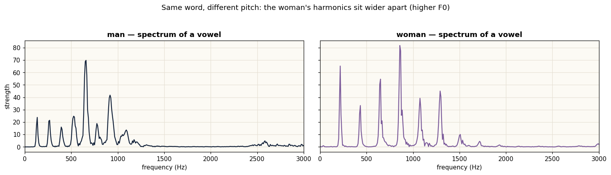

Read those two panels as *combs*: the **spacing between spikes is the pitch**. The woman's comb is spaced wider, because her `F0` is roughly double.

### The split that matters downstream: voiced vs unvoiced

- **Voiced** sounds (all vowels, `m`, `n`, `l`) are **periodic** — they have an `F0` and a clean harmonic comb.
- **Unvoiced** sounds (`s`, `f`, `sh`, `th`) are basically **noise** — broadband hiss, no pitch, and *quiet*.

Two cheap measurements separate them, and you will meet both again at VAD (§9):

| Measure | What it is | Voiced | Unvoiced |
|---|---|---|---|
| **RMS** (root-mean-square) | energy of a short frame — `sqrt(mean(frame²))` | high | **low** |
| **ZCR** (zero-crossing rate) | how often the wave crosses zero in a frame | low | **high** |

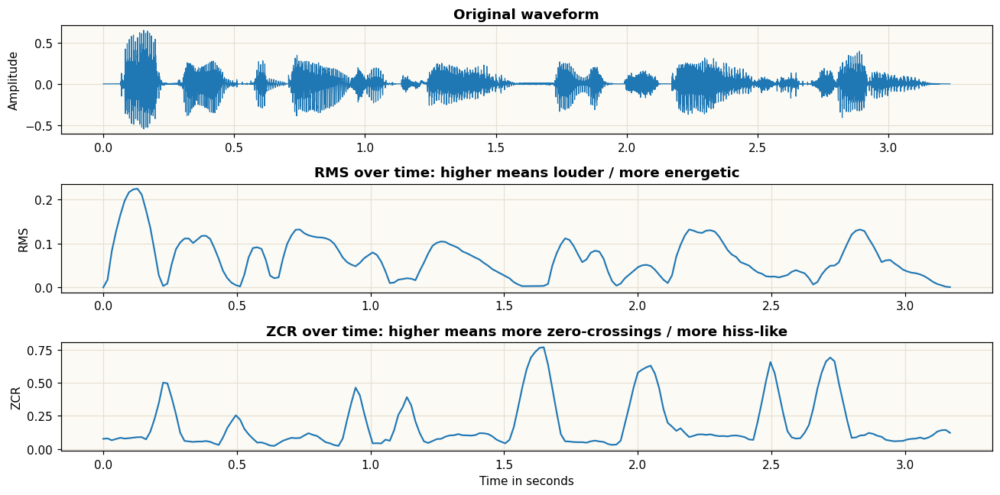

A useful reading: ZCR **is** a frequency estimate in disguise. A wave crosses zero twice per cycle, so `zcr × sr / 2 ≈ dominant frequency in that frame`. A man's vowels land around 100–1000 Hz; `s`/`sh` hiss sits far above that.

⚠️ **RMS + ZCR is a teaching heuristic, not a production VAD.** It is here so you understand what a real VAD is approximating — see §9 for what to actually ship.

**Why the telephone sounds like the telephone.** The old phone network low-passed everything at **3.4 kHz**. Vowels (low frequencies) survive that; `s` and `f` live *above* it and blur together. That is why "S as in Sam" exists as a phrase. It is also exactly what a botched downsample does to your audio — `(likely)` your first "the model got worse and I don't know why" incident.

---

## 5. What the Model Actually Sees — the log-mel spectrogram

Models almost never read the raw waveform. 16,000 numbers per second is too much and too low-level. The front-end converts the wave into a **spectrogram**: a picture of *which frequencies are present, over time*.

Here is the whole construction in one figure:

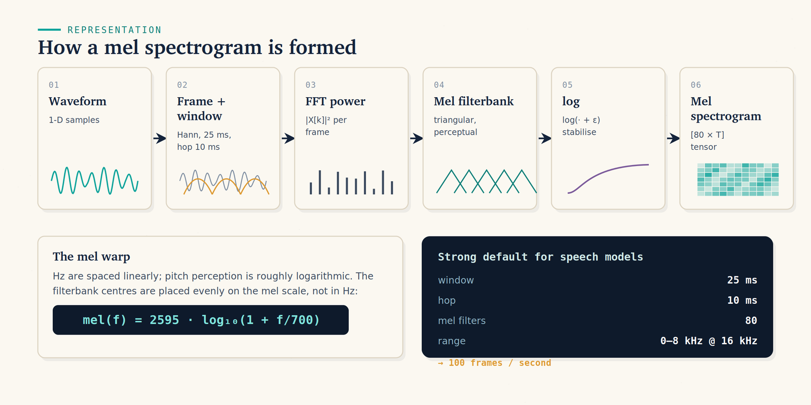

### Step 1 — STFT: slide a window, FFT each slice, stack the columns

Take a short window of the wave (25 ms), FFT it (§3) to get one spectrum, and write that spectrum down as **one vertical column**. Slide the window forward a little (10 ms) and do it again. Stack the columns side by side and you have an image whose x-axis is time and y-axis is frequency. That's the **Short-Time Fourier Transform**.

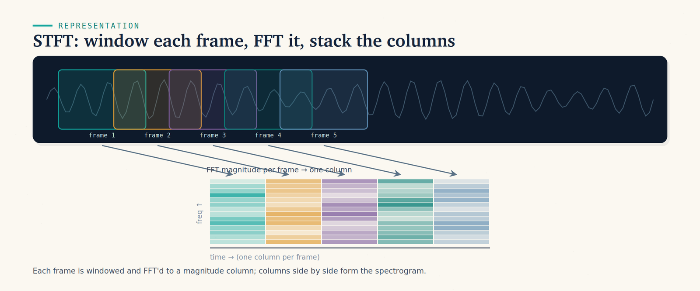

### Step 2 — mel: squash many FFT bins into ~80 perceptual bands

Humans do **not** hear frequency linearly. The gap between 100 Hz and 200 Hz feels enormous; the gap between 7100 Hz and 7200 Hz is inaudible. The **mel scale** encodes that:

```
mel(f) = 2595 · log10(1 + f / 700)
```

So instead of keeping hundreds of linear FFT bins, you sum them into **~80 triangular filters** spaced evenly on the *mel* scale — narrow and dense at low frequencies, wide and sparse at high ones. Same perceptual information, ~an order of magnitude fewer numbers.

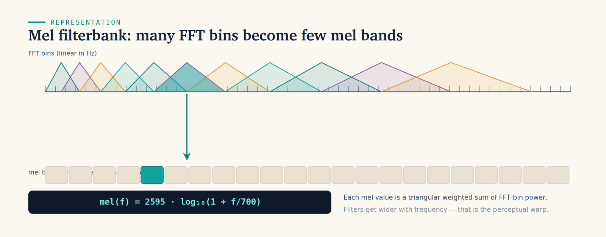

### Step 3 — log: so quiet detail survives

Loudness is perceived logarithmically too. Taking `log` (or `power_to_db`) keeps quiet consonants from being crushed to zero next to a loud vowel. The result is the **log-mel spectrogram** — and this is literally what Whisper's feature extractor emits:

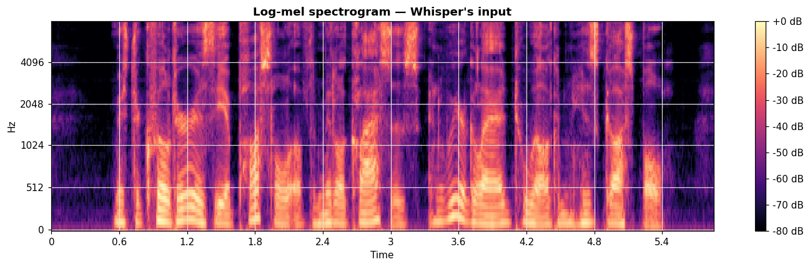

### The canonical speech config — memorise this row

| Parameter | Value | Why |
|---|---|---|
| window (`win_length`) | **25 ms** = 400 samples @ 16 kHz | long enough to read pitch |
| hop (`hop_length`) | **10 ms** = 160 samples | ⇒ exactly **100 frames per second** |
| mel bands (`n_mels`) | **80** | the perceptual squash |
| frequency range | **0–8 kHz** | Nyquist at 16 kHz |

⇒ output shape **`(80, T)`** where `T ≈ 100 × seconds`. As a model tensor: `(batch, 80, frames)`.

### The one knob worth understanding: window length

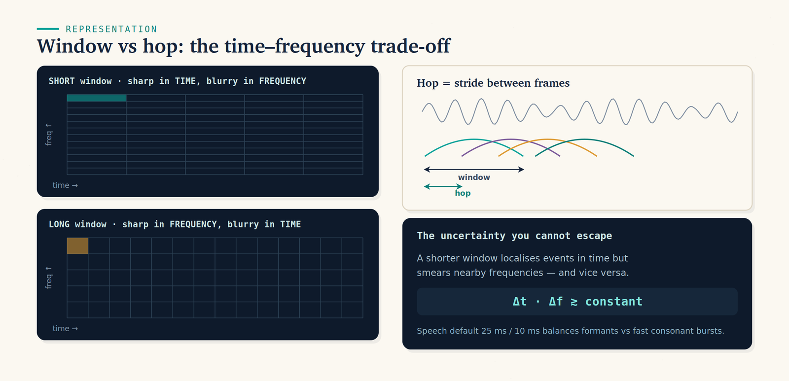

A **short** window pins down *when* a sound happened but smears *which* frequency it was. A **long** window does the reverse. You cannot sharpen both axes at once — `Δt · Δf ≥ constant`. 25 ms is the speech compromise: long enough to resolve pitch, short enough to catch a fast consonant burst.

You will basically never change these numbers. You *will* be asked why they trade off. `(certain)`

---

## 6. Worked Example — one 5.86 s clip, end to end, in numbers

A real LibriSpeech clip, every shape and number traced through the pipeline. This is the section to reproduce from memory.

```
1. FILE                 librispeech_dummy.wav
                        sr = 16,000 Hz    duration = 5.86 s

2. WAVEFORM             samples  = 16,000 × 5.86  = 93,680
                        shape    = (93680,)
                        dtype    = float32,  range [-0.339, +0.388]   ← in [-1, 1] ✓

3. LOG-MEL              win = 400 (25 ms), hop = 160 (10 ms), n_mels = 80
                        frames T = 93,680 / 160 ≈ 586
                        shape    = (80, 586)
                        check    : 586 / 5.86 = 100.0 frames per second ✓

4. WHISPER INPUT        input_features = (1, 80, 3000)     ← note the 3000
                        Whisper ALWAYS pads/truncates to exactly 30 s
                        30 s × 100 frames/s = 3000 frames, always

5. DECODE               prefix <|startoftranscript|><|en|><|transcribe|>
                        → token ids → text

6. OUTPUT               hypothesis : "Mr. Quilter is the apostle of the middle
                                      classes and we are glad to welcome his gospel"
                        reference  : "MISTER QUILTER IS THE APOSTLE OF THE MIDDLE
                                      CLASSES AND WE ARE GLAD TO WELCOME HIS GOSPEL"

7. SCORE                WER raw        = 0.176      ← punishes "Mr." vs "MISTER" + casing
                        WER normalised = 0.059      ← report THIS one
```

Two things to notice, because both are exam-grade:

1. **Step 4's `3000` is not your clip's length.** Whisper was trained on fixed 30-second windows, so the feature extractor pads a 5.86 s clip with silence out to 30 s **every time**. A 3-second clip costs the same encoder compute as a 29-second one — which is why batching short clips is wasteful and why §11's chunking exists.
2. **Raw WER tripled the error rate over a formatting difference.** `MISTER` vs `Mr.` is not a recognition failure. §10.

---

## 7. Loading Audio Without Shooting Yourself in the Foot

This is the section that saves you days. Five things go wrong in production, in roughly this order of frequency:

| # | Bug | What you see | Fix |
|---|---|---|---|
| **1** | **Sample-rate mismatch** | garbage transcript, or text at the wrong speed | resample to the model's rate **and** pass that same rate everywhere |
| 2 | **Stereo vs mono** | shape error, or half the signal | `wav.mean(axis=1)` — **average** the channels, don't drop one |
| 3 | **int16 vs float** | silence, or clipping distortion | load with `dtype="float32"`; values must sit in `[-1, 1]` |
| 4 | **Format / codec** | decoder exception on `.mp3/.m4a/.webm` | decode via ffmpeg/soundfile, never raw byte parsing |
| 5 | **Clipping / normalisation** | harsh distortion when you concatenate clips | loud-normalise toward ~−1 dBFS |

### Bug #1, made concrete

The same array, played at three declared rates:

```
Audio(y16, rate=16000)        CORRECT      — the true rate
Audio(y16, rate=24000)        "chipmunk"   — 1.5× too fast, pitch shifted up
Audio(y16, rate=10700)        "slow-mo"    — 0.67× too slow, pitch shifted down
```

Passing the wrong `sampling_rate=` to a feature extractor does **exactly this to the model's input**, except you cannot hear it. You just get wrong transcripts and no error message anywhere.

> ⚠️ **The reason this bug is special: it is silent.** A shape mismatch throws. A missing file throws. A wrong sample rate returns a plausible-looking string. `(certain)`

### The correct preparation, in three lines

```
stereo 44.1 kHz  (n, 2)
   │  1) mono      wav.mean(axis=1)          → (n,)
   │  2) dtype     .astype(np.float32)       → float32 in [-1, 1]
   │  3) resample  librosa.resample(...)     → 16 kHz
   ▼
model-ready  (m,)  @ 16,000 Hz
```

In production these three steps live in **one `prepare(wav, sr)` helper that every entry point calls**. The bug class disappears the moment there is exactly one place that can get it wrong.

### Why `librosa.resample` and never `wav[::k]`

Dropping every k-th sample skips the **anti-alias filter** from §2.1. Frequencies above the new Nyquist don't vanish — they fold back as a metallic, false low-frequency buzz. At the *same output rate*, the properly resampled version sounds duller but correct; the sliced version sounds harsh and metallic. Learn the sound; it is the signature of a broken resampling step.

---

## 8. ASR — Whisper, its knobs, and its two failure modes

**Whisper** is the workhorse: a Transformer **encoder–decoder** over the log-mel image from §5. The encoder reads the whole spectrogram; the decoder writes text one token at a time, attending back to the audio.

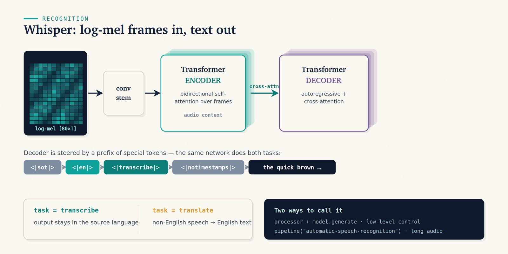

The thing to internalise, because it is the most quotable fact about Whisper:

> **Whisper's task is set by a token prefix, not by a different model.**
> `<|startoftranscript|><|en|><|transcribe|>` vs `…<|translate|>` is the *only* difference between transcription and translation. Same weights, both times.

Decoding is ordinary autoregression — each step mixes the audio memory (cross-attention) with the tokens so far (causal self-attention), predicts one token, appends it, repeats:

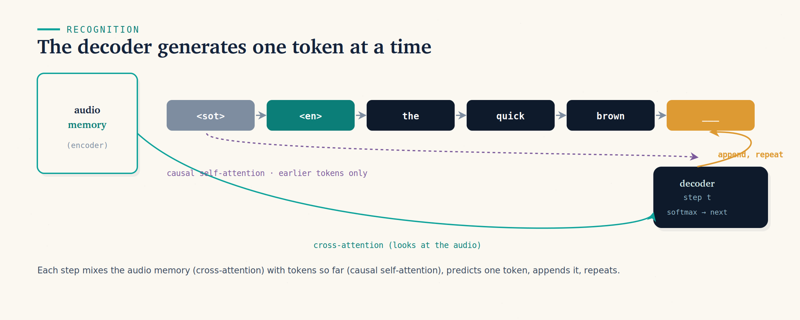

### The knobs you will actually twist

| Knob | What it does | Production guidance |
|---|---|---|
| **model size** | `tiny` → `large-v3-turbo` | start at **`large-v3-turbo`** — near-`large` accuracy, several× faster. Use `*.en` variants only for English. |
| **`language`** | skips auto-detect | **always set it if you know it.** Auto-detect is a classic failure on short or noisy clips. |
| **`task`** | `transcribe` / `translate` | `translate` = speech in any language → **English** text. There is no "translate into French" here. |
| **`return_timestamps`** | per-segment times | required for subtitles, diarization alignment, long audio |
| **`temperature`** | sampling randomness | keep **`0`**. Whisper uses a temperature *fallback* (0 → 0.2 → …) only when decoding looks degenerate. |
| **`condition_on_previous_text`** | feeds prior text as context | helps fluency but **propagates hallucinations** — set `False` the moment you see runaway repeats |
| **`no_speech_threshold`**, **`compression_ratio_threshold`** | drop silent/garbage segments | the main levers against hallucination |

### ⚠️ The two failure modes that bite in production

**1. Hallucination on silence and non-speech.** Fed silence, music, or room noise, Whisper confidently emits training-data priors. The strings it invents are famous:

> ⚠️ These are **hallucinations, not transcripts** — the audio contained no speech at all. Whisper learned them from YouTube-style subtitle data and emits them as filler: *"Thank you."*, *"Thanks for watching!"*, *"♪"*, and subtitle credits.

**2. Repetition loops.** On long silences or out-of-distribution audio the decoder can get stuck repeating one phrase for many seconds. You will see it as the same line repeated across consecutive timestamps.

**The fixes, in order of impact:**
1. **Run VAD first** (§9) and transcribe only segments that contain speech. This single step removes most hallucinations.
2. Keep `temperature=0` with the built-in fallback enabled.
3. Tune `no_speech_threshold` / `compression_ratio_threshold` to drop degenerate segments.
4. Set `condition_on_previous_text=False` so one bad segment can't poison the next.

---

## 9. VAD — find the speech before you transcribe it

**Voice Activity Detection** answers "*where* is there speech?" before you spend money answering "*what* was said?". It is cheap, fast, and the standard pre-filter.

```
raw audio ──► VAD ──► [0.50s–5.50s]  ──► ASR only on these spans
              │
              └──► silence / music / noise  ──► SKIPPED (never reaches Whisper)
```

**Silero VAD** is the production default: tiny, MIT-licensed, runs on CPU, expects 16 kHz mono `float32`. The RMS/ZCR heuristics from §4 are *not* good enough for real audio — they fall over on background music, air-conditioning hum, and quiet fricatives. Use a learned VAD.

Three payoffs, and the first is the one people forget:

1. **Hallucination control.** No silence reaches the decoder, so it never invents *"Thanks for watching!"*.
2. **Cost.** A one-hour meeting recording is often 20 minutes of speech. You just cut your ASR bill ~3×.
3. **Endpointing.** In a live agent, VAD is also what decides *the user has stopped talking* — which is the event that starts your whole response pipeline (§13).

---

## 10. Evaluating ASR — WER, and why you report the normalised one

ASR is **not** scored like text generation. The metric is **Word Error Rate**, computed by aligning hypothesis to reference and counting edits:

```
WER = (S + I + D) / N_ref

S = substitutions   I = insertions   D = deletions   N_ref = words in the reference
```

A tiny example you can verify by hand:

```
reference : the quick brown fox jumps over the lazy dog     (9 words)
hypothesis: the quick brown fox jump  over     lazy dog
                                 ^^^^        ^^^
                                 1 sub    1 deletion

WER = (1 + 0 + 1) / 9 = 0.222
```

Three things interviewers probe here:

- **Insertions count**, so **WER can exceed 100%** — a model that hallucinates 30 extra words onto a 10-word reference scores 3.0. `(certain)`
- **Normalise both sides first.** Lowercase, strip punctuation, expand numerals and abbreviations, *then* score. From §6: raw `0.176` vs normalised `0.059` on the identical output — the raw number was measuring formatting, not recognition. Use `transformers`' `BasicTextNormalizer` / `EnglishTextNormalizer`, or the Whisper normaliser, and **say which one you used** when you quote a number.
- **WER is not the product metric.** For a voice agent, what matters is whether the *intent* survived. A 12% WER that never garbles an order number beats an 8% WER that does. Pair WER with a task-level metric — entity accuracy, intent accuracy, or downstream success. *(Same argument as [Evaluating LLMs](Evaluating%20LLMs.md): the offline metric is a proxy, not the goal.)*

**Related metrics worth naming:** **CER** (character error rate — for languages without clean word boundaries, and for codes/IDs), and **diarization error rate (DER)** when you also care about *who* spoke.

---

## 11. Long Audio — chunking with stride, and timestamps

Whisper only ever sees **30 seconds** at a time — it was trained that way, and §6 showed the feature extractor padding to exactly 3000 frames. Longer audio must be split, and a naive split slices words in half at the seams.

The fix is **overlapping chunks with a stride**:

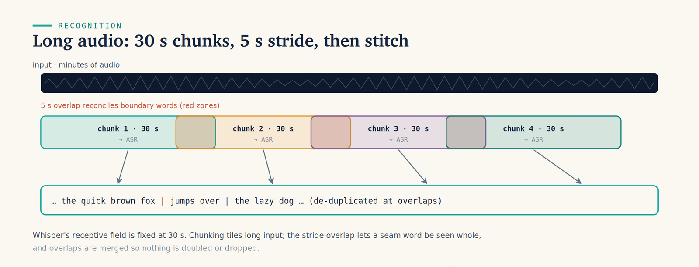

```
chunk_length_s = 30     # Whisper's native receptive field
stride_length_s = 5     # overlap, so a word on a seam is seen whole by a neighbour
return_timestamps=True  # per-segment start/end times
```

The overlap regions are then **de-duplicated** when the pieces are stitched, so nothing is doubled or dropped. The HF `pipeline("automatic-speech-recognition", chunk_length_s=..., stride_length_s=...)` does all of this for you — write it yourself only if you need custom seam logic.

> **Two more production realities.**
> **"Who spoke when?" is diarization, and Whisper does not do it.** Whisper transcribes *what* was said, not *who* said it. For meetings and calls, add a diarization model — **`pyannote.audio`** is the standard — and align its speaker turns against Whisper's timestamps. Expect the alignment itself to be fiddly at turn boundaries.
> **Word-level timestamps are approximate.** Whisper's segment timestamps come from the decoder's own `<|t|>` tokens and drift; if you need frame-accurate word times (karaoke, editing), use forced alignment (`WhisperX`, `wav2vec2` CTC alignment) on top. `(likely)`

---

## 12. TTS — the other direction

ASR was audio → text. **TTS is text → audio**, and it is the other half of any voice product.

| Option | Examples | When you'd pick it |
|---|---|---|
| **Open local models** | Kokoro, Piper, Coqui XTTS, MMS-TTS, Parler-TTS | no per-call cost, on-prem/private, you own the latency |
| **Managed APIs** | OpenAI TTS, ElevenLabs, Cartesia, PlayHT | best voice quality, streaming built in, zero infra |

The knobs that matter: **voice** (speaker identity), **speed**, **output format and sample rate**, and **streaming**.

> ⚠️ **The sample-rate trap closes here.** Most TTS emits **24 kHz** (some 22.05 kHz); your ASR wants **16 kHz**. Feed TTS output straight back into ASR and you have recreated §7's bug #1 inside your own pipeline. **Resample between them.** This bites hardest in evaluation loops and round-trip tests, where both ends are yours and you assume they match.

**Streaming is the whole latency game.** A non-streaming TTS call returns nothing until the entire sentence is synthesised. A streaming one starts returning audio almost immediately, so playback begins while the rest is still being generated — which is what actually moves your time-to-first-sound. Prefer `opus` for low-latency streaming, `wav` when you need to post-process.

---

## 13. The Voice-Agent Loop — latency, barge-in, cascade vs audio-native

Every voice product — phone bot, meeting assistant, talking app — is the same **cascade**:

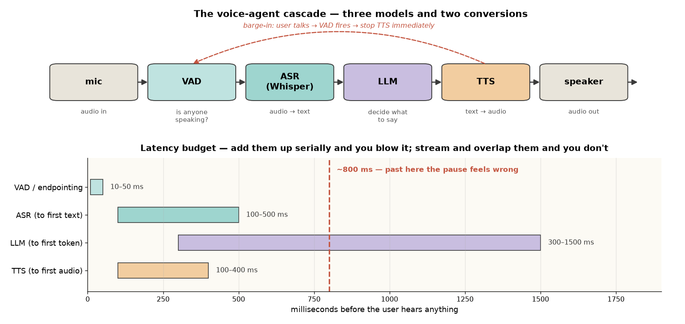

The hard part isn't any one box. **It's the latency budget**, because humans notice a reply that takes more than **~800 ms to start**. Add the stages up serially and you are already over.

| Stage | Typical latency | How to cut it |
|---|---|---|
| VAD / endpointing | 10–50 ms | tune the silence threshold; don't over-wait to decide the user stopped |
| ASR | 100–500 ms | streaming / partial transcripts; smaller model |
| LLM | 300 ms – seconds | **stream tokens**; start TTS on the first *sentence*, not the first paragraph |
| TTS | 100–400 ms to first audio | **streaming TTS** |

Two senior-level ideas that separate a demo from a product:

1. **Stream everything and overlap the stages.** Don't wait for a full transcript to call the LLM, or a full reply to start TTS. Pipeline them — the stages should be running *concurrently*, not in sequence. This is the same "time-to-first-token beats total throughput" instinct from [Serving LLMs at Scale](Serving%20LLMs%20at%20Scale.md), applied one layer up.
2. **Barge-in / interruption.** When the user starts talking, VAD must detect it and **stop the TTS immediately**. Handling interruption is the single feature that makes a voice agent feel usable rather than infuriating — and it is why VAD keeps running *while the agent is speaking*, not only while it is listening.

### Cascade vs audio-native (multimodal)

The cascade uses three models. The newer alternative is an **audio-native multimodal LLM** — GPT-4o-audio, Gemini — that takes audio **directly** as input, and in the speech-to-speech variants emits audio directly too.

| | Cascade (VAD → ASR → LLM → TTS) | Audio-native |
|---|---|---|
| Latency | four hops, each with its own overhead | **lowest** — one model |
| Tone / prosody | **thrown away** at the transcript | preserved and usable |
| Control per stage | **high** — swap any box, log any hop | low |
| Debuggability | **high** — you can read the transcript | low — no intermediate artifact to inspect |
| Cost | three models, but each cheap and swappable | one call, priced per audio token |

🎯 **Rule of thumb:** *cascade when you need control, observability and cheap swappable parts; audio-native when you need the lowest latency and the model needs to hear tone, not just words.*

---

## 14. Code / Implementation

Library versions: `librosa` 0.11, `transformers` 5.x, `soundfile`, `jiwer` 4.x.

### The `prepare()` helper — the function that prevents §7

```python
import numpy as np, librosa, soundfile as sf

SR = 16_000  # the ONE rate this service standardizes on

def prepare(path_or_array, orig_sr=None, target_sr=SR):
    """Every entry point calls this. One place to get the tensor right."""
    if isinstance(path_or_array, (str, bytes)):
        wav, orig_sr = sf.read(path_or_array, dtype="float32")   # int16 → float32 for you
    else:
        wav = np.asarray(path_or_array, np.float32)
        assert orig_sr is not None, "an in-memory array must carry its sample rate"

    if wav.ndim > 1:                       # (n, channels) → (n,)
        wav = wav.mean(axis=1)             # AVERAGE — dropping a channel loses half the signal
    wav = wav.astype(np.float32)

    if orig_sr != target_sr:               # anti-alias filter THEN decimate — never wav[::k]
        wav = librosa.resample(wav, orig_sr=orig_sr, target_sr=target_sr)

    peak = np.abs(wav).max()
    if peak > 1.0:                         # outside [-1,1] clips into harsh distortion
        wav = wav / peak
    return wav, target_sr
```

### The log-mel front-end, by hand — to see the `(80, T)` shape appear

```python
n_mels, hop, win = 80, 160, 400            # 25 ms window / 10 ms hop at 16 kHz

mel = librosa.feature.melspectrogram(
    y=wav, sr=SR, win_length=win, hop_length=hop,
    n_mels=n_mels, fmin=0, fmax=8000, power=2.0)   # power spectrogram
log_mel = librosa.power_to_db(mel, ref=np.max)     # the "log" step, in dB

print(log_mel.shape)                               # (80, 586) = (mel bands, frames)
print(log_mel.shape[1] / (len(wav)/SR))            # 100.0 frames/sec — as promised
```

### Whisper — the two ways to call it

```python
import torch
from transformers import WhisperProcessor, WhisperForConditionalGeneration

MODEL = "openai/whisper-large-v3-turbo"            # the production default
processor = WhisperProcessor.from_pretrained(MODEL)
model = WhisperForConditionalGeneration.from_pretrained(MODEL).to(device).eval()

# --- (a) low-level: full control over generation ---------------------------
feats = processor(wav, sampling_rate=16_000,       # MUST match wav's true rate (§7)
                  return_tensors="pt").input_features.to(device)
print(feats.shape)                                 # (1, 80, 3000) — padded to 30 s, always

with torch.no_grad():
    ids = model.generate(feats, language="en", task="transcribe",
                         temperature=0.0,          # fallback still engages if degenerate
                         condition_on_previous_text=False,   # stop loops propagating
                         max_new_tokens=440)
text = processor.batch_decode(ids, skip_special_tokens=True)[0].strip()

# --- (b) pipeline: long audio, chunking and timestamps handled for you -----
from transformers import pipeline
asr = pipeline("automatic-speech-recognition", model=model,
               tokenizer=processor.tokenizer,
               feature_extractor=processor.feature_extractor,
               chunk_length_s=30, stride_length_s=5,        # §11 — never hard-cut at 30 s
               return_timestamps=True)
out = asr({"raw": wav, "sampling_rate": SR})
for ch in out["chunks"]:
    a, b = ch["timestamp"]
    print(f"[{a:6.2f}s -> {b:6.2f}s] {ch['text'].strip()}")
```

### VAD-gating — the three lines that kill most hallucinations

```python
vad_model, utils = torch.hub.load("snakers4/silero-vad", "silero_vad", trust_repo=True)
get_speech_timestamps = utils[0]

spans = get_speech_timestamps(torch.from_numpy(np.ascontiguousarray(wav)),
                              vad_model, sampling_rate=16_000, return_seconds=True)
if not spans:
    transcript = ""                                # silence → SKIP ASR entirely
else:                                              # transcribe only the speech
    speech = np.concatenate([wav[int(s["start"]*SR):int(s["end"]*SR)] for s in spans])
    transcript = asr({"raw": speech, "sampling_rate": SR})["text"]
```

### Scoring — always normalise before you report

```python
from jiwer import wer
from transformers.models.whisper.english_normalizer import BasicTextNormalizer
norm = BasicTextNormalizer()

print(f"WER raw        : {wer(reference.lower(), hypothesis.lower()):.3f}")
print(f"WER normalized : {wer(norm(reference), norm(hypothesis)):.3f}   <- report THIS")
```

### TTS, and closing the loop

```python
from transformers import pipeline
tts = pipeline("text-to-speech", model="facebook/mms-tts-eng")
out = tts("Audio is just an array of numbers, and sample rate is king.")
audio, tts_sr = np.asarray(out["audio"]).squeeze(), out["sampling_rate"]

# ⚠️ tts_sr is often 24000 or 22050 — NOT your ASR's 16000.
if tts_sr != SR:
    audio = librosa.resample(audio, orig_sr=tts_sr, target_sr=SR)   # §12's trap, closed
```

---

## 15. When It Breaks

| Symptom | Likely cause | Fix |
|---|---|---|
| Transcript empty, or text at the wrong speed | **sample-rate mismatch** | resample to 16 kHz **and** pass `sampling_rate=16000` |
| *"Thank you."* / *"Thanks for watching!"* over silence | hallucination prior | **VAD-gate**; raise `no_speech_threshold` |
| One phrase repeats forever | decoder loop | `temperature=0` with fallback; `condition_on_previous_text=False` |
| Words cut in half at regular intervals | hard 30 s split | `chunk_length_s` + `stride_length_s` |
| Harsh, metallic audio after downsampling | no anti-alias filter (`wav[::k]`) | `librosa.resample` |
| Accuracy fine in dev, terrible in prod | dev clips were clean 16 kHz WAV; prod is 8 kHz phone / compressed / noisy | build the eval set **from production audio**, not LibriSpeech |
| Model "got worse" after a pipeline change | someone low-passed or downsampled upstream | log `sr`, `dtype`, `shape` and `peak` at every hop |
| TTS output transcribes badly | 24 kHz fed to a 16 kHz model | resample between the two |
| Wrong language detected on short clips | auto-detect on <5 s of audio | **set `language=` explicitly** |
| Numbers and names consistently wrong | out-of-vocabulary domain terms | **prompt/initial-prompt biasing**, or fine-tune; see [Fine-Tuning LLMs](Fine-Tuning%20LLMs.md) |
| `.mp3`/`.m4a` decode error | missing/mismatched codec path | decode with ffmpeg/soundfile rather than raw byte parsing |

---

## 16. Production & LLMOps Notes

**Standardise the tensor at the edge.** One `prepare()` (§14), called by every entry point, and log `(sr, dtype, shape, peak)` on the way in. Most audio incidents are diagnosed the moment those four numbers appear in a log line.

**Cost model.** Managed ASR is priced **per minute of audio**; self-hosted is priced in **GPU-seconds**. The crossover is usually a few hundred hours/month `(guessing — recompute against current prices)`. But note the real lever is **VAD, not the model**: gating out non-speech cuts billable minutes directly, and it works on both pricing models.

**The 30-second padding tax.** Whisper pads every clip to 30 s (§6), so a batch of 2-second utterances wastes ~93% of the encoder's work. If you serve many short clips, batch them and consider a CTC model (`wav2vec2`) instead — it has no fixed window. `(certain)`

**Streaming vs batch are different systems.** Batch transcription is a queue you can scale horizontally and retry. Streaming ASR holds a per-connection session with state, cares about partial-hypothesis stability (the text should not visibly rewrite itself), and needs endpointing. Don't retrofit one into the other — pick up front.

**Privacy is a first-class constraint here, more than anywhere else in this vault.** Audio is biometric: a voice identifies a person even after the words are redacted. That changes the architecture, not just the policy — it is often the reason to self-host rather than call an API, and it is why retention windows on raw audio are typically much shorter than on transcripts. Redact PII in the transcript *and* decide explicitly how long the waveform lives.

**Evaluation set discipline.** Build it from **real production audio** — your users' accents, your codecs, your background noise, your domain vocabulary. A model that wins on LibriSpeech can lose badly on 8 kHz call-centre audio. Track WER **by slice** (accent, channel, noise level, clip length), not just in aggregate, or a regression that only affects one slice will hide inside a healthy average. Same discipline as any [LLM eval set](Evaluating%20LLMs.md).

**Monitoring signals that actually catch drift:** WER on a labelled canary set, the **rate of empty/degenerate transcripts**, **VAD speech-ratio** (a sudden drop means your input pipeline broke), compression-ratio outliers (the repetition-loop signature), and latency percentiles per stage.

**Fine-tuning is real and often cheap.** Domain vocabulary (drug names, SKUs, place names) and accent coverage both respond well to a few hours of labelled in-domain audio. Whisper fine-tunes with the same LoRA machinery as any Transformer — see [Fine-Tuning LLMs](Fine-Tuning%20LLMs.md). Before you fine-tune, try **prompt biasing** (`initial_prompt` seeded with the expected terms); it is free and often enough.

---

## 17. Interview Lens

| Question | What it's really testing — and the answer that lands |
|---|---|
| *"How would you build a voice assistant?"* | Whether you know it's a **latency problem**, not a model problem. Name the cascade, give the ~800 ms budget, then say the two things that buy it: **stream and overlap every stage**, and **handle barge-in**. |
| *"Why do you need a sample rate at all?"* | Understanding that the array is meaningless without it. 🎯 *"The array is just numbers — the sample rate is what turns index into time. Change it and every frequency in the clip changes."* |
| *"What's the Nyquist limit and why do I care?"* | `f_max = sr / 2`. You care because (a) it tells you what a rate can represent, and (b) violating it produces **aliasing** — a false low tone that no later stage can remove. |
| *"Whisper keeps writing 'Thank you' on our silent recordings."* | The senior answer is **VAD-gate before ASR**, not "use a bigger model". Then the secondary levers: `no_speech_threshold`, `condition_on_previous_text=False`, `temperature=0`. |
| *"Your WER is 3%. Is that good?"* | Correct answer is a question back: **normalised or raw, on what data, and with what task metric?** 3% on read speech is unremarkable; 3% on noisy call audio is excellent. And WER isn't the product metric — intent/entity accuracy is. |
| *"Can WER be above 100%?"* | **Yes** — insertions are counted in the numerator but the denominator is reference length. A hallucinating model scores >1.0. Cheap signal that you've actually looked at the metric. |
| *"What does the model actually see?"* | `(80, T)` log-mel, 100 frames/sec, 25 ms window / 10 ms hop. Then the trade-off: short window = sharp in time, blurry in frequency. |
| *"Bit depth vs sample rate?"* | Amplitude resolution vs time resolution. **~6 dB per bit.** More bits never buys you bandwidth. |
| *"Cascade or an audio-native model?"* | Control and observability vs latency and prosody. Say what you'd lose: the cascade's transcript is the artifact you log, eval and debug against — give it up deliberately, not by default. |
| *"How do you know who said what?"* | That's **diarization** (`pyannote.audio`), a separate model. Whisper does not do it, and saying so is the answer. |

---

## 18. Alternatives & How to Choose

### ASR model

| Option | Pick it when |
|---|---|
| **Whisper `large-v3-turbo`** | default — best accuracy/speed balance, 99 languages, huge ecosystem |
| **Whisper `tiny`/`base`** | edge devices, or a VAD-gated first pass before an expensive second pass |
| **`faster-whisper` (CTranslate2)** | same weights, several× faster and lighter — the usual self-hosting choice `(likely)` |
| **`wav2vec2` / CTC models** | streaming, or many **short** clips (no 30-second padding tax), or you need frame-accurate alignment |
| **Managed API** (OpenAI, Deepgram, AssemblyAI) | you want diarization, formatting and scaling for free and can accept per-minute pricing and sending audio off-box |

### The build decision

```
Do you need per-stage control, logging, or on-prem/private audio?
   │
   ├── YES ──► self-hosted cascade: Silero VAD → faster-whisper → your LLM → local TTS
   │
   └── NO ───► is the lowest possible latency + tone-awareness the product?
                  │
                  ├── YES ──► audio-native multimodal model (GPT-4o-audio, Gemini)
                  │
                  └── NO ───► managed ASR + TTS APIs, glue in between
```

**The adjacent topic this note deliberately stops short of:** generating *non-speech* audio — music and sound effects — and voice cloning. Different models, different evaluation, and a materially different consent/legal posture. [[Audio Generation]]

---

## 🧠 Self-Test

1. **What are the only two numbers you need to know what an audio array *means*, and which axis does each control?**
   <details><summary>answer</summary> <b>Sample rate</b> (how often you measured — the <b>time</b> axis) and <b>bit depth / dtype</b> (how precisely each measurement is stored — the <b>amplitude</b> axis). Sample rate turns array index into seconds and sets the highest representable frequency (`sr/2`); bit depth sets the noise floor at ~6 dB per bit and buys you no extra bandwidth. Channels are a third, lesser thing: average stereo to mono, never drop a channel.</details>

2. **A pure 5 kHz tone is sampled at 8 kHz with no anti-alias filter. What comes out, and why can't you fix it later?**
   <details><summary>answer</summary> 5 kHz is above the 4 kHz Nyquist limit, so it <b>folds down</b> to <code>|8000 − 5000| = 3000 Hz</code> — a 3 kHz tone that was never played. You can't fix it afterwards because the samples are genuinely consistent with a 3 kHz wave: the information identifying it as 5 kHz is <i>gone</i>. The only fix is a low-pass filter applied <b>before</b> decimation — which is exactly what a real resampler does and <code>wav[::k]</code> does not.</details>

3. **Walk the pipeline from a `.wav` file to Whisper's input tensor, naming every shape.**
   <details><summary>answer</summary> File → waveform <code>(n,)</code> float32 in <code>[-1,1]</code> at 16 kHz (mono; average channels if stereo) → <b>STFT</b> with a 25 ms window and 10 ms hop → <b>mel filterbank</b> squashing FFT bins into 80 perceptual bands → <b>log</b> → log-mel <code>(80, T)</code> where <code>T ≈ 100 × seconds</code> → Whisper's extractor pads/truncates to exactly 30 s, so <code>input_features = (1, 80, 3000)</code> <b>always</b>. That padding is why short clips are wasteful to serve.</details>

4. **Whisper writes "Thanks for watching!" over a silent stretch of your recording. Rank the fixes.**
   <details><summary>answer</summary> ① <b>VAD-gate before ASR</b> (Silero) so silence never reaches the decoder — this alone removes most of it. ② <code>temperature=0</code> with the built-in fallback. ③ Tune <code>no_speech_threshold</code> / <code>compression_ratio_threshold</code> to drop degenerate segments. ④ <code>condition_on_previous_text=False</code> so one bad segment can't poison the next. Note what is <i>not</i> on the list: a bigger model. These strings are learned priors from subtitle-heavy training data, not a capacity problem.</details>

5. **Write the WER formula. Can it exceed 100%? Why does the normalised number differ so much from the raw one?**
   <details><summary>answer</summary> <code>WER = (S + I + D) / N_ref</code>. <b>Yes</b>, it can exceed 100% — insertions add to the numerator while the denominator is fixed at reference length, so a hallucinating model scores above 1.0. Raw vs normalised differ because raw WER punishes casing, punctuation and formatting: "MISTER" vs "Mr." counts as a substitution even though recognition was perfect. Normalise both sides (lowercase, strip punctuation, expand abbreviations) and report that number — plus which normaliser you used.</details>

6. **Your voice agent takes 1.6 s to start replying. Where does that time go, and what's the single highest-leverage change?**
   <details><summary>answer</summary> It goes into four serial stages: VAD/endpointing (10–50 ms), ASR (100–500 ms), LLM (300 ms+), TTS to first audio (100–400 ms) — summed, not overlapped. The highest-leverage change is to <b>stream and overlap</b>: start the LLM on partial transcripts, and start <b>streaming TTS on the first complete sentence</b> rather than the whole reply. Time-to-first-sound depends on when audio <i>starts</i>, not on total compute. Second priority is <b>barge-in</b> — VAD must keep running while the agent speaks so it can cut the TTS the instant the user talks over it.</details>

7. **You send a 44.1 kHz stereo podcast into a pipeline built for 16 kHz mono speech. List everything that goes wrong and the order you'd fix it.**
   <details><summary>answer</summary> (a) Shape — the model gets <code>(n, 2)</code> where it wants <code>(n,)</code>: average the channels. (b) Rate — if you resample but still declare 16 kHz somewhere, or declare 16 kHz without resampling, every frequency is misread and the transcript is silently garbage. (c) dtype/range — if it loaded as int16 you're outside <code>[-1, 1]</code>. Fix order: <b>mono → float32 → resample</b>, all inside one <code>prepare()</code> helper so no entry point can skip a step. Then log <code>(sr, dtype, shape, peak)</code> so the next incident is a one-line diagnosis.</details>

8. **Why does a mel spectrogram use ~80 bands instead of keeping all the FFT bins, and what does the log buy you?**
   <details><summary>answer</summary> Human frequency perception is roughly logarithmic — 100→200 Hz is a huge perceptual step, 7100→7200 Hz is inaudible — so the mel scale (<code>2595·log10(1 + f/700)</code>) places narrow filters at low frequencies and wide ones at high. Summing FFT bins into ~80 mel bands keeps essentially all the perceptually relevant information at roughly an order of magnitude fewer numbers, which is a real compute saving for the encoder. The <b>log</b> then compresses dynamic range so quiet consonants survive next to loud vowels instead of being crushed to zero.</details>

---

*Covers: sound as an array · sample rate, Nyquist & aliasing · bit depth and quantization noise · sound as a sum of frequencies and the FFT · source–filter, F0, formants, voiced vs unvoiced, RMS/ZCR · STFT → mel → log and the `(80, T)` tensor · the window/hop trade-off · the five loading footguns · Whisper's encoder–decoder and token-prefix task control · hallucination and repetition-loop failure modes · Silero VAD · WER, normalisation and CER/DER · chunking with stride, timestamps, diarization · TTS and the 24 kHz trap · the voice-agent cascade, latency budget and barge-in · cascade vs audio-native · cost, privacy, eval-slice and monitoring discipline.*
