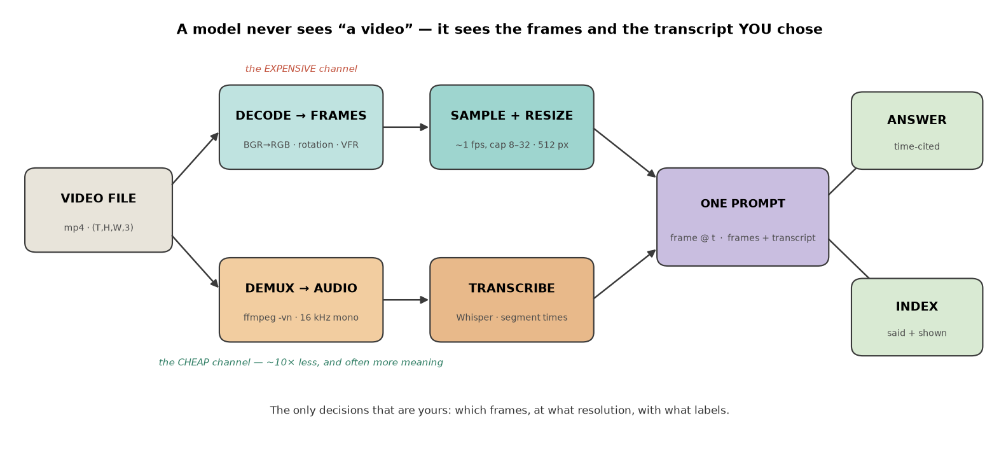
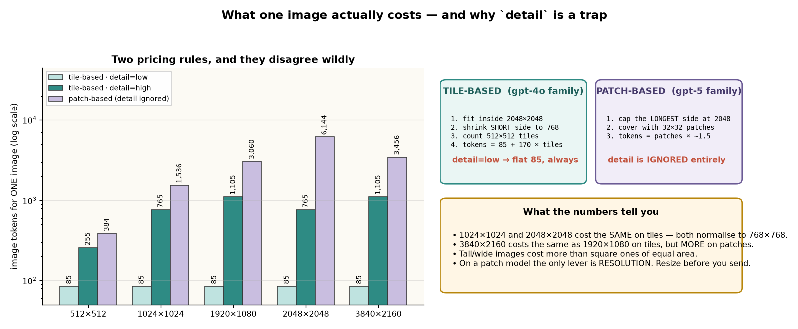
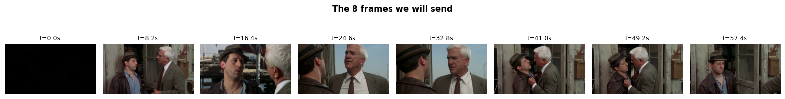
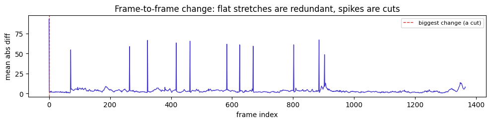
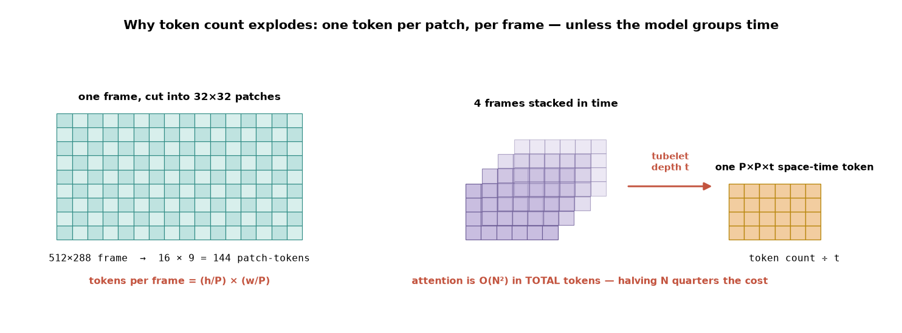

# Video for AI Engineers — sampling, pricing, and fusing the frames a model actually sees

> **TL;DR.** There is no "video model" in the OpenAI-style pipeline. **A video is N images, and you choose which ones.** The job is entirely *around* the model: decode the file, **sample a handful of frames**, shrink them, **label each with its timestamp**, pull the **audio** out and transcribe it, and send frames + transcript as one prompt. Get the sampling right and a 57-second clip costs a fraction of a cent; get it wrong and the same clip is 4.2 million tokens that don't fit in any context window at any price. Two pricing rules exist and they behave differently — **tile-based** (`gpt-4o`: `85 + 170 × tiles`, and `detail` is a real lever) vs **patch-based** (`gpt-5-*`: `patches × ~1.5`, and `detail` does **nothing**). 🎯 The line that wins the question: *"A model never sees 'a video' — it sees a handful of frames and a transcript that I chose, so sampling **is** the engineering, and the audio track is usually both the cheaper channel and the more informative one."* `(certain)`

**Where it fits:** The **video modality** of AI engineering — the sibling of [Speech & Audio for AI Engineers](Speech%20&%20Audio%20for%20AI%20Engineers.md) (which this note depends on for the audio half) and the temporal extension of [Multimodal RAG](Multimodal%20RAG.md) (which handles *still* images and document pages). Everything downstream is machinery you already have: the answer is an [LLM](LLM.md) call, the index is [embeddings](Embeddings.md), the search is [RAG](RAG.md).
**Prereqs:** [LLM](LLM.md) (context windows, token pricing), [Multimodal RAG](Multimodal%20RAG.md) (VLMs, a shared embedding space), [Speech & Audio for AI Engineers](Speech%20&%20Audio%20for%20AI%20Engineers.md) (Whisper, 16 kHz mono, ASR failure modes). No 3-D convolutions and no optical flow — real video models do that internally, and it is not your job.

> 🧠 **Start here, not at the top.** Jump straight to the [Self-Test](#-self-test), answer cold, then read **only** the sections you missed — a 5-minute pass instead of 35. *([why](../_STUDY%20LOOP.md))*

---

> ### ⚡ Fast Pass — 5 minutes
> **Model:** `video → decode → sample ~8 frames → resize to 512 px → label each "frame @ t" → send with the transcript`. The model's whole view of the video is the frames you picked.
> **Core:**
> - A vision message's `content` is a **list of parts**, and **order is preserved** — that is the hook timestamps hang on.
> - **Tile-based** (`gpt-4o`): fit 2048² → short side 768 → count 512 px tiles → `85 + 170 × tiles`. `detail="low"` = flat **85**.
> - **Patch-based** (`gpt-5-*`): cap longest side 2048 → cover with 32×32 patches → `ceil(patches × 1.5)`. **`detail` is ignored entirely** — the only lever is resolution.
> - Inside any ViT: `tokens per frame = (h/P) × (w/P)`, and attention is `O(N²)` in total tokens. A **tubelet** groups `t` frames into one space-time token ⇒ token count `÷ t`.
> - **Audio is ~10× cheaper than frames as text, and usually carries more meaning.** Extract with `ffmpeg -vn -ac 1 -ar 16000`.
> - `usage.prompt_tokens` is **the only number about cost that is actually true**. Measure, don't assume.
> **Traps:** ① OpenCV decodes **BGR** — forget `cvtColor` and the model describes a colour-swapped scene; ② setting `detail="low"` on a patch model and expecting savings (resize instead); ③ sending frames with no timestamp labels, then asking about order; ④ trusting a transcript that is **looping** (a classic Whisper failure) instead of cross-checking the frames; ⑤ `CAP_PROP_FRAME_COUNT` and `i/fps` lying on variable-frame-rate clips; ⑥ an empty reply from a `gpt-5-*` call because hidden reasoning tokens ate `max_completion_tokens`.
> 🎯 **Kill-shot:** *"Sending every frame of a 57-second 1080p clip is 4.2 million image-tokens — 10× the context window and ~$4 on the wrong model. Eight resized frames plus the transcript answer the same question for about a tenth of a cent, and the entire difference is one `resize` call and one `linspace`."*

---

## Table of Contents
1. [Intuition — the model sees the frames you chose](#1-intuition--the-model-sees-the-frames-you-chose)
2. [How an Image Reaches a VLM — the message is a list, not a string](#2-how-an-image-reaches-a-vlm--the-message-is-a-list-not-a-string)
3. [The Formal Core — what one image actually costs](#3-the-formal-core--what-one-image-actually-costs)
4. [A Video Is Just N Images — and it never fits](#4-a-video-is-just-n-images--and-it-never-fits)
5. [Decode & Sample — the three knobs that are yours](#5-decode--sample--the-three-knobs-that-are-yours)
6. [Timestamps — the label that turns pictures into a video](#6-timestamps--the-label-that-turns-pictures-into-a-video)
7. [Patches & Tubelets — the mechanism under both formulas](#7-patches--tubelets--the-mechanism-under-both-formulas)
8. [Audio Is Half the Video — and the cheap half](#8-audio-is-half-the-video--and-the-cheap-half)
9. [Fusion — why neither channel alone is enough](#9-fusion--why-neither-channel-alone-is-enough)
10. [Video RAG — indexing what was said and what was shown](#10-video-rag--indexing-what-was-said-and-what-was-shown)
11. [Worked Example — a 57-second clip, priced and answered](#11-worked-example--a-57-second-clip-priced-and-answered)
12. [Code / Implementation](#12-code--implementation)
13. [When It Breaks](#13-when-it-breaks)
14. [Production & LLMOps Notes](#14-production--llmops-notes)
15. [Interview Lens](#15-interview-lens)
16. [Alternatives & How to Choose](#16-alternatives--how-to-choose)
- [🧠 Self-Test](#-self-test)

---

## 1. Intuition — the model sees the frames you chose

Strip the container away and a video is `frames × H × W × 3` — a stack of ordinary images, plus an audio track riding alongside. There is no magic "video understanding" box in this pipeline. There is a **VLM that takes images**, and a set of decisions you make before it ever runs.



> **A model never sees "a video." It sees a handful of frames and/or a transcript that *you* chose.** Choose well and it is cheap, fast and accurate. Choose badly and it is expensive, slow, or blind to the one moment that mattered.

That sentence is the whole note. Everything below is either *how to choose* or *what it costs when you choose badly*.

---

## 2. How an Image Reaches a VLM — the message is a list, not a string

Two mechanics, and they are the foundation for the video sections.

**① `content` becomes a list of parts.** For a text-only call you pass `content: "some question"`. For a vision call:

```python
content = [
    {"type": "text",      "text": "What is in this picture?"},
    {"type": "image_url", "image_url": {"url": ...}},
]
```

**Ordering inside that list is preserved** — and that is the hook the entire video section hangs on (§6).

**② Two ways to deliver the image.** Either a **public URL** the API fetches, or a **base64 data URL** you build from bytes you already hold:

```
data:image/jpeg;base64,/9j/4AAQSkZJRgABAQEASABIAAD/...
└──────┬──────┘ └──┬──┘ └────────────────┬────────────────┘
   mime type    encoding      the file's bytes, base64'd
```

A public URL is fine for a demo and useless in production: it breaks when the host does, and **your video frames were never on the web in the first place**. The base64 path is the one that matters — a decoded frame is an array in memory, and this is how you get it to a model.

> Base64 costs **+33% in bytes** (3 bytes pack into 4 ASCII characters). That is upload bandwidth, **not** tokens — the token bill depends only on the image's *dimensions*, never on its file size or its content.

### The same call through two OpenAI interfaces

You will meet both in the wild, and the image part is where people trip:

| | Chat Completions | Responses |
|---|---|---|
| the argument | `messages=` | `input=` |
| a text part | `{"type": "text", "text": ...}` | `{"type": "input_text", "text": ...}` |
| an image part | `{"type": "image_url", "image_url": {"url": U}}` | `{"type": "input_image", "image_url": U}` |
| output cap | `max_completion_tokens=` | `max_output_tokens=` |
| reading the reply | `.choices[0].message.content` | `.output_text` |
| tokens in / out | `.usage.prompt_tokens` / `.completion_tokens` | `.usage.input_tokens` / `.output_tokens` |

⚠️ In **Responses**, `image_url` is a **plain string**, not a dict wrapping a `url` key. Same data URL either way, and the same input bill either way — a 564×564 image measured **498** prompt tokens on one and **499** input tokens on the other. `(certain)`

---

## 3. The Formal Core — what one image actually costs

That `prompt_tokens` number *is* the cost of a video pipeline, multiplied by however many frames you send. You should be able to predict it before you call — and the rule depends on **which family of vision model** you're talking to.



### Tile-based (the `gpt-4o` family)

```
1. shrink to fit inside 2048 × 2048        (shrink only, never enlarge)
2. shrink again until the SHORT side = 768
3. count how many 512 × 512 tiles cover it  (a partial tile counts as one)
4. tokens = 85 + 170 × tiles

detail="low"  →  a flat 85 tokens, whatever the size
detail="auto" →  resolves to "high"
```

### Patch-based (the `gpt-5` family)

```
1. shrink so the LONGEST side ≤ 2048
2. cover with 32 × 32 patches             (a partial patch counts as one)
3. tokens = ceil(patches × tokens_per_patch)    tokens_per_patch ≈ 1.5

detail is IGNORED. Entirely. Setting it does nothing.
```

### Three things the table teaches that the formulas alone don't

- **`1024×1024` and `2048×2048` cost the same on tiles** (765 each) — both normalise down to 768×768. On patches they differ 4× (1,536 vs 6,144). Same two images, opposite conclusions.
- **`3840×2160` costs the same as `1920×1080` on tiles** (1,105 each) — the 2048 cap flattens them — but on patches 4K costs 13% more.
- **`detail` spans a ~13× range on a tile model** (85 → 1,105 for 1080p) and **exactly nothing on a patch model** (3,059 for `low`, `high` and `auto` alike).

🎯 **The consequence you act on:** *on a tile model `detail` is a real cost lever, and on a patch model the only lever is **resolution** — you resize the image before you send it.* Cropping usually beats compressing, because cropping removes tiles/patches outright while compression only changes bytes.

### Derive the constant, don't trust it

These numbers **drift** — new model families change them. The method that doesn't go stale is to price the same flat-grey image twice, then once, and subtract; the text part and fixed message overhead appear in both and cancel:

```python
tokens_for_one_image = prompt_tokens_for(2 copies) - prompt_tokens_for(1 copy)
```

Measured this way, a 1024×1024 image on `gpt-5-nano` billed **1,535** tokens over `32 × 32 = 1024` patches ⇒ **1.499 tokens per patch**. The rule then tracked reality across a 16× range of image area, running exactly one token high each time — right rule, not a number to budget to the last token. **`usage.prompt_tokens` is the only trustworthy number here; everything else is a prediction of it.**

---

## 4. A Video Is Just N Images — and it never fits

Now price a real clip with the functions above. No magic constants.

```
FILE            bribe.mp4
  shape (T,H,W,C) : (1367, 1080, 1920, 3)
  fps / duration  : 23.81 fps / 57.4 s
  raw decoded RGB : 8.50 GB in memory      ← what "just decode it" costs
  file on disk    : 25.4 MB                ← that gap is compression

ONE full-resolution 1920×1080 frame
  gpt-4o      : 1,105 tokens
  gpt-5-nano  : 3,060 tokens

ALL 1367 frames of this 57-second clip
  gpt-4o      : 1,510,535 tokens = $3.78   (  12× its 128k context window)
  gpt-5-nano  : 4,183,020 tokens = $0.21   (  10× its 400k context window)
```

> **It does not fit, at any price.** Not "it's expensive" — it is 10–12× the context window for **one minute** of video. The whole game is sampling few frames well.

⚠️ **`CAP_PROP_FRAME_COUNT` lies.** For variable-frame-rate clips and some codecs it is an *estimate*, and `frame_count / fps` can be off by seconds. When exact timing matters, trust decoded per-frame timestamps (PyAV's PTS), not the header.

---

## 5. Decode & Sample — the three knobs that are yours

This is the single most important decision in any video pipeline, and it is entirely yours: **which frames does the model ever see?**

| Knob | Trades | Sensible default |
|---|---|---|
| **# frames** | coverage vs tokens | **~1 frame/sec, capped at 8–32 total** |
| **resolution** | fine detail (OCR, small objects) vs tokens | **longest side 512–768 px** |
| **sampling strategy** | uniform vs event-aware | **uniform first**; go event-aware only when it demonstrably misses things |

Eight uniformly spaced frames from the 57-second clip — this is the model's *entire* view of it:



### Why throwing away 99.4% of the frames is safe

Because consecutive frames are near-duplicates. Decode the whole clip densely at 64×64 (you want a *change signal*, not detail) and measure the mean absolute difference between neighbours:



```
mean consecutive-frame difference : 3.52          (0 = identical)
70% of frame pairs change LESS than average
```

Flat stretches are redundant; the spikes are **cuts**. That distribution is the justification for uniform sampling — and it is also the recipe for **event-aware sampling**: put a frame at each spike instead of on a fixed grid.

> **Never send 30 fps.** The model cannot use 30 near-identical frames per second. You would pay 30× for the same information.

### What one `resize` call buys

The same 8 frames, sent at 512×288 instead of the source 1920×1080:

| model | sent (512×288) | full-res (1920×1080) | saved |
|---|---|---|---|
| `gpt-4o` | 2,040 tok · $0.0051 | 8,840 tok · $0.0221 | **4.3×** |
| `gpt-5-nano` | 1,728 tok · $0.0001 | 24,480 tok · $0.0012 | **14.2×** |

**One resize call. That is the whole optimisation.** Note the asymmetry: resizing matters *far more* on a patch model, because patch count scales with area while tiles saturate at the 768-short-side cap.

### The gotchas that bite real pipelines

- **BGR vs RGB.** OpenCV decodes **BGR**. Skip `cv2.cvtColor(..., COLOR_BGR2RGB)` and reds and blues swap — the model will cheerfully and confidently describe the wrong scene. No error, no warning. `(certain)`
- **Rotation metadata.** Phone videos carry a rotation flag that some decoders ignore, so portrait clips arrive sideways. Check `cap.get(cv2.CAP_PROP_ORIENTATION_META)`, or decode with PyAV/ffmpeg which honour it.
- **Variable frame rate.** Screen recordings and phone cameras vary their fps, so `index / fps` drifts and your timestamps slowly desync. Read per-frame PTS with PyAV when times must be right.
- **Decode sequentially, don't seek.** On long-GOP clips a seek can land between keyframes and hand back the wrong picture. Decode forward and select, shrinking each frame *as you read it* so memory stays flat.
- **Decoding is the silent cost.** It is CPU-bound and often the slowest stage at scale. Pre-extract once and cache; use `decord` or PyAV rather than an OpenCV Python loop.

---

## 6. Timestamps — the label that turns pictures into a video

Same call as §2, with one change that turns a pile of pictures into a video: **tell the model the order and the time.**

Without labels the model receives an unordered bag of images. Interleave a scrap of text before each frame and it can suddenly reason about before/after and cite moments back to you:

```python
content = [{"type": "text", "text": "Frames sampled IN ORDER from one short video, "
                                    "each labeled with its timestamp."}]
for t, f in zip(stamps, frames):
    content.append({"type": "text",      "text": f"[frame @ {t:.1f}s]"})   # ← order + time
    content.append({"type": "image_url", "image_url": {"url": frame_to_data_url(f)}})
content.append({"type": "text", "text": "In 2-3 sentences, describe what happens across the clip."})
```

That's it — a few dozen text tokens. It costs nothing and it is the difference between *"there are two men and a doorway"* and *"the conversation escalates and by ~49 s the older man has grabbed the younger by the lapel."*

🎯 **The interview line:** *"Order is preserved in the content list, so interleaving `[frame @ t]` before each image is what makes a bag of pictures into a timeline — without it the model has no way to express before/after or cite a moment."*

---

## 7. Patches & Tubelets — the mechanism under both formulas

You have now measured the bill twice and paid it once. The mechanism underneath is worth one look, because it explains both §3 formulas *and* the one architectural fork that matters.

Inside a vision transformer each frame is cut into non-overlapping **P × P patches**. Every patch is flattened, projected to **one token**, and tagged with its position:



```
tokens per frame = (h / P) × (w / P)          attention cost = O(N²) in total tokens
```

That single formula is why everything in §3 behaves as it does. **Double the resolution and you get roughly 4× the tokens** — and 16× the attention cost. `gpt-4o`'s 512-px tiles are a coarse, model-agnostic version of the same idea; picture each tile as one fat patch.

A **tubelet** is the time-axis trick: instead of one token per patch per frame, group `t` consecutive frames into a single `P × P × t` **space-time token**, which **divides the token count by `t`**.

```
one 512×288 frame at P=32  →  16 × 9 = 144 patches
8 frames, no tubelet        →  1,152 tokens   attention ~ 1,327,104
8 frames, tubelet depth 2   →    576 tokens   attention ~   331,776
8 frames, tubelet depth 4   →    288 tokens   attention ~    82,944
```

You never set `P` or `t` — the model does. **The payoff of knowing they exist is prediction:** it is exactly why a video-native architecture (ViViT, VideoMAE) or a long-context video model like Gemini can swallow a 20-minute video, while the "every frame is a fresh image" path OpenAI uses caps out at a handful of frames. `(certain)`

---

## 8. Audio Is Half the Video — and the cheap half

For most of what people call "video understanding" — meetings, lectures, interviews, tutorials, calls — **the audio carries more meaning than the frames, and it is far cheaper to process.**

```
one minute of speech, as text   ≈ a few hundred text tokens
one minute of frames at 1 fps   ≈ thousands of image-tokens
```

On the 57-second clip: the video is **25.4 MB**, the extracted 16 kHz mono WAV is **1.84 MB**, and the entire timestamped transcript is **~517 text tokens** — against ~864 image-tokens for just *four* frames.

So the default for anything with talking in it is:

> **Transcribe the audio, send the transcript plus a *few* keyframes, and ask for an answer that cites timestamps.**

### Extraction, and the check people skip

```bash
ffmpeg -y -i clip.mp4 -vn -ac 1 -ar 16000 audio.wav
#              │       │      │
#              │       │      └─ 16 kHz: the ASR sweet spot (see the Speech note)
#              │       └─ mono
#              └─ drop the video stream
```

⚠️ **Probe for an `Audio:` *stream*, not for file size.** ffmpeg will happily write a valid, *silent* WAV for a video with no audio track — a size check then reports "has audio" and you feed silence to Whisper, which (per the [Speech note](Speech%20&%20Audio%20for%20AI%20Engineers.md#8-asr--whisper-its-knobs-and-its-two-failure-modes)) responds by hallucinating *"Thanks for watching!"*. Two failure modes stacking into a confident wrong answer.

**Whisper caps at 25 MB per request**, so long audio must be chunked — split on silence, transcribe the pieces, and **offset the timestamps** so they stay absolute.

### When the audio is *not* the cheap win

A worked counter-example, because the rule has a real boundary. The same pipeline on a 66-second **cartoon** returned **5 transcript segments** — a single adult voice scolding a cat at the start, then nothing. All the action was visual: chases, breakage, slapstick. On that clip the frames carried the content and the transcript carried almost none of it.

🎯 **The nuance that shows seniority:** *"Audio is the cheap channel for talking-head content — meetings, lectures, calls. For action, sport, surveillance, screen-recordings and animation, the frames are the content and the transcript is nearly empty. Check the speech-to-duration ratio before you decide which channel to spend on."*

---

## 9. Fusion — why neither channel alone is enough

Read a real transcript carefully and you find the argument for fusion made by the data rather than by assertion.

On the 57-second clip, a short line repeats for several seconds in a row in the middle of the transcript. ⚠️ **That is not the scene — it is Whisper *looping*,** a well-known ASR failure on repetitive or music-backed audio. The words in those segments are fabricated repetition, not dialogue.

```
Transcript alone  →  a stuck phrase, and no idea what is happening
Frames alone      →  the action, but none of the dialogue
Together          →  each covers the other's blind spot
```

So the prompt says so explicitly:

```python
fused = [{"type": "text",
          "text": "TRANSCRIPT (timestamped, may contain ASR errors):\n" + transcript_block +
                  "\n\nBelow are keyframes for visual context."}]
for t, f in zip(stamps[::2], frames[::2]):          # 4 keyframes is plenty
    fused.append({"type": "text",      "text": f"[frame @ {t:.1f}s]"})
    fused.append({"type": "image_url", "image_url": {"url": frame_to_data_url(f)}})
fused.append({"type": "text",
              "text": "Summarise the clip in 3 bullets, each citing a timestamp. "
                      "If the transcript looks like it repeats in error, say so and "
                      "rely on the frames for that stretch."})
```

**Never treat a transcript as ground truth on its own.** Telling the model the transcript may be wrong — and giving it a second channel to check against — is a prompt-engineering move that costs one sentence and prevents a whole class of confidently-wrong summaries.

---

## 10. Video RAG — indexing what was said and what was shown

Summarisation asks *what is this?* **Retrieval** asks *where in my library does X happen?* — which is the actual product in search, moderation and highlight-finding. It is the [RAG](RAG.md) you already know, with video-shaped chunks:

```
1. CHUNK     transcript segments give you time-aligned text for free
2. DESCRIBE  caption the keyframes too, so the index covers what was SHOWN
3. EMBED     both, keeping each chunk's timestamp
4. QUERY     embed the question, rank by cosine, return moments WITH their timestamps
```

Captioning is one extra VLM call for all the keyframes at once, returning JSON:

```python
r = client.chat.completions.create(
    model=PATCH_MODEL, response_format={"type": "json_object"},
    messages=[{"role": "user", "content": cap_msg}])   # 'Caption each timestamped frame...'

chunks = ([{"t": s["start"], "kind": "said",  "text": s["text"]} for s in segments if s["text"]]
        + [{"t": c["t"],     "kind": "shown", "text": c["caption"]}
           for c in json.loads(r.choices[0].message.content)["captions"]])
# 62 chunks: 53 said, 9 shown → embed → (62, 1536) normalised index
```

**Indexing both modalities is what lets a visual query find a moment nobody narrated.** Real output from the two-channel index:

```
query: "someone handing over money"
  #1  t= 36.0s  0.270  ( said) He was no cop, he was dealing H.
  #2  t= 49.2s  0.225  (shown) The older man grabs the other by the shirt collar.

query: "the name of the man they discuss"
  #1  t= 16.4s  0.435  (shown) The man looks surprised as he talks.
```

Two honest observations that a demo would hide:
- **The scores are low (0.2–0.4) and the top hit is not always right.** Cosine over short captions is a weak signal; this is a shortlist, not an answer. In production you rerank, or widen `k` and let the VLM adjudicate.
- **Captions are lossy by construction.** A one-sentence caption of a frame throws away almost everything in it. For "find the clip that *looks* like this image" with no words involved, skip captioning and use a **multimodal embedder** (CLIP, SigLIP) directly — see [Multimodal RAG](Multimodal%20RAG.md).

**Metrics.** Retrieval is judged by **Recall@K / MRR / nDCG**, not accuracy. Swap the numpy array for a vector DB and this is a production video search.

---

## 11. Worked Example — a 57-second clip, priced and answered

Every number traced end to end. This is the section to reproduce from memory.

```
STEP 0 · THE FILE
  bribe.mp4   (1367, 1080, 1920, 3)   23.81 fps   57.4 s   25.4 MB on disk
  decoded RGB in memory: 8.50 GB

STEP 1 · THE NAIVE PRICE  (send everything)
  gpt-5-nano : 1367 frames × 3,060 tok = 4,183,020 tok = $0.21   ← 10× its context. Impossible.

STEP 2 · SAMPLE
  np.linspace(0, 1366, 8)  →  t = [0.0, 8.2, 16.4, 24.6, 32.8, 41.0, 49.2, 57.4] s
  resize longest side to 512  →  each frame (288, 512, 3)

STEP 3 · PRICE THE FRAMES
  512×288 at P=32  →  16 × 9 = 144 patches  →  ceil(144 × 1.5) = 216 tok/frame
  8 frames         →  1,728 image-tokens                     ← vs 24,480 at full res (14.2×)

STEP 4 · THE AUDIO
  ffmpeg -vn -ac 1 -ar 16000  →  1.84 MB wav   (vs 25.4 MB video)
  whisper-1, verbose_json, segment granularity  →  46 segments, 57.5 s
  whole transcript as text  ≈  517 text tokens                ← the cheap channel

STEP 5 · FUSE AND ASK
  transcript (517 tok) + 4 keyframes (864 tok) + question
  → "It's a crime-comedy interrogation scene. Lt. Drebin questions a suspect about
     a drug operation and about Nordberg... the suspect stalls and refuses to talk."

STEP 6 · THE LEDGER
  naive  : 4,183,020 tokens, does not fit in any context window
  actual :     ~1,400 tokens, answers the question
  ratio  : ~3,000×      — and the entire difference is linspace() + resize() + ffmpeg
```

### The tile arithmetic, by hand

Worth doing once so the formula stops being a black box:

```
1024 × 1024
  step 1: already inside 2048²                        → 1024 × 1024
  step 2: short side 1024 → 768,  scale = 768/1024 = 0.75
                                                      → 768 × 768
  step 3: ceil(768/512) = 2  across,  2 down          → 4 tiles
  step 4: 85 + 170 × 4                                = 765 tokens

3840 × 2160
  step 1: scale = 2048/3840 = 0.533                   → 2048 × 1152
  step 2: short side 1152 → 768, scale = 768/1152 = 0.6667
                                                      → 1365 × 768
  step 3: ceil(1365/512) = 3 across,  ceil(768/512) = 2 down  → 6 tiles
  step 4: 85 + 170 × 6                                = 1105 tokens
```

Note what just happened: **4K and 1080p both land on 1,105 tokens.** Uploading 4K to a tile model buys you literally nothing — it is discarded in step 1.

---

## 12. Code / Implementation

`opencv-python`, `numpy`, `imageio-ffmpeg`, `openai` 1.x. Every call here is deliberately tiny.

### Frame → data URL: the bridge from an array to an API

```python
import cv2, base64, numpy as np

def frame_to_data_url(rgb, quality=80):
    """An in-memory RGB array -> base64 JPEG data URL.

    JPEG rather than PNG: these go over the wire, and JPEG is ~10x smaller for
    photographic content. quality=80 is invisible to a VLM and halves the bytes.
    Token cost is unaffected either way — that depends only on DIMENSIONS.
    """
    bgr = cv2.cvtColor(rgb, cv2.COLOR_RGB2BGR)       # imencode wants BGR back
    ok, buf = cv2.imencode(".jpg", bgr, [cv2.IMWRITE_JPEG_QUALITY, quality])
    return "data:image/jpeg;base64," + base64.b64encode(buf).decode("ascii")
```

### Decode and sample

```python
def extract_frames(path, num_frames=8, size=512):
    """Decode -> num_frames uniformly spaced RGB frames + their timestamps.

    Decodes SEQUENTIALLY rather than seeking: on long-GOP clips a seek can land
    between keyframes and hand back the wrong picture. Each frame is shrunk as it
    is read, so memory stays flat even on a long clip.
    """
    cap = cv2.VideoCapture(path)
    fps = cap.get(cv2.CAP_PROP_FPS) or 25.0
    kept, stamps, i = [], [], 0
    while True:
        ok, bgr = cap.read()
        if not ok:
            break
        rgb = cv2.cvtColor(bgr, cv2.COLOR_BGR2RGB)   # GOTCHA: OpenCV decodes BGR
        h, w = rgb.shape[:2]
        s = min(1.0, size / max(h, w))               # shrink only, never upscale
        if s < 1.0:
            rgb = cv2.resize(rgb, (int(w * s), int(h * s)))
        kept.append(rgb); stamps.append(i / fps); i += 1
    cap.release()
    sel = np.linspace(0, len(kept) - 1, num_frames).round().astype(int)
    return [kept[k] for k in sel], [stamps[k] for k in sel]
```

### The cost model — both families, from scratch

```python
import math

def tile_tokens(width, height, detail="high"):
    """gpt-4o family. detail is a REAL lever here."""
    if detail == "low":
        return 85
    s1 = min(1.0, 2048 / max(width, height))          # fit inside 2048²
    w, h = width * s1, height * s1
    s2 = min(1.0, 768 / min(w, h))                    # short side down to 768
    w, h = w * s2, h * s2
    tiles = math.ceil(w / 512) * math.ceil(h / 512)   # a partial tile still counts
    return 85 + 170 * tiles

def patch_tokens(width, height, tokens_per_patch=1.5, patch_px=32, max_long_side=2048):
    """gpt-5 family. No base charge, no tiles — and `detail` is not a parameter,
    because these models ignore it."""
    s = min(1.0, max_long_side / max(width, height))
    w, h = width * s, height * s
    patches = math.ceil(w / patch_px) * math.ceil(h / patch_px)
    return math.ceil(patches * tokens_per_patch)
```

### Measure it, because the constants drift

```python
def measure_image_tokens(model, width, height, detail=None):
    """Price the SAME image twice, then once, and subtract. The text part and all
    fixed message overhead appear in both calls and cancel out.

    Flat grey on purpose: token cost depends only on DIMENSIONS, so this bills
    identically to a photo while compressing to ~30x fewer bytes to upload."""
    flat = np.full((height, width, 3), 200, np.uint8)
    part = {"type": "image_url", "image_url": {"url": frame_to_data_url(flat, quality=60)}}
    if detail:
        part["image_url"]["detail"] = detail

    def bill(n):
        parts = [{"type": "text", "text": "ok"}] + [part] * n
        r = client.chat.completions.create(model=model, max_completion_tokens=16,
                                           messages=[{"role": "user", "content": parts}])
        return r.usage.prompt_tokens
    return bill(2) - bill(1)
```

### Audio: probe the stream, then extract

```python
import subprocess, imageio_ffmpeg
FFMPEG = imageio_ffmpeg.get_ffmpeg_exe()      # bundled binary, no system install

info = subprocess.run([FFMPEG, "-i", VIDEO_PATH], capture_output=True, text=True).stderr
assert "Audio:" in info, "no audio track — a size check would have lied here"

subprocess.run([FFMPEG, "-y", "-i", VIDEO_PATH, "-vn", "-ac", "1", "-ar", "16000",
                AUDIO_PATH], capture_output=True, text=True)

with open(AUDIO_PATH, "rb") as fh:
    tr = client.audio.transcriptions.create(
        model="whisper-1", file=fh,
        response_format="verbose_json",            # verbose_json is what carries times
        timestamp_granularities=["segment"])
segments = [{"start": s.start, "end": s.end, "text": s.text.strip()} for s in tr.segments]
```

### The index

```python
def embed(texts):
    """L2-normalised, so cosine similarity IS the dot product."""
    r = client.embeddings.create(model="text-embedding-3-small", input=texts)
    V = np.array([d.embedding for d in r.data], np.float32)
    return V / (np.linalg.norm(V, axis=1, keepdims=True) + 1e-8)

index = embed([c["text"] for c in chunks])        # (62, 1536)
scores = index @ embed([query])[0]                # every query is one dot product
for i in np.argsort(-scores)[:3]:
    print(f"t={chunks[i]['t']:5.1f}s  {scores[i]:.3f}  ({chunks[i]['kind']}) {chunks[i]['text']}")
```

> ⚠️ **`gpt-5-*` are reasoning models.** Hidden reasoning tokens are billed against `max_completion_tokens` **before** any visible text, so too small a cap returns `""` — the whole budget went on thinking. Leave headroom (2000+ for a multi-frame call) and check `usage.completion_tokens_details` when a reply comes back empty.

---

## 13. When It Breaks

| Symptom | Cause | Fix |
|---|---|---|
| `content` rejected by the API | passed a string where a **list of parts** was needed | `content=[{"type":"text",...},{"type":"image_url",...}]` |
| Model says it can't see the image | passed a bare file path or a private URL | base64 it into a `data:` URL |
| Colours wrong, model misreads the scene | frames left in **BGR** | `cv2.cvtColor(..., COLOR_BGR2RGB)` after decode |
| Portrait video arrives sideways | rotation metadata ignored | read `CAP_PROP_ORIENTATION_META`, or decode with PyAV |
| Timestamps drift over a long clip | **variable fps**, `i/fps` assumed constant | use per-frame PTS from PyAV |
| `frame_count` looks wrong | header is an estimate for VFR | decode to count when exactness matters |
| Model ignores order, can't cite a time | you sent a **bag of images** | interleave `[frame @ t]` before each frame |
| `detail:"low"` changed nothing | you are on a **patch-based** model | resize the image instead; `detail` is inert there |
| Token bill far higher than expected | full-resolution frames | resize to 512–768 longest side before encoding |
| Empty `content` from a `gpt-5-*` call | reasoning tokens ate `max_completion_tokens` | raise the cap; check `usage.completion_tokens_details` |
| Whisper request fails | audio over **25 MB** | chunk on silence, transcribe pieces, **offset timestamps** |
| Transcript repeats one line for seconds | **ASR looping** on repetitive/music audio | cross-check against frames; say so in the prompt |
| "Has audio" check passes on a silent clip | tested file **size**, not stream | probe for an `Audio:` stream |
| Retrieval ranks look random | embeddings not normalised, or wrong modality | L2-normalise; use CLIP/SigLIP for image-only queries |
| Decoding is the bottleneck | OpenCV Python loop at scale | switch to `decord`/PyAV; pre-extract and cache |
| The one important moment was missed | uniform sampling skipped over it | event-aware sampling at the frame-difference spikes; raise the frame cap |

---

## 14. Production & LLMOps Notes

**Decoding, not inference, is usually your bottleneck.** It is CPU-bound and it scales with clip length, not with how many frames you keep. Pre-extract frames once into object storage keyed by `(video_id, strategy, resolution)` and never decode the same video twice. At scale use `decord` or PyAV; an OpenCV Python loop will cap your throughput long before the model does.

**Guard cost at the request boundary.** Set a **frame budget per request** (a hard cap, not a suggestion), log `usage` on every call, and alert on outliers. A single 4K, 30-minute upload with an unbounded sampler is how you get a surprise bill — and because the cost is in *tokens*, not requests, ordinary rate limiting will not catch it.

**Cache the expensive intermediates, not the answer.** Transcripts and keyframe captions are stable per video and reusable across every question about it; the answer is not. Caching at the transcript/caption layer is what makes the second question about a video nearly free.

**Version your sampling strategy alongside your prompt.** "8 uniform frames at 512 px" is as much a part of your system's behaviour as the prompt text is — change it and your evals move. Treat `(n_frames, resolution, strategy)` as config under the same review as prompt changes. Same discipline as prompt versioning in [Evaluating LLMs](Evaluating%20LLMs.md).

**Evaluate the pipeline, not the model.** The task metric (summary quality, retrieval Recall@K) is necessary but not sufficient — track **latency, throughput, and dollars per clip** beside it, and A/B the *sampling* config at least as often as the model. Most of the accuracy you will ever gain or lose here comes from §5, not from swapping VLMs.

**Privacy and consent are sharper for video than for text.** Frames contain faces — biometric data in several jurisdictions — and the audio track contains voices, which identify people even after the words are redacted (see [Speech & Audio](Speech%20&%20Audio%20for%20AI%20Engineers.md#16-production--llmops-notes)). Decide retention for raw video, extracted frames and transcripts *separately*; they usually deserve different windows. Sending frames to a third-party API is a data-export decision, not an implementation detail.

**Safety filtering runs on what you send, not what you have.** A VLM provider may refuse frames containing violence, nudity or minors — and a uniform sampler will eventually hit one in user-generated content. Handle the refusal path explicitly (fall back to the transcript, or resample) rather than letting one frame fail the whole request.

---

## 15. Interview Lens

| Question | What it's really testing — and the answer that lands |
|---|---|
| *"How would you build video search?"* | Whether you know it's **retrieval over two channels**, not a video model. Transcript segments + keyframe captions, both timestamped, in one embedding index. Then name the metric: **Recall@K / MRR**, not accuracy. |
| *"How many frames do you send?"* | 🎯 *"~1 fps, capped at 8–32, resized to 512–768 on the longest side — and I'd measure whether event-aware sampling at the scene cuts beats uniform before adding the complexity."* Give the default *and* the escalation path. |
| *"What does an image cost?"* | Name **both** families. Tile: `85 + 170 × tiles` after the 2048/768 normalisation, `detail="low"` = flat 85. Patch: `patches × ~1.5`, **`detail` ignored**. The second half is what separates someone who has read the docs from someone who has used them. |
| *"Why not just send every frame?"* | Numbers, not adjectives: a 57-second 1080p clip is **4.2 M image-tokens — 10× the context window**. It isn't expensive, it's *impossible*. |
| *"How does the model know what happened first?"* | Because you told it. Order is preserved in the content list; interleave `[frame @ t]` text parts. Without them it's an unordered bag of images. |
| *"Transcript or frames?"* | **Both**, and know when each wins: talking-head content → audio is ~10× cheaper and richer; action/sport/animation → the transcript is nearly empty. And never trust a transcript alone — Whisper loops. |
| *"What's a tubelet?"* | `P × P × t` space-time token, which divides token count by `t`. Then the payoff: it's why a video-native model ingests 20 minutes while the frames-as-images path caps out at a handful. |
| *"Your video pipeline got slow. Where do you look first?"* | **Decoding**, not the model. It's CPU-bound and scales with clip length regardless of how many frames you keep. Pre-extract and cache; move to decord/PyAV. |
| *"The model described a scene that isn't in the video."* | Check **BGR/RGB** first (silent, colour-swapped, confidently wrong), then whether the transcript was looping and the model believed it. |

---

## 16. Alternatives & How to Choose

### The architectural fork

| Approach | How video gets in | Pick it when |
|---|---|---|
| **Frames-as-images** (OpenAI, Claude, open VLMs like Qwen-VL) | you sample and send images yourself | you want **control and portability** — the pattern transfers unchanged across providers |
| **Video-native** (Gemini) | the model ingests the file and does its own temporal encoding | long clips, dense temporal reasoning, and you'd rather not own the sampling |
| **Specialist video models** (ViViT, VideoMAE, X-CLIP) | trained on video, tubelet tokenisation | classification/retrieval at scale on a fixed taxonomy, where a fine-tuned small model beats a general VLM |

### The decision, in order

```
Does the clip have meaningful speech?
   │
   ├── YES ──► transcript FIRST + 4–8 keyframes. Cheapest and usually best.
   │            └── still missing things? → more frames, or event-aware sampling
   │
   └── NO  ──► frames are the content. Raise the frame budget,
                and consider a video-native model if the clip is long.

Is the query "find the moment that LOOKS like this"?
   └── use a multimodal embedder (CLIP / SigLIP) directly — skip captioning.
       See Multimodal RAG.
```

**Adjacent topics this note deliberately stops short of:** **video *generation*** (Sora, Veo, Runway — a different model class, a different evaluation problem, and a different consent posture) [[Video Generation]]; and **classical video understanding** — optical flow, 3-D convolutions, tracking — which live inside video models rather than around them. [[Video Understanding Architectures]]

---

## 🧠 Self-Test

1. **You have a 57-second 1080p clip and a question about it. Why can't you just send every frame, and what do you send instead?**
   <details><summary>answer</summary> 1367 frames × ~3,060 tokens each ≈ <b>4.2 million image-tokens</b> — roughly 10× a 400k context window. It is not expensive, it is <i>impossible</i>. Instead: sample ~8 uniformly spaced frames, resize the longest side to 512 px (1,728 tokens total), extract and transcribe the audio (~517 text tokens), and send both in one prompt with <code>[frame @ t]</code> labels. ~1,400 tokens instead of 4.2 M — about a 3,000× reduction from <code>linspace()</code> + <code>resize()</code> + <code>ffmpeg</code>.</details>

2. **Write both image-cost formulas, and say what `detail="low"` does on each.**
   <details><summary>answer</summary> <b>Tile-based</b> (<code>gpt-4o</code>): fit inside 2048², shrink the short side to 768, count 512×512 tiles, <code>tokens = 85 + 170 × tiles</code>; <code>detail="low"</code> is a <b>flat 85 tokens</b> regardless of size, and <code>"auto"</code> resolves to <code>"high"</code>. <b>Patch-based</b> (<code>gpt-5-*</code>): cap the longest side at 2048, cover with 32×32 patches, <code>tokens = ceil(patches × ~1.5)</code>; <b><code>detail</code> is ignored entirely</b> — low, high and auto all bill identically. On a patch model the only lever is <b>resolution</b>.</details>

3. **Why is it safe to throw away 99% of the frames, and how would you know when it isn't?**
   <details><summary>answer</summary> Because consecutive frames are near-duplicates: measuring mean absolute difference between neighbours at 64×64 showed a mean of 3.52 with <b>70% of frame pairs changing less than average</b> — long flat stretches punctuated by spikes at scene cuts. You know it <i>isn't</i> safe when the answer depends on a brief event that falls between your samples. The fix is <b>event-aware sampling</b>: place frames at the frame-difference spikes rather than on a fixed grid, and raise the frame cap.</details>

4. **What single addition turns a set of images into "a video" for the model, and why does it work?**
   <details><summary>answer</summary> Interleaving a text part — <code>[frame @ 7.2s]</code> — <b>before each image</b> in the content list. It works because <b>order is preserved in the content list</b>, so the labels give the model both sequence and absolute time. Without them it receives an unordered bag of pictures and has no way to express before/after or cite a moment back to you. It costs a few dozen text tokens.</details>

5. **When is the audio track the cheap win, and when is it nearly useless? Give the check.**
   <details><summary>answer</summary> <b>Cheap win</b> for talking-head content — meetings, lectures, interviews, calls — where a minute of speech is a few hundred text tokens against thousands of image-tokens, and the words carry the meaning. <b>Nearly useless</b> for action, sport, surveillance, screen recordings and animation: a 66-second cartoon yielded only 5 transcript segments because all the content was visual. The check is the <b>speech-to-duration ratio</b> — run VAD or look at total transcript length against clip length before deciding which channel to spend on.</details>

6. **Your summary describes a scene that isn't in the video. Name two distinct causes and how you'd tell them apart.**
   <details><summary>answer</summary> (a) <b>BGR/RGB swap</b> — OpenCV decodes BGR, and without <code>cvtColor</code> the model sees a colour-inverted scene and describes it confidently with no error anywhere. Tell by displaying one frame yourself: skin will look blue. (b) <b>Whisper looping</b> — the transcript repeated a line for several seconds and the model believed it. Tell by reading the transcript for repeated consecutive segments. The defence against (b) is fusion plus telling the model explicitly that the transcript may contain ASR errors and to prefer the frames for that stretch.</details>

7. **What is `tokens per frame` inside a ViT, what is a tubelet, and why should you care if you never set either?**
   <details><summary>answer</summary> <code>tokens per frame = (h/P) × (w/P)</code> for P×P patches, and attention costs <code>O(N²)</code> in total tokens — so doubling resolution roughly quadruples tokens and 16×'s the attention cost. A <b>tubelet</b> groups <code>t</code> consecutive frames into one <code>P×P×t</code> space-time token, <b>dividing token count by t</b>. You never set <code>P</code> or <code>t</code>, but knowing they exist is <b>predictive</b>: it is exactly why a video-native architecture or a long-context video model can ingest 20 minutes while the frames-as-images path caps out at a handful of frames.</details>

8. **You're asked to keep video costs under control in production. Name three levers, ranked.**
   <details><summary>answer</summary> ① <b>Resolution</b> — one resize to 512 px longest side saved 14.2× on a patch model (24,480 → 1,728 tokens for 8 frames); on a patch model it is the <i>only</i> lever. ② <b>Frame count</b> — a hard per-request budget, because cost is in tokens and ordinary rate limiting won't catch one 4K 30-minute upload. ③ <b>Prefer the transcript</b> — ~10× cheaper than frames for talking-head content, plus <b>cache transcripts and captions</b> per video so the second question about a clip is nearly free. And underneath all three: log <code>usage</code> on every call and alert on outliers, because <code>usage.prompt_tokens</code> is the only number that is actually true.</details>

---

*Covers: the content-list message shape and base64 data URLs · Chat Completions vs Responses · tile-based vs patch-based image pricing and the `detail` trap · deriving and measuring token cost · video shapes, decode size and why every frame never fits · sampling, resolution and event-aware strategies · BGR/RGB, rotation metadata, VFR and long-GOP seeking · timestamp labels · patches, tubelets and O(N²) attention · audio extraction, the stream-vs-size probe, and when audio is the cheap channel · transcript looping and fusion prompting · two-channel video RAG and its retrieval metrics · decode caching, frame budgets, sampling-config versioning, privacy and safety-refusal paths.*
