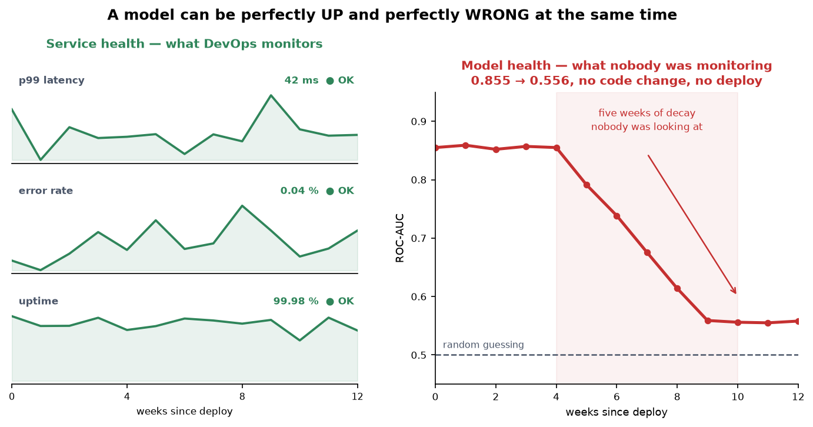

# Introduction to MLOps — The 95% That Starts Where the Notebook Ends

*Dense, no filler. Every concept an interviewer will probe.*

> **TL;DR.** A model is not a deliverable; a **system** is. MLOps is the discipline covering everything a `.fit()` call doesn't: versioning data as well as code, making results reproducible, automating what runs twice, retraining on a policy, monitoring the *predictions* rather than only the server, and naming an owner. It differs from DevOps on exactly three axes — **you version more than code**, **"correct" is statistical so testing becomes gates**, and **deployed models decay on their own** — which is why CI/CD becomes CI/CD/**CT**/**CM**. The one sentence to carry: 🎯 *every health signal can be green while the model is quietly worthless, because the only thing that broke is the thing nobody was measuring.*

**Where it fits:** Session 1 of the Scaler **MLOps** track — the conceptual map before any tool. Everything later in the course (Git, Optuna, MLflow, Docker, ECS, GitHub Actions, SageMaker) is a *tool that solves one problem named here*. Learn the problems first or you end up with a toolbox and no judgment.
**Prereqs:** you can train and evaluate a model — [Classification Metrics](../Supervised%20ML/Classification%20Metrics.md) (precision/recall/ROC-AUC appear throughout) and [Ensemble Methods that Trade Off Bias vs Variance](../Supervised%20ML/Ensemble%20Methods%20that%20Trade%20Off%20Bias%20vs%20Variance.md) (the random forest in §6). Companion note from the parallel Production-ML track, same territory from a different angle: [The Model Is Only 5%](The%20Model%20Is%20Only%205%25.md).

> 🧠 **Start here, not at the top.** Jump straight to the [Self-Test](#-self-test), answer cold, then read **only** the sections you missed — a 5-minute pass instead of 30. *([why](../../_STUDY%20LOOP.md))*

---

> ### ⚡ Fast Pass — 5 minutes
>
> **Model.** Code is a **bridge** — built right in January, still standing in December. A model is a **map** — printed right in January, and by December the city has three new roads. Nothing in the artifact changed; that is precisely the problem. So an ML system is never "done," and the discipline that keeps it honest is MLOps.
>
> **Core.** Three axes separate MLOps from DevOps: ① you version **code + data + model + features + config + environment**, not just code; ② "correct" is statistical, so unit tests become **quality gates** (`roc_auc ≥ 0.93`), data validation, and behavioural tests; ③ models **decay**, so CI/CD gains **CT** (continuous training) and **CM** (continuous monitoring). The six principles: **version everything · reproducibility · automate what runs twice · continuous training · monitor the model not just the server · governance**. Maturity is **Level 0** (manual) → **Level 1** (automated training pipeline) → **Level 2** (CI/CD for the pipeline itself).
>
> **Traps.** ① Optimising the model when the bottleneck is the system. ② Treating **input drift as an incident** — it is an alert; **concept drift** is what actually destroys performance, and it needs labels you get late or never. ③ Green service dashboards proving nothing about prediction quality.
>
> 🎯 **Kill-shot.** *"Deployed code doesn't get worse on its own; a deployed model does, because the world it learned from moves away from the world it now sees — which is why an ML system needs continuous training and a second monitoring layer that DevOps never had to build."*

---

## Table of Contents

- [1. Intuition — Why ML Projects Die After the Notebook](#1-intuition--why-ml-projects-die-after-the-notebook)
- [2. What MLOps Is, and What It Is Not](#2-what-mlops-is-and-what-it-is-not)
- [3. DevOps vs MLOps — Three Axes of Difference](#3-devops-vs-mlops--three-axes-of-difference)
- [4. The ML Lifecycle — Eight Stages and What Breaks at Each](#4-the-ml-lifecycle--eight-stages-and-what-breaks-at-each)
- [5. Choosing the Number — Offline Metrics vs Online Metrics](#5-choosing-the-number--offline-metrics-vs-online-metrics)
- [6. Worked Example — Two Drift Labs](#6-worked-example--two-drift-labs)
- [7. Code — From "Trust Me" to "Verify Me"](#7-code--from-trust-me-to-verify-me)
- [8. Drift in Depth — Kinds, Shapes, and Detection Without Labels](#8-drift-in-depth--kinds-shapes-and-detection-without-labels)
- [9. When It Breaks — Technical Debt and the Ten Pitfalls](#9-when-it-breaks--technical-debt-and-the-ten-pitfalls)
- [10. Production and MLOps Notes — Maturity, Monitoring, Retraining, Rollout](#10-production-and-mlops-notes--maturity-monitoring-retraining-rollout)
- [11. Roles, Tools, and the Course Map](#11-roles-tools-and-the-course-map)
- [12. Does Any of This Apply to Foundation Models?](#12-does-any-of-this-apply-to-foundation-models)
- [13. Interview Lens](#13-interview-lens)
- [14. Alternatives and How to Choose](#14-alternatives-and-how-to-choose)
- [Glossary](#glossary)
- [🧠 Self-Test](#-self-test)

---

## 1. Intuition — Why ML Projects Die After the Notebook

A bank builds a fraud model. Six weeks in a Jupyter notebook, **0.96 ROC-AUC** on the held-out test set, leadership thrilled, approved for production. Then reality arrives — and read the right-hand column carefully, because **not one of these is a modelling problem**.

| What happened | Why it happened |
|---|---|
| Engineering asks for the model. They receive `fraud_final_v3_USE_THIS.ipynb` and a `.pkl`. | No packaging standard. The model is not a deployable artifact. |
| The engineer runs the notebook. It crashes — `pandas` version mismatch. | No dependency pinning, no reproducible environment. |
| Fixed. It runs — but scores **0.91**, not 0.96. | No seed, no fixed split. The reported number was never reproducible. |
| The notebook reads `/Users/priya/Downloads/txns_cleaned_v2.csv`. Nobody knows how that file was made. | No data versioning, no lineage. |
| It ships after three months. Two features are computed differently in production than in training. | **Training/serving skew** — the classic ML production bug. |
| Month four: fraud catch rate drops from **89% to 61%**. Nobody notices for five weeks. | No monitoring, no drift detection, no alerting. |
| "Roll back to the previous model." Nobody knows which version is live, or where the previous one is. | No model registry, no versioned deployments. |

> **The core insight of the whole course:** a machine learning model is not a deliverable. A machine learning **system** is the deliverable. The model is one component inside it — and usually the smallest one.

**The two analogies that do the work.** Traditional software is **Lego**: swap one brick, the rest of the structure holds, and you can reason about the blast radius of a change. A model is a **knitted sweater**: pull one thread and the shape of the whole garment changes, because changing one input feature changes the learned weights of *every* other feature. And for decay: code is a **bridge** (built correctly in January, still standing in December), a model is a **map** (printed correctly in January, accurate — of a city that has since built three new roads). 🎯 *ML systems need **stronger** engineering discipline than ordinary software, not weaker.*

### 1.1 Hidden Technical Debt — the paper the field is built on

Sculley et al., *Hidden Technical Debt in Machine Learning Systems* (NeurIPS 2015). One line: **only a small fraction of the code in a real ML system is the ML code**; the rest is data collection, feature extraction, verification, configuration, serving, monitoring, and process management. The phrase to memorise is **CACE — "Changing Anything Changes Everything."**

The debt types, worth knowing by name because you will meet all of them:

- **Entanglement** — features are not independent; touching one perturbs the whole model (this *is* CACE).
- **Correction cascades** — a model built to patch another model's errors, then a third to patch the second. Now nothing can be retrained independently.
- **Undeclared consumers** — teams silently consuming your model's output. You can't change or retire it without breaking them, and you don't know they exist.
- **Data dependency debt** — you depend on an upstream table nobody owns, which anyone can change without telling you.
- **Configuration debt** — dozens of hyperparameters, thresholds, and paths scattered across scripts, with no single source of truth.
- **Pipeline jungles** — data prep grown as an organic pile of scripts nobody can rerun end to end.
- **Dead experimental code paths** — `if use_new_features_v2:` branches never removed, still silently affecting behaviour.

---

## 2. What MLOps Is, and What It Is Not

**MLOps** is the set of practices, principles, and tooling for reliably building, deploying, and maintaining ML systems in production. The engineer's working definition:

> MLOps is what turns a model into a **service** — something with a version, an owner, a deployment process, a monitoring dashboard, a rollback plan, and a defined path for improvement.

```
        ┌───────────────────────┐
        │   Machine Learning    │   models, features, evaluation,
        │                       │   experimentation, retraining
        └───────────┬───────────┘
                    │
   ┌────────────────┼────────────────┐
   │                │                │
┌──┴───────────┐    │      ┌─────────┴────────┐
│   DevOps /   │    │      │       Data       │
│  Software    │────┴──────│    Engineering   │
│ Engineering  │           │                  │
└──────────────┘           └──────────────────┘
 CI/CD, containers,         pipelines, storage,
 IaC, testing,              quality checks,
 monitoring, versioning     lineage, schemas
                  = MLOps
```

Each parent contributes something non-negotiable: **software engineering** gives version control, review, testing, packaging, releases, rollbacks; **DevOps** gives automation, CI/CD, containerisation, IaC, observability, on-call; **data engineering** gives reliable pipelines, schema contracts, quality gates, lineage. MLOps adds what none of them ever had to handle: **the model as a versioned, decaying, data-dependent artifact.**

**What it is not** — clearing these up early saves a lot of confusion:

- **Not a tool.** Not "MLflow" or "SageMaker." Those are implementations. You can do good MLOps with a shell script and disciplined Git; you can do terrible MLOps on a million-dollar platform.
- **Not just deployment.** Deployment is one stage of eight. Monitoring, retraining, governance, and rollback are equally part of it.
- **Not only for large companies.** A two-person team with one model benefits *immediately* from pinned dependencies, a seed, and a run log. Scale changes which practices pay off, not whether they matter.
- **Not a separate team's problem.** In most organisations the data scientist who trained the model is expected to understand how it ships and how it is watched.
- **Not about perfection.** It is about **maturity levels** — knowing where you are and what the next improvement is (§10).

### 2.1 The six principles

Tools change every eighteen months; these do not. Each is stated with the failure it prevents and the minimum practice you can adopt today.

| # | Principle | Failure it prevents | Minimum viable practice |
|---|---|---|---|
| **1** | **Version everything, not just code** — every input that can change the output is versioned: code, data, features, model, hyperparameters, environment, config | *"Production performs differently from what I evaluated and I cannot determine why"* — unanswerable without versioning | Git for code · a content **hash** recorded for every training dataset · pinned `requirements.txt` · hyperparameters in a config file · a metadata JSON beside every model artifact |
| **2** | **Reproducibility is a hard requirement** — anyone, on another machine, reproduces a reported result from *recorded information alone* | Unreproducible results are **unverifiable** results: you cannot debug a regression, satisfy an auditor, or hand the project over | Set and **record** every seed · fix the split deterministically · pin library versions · record the code commit next to the metrics |
| **3** | **Automate everything that will be done twice** | The 3 a.m. deploy where step 6 of an 11-step runbook is done from memory, wrongly. Also the quiet one: a process so tedious people avoid it, so retraining stops happening | One command trains end to end · one command builds the deployable artifact · no notebook cells that must run in an undocumented order |
| **4** | **Continuous training, because models decay** — retraining is designed and scheduled, not an emergency response | Slow silent degradation — 89% → 61% over five weeks | Write the trigger and cadence down *before* you deploy. *"Monthly, compared against the incumbent on a fixed holdout"* is a policy; *"when someone notices"* is not |
| **5** | **Monitor the model, not just the server** | Green dashboards and a broken product — the most dangerous state in ML operations, because nobody is looking | **Log every prediction with its inputs, model version, and timestamp.** The cheapest high-value thing you can add to any ML service — you cannot investigate what you did not record |
| **6** | **Governance, collaboration, reviewability** | The bus factor of one · the unauditable model · the credential in a public repo · the model nobody can explain to a regulator | A **named owner** per model · a **model card** (intended use, data, metrics, limitations, failure modes) · code review on pipeline config too · secrets in a secret store |

> **How to use these six.** When you meet a new tool, ask: *which principle does this serve, and what did people do before it existed?* That question converts tool-learning into engineering judgment — and it is an excellent interview answer.

**One caveat on Principle 2 that most notes omit.** Seeds are necessary but not always sufficient. GPU kernels, multi-threaded reductions, and non-deterministic library defaults can make two runs differ slightly with every seed fixed. Aim for **reproducible within a stated tolerance** by default, and treat **bit-exact** reproducibility as a stronger guarantee you engineer deliberately (deterministic kernels, single-threaded reductions, fixed BLAS) only when an auditor or regulator demands it. `(certain)`

---

## 3. DevOps vs MLOps — Three Axes of Difference

"If DevOps solved software delivery, why a new discipline?" Fair question. DevOps solves most of it. ML systems differ in exactly three structural ways, and each forces new practice.

### Axis 1 — The number of things you must version

| | DevOps | MLOps |
|---|---|---|
| Versioned artifacts | Code | Code **+ data + model + features + config + environment** |
| "What produced this output?" | The commit SHA | The commit SHA **and** the dataset snapshot **and** the hyperparameters **and** the library versions |

In DevOps, `git log` is the full story. In MLOps it gives you the screenplay but not which actors turned up that day. 🎯 *Two engineers can run byte-identical code and get different models, because the data changed.* That single fact is the entire reason data versioning and experiment tracking exist.

### Axis 2 — What "correct" means, and how you test it

Traditional software is **deterministic and specified**: `add(2, 2)` must return `4`. Binary pass/fail. An ML model is **statistical and unspecified**: there is no single correct output for a given input, only a distribution of acceptable behaviour. So testing changes shape:

- You cannot assert `predict(x) == y`. You assert `roc_auc >= 0.93 on the holdout`.
- You add tests DevOps has no concept of: **data validation** (is the schema and distribution what we expect?), **model quality gates** (does the candidate beat the incumbent?), **behavioural tests** (does the prediction move the right way when a key feature increases?), **fairness checks** (is performance uniform across segments?).
- Passing tests never proves correctness. It proves the model has not **obviously regressed**.

### Axis 3 — Decay

The most important difference, and the one that surprises people from software. **Deployed code does not get worse on its own. A deployed model does.** Four mechanisms drive it:

- **Data drift** (*covariate shift*) — the input distribution `P(X)` shifts. Younger customers, recalibrated sensors, a new region onboarded.
- **Concept drift** — the input→output relationship `P(y|X)` itself shifts. What counted as fraud in 2023 is not what fraudsters do now.
- **Upstream changes** — a data engineer changes a column from dollars to cents. Your model becomes nonsense while every health check stays green.
- **Feedback loops** — the model's own decisions shape the data it will be retrained on. A recommender that only shows popular items generates data proving popular items are popular.

The operational consequence: **an ML system is never "done."**

### 3.1 The four C's

| | Meaning | Trigger |
|---|---|---|
| **CI** — Continuous Integration | Test and build on every change; for ML this also means validating **data** and **models** | Code push |
| **CD** — Continuous Delivery/Deployment | Ship the validated artifact automatically | CI passes |
| **CT** — Continuous Training | Retrain on fresh data automatically | Schedule, drift alert, or new-data volume |
| **CM** — Continuous Monitoring | Watch data quality, prediction distributions, business metrics | Always on |

**CT and CM are the ML-specific additions.** If you remember one distinction from this section, make it this one. *(Vocabulary note: CI/CD/CT are standard — CT comes from Google's MLOps paper. "CM" is less universal; many teams fold monitoring into operations. The practice matters more than the acronym.)* `(certain)`

---

## 4. The ML Lifecycle — Eight Stages and What Breaks at Each

Learn this map and every tool in the course finds its place on it.


Two properties matter more than the boxes:

1. **It is a loop, not a line.** The arrow from monitoring back to data is the whole point. A project with no working return path is not an ML system; it is a one-off analysis.
2. **Every arrow is a handoff, and every handoff is where things break.** Training code computing a feature differently from serving code. A schema change between data and features. A model approved in evaluation that was never the one actually deployed.

**Stage 0 — Business framing.** Before any code: what decision does this model improve, and what metric proves it? Skipped constantly, and the leading cause of *wasted* ML work — models that are technically excellent and operationally pointless. You need: **the decision** ("flag for manual review" and "auto-decline" are completely different products with different latency, precision, and explainability needs) · **the business metric** (ROC-AUC is not one; *fraud losses prevented per month minus review cost* is) · **the cost asymmetry** (a false negative is a stolen amount, a false positive is an annoyed customer — these are not commensurate, and this asymmetry, not the default 0.5, sets your threshold) · **latency and volume** (50 ms per request vs a nightly batch of 10M rows are different architectures) · **the baseline** (if you can't beat "flag transactions above ₹500," don't ship) · **constraints** (regulatory explainability, data residency, PII, retention — plus the security surface: can the endpoint be probed adversarially, and is training data inferable from outputs?) · **cost per prediction and per retrain** (a design constraint, not an afterthought — it rules out whole architectures early and is the single most common reason a successful pilot is never scaled).

**Stage 1 — Data.** Sourcing, understanding, cleaning, splitting, and **versioning**. What goes wrong: training on a dataset nobody can reconstruct · **leakage** (a feature encoding the target, like `payment_received_date` in default prediction — spectacular offline metrics, worthless in production) · splitting *randomly* when the data is temporal, so you train on the future and evaluate on the past · silent upstream schema changes · sampling bias (your data covers only the customers the *current* system already approved). **Contribution:** dataset snapshots and hashes, schema contracts, automated validation as a gate, lineage.

**Stage 2 — Feature engineering.** Encodings, aggregations, scaling, windowed statistics. The single most common production ML bug lives here:

> **Training/serving skew.** The feature is computed one way in the training notebook (pandas, full history, batch) and another way in the serving path (a service call, last 24 hours only, streaming). The model receives inputs it never saw in training and quietly misbehaves.

**Contribution:** *shared transformation code* between training and serving — never two implementations — pipeline objects that persist the fitted transformer alongside the model, and feature stores that give both paths one definition. Know the limit of that last one: **a feature store reduces skew, it does not abolish it.** Divergence between the offline and online stores, and **point-in-time correctness** bugs (serving a training row a feature value that would not have been available at that timestamp — a subtle, silent form of leakage) are the two ways skew survives a feature store.

**Stage 3 — Experimentation and training.** The stage you already know, with one addition: **every run must be recorded.** What goes wrong: fifty experiments in a notebook with results in scrollback and a WhatsApp screenshot · the best result unreproducible two weeks later · no record of *which* data and *which* code produced the winner · `model_final_v7_actually_final.pkl`. **Contribution:** experiment tracking — automatic logging of parameters, metrics, artifacts, code version, and environment per run. (This is the subject of the MLflow class, and the tuning side is [Hyperparameter Tuning with Optuna](Hyperparameter%20Tuning%20with%20Optuna.md).)

**Stage 4 — Evaluation and validation.** Not "what is my test accuracy" but **"should this model be allowed to ship?"** A production-grade evaluation has: held-out performance on the metric that maps to the business objective — **chosen for the class balance you actually have** (ROC-AUC is nearly insensitive to imbalance, so on a genuine fraud problem at a 0.1% base rate a 0.96 ROC-AUC model can still be wrong about the overwhelming majority of what it flags; **PR-AUC**, or precision at a fixed alert budget your review team can staff, is the honest choice) · **comparison against the incumbent**, not against nothing · **segment-level performance** (94% overall can be 71% on a segment producing 40% of revenue) · fairness checks across protected attributes · robustness to missing values, out-of-range inputs, adversarial nonsense · explainability artifacts where the domain requires them. **Contribution:** these become *automated* quality gates. A model that fails the gate is not deployed — no human override, no "just this once."

One thing offline evaluation **cannot** do: predict business impact. Offline metrics and online outcomes correlate far more weakly than people expect, which is exactly why shadow and A/B exist. Gates catch regressions; only live traffic tells you whether the model helps.

**Stage 5 — Deployment.** Patterns: **batch** (score a table on a schedule — simplest, and correct far more often than people assume) · **real-time endpoint** (the default assumption, often the wrong one) · **streaming** (score events off a queue) · **edge/embedded**. Rollout strategies by name: **shadow** (serve live traffic to the new model, discard its answers, compare at zero risk) · **canary** (route 5%, watch, ramp) · **blue/green** (two full environments, flip and flip back instantly) · **A/B test** (split traffic to measure business impact, not accuracy). **Contribution:** containerisation so the environment travels with the model, automated deploys so the process is repeatable rather than remembered, a registry so you always know what is live and what to roll back to.

**Stage 6 — Monitoring.** Two layers, and you need both:

- **Service health** (DevOps): latency, throughput, error rate, CPU, memory. Tells you the *system* is alive.
- **Model health** (MLOps): input distributions, prediction distributions, feature nulls, segment performance, business KPIs, and — when labels eventually arrive — actual accuracy. Tells you the *predictions* are still worth trusting.

**Ground-truth labels are delayed.** You learn whether a loan defaulted 18 months later. A farmer cannot measure yield until harvest, so in the meantime they monitor rainfall and soil moisture. Model monitoring works the same way: layer it by how fast the signal arrives — input drift instantly, prediction drift within minutes, proxy business metrics within days, true accuracy eventually. **Design your alerting around the fast signals.**

**Stage 7 — Retrain and improve.** These are *policy* decisions, made deliberately and written down: **trigger** (fixed schedule, drift threshold, volume of new labels, or a performance floor) · **scope** (rolling window, or from scratch on everything?) · **approval** (auto-deploy on passing gates, or a human signs off? The standard pattern is **champion/challenger** — the incumbent keeps serving while the candidate is evaluated against it on the same traffic, and only a clear win promotes it) · **rollback** (what is the exact procedure, and when did you last *test* it?).

> **Untested rollback is not rollback. It is hope.**

---

## 5. Choosing the Number — Offline Metrics vs Online Metrics

Stage 0 said "ROC-AUC is not a business metric." Here is the split that makes that concrete, because it is where most metric arguments actually live:

| | **Offline metrics** | **Online metrics** |
|---|---|---|
| Measured on | a held-out dataset, before deploy | live traffic, after deploy |
| Examples | MSE, RMSE, MAE, precision, recall, F1, ROC-AUC, PR-AUC, NDCG | conversion rate, click-through rate, revenue per session, latency, throughput, escalation rate |
| Answers | "is this model better than that one?" | "is the product better than it was?" |
| Speed | instant, repeatable, free | slow, noisy, costs real traffic |
| Failure | **a model can improve offline and lose money online** | you can't run one for every candidate |

You need both, and in that order: offline metrics **select** candidates, online metrics **decide** whether the winner ships for good. Shadow and A/B (§4, stage 5) are exactly the bridge between the two columns.

### 5.1 Ranking metrics you will be asked to derive

When the "prediction" is an ordered list — search, recommendations, retrieval for a RAG system — accuracy is meaningless and position is everything. Two metrics carry most interviews. *(Applied context: [Recommendation Systems](../Recommendation%20Systems/Recommendation%20Systems.md) · [RAG](../../AI%20Engineering/RAG.md).)*

**MRR — Mean Reciprocal Rank.** For each query, find the rank of the **first** relevant result and take `1/rank`; average over queries. Only the first hit counts, which makes it the right metric when the user needs *one* answer.

```
   good system                                 bad system
 q1: first hit @ 1  → 1/1  = 1.0      q1: @10 → 1/10  = 0.100
 q2: first hit @ 2  → 1/2  = 0.5      q2: @ 5 → 1/5   = 0.200
 q3: first hit @ 1  → 1/1  = 1.0      q3: @ 8 → 1/8   = 0.125
 MRR = 2.5/3 = 0.833                  MRR = 0.425/3 = 0.142
 1/MRR ≈ 1.2  → the answer is         1/MRR ≈ 7    → the user scrolls
 about 1.2 slots down, on average        past six wrong answers first
```

🎯 *`1/MRR` is the interpretable half — it is the harmonic-mean rank of the first correct answer, so "0.142" becomes "position 7" and a product manager can act on it.*

**NDCG — Normalized Discounted Cumulative Gain.** MRR ignores everything after the first hit. NDCG grades the *whole* list with graded relevance, discounting by position:

```
DCG@k = Σ  (2^rel_i − 1) / log2(i + 1)        i = 1 … k
NDCG  = DCG(your order) / DCG(ideal order)     → always in 0…1
```

`2^rel − 1` makes a highly relevant item worth disproportionately more than a mildly relevant one; `log2(i+1)` is the positional discount — slot 1 is worth full value, slot 5 about 39% of it. Worked, with the lecture's own numbers (relevances `A=2, B=1, C=2, D=0, E=1`):

```
your ranking  A  B  C  D  E   →  3/1 + 1/1.585 + 3/2 + 0 + 1/2.585 = 5.52
ideal ranking A  C  B  E  D   →  3/1 + 3/1.585 + 1/2 + 1/2.322 + 0 = 5.82
NDCG = 5.52 / 5.82 = 0.948
```

The normalisation is what makes it comparable across queries: a query with five relevant documents and a query with one are graded on their own achievable maximum. **Trap:** NDCG needs *graded* relevance labels. If yours are binary, the `2^rel − 1` term collapses to `{0,1}` and you have a discounted hit-rate — still useful, but don't claim graded relevance you never collected. `(certain)`

---

## 6. Worked Example — Two Drift Labs

### 6.1 Lab A — drift, manufactured in 30 lines

The clearest demonstration in the lecture. Train a fraud model on Q1; score it on Q2 without touching a line of code.

- **Q1 (the training world):** fraud looks like **large** transactions at **high velocity**. `logit = −12.0 + 0.12·amount + 1.8·velocity`, amounts ~₹50, velocity ~2/hr.
- **Q2 (the deployed world):** two things moved at once. The mix shifted (smaller amounts ~38, higher velocity ~3.2) — **data drift** — *and* fraudsters adapted to many small transactions, so `logit = −2.0 − 0.09·amount + 1.2·velocity`: the sign on amount **flipped** — **concept drift**.

| | Q1 holdout (training world) | Q2 (deployed world) |
|---|---|---|
| ROC-AUC | **0.855** | **0.556** |
| Fraud base rate | 17.4% | 25.9% |
| Deployed code | unchanged | unchanged |
| Model artifact | unchanged | unchanged |
| Uptime / latency / error rate | healthy / fine / zero | healthy / fine / **zero** |
| Business outcome | fine | **materially worse** |



🎯 **Every conventional health signal was green.** The container was up, latency fine, zero exceptions. The only thing that broke was the thing nobody was measuring. A model at ~0.56 ROC-AUC is barely better than a coin flip.

**Now isolate the two causes** — this is the part worth doing by hand, because one result is counter-intuitive:

| Scenario | Construction | Result |
|---|---|---|
| **Pure concept drift** | Q1 *input* distributions, Q2 *coefficients* | **Catastrophic** — AUC falls **below 0.5**: the sign on `amount` flipped, so the model is confidently ranking *backwards*. Worse than random. |
| **Pure data drift** | Q2 *input* distributions, Q1 *coefficients* | **No degradation** — AUC actually *rises*, because the shifted inputs happen to separate the classes more cleanly. The model is still right about how the world works; it is just seeing a different slice of it. |


Take the general lesson, not the specific number:

> **Input drift is an alert, not an incident.** It tells you the model is now operating outside the conditions you validated it under — a reason to *look*, not proof that anything is broken. Teams that page someone every time a distribution moves quickly train everyone to ignore the pager.

And the asymmetry underneath, which is the design constraint for all of §8: **data drift is detectable from inputs alone, instantly, without labels. Concept drift is the one that destroys performance — and detecting it generally requires labels, which arrive late or never.** You end up monitoring the signal you *can* see as a proxy for the one you care about. Most practical monitoring design follows from that single trade-off.

### 6.2 Lab B — the live class: a bike-share model meets February

The live notebook is the same lesson on real data, and it is harder to read — which is the point. **Cadence** is a `RandomForestRegressor(n_estimators=200)` predicting hourly bike rides from weather and calendar features. Trained on **1–24 January** (548 hours), approved on a held-out **25–31 January** (140 hours), then scored on all of **February** (649 hours) with no code change.

| | held-out January | February | reading |
|---|---|---|---|
| MAE | **14.05** | **20.02** | ▲ 42% worse — the honest signal |
| RMSE | 22.86 | 32.49 | ▲ 42% worse, and large errors weigh more here |
| R² | 0.778 | **0.739** | ▼ barely moved — **flattering, and here is why** |
| MAPE | 0.411 | **0.374** | ▼ *improved* — **also flattering** |

**Why R² and MAPE lie here, and MAE does not.** `R² = 1 − MSE/Var(y)`, so it has a **denominator that changes with the test set**. Back it out: January holdout variance ≈ `522.4 / (1 − 0.778) ≈ 2356`; February variance ≈ `1055.6 / (1 − 0.739) ≈ 4042`. February's ride counts vary **1.7× more**, so a much larger squared error divides by a much larger denominator and R² lands in almost the same place. MAPE has the same problem in reverse: it is error *relative to the actual value*, and February has more rides per hour, so the same absolute miss is a smaller percentage. **MAE has no denominator.** It is in rides, it means the same thing every month, and it says the model is off by twenty bikes an hour instead of fourteen. 🎯 *Pick the metric in the units of the problem; a normalised metric can move for reasons that have nothing to do with the model.* (The tuning note opens with the same trap from the other end — R² swinging 0.18 on a model that did not change: [Hyperparameter Tuning with Optuna](Hyperparameter%20Tuning%20with%20Optuna.md).)

**So: data drift or concept drift?** The live class asked and left it open. The honest answer is **you cannot tell from those five numbers**, and knowing *that* is the skill. What you can do:

1. **Look at the inputs first** (free, no labels). February's `temp`, `humidity` and `windspeed` distributions against January's. Seasonal movement is near-certain — that is data drift, confirmed cheaply.
2. **Notice the structural trap.** In January-only training data, `month` is **always 1** and `season` is **always 1**. A feature with zero variance carries no information, so the forest never splits on it — the model has *no representation of what month it is*. Come February it is handed `month = 2`, a value it has never seen, by a model that structurally cannot use it. That is not drift so much as a **training-window bug**, and it is the kind of thing only someone who looked at the columns would catch. 🎯
3. **Run the decisive test** (needs labels, and February's are available): **retrain on February, score on February.** If a February-trained model is dramatically better, the input→output relationship itself moved → **concept drift**. If it is no better, the old model was fine and the inputs simply moved into a harder region → **data drift**.

My read `(likely)`: mostly **data drift** plus that training-window bug — weather and ridership move seasonally, and the relationship "warm and dry ⇒ more rides" is a physical fact that does not invert between January and February. But the retrain test is what turns "likely" into "measured," and *running it* is the difference between an engineer and someone with an opinion.

---

## 7. Code — From "Trust Me" to "Verify Me"

The naive version — load, split, fit, print — is what most projects stop at. It is honest about the model and silent about everything else:

```python
# Stages 1-4 in one cell, "naive but honest"
bunch = load_breast_cancer(as_frame=True); df = bunch.frame
X, y = df.drop(columns=["target"]), df["target"]
X_tr, X_te, y_tr, y_te = train_test_split(X, y, test_size=0.2, stratify=y, random_state=42)
clf = RandomForestClassifier(n_estimators=200, max_depth=6, random_state=42).fit(X_tr, y_tr)
print(roc_auc_score(y_te, clf.predict_proba(X_te)[:, 1]))     # 0.9940
# Stages 5, 6, 7 — deployment, monitoring, retraining — do not exist in this cell.
```

Roughly twenty extra lines move that from *trust me* to *verify me*. Nothing here needs a tool you don't already have — and when you meet MLflow later, notice it is doing exactly this, automatically and queryably:

```python
import json, hashlib, platform
import numpy as np, pandas as pd, sklearn

# 1 — Every knob in ONE place, so the run is described by data, not code archaeology. (P1)
CONFIG = {"seed": 42, "test_size": 0.2, "n_estimators": 200, "max_depth": 6, "threshold": 0.5}

# 2 — Fingerprint the exact training data. Two runs with the same hash saw the same rows. (P1)
df = load_breast_cancer(as_frame=True).frame
data_hash = hashlib.sha256(
    pd.util.hash_pandas_object(df, index=True).values.tobytes()
).hexdigest()[:16]

# 3 — One seed, threaded through EVERY source of randomness — split and model alike. (P2)
X, y = df.drop(columns=["target"]), df["target"]
X_tr, X_te, y_tr, y_te = train_test_split(
    X, y, test_size=CONFIG["test_size"], stratify=y, random_state=CONFIG["seed"])
clf = RandomForestClassifier(n_estimators=CONFIG["n_estimators"],
                             max_depth=CONFIG["max_depth"],
                             random_state=CONFIG["seed"]).fit(X_tr, y_tr)
auc = roc_auc_score(y_te, clf.predict_proba(X_te)[:, 1])

# 4 — Everything needed to explain, audit, or REBUILD this exact result, written beside
#     the model file as model.pkl + model.meta.json, so provenance travels with it. (P1, P6)
metadata = {
    "model_type": type(clf).__name__,
    "config": CONFIG,
    "data_hash": data_hash,                    # which rows?        -> this
    "data_shape": list(df.shape),
    "metrics": {"roc_auc": round(float(auc), 4)},
    "environment": {                           # reproducible where? -> this
        "python": platform.python_version(), "numpy": np.__version__,
        "pandas": pd.__version__, "scikit_learn": sklearn.__version__},
}
```

What you can now answer that you could not before: *which exact rows trained this model?* → `data_hash`. *Can a colleague reproduce 0.9940 on a laptop?* → `config` + `environment`. *Which model is this, six months from now?* → the file travels with its metadata. **This is Level 0 done honestly, and it is the floor for everything after.**

Three additions that belong in the same file the moment the model is real, and which the lecture's version leaves implicit:

- **The git commit SHA** (`subprocess.run(["git","rev-parse","HEAD"])`) — the environment tells you *which libraries*, the SHA tells you *which code*. Without it the metadata describes an unidentifiable script. Record whether the tree was dirty, too.
- **The decision threshold**, already in `CONFIG` above — and it should come from the cost asymmetry in Stage 0, not from `0.5`. A model artifact without its threshold is half a decision system.
- **The label definition and the data window** (`"labels": "chargeback within 60d", "window": "2026-01-01..2026-03-31"`). Six months later, "fraud" will have quietly been redefined by someone in risk, and nothing else in this file would show it.

---

## 8. Drift in Depth — Kinds, Shapes, and Detection Without Labels

### 8.1 The four kinds, stated formally

Write the joint as `P(X, y) = P(X) · P(y|X)` and the taxonomy falls out of which factor moved:

| Kind | What moves | Needs labels? | Example |
|---|---|---|---|
| **Data / covariate drift** | `P(X)` | **No** | Your users are suddenly younger; a sensor was recalibrated |
| **Concept drift** | `P(y\|X)` | **Yes** | Fraud tactics change, so the same transaction means something different |
| **Label / prior drift** | `P(y)` | Yes (or a proxy) | Fraud base rate 17% → 26%. Breaks calibrated probabilities and any fixed threshold even if `P(y\|X)` is intact |
| **Upstream / schema break** | neither — the *pipeline* moved | No | Dollars became cents; a column was renamed. Not statistics, a **bug** — and the most common real incident |

That third row is the one most write-ups skip and the lecture's own lab contains (17.4% → 25.9%). **Prior drift silently miscalibrates you**: a model whose probabilities were well-calibrated at a 17% base rate will systematically under-predict at 26%, so a fixed 0.5 threshold now catches a different fraction of fraud than the one you signed off on — before any coefficient has changed. `(certain)`

### 8.2 The four shapes — drift has a time signature

*Which* kind drifted tells you what to fix; *how* it drifted tells you how to detect it and whether retraining will even help.


*Source: Scaler lecture deck.*

- **Sudden** — a new concept arrives within a short time. Easiest to detect (any window comparison catches it), and usually has a *cause* you can name: a pandemic, a pricing change, a competitor launch, a new region.
- **Gradual** — the new concept interleaves with the old before replacing it. Fixed-threshold alarms tend to fire late, because each individual window looks nearly fine.
- **Incremental** — the old concept slides continuously into the new. **The dangerous one**: no single day is anomalous, so month-over-month comparison sees nothing and you only notice the accumulated distance. Compare against a *fixed* reference window (the training distribution), not against last week — comparing to last week is exactly how incremental drift stays invisible. 🎯
- **Recurring** — an old concept returns (seasonality, weekday/weekend, festival periods). **Do not retrain on this.** The fix is a feature that encodes the cycle, or a seasonal model — retraining every time summer arrives is chasing a pattern you should have modelled. *(Which is precisely Lab B's trap: a model trained on 24 days of January has no way to represent the season at all — see [Seasonal ARIMA with Exogenous Regressors](../Time%20Series/Seasonal%20ARIMA%20with%20Exogenous%20Regressors.md) for handling seasonality properly.)*

### 8.3 Detecting it without labels

The lecture's two headings are the right two, in the right order:

**1. Visual inspection / summary statistics.** Track per-feature mean, std, min/max, null rate, and cardinality per time window, against the **training** reference. Crude, cheap, and catches the majority of *real* incidents — because most real incidents are the schema break in §8.1's last row, not a subtle distribution shift. Start here.

**2. Statistical tests.** Compare the reference window against the current window:

| Test | For | Note |
|---|---|---|
| **PSI** (Population Stability Index) | numeric or binned | `PSI = Σ (p_cur − p_ref) · ln(p_cur / p_ref)` over bins. Industry rules of thumb: `< 0.1` stable · `0.1–0.25` investigate · `> 0.25` significant shift. Not a hypothesis test — an **effect size**, which is why it doesn't explode with sample size |
| **KS** (Kolmogorov–Smirnov) | continuous, 1-D | Max gap between the two empirical CDFs. Sensitive and well understood |
| **Chi-square** | categorical | Compares category frequencies |
| **Wasserstein / earth-mover** | continuous | Distance in the units of the feature — often more interpretable than KS |
| **Domain classifier** | *multivariate* | Train a model to tell "reference" rows from "current" rows. If it can (AUC ≫ 0.5), the joint distribution moved — catches **correlation drift** that every per-feature test misses |

**Three traps that decide whether your drift monitoring is useful or noise:**

- **p-values die at scale.** At a million rows per window, a KS test rejects on a difference far too small to matter. Alert on **effect size** (PSI, Wasserstein) and use tests to rank, not to page. 🎯 *"Statistically significant" and "operationally significant" diverge completely at production data volumes.*
- **Multiple testing.** 200 features × a daily test = something crosses p < 0.05 every single day by chance. Correct for it, or monitor a *small* set of features that actually drive the model (use feature importance to pick them).
- **Alert on what a named human would act on.** An alert that fires daily is not an alert; it is noise, and people build filters to hide it. Pair every drift alarm with the action it should trigger.

**And the layer above all of it:** when labels *do* arrive — days or months late — backfill and compute real performance on that window. Input drift is your fast proxy; delayed accuracy is the ground truth that tells you whether the proxy was worth watching.

---

## 9. When It Breaks — Technical Debt and the Ten Pitfalls

The debt taxonomy is §1.1. These are the operational mistakes, each cheap to avoid and expensive to fix later:

1. **Optimising the model when the bottleneck is the system.** Three weeks of tuning for +0.4% AUC on a model that takes six weeks to deploy and has no monitoring. The marginal model gain is usually the *least* valuable work available to you.
2. **Treating the notebook as the deliverable.** Hidden state, out-of-order execution, no testability, unreviewable diffs. Explore in a notebook; **ship a module**.
3. **Skipping reproducibility because "it's just an experiment."** Every experiment is *just an experiment* until it becomes the model everyone depends on. Seeds and a config file cost two minutes.
4. **No data validation.** Your model will happily consume garbage and return confident nonsense. A schema and range check at the pipeline entrance catches most real incidents.
5. **Deploying without a rollback plan** — and, more commonly, having one you have never executed. Rehearse it once while nothing is on fire.
6. **Broad, convenient credentials.** "Admin for now, we'll tighten it later." Later never arrives; the credential ends up in a public repo. Least privilege from day one.
7. **Overly broad, unactionable monitoring.** See §8.3.
8. **Building for scale you do not have.** Kubernetes, a feature store, and a streaming pipeline for one model scoring 400 rows a day. Complexity is a cost paid every day. **Batch scoring on a schedule is a perfectly respectable production architecture.**
9. **No named owner.** Models without owners do not get monitored, retrained, or retired. They quietly rot in production.
10. **Learning tools instead of principles.** The five-year half-life of MLOps tooling is real; the six principles have outlived several complete generations of tools.

---

## 10. Production and MLOps Notes — Maturity, Monitoring, Retraining, Rollout

### 10.1 The maturity model

You do not implement MLOps at once; you move up levels. The standard framing is Google's, with three:


Being able to place a project on this scale is a genuinely useful professional skill — and so is knowing when to stop. **Most production teams live at Level 1, and that is often the right economic choice.** Level 2 pays for itself when you have many models, frequent retraining, or regulatory pressure. Deciding *not* to climb further, for stated reasons, is a legitimate engineering decision. Not knowing which level you are on is not.

### 10.2 The twelve-question audit — run this on your own work

Each is a yes or a no. Answer honestly about a project you actually built.

1. Can someone else reproduce your headline metric from your repository alone?
2. Is the exact training dataset for your best model recoverable today?
3. Are all hyperparameters in a config file rather than scattered as literals?
4. Does one command run data prep → train → evaluate, end to end?
5. Is every experiment's parameters and metrics recorded automatically?
6. Are dependencies pinned, so the environment is rebuildable?
7. Is there an automated gate that would block a bad model from deploying?
8. Is deployment automated and repeatable, with no manual runbook?
9. Would you detect input drift within a day of it starting?
10. Is there a written — and **tested** — rollback procedure?
11. Does the model have a named owner and a model card?
12. Is retraining triggered by policy rather than by a complaint?

**Scoring:** 0–3 → Level 0 · 4–8 → partial Level 1, automating with real gaps · 9–10 → solid Level 1 · 11–12 → Level 2.

🎯 **The rule that makes this useful: fix the lowest-numbered "no" first.** Maturity is climbed in order, not cherry-picked — *automated deployment on top of an unreproducible pipeline just ships your irreproducibility faster.*

### 10.3 Practical defaults worth stealing

- **Log every prediction** with inputs, model version, timestamp, and a request ID. Retention of 30–90 days is usually enough to investigate anything. This single habit converts most "we have no idea what happened" incidents into a query.
- **Version the model in the response.** `{"score": 0.81, "model": "fraud-v7"}` costs nothing and makes per-version comparison, canary analysis, and post-incident forensics trivial.
- **The registry answers two questions:** *what is live?* and *what do I roll back to?* If a spreadsheet answers both reliably, you have a registry. If nothing does, you do not — regardless of what tooling you bought.
- **Shadow before canary before ramp.** Shadow costs you compute and nothing else; it is the cheapest real evidence you will ever get, and it catches training/serving skew that no offline test can.
- **Pin `requirements.txt` with `==`, never `>=`.** A pickle carries state, not code; the class it expects to be poured back into has to still exist with the same shape. An unpinned `scikit-learn` is how an artifact that loaded fine in March stops loading in June.
- **Calibration is a production concern, not a modelling nicety.** If a downstream rule reads the *probability* (auto-decline above 0.9), prior drift (§8.1) breaks that rule without touching accuracy. Monitor the predicted-score distribution, not only the predicted class.

---

## 11. Roles, Tools, and the Course Map

### 11.1 Who does what

| Role | Owns | Typical artifacts |
|---|---|---|
| **Data Engineer** | Reliable data availability and quality | Pipelines, warehouse tables, schema contracts |
| **Data Scientist** | Problem framing, features, model quality | Experiments, evaluation reports, trained candidates |
| **ML Engineer** | Production-grade ML code and serving | Training pipelines, model services, feature transforms |
| **MLOps / Platform Engineer** | The infrastructure everyone else builds on | CI/CD, containers, registries, monitoring, IaC |
| **Software Engineer** | The application consuming predictions | API integrations, product surfaces |
| **Product / Domain Owner** | Business metric, cost asymmetry, acceptance | Charter, success criteria, launch approval |
| **Risk / Compliance** | Fairness, explainability, auditability | Model cards, audit trails, approvals |

Two observations from industry: **in small teams one person wears three or four of these hats** — the most common situation, and exactly why understanding all of them matters even if your title is "Data Scientist." And **the Data Scientist / ML Engineer boundary is the most contested in the market**: titles are inconsistent, so read the responsibilities, not the title. Increasingly, "Data Scientist" postings expect that you can ship.

### 11.2 The tool landscape

A caution before the list: the MLOps tool market is crowded and fashion-driven. **Do not confuse tool familiarity with competence.** Anchor on the six principles and treat tools as interchangeable implementations.

| Lifecycle need | Common tools |
|---|---|
| Code versioning | Git, GitHub, GitLab |
| Data/artifact versioning | DVC, LakeFS, Delta Lake, S3 versioning |
| Experiment tracking | **MLflow**, Weights & Biases, Neptune, Comet |
| Hyperparameter tuning | **Optuna**, Ray Tune, Hyperopt |
| App / demo layer | **Streamlit**, Gradio, Dash |
| Packaging | **Docker**, Podman, Buildpacks |
| Image registry | **ECR**, Docker Hub, GCR |
| Serving / orchestration | **ECS**, Kubernetes, Lambda, Vertex AI |
| CI/CD | **GitHub Actions**, Jenkins, GitLab CI, CircleCI |
| Managed ML platform | **SageMaker**, Vertex AI, Azure ML, Databricks |
| Feature store | **SageMaker Feature Store**, Feast, Tecton |
| Model registry | **SageMaker Model Registry**, MLflow Registry |
| Monitoring | Evidently, WhyLabs, Prometheus + Grafana, CloudWatch |
| LLM / foundation-model stack | LangChain, LlamaIndex, vector DBs (pgvector, Pinecone, Chroma), LangSmith, Ragas |

**Bold** = used directly in this course. They were chosen because they are the most common commercial configuration you will meet: a Git-based workflow, open-source experiment tracking, containers, and a major cloud's managed ML platform.

### 11.3 Where the course goes from here

The syllabus is the lifecycle, walked in order, one tool per stage:

```
  1  MLOps principles + ML lifecycle        ← you are here
  2  Git · GitHub · GitLab                     (Principle 1, for code)
  3  Streamlit · Flask · Optuna                → tuning + a surface for a human
  4  ML lifecycle · sklearn Pipelines · Optuna (Principle 3, and skew killed at the source)
  5  MLflow: tracking · projects · models · registry   (Principles 1, 2, 6)
  6  Docker · Docker Hub · containerisation    (the environment travels with the model)
  7  AWS ECS · cloud deployment                (Stage 5)
  8  CI/CD pipelines · GitHub Actions          (Principle 3, all the way up → Level 2)
  9  SageMaker Studio · S3 · Data Wrangler · Ground Truth
 10  SageMaker Feature Store                   (Stage 2, skew abolished-ish)
 11  SageMaker Model Registry · model versioning
 12  SageMaker Canvas
```

Read that list against §4 and notice that **every single item is a stage of the lifecycle or a principle, wearing a vendor's name.** That mapping is the whole reason this session came first.

---

## 12. Does Any of This Apply to Foundation Models?

A fair question, since a growing share of production "ML" is an API call to a model you did not train. Short answer: **the lifecycle survives almost entirely intact — the stages change contents, not their existence.** Business framing, evaluation gates, deployment patterns, monitoring, versioning, rollback, governance, a named owner: unchanged. All six principles apply unchanged.

| Stage | Classical ML | Foundation models |
|---|---|---|
| **Data** | Training dataset | Retrieval corpus, its chunking and embedding strategy, its refresh cadence |
| **Features** | Transformations | Prompt templates and context assembly — versioned exactly like code, **because they are code** |
| **Training** | Fit a model | Prompt iteration, retrieval tuning, occasionally fine-tuning |
| **Evaluation** | Held-out metrics | Curated eval sets, LLM-as-judge, human review; non-determinism means you evaluate *distributions* of outputs, not single answers |
| **Deployment** | Your container | Often a vendor endpoint — so latency, rate limits, and token cost become first-class design constraints |
| **Monitoring** | Drift in features | Drift in user inputs, plus output quality, refusal rates, hallucination and safety incidents, and cost per request |

And one genuinely new failure mode: 🎯 **the model can change underneath you.** A vendor updates a model behind the same API name and your carefully tuned prompts silently behave differently. In classical ML the artifact is frozen and the data moves; here, **both** can move. Pin model versions explicitly where the vendor allows it, and keep a regression eval set you can re-run on demand. *(The mechanics live in [Evaluating LLMs](../../AI%20Engineering/Evaluating%20LLMs.md), [RAG](../../AI%20Engineering/RAG.md), and [Serving LLMs at Scale](../../AI%20Engineering/Serving%20LLMs%20at%20Scale.md).)*

---

## 13. Interview Lens

**What the question is really testing:** whether you have shipped something, or only trained something. Every MLOps question is a proxy for *"have you ever been on the hook for a model at 3 a.m.?"* The tell is whether your answer contains a *failure mode and its detection*, or only a tool name.

🎯 **Kill-shots, ranked by how often they land:**

- *"Deployed code doesn't get worse on its own; a deployed model does — because the world it learned from moves away from the world it now sees."*
- *"A model can be perfectly UP and perfectly WRONG at the same time. Service health tells you the system is alive; it says nothing about whether the predictions are still worth trusting."*
- *"Data drift is an alert, concept drift is the incident — and the cruel part is that the one you can detect instantly without labels is the one that might not matter, while the one that destroys performance needs labels you get late or never."*
- *"MLOps isn't a tool. Name the principle a tool serves and what people did before it existed, and you'll pick tools correctly for the rest of your career."*

**Likely follow-ups, with crisp answers:**

| Question | Answer |
|---|---|
| "How is MLOps different from DevOps?" | Three axes: you version data/model/features/config/environment as well as code; "correct" is statistical so tests become quality gates and data validation; and models decay, so CI/CD gains CT and CM. |
| "How do you detect drift when labels arrive 18 months late?" | Layer by signal speed. Input drift instantly (PSI/KS against the *training* reference, alert on effect size not p-value), prediction-distribution drift in minutes, proxy business KPIs in days, true accuracy backfilled when labels land. Monitor the fast proxy; validate it against the slow truth. |
| "What would you monitor for a fraud model?" | Both layers. Service: latency, error rate, throughput. Model: per-feature distributions and null rates vs the training reference, the predicted-score distribution (prior drift breaks calibrated thresholds), alert-volume against the review team's capacity, segment-level precision, and backfilled precision/recall as chargebacks arrive. |
| "The model does worse in production than offline. Where do you look?" | Training/serving skew first — the same feature computed two ways is the most common cause by a wide margin. Then leakage in the offline evaluation, then a temporal split done randomly, then genuine drift. In that order, because that's the order of prior probability. |
| "When would you *not* build an ML system?" | When a rule beats it (`amount > ₹500`), when you can't name the decision it improves, when you can't get labels, or when the cost per prediction exceeds the value of the decision. "What happens today without ML?" is a Stage-0 question and skipping it is the leading cause of wasted ML work. |
| "How often should you retrain?" | It's a policy, not a number: schedule, drift threshold, new-label volume, or a performance floor — whichever you can *defend*. Then champion/challenger on identical traffic, and a tested rollback. Recurring seasonal drift should be modelled as a feature, not chased with retraining. |

---

## 14. Alternatives and How to Choose

MLOps has no alternative *to itself* — the choice is always **how much of it, and where**. Four decisions carry most of the weight:

| Decision | Choose the cheap side when | Choose the expensive side when |
|---|---|---|
| **Batch vs real-time serving** | The decision can wait hours; volume is bulk. Batch is simpler, cheaper, easier to backfill and reprocess | The decision is per-request and blocking (fraud at checkout, a page render). Real-time buys latency at the cost of an always-on service, a hot feature path, and skew risk |
| **Level 1 vs Level 2 maturity** | One or two models, retrained monthly, one team | Many models, frequent retraining, regulated domain, multiple teams sharing a platform |
| **Feature store vs shared transform code** | Few models, features not reused across teams — a shared Python module the training and serving paths both import gets you most of the benefit for ~none of the cost | Features reused across many models/teams, or you need point-in-time-correct historical joins |
| **Build vs managed platform** (MLflow+Docker+ECS vs SageMaker/Vertex) | You want portability and control, and have the platform skills on the team | You want the integrated path and are willing to accept the lock-in and the bill. The *concepts* transfer completely either way — which is the point of learning principles over tools |

And the meta-rule: **start at the simplest thing that satisfies the principles, not the most impressive thing that satisfies your résumé.** A batch job with pinned dependencies, a seed, a data hash, a metadata JSON, and a daily distribution check beats a Kubernetes cluster with none of those.

---

## Glossary

| Term | Meaning |
|---|---|
| **Artifact** | Any versioned output of a stage that a later stage consumes — a dataset snapshot, a trained model file, a container image, an evaluation report |
| **Model registry** | Catalogue of trained models with versions, stage labels (staging/production/archived), lineage, approval status. The answer to *"what is live, and what do I roll back to?"* |
| **Quality gate** | An automated pass/fail check in a pipeline. The point is that it is **automated** — no case-by-case human override |
| **Lineage** | The recorded chain from raw source to deployed model: which data, which commit, which parameters, which run |
| **Training/serving skew** | Any difference between how a feature is computed during training and during serving. The most common production ML bug |
| **Data drift / covariate shift** | `P(X)` moves away from the training distribution. Detectable without labels |
| **Concept drift** | `P(y\|X)` itself changes. Usually requires labels to detect. The one that actually destroys performance |
| **Prior / label drift** | `P(y)` moves — the base rate changes. Breaks calibration and fixed thresholds |
| **Incumbent (champion)** | The model currently in production, and the baseline any candidate must beat |
| **Challenger** | A candidate model being evaluated against the incumbent before promotion |
| **Shadow deployment** | Serving live traffic to a new model while **discarding** its predictions, purely to compare at zero risk |
| **Canary** | Routing a small slice of real traffic (say 5%) to a new model, watching, then ramping or rolling back |
| **Blue/green** | Two complete environments; traffic flips from one to the other and can flip back instantly |
| **Feature store** | A system storing feature definitions and values so one definition serves both training and inference |
| **Model card** | A short document shipping with a model: intended use, training data, metrics, limitations, known failure modes, owner |
| **CACE** | *Changing Anything Changes Everything* — Sculley et al.'s name for feature entanglement |
| **CT / CM** | Continuous Training and Continuous Monitoring — the ML-specific extensions to CI/CD |
| **PSI** | Population Stability Index — a binned effect-size measure of distribution shift; `<0.1` stable, `>0.25` significant |

**Further reading:** Sculley et al. (2015) *Hidden Technical Debt in ML Systems* · Breck et al. (2017) *The ML Test Score* (a 28-point production-readiness rubric you can audit any system against) · Mitchell et al. (2019) *Model Cards for Model Reporting* · Google Cloud, *MLOps: Continuous delivery and automation pipelines in ML* (the 0/1/2 maturity model) · Chip Huyen, *Designing Machine Learning Systems* · Evidently AI's blog (the clearest practical writing on drift).

---

## 🧠 Self-Test

1. **Name the three axes on which MLOps differs from DevOps, and say what each one forces you to build.**
   <details><summary>answer</summary>① <b>What you version</b> — code <i>plus</i> data, model, features, config, environment. Forces data versioning, experiment tracking, lineage. Two engineers running byte-identical code can get different models because the data changed. ② <b>What "correct" means</b> — statistical, not specified, so you cannot assert <code>predict(x)==y</code>. Forces quality gates (<code>roc_auc ≥ 0.93</code>), data validation, behavioural and fairness tests. Passing never proves correctness, only non-regression. ③ <b>Decay</b> — deployed models get worse on their own via data drift, concept drift, upstream changes, and feedback loops. Forces <b>CT</b> (continuous training) and <b>CM</b> (continuous monitoring) on top of CI/CD.</details>

2. **A drift alarm fires: the input distribution for `transaction_amount` has shifted significantly. Is this an incident? What do you do?**
   <details><summary>answer</summary><b>It is an alert, not an incident.</b> Data drift means the model is operating outside the conditions you validated it under — a reason to look, not proof anything is broken. The lecture's own lab showed pure data drift <i>improving</i> AUC, because the shifted inputs happened to separate the classes more cleanly. What to do: check the predicted-score distribution (has the model's behaviour changed, or just its inputs?), check for an upstream schema break first — dollars→cents is far more likely than a genuine population shift — check segment performance, and backfill true accuracy when labels arrive. <b>Concept drift</b> is what destroys performance, and you generally cannot see it without labels; you monitor the visible proxy and validate it against the delayed truth. Teams that page on every distribution move train everyone to ignore the pager.</details>

3. **Your model's February R² is 0.739 against a January holdout of 0.778, but MAE went from 14.05 to 20.02. Which number do you report to the business, and why do the two disagree?**
   <details><summary>answer</summary><b>MAE — and the model is 42% worse.</b> <code>R² = 1 − MSE/Var(y)</code> has a <b>denominator that changes with the test set</b>. February's ride counts vary ~1.7× more than the January holdout's (variance ≈4042 vs ≈2356), so a much larger squared error divides by a much larger denominator and R² barely moves. MAPE is flattering for the mirror-image reason — it is error <i>relative to the actual value</i>, and February has more rides per hour, so the same absolute miss is a smaller percentage. MAE has no denominator: it is in the units of the problem, it means the same thing every month, and the business can act on "we're off by twenty bikes an hour."</details>

4. **What is training/serving skew, why is it the most common production ML bug, and what reduces it?**
   <details><summary>answer</summary>Any difference between how a feature is computed at training time and at serving time — pandas over full history in a notebook vs a service call with only the last 24 hours available. The model receives inputs it never saw in training and quietly misbehaves, with every health check green. It is the most common bug because the two code paths are written by different people at different times for different runtimes, and <i>nothing tests that they agree</i>. Fixes, in order of strength: <b>shared transformation code</b> both paths import (never two implementations) · pipeline objects that persist the fitted transformer alongside the model · a <b>feature store</b> giving both paths one definition. Know the feature store's limit: it <i>reduces</i> skew, it does not abolish it — offline/online store divergence and point-in-time correctness bugs survive it. <b>Shadow deployment</b> is the cheapest way to actually catch skew, because it runs both paths on the same live traffic.</details>

5. **Place a project at a maturity level and name the next move. What is the rule for choosing which gap to close?**
   <details><summary>answer</summary><b>Level 0</b> = manual: notebooks run by hand, handoff is a file and a chat, deploy is rare and manual, no model-quality monitoring, retrain when someone complains. <b>Level 1</b> = automated training pipeline: one trigger runs the whole flow, experiments tracked and data versioned, automated data and model gates, CT possible, model deploy automated. <b>Level 2</b> = the pipeline <i>itself</i> is under CI/CD: dev→staging→prod, registry promotion with approval gates, monitoring feeding retraining, one-command <i>tested</i> rollback. The rule: <b>fix the lowest-numbered gap first</b> on the twelve-question audit — maturity is climbed in order, not cherry-picked, because automated deployment on top of an unreproducible pipeline just ships your irreproducibility faster. And most teams should <i>stop</i> at Level 1; deciding not to climb, for stated reasons, is engineering. Not knowing your level is not.</details>

6. **The six MLOps principles — name them, and give the minimum viable practice for each.**
   <details><summary>answer</summary>① <b>Version everything</b> → Git + a data content hash + pinned requirements + config file + metadata JSON beside the artifact. ② <b>Reproducibility is a hard requirement</b> → record every seed, fix the split deterministically, pin versions, record the commit SHA next to the metrics. ③ <b>Automate what runs twice</b> → one command trains end to end, one command builds the artifact, no undocumented cell order. ④ <b>Continuous training</b> → write the trigger and cadence down <i>before</i> deploying; "monthly, compared against the incumbent" is a policy, "when someone notices" is not. ⑤ <b>Monitor the model, not just the server</b> → log every prediction with inputs, model version, and timestamp; you cannot investigate what you did not record. ⑥ <b>Governance</b> → a named owner, a model card, code review on pipeline config, secrets in a secret store.</details>

7. **Explain MRR and NDCG, and say when you'd reach for each.**
   <details><summary>answer</summary><b>MRR</b> = mean of <code>1/rank-of-first-relevant-result</code> across queries. Only the first hit counts — right when the user needs <i>one</i> answer (a lookup, a "did it find the doc" retrieval check). The interpretable half is <code>1/MRR</code>: 0.142 → "the first correct answer sits around position 7." <b>NDCG</b> = <code>DCG(your order) / DCG(ideal order)</code> where <code>DCG@k = Σ (2^rel_i − 1)/log2(i+1)</code>. It grades the <i>whole</i> list with graded relevance, exponentially rewarding highly relevant items and discounting by position, and the normalisation makes queries with different numbers of relevant documents comparable. Reach for NDCG when the user scans several results (search results, recommendation carousels) and relevance comes in degrees. Trap: NDCG needs <i>graded</i> labels — with binary relevance <code>2^rel − 1</code> collapses to {0,1} and you have a discounted hit-rate.</details>

8. **A stakeholder says: "the API is up, latency is 40 ms, error rate is zero — the model is fine." What is wrong with that sentence?**
   <details><summary>answer</summary>Every signal quoted belongs to the <b>service health</b> layer, which tells you the system is <i>alive</i> and nothing about whether the predictions are worth trusting. 🎯 A model can be perfectly UP and perfectly WRONG at the same time — the lecture's fraud model went 0.855 → 0.556 ROC-AUC with the container up, latency fine, zero exceptions and no deploy. The missing layer is <b>model health</b>: input distributions and null rates against the training reference, the predicted-score distribution, segment performance, business KPIs, and backfilled accuracy as labels arrive. The reason this is the most dangerous state in ML operations is that nobody is looking for the problem — you find out when a business stakeholder notices revenue moved.</details>

---

*Covers: why ML projects die after the notebook · Sculley's technical-debt taxonomy and CACE · what MLOps is and is not · the six principles · the three DevOps-vs-MLOps axes and the four C's · the eight-stage lifecycle and what breaks at each handoff · offline vs online metrics with MRR and NDCG worked through · two drift labs (manufactured fraud drift, and the live bike-share model meeting February) · the provenance upgrade from "trust me" to "verify me" · drift kinds, shapes, and label-free detection with PSI/KS/domain classifiers · the ten pitfalls · maturity levels and the twelve-question audit · roles, tools, and the course map · the foundation-model mapping. Sourced from Scaler MLOps Session 1 (2026-09-09), its live drift notebook, and the lecture whiteboard. Companion: [The Model Is Only 5%](The%20Model%20Is%20Only%205%25.md).*
