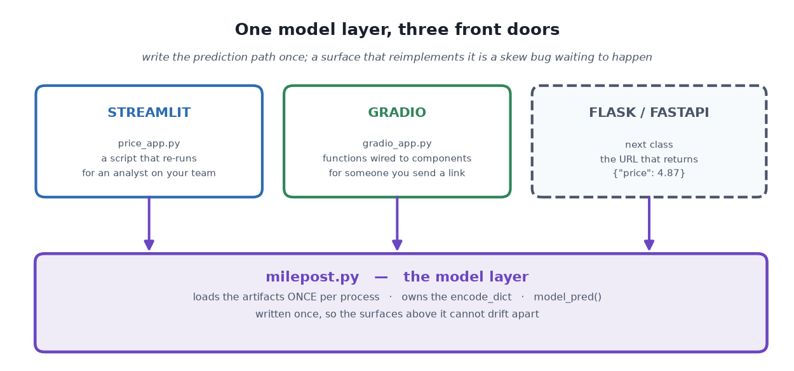

# Streamlit and Gradio — Putting a Model in Front of a Human

*Dense, no filler. Every concept an interviewer will probe.*

> **TL;DR.** A tuned model on disk is still unusable by anyone who cannot open a Python REPL. **Streamlit**'s bargain: write a Python script, get a web page — in exchange you accept one unusual rule, that **the whole script re-executes on every interaction**. **Gradio**'s bargain is shorter: hand it a function, it builds the UI from the signature — and `share=True` gives you a public URL with no deployment at all. Neither is an API: there is no URL that returns `{"price": 4.87}`, no contract, and per-user Python sessions. 🎯 *The deciding question is lifespan — something a colleague uses every Tuesday for a year is Streamlit; something three people look at before Friday is Gradio; something another **program** calls is neither.*

**Where it fits:** Session 2 of the Scaler **MLOps** track (second half) — Stage 5 of the lifecycle in [Introduction to MLOps](Introduction%20to%20MLOps.md), at its cheapest possible scale. The artifact these apps serve is the one produced in [Hyperparameter Tuning with Optuna](Hyperparameter%20Tuning%20with%20Optuna.md); this note is what happens to it next.
**Prereqs:** Python modules and imports, and knowing what a `joblib`-pickled model is. No web development needed — that is the entire point of both libraries.

> 🧠 **Start here, not at the top.** Jump straight to the [Self-Test](#-self-test), answer cold, then read **only** the sections you missed — a 5-minute pass instead of 30. *([why](../../_STUDY%20LOOP.md))*

---

> ### ⚡ Fast Pass — 5 minutes
>
> **Model.** Streamlit has **no event handler**. Move a slider and the script re-runs top to bottom, with the widget now returning its new value. Gradio has the opposite model: **functions wired to components** via `.click(fn=..., inputs=[...], outputs=[...])`.
>
> **Core.** Streamlit: `st.slider / selectbox / number_input / button / columns / session_state`; `@st.cache_data` for **data** (returns a copy), `@st.cache_resource` for **models and connections** (returns the *same* object). `st.button` is `True` **only on the re-run its click caused** — park anything you want to survive in `st.session_state`. Gradio: `gr.Interface(fn, inputs, outputs)` or `gr.Blocks()` + `.click(...)`, `demo.launch(share=True)` for a public URL, guarded by `if __name__ == "__main__":`.
>
> **Traps.** ① `joblib.load()` at the top of a Streamlit script runs on *every* click — cache it, or put it in an imported module. ② A `share=True` link is **public and unauthenticated** and your laptop is still serving every request. ③ Writing the prediction path twice, once per surface — that is a training/serving skew bug you built by hand.
>
> 🎯 **Kill-shot.** *"Streamlit and Gradio serve a person; neither serves a program. There's no URL that returns JSON, no declared contract, and each browser tab gets its own Python session — which is exactly why the next step is Flask or FastAPI."*

---

## Table of Contents

- [1. Intuition — Two Different Bargains](#1-intuition--two-different-bargains)
- [2. The One Rule — The Whole Script Re-Runs](#2-the-one-rule--the-whole-script-re-runs)
- [3. The Widgets, as a Reference](#3-the-widgets-as-a-reference)
- [4. What a Re-Run Costs When a Model Is Involved](#4-what-a-re-run-costs-when-a-model-is-involved)
- [5. The Seam — One Model Layer, Two Front Doors](#5-the-seam--one-model-layer-two-front-doors)
- [6. The Real App](#6-the-real-app)
- [7. Gradio — The Surface for a Link](#7-gradio--the-surface-for-a-link)
- [8. When It Breaks — Where Streamlit Runs Out](#8-when-it-breaks--where-streamlit-runs-out)
- [9. Production and MLOps Notes](#9-production-and-mlops-notes)
- [10. Interview Lens](#10-interview-lens)
- [11. Alternatives and How to Choose](#11-alternatives-and-how-to-choose)
- [🧠 Self-Test](#-self-test)

---

## 1. Intuition — Two Different Bargains

The model is tuned, measured, and on disk as a `.joblib`. It is still unusable by anyone who cannot open a Python REPL with the right `import`. Between that file and something a colleague can use there is exactly one gap, and two libraries fill it with two different trades:

| | **Streamlit** | **Gradio** |
|---|---|---|
| The bargain | *You write a Python script, it becomes a web page* | *You give it a function, it builds the UI from the function* |
| You give up | Event handlers — the whole script re-runs instead | Layout control — Gradio decides what the page looks like |
| You write | **the page** | **the function signature** |

Neither asks for HTML, JavaScript, routes, or callbacks. That is the whole reason they exist, and it is why a data scientist can ship a usable interface in an afternoon.

Here is the shape of the lecture's running example — a used-car pricing app for "Milepost" — and the reason it has three boxes rather than two:



---

## 2. The One Rule — The Whole Script Re-Runs

**There is no event handler.** When anyone moves a slider, Streamlit **re-executes your script from line 1 to the end**, with the widget now returning its new value.


Almost every Streamlit surprise is a consequence of that single fact:

| What you expect | What actually happens |
|---|---|
| `count = count + 1` accumulates | It resets to its starting value on every interaction |
| The model loads once when the app starts | `joblib.load()` on line 12 runs on **every** click |
| A variable survives a button press | It does not — unless it lives in `st.session_state` |

**`st.button` deserves special attention.** It returns `True` on the re-run *caused by the click* and `False` on every re-run after that. So anything you compute inside `if st.button(...)` **disappears the moment the user touches another widget** — unless you park it in `st.session_state`:

```python
if "quotes" not in st.session_state:        # runs once per SESSION, not per re-run
    st.session_state.quotes = []

if st.button("Estimate price", type="primary"):
    price = model_pred(*car)
    st.success(f"Estimated resale price: {price} lakhs")
    st.session_state.quotes.append({"price (lakhs)": price, "year": year})   # survives

if st.session_state.quotes:                 # …and is still here on the NEXT re-run
    st.dataframe(pd.DataFrame(st.session_state.quotes))
```

🎯 *`st.session_state` is the only thing that survives a re-run, and it is per browser session — two users get two independent dictionaries.* That second half is a scaling property, not a detail: see §8.

The two escape hatches worth knowing beyond `session_state`: **`st.form`** batches several widgets so the script re-runs *once* on submit rather than on every keystroke (the right fix for a ten-field input page), and **`st.rerun()`** triggers a re-run deliberately when you have changed state and need the page to reflect it. `(certain)`

---

## 3. The Widgets, as a Reference

Everything you need for a model-input page, learned once on a plain table of daily price history with no model in sight:

| Call | Returns | Use for |
|---|---|---|
| `st.title` / `st.write` / `st.text` | — | Headings and prose; `st.write` renders almost anything you hand it |
| `st.text_input(label, default)` | `str` | Free text |
| `st.number_input(label, min_value=, max_value=, value=, step=)` | `float` / `int` | Bounded numbers |
| `st.slider(label, min_value=, max_value=, value=, step=)` | number | A number where the **range** matters to the user |
| `st.selectbox(label, options)` | the chosen option | One of a fixed set |
| `st.date_input(label, default)` | `datetime.date` | Dates |
| `st.button(label)` | `bool` — **`True` only on the run the click caused** | Firing an action |
| `st.checkbox(label)` | `bool` | A toggle that *persists* across re-runs (unlike a button) |
| `st.columns(n)` | list of containers | Side-by-side layout, used with `with` |
| `st.tabs([...])` / `st.sidebar` | containers | Grouping |
| `st.dataframe` / `st.line_chart` / `st.bar_chart` | — | Tables and quick charts |
| `st.metric(label, value, delta=)` | — | A single headline number with a change indicator |
| `st.session_state` | dict-like | **The one thing that survives a re-run** |

```python
%%writefile ticker_app.py
import streamlit as st, pandas as pd

st.title("Widget tour")

# The script re-runs on every interaction. Without this decorator the CSV would be
# re-read from disk on every single slider drag.
@st.cache_data
def load_history():
    return pd.read_csv("data/ticker_history.csv", index_col="Date", parse_dates=True)

history = load_history()
symbol   = st.text_input("Symbol", "AAPL")

col1, col2 = st.columns(2)
with col1: start_date = st.date_input("From", datetime.date(2019, 1, 1))
with col2: end_date   = st.date_input("To",   datetime.date(2022, 12, 31))

window = history.loc[str(start_date):str(end_date)]
st.line_chart(window["Close"])

# A slider that feeds a real computation: every drag re-runs the loop below.
alpha = st.slider("Alpha", min_value=0.01, max_value=1.0, value=0.10, step=0.01)
ema, ema_values = window["Close"].iloc[0], []
for i in range(len(window)):
    ema = alpha * window["Close"].iloc[i] + (1 - alpha) * ema
    ema_values.append(ema)
st.line_chart(window.assign(EMA=ema_values)[["Close", "EMA"]])
```

Run it **from a terminal, not from a notebook** — a Streamlit process runs until you stop it, so it needs a terminal you own:

```bash
streamlit run ticker_app.py      # opens http://localhost:8501 ; Ctrl-C to stop
```

Drag **Alpha**: low alpha gives a smooth lagging line, alpha near 1 tracks the close almost exactly. That whole EMA loop re-runs on every drag — the re-run rule doing its job, visibly.

> ⚠️ **One call in the lecture's app is now dead — the correct form first.** Write **`st.dataframe(df, width="stretch")`**. The lecture's `price_app.py` uses `use_container_width=True`, which Streamlit **deprecated and removed after 2025-12-31** (already gone from `st.plotly_chart` and `st.vega_lite_chart` in the 2026 releases). Migration is mechanical: `use_container_width=True` → `width="stretch"`, `use_container_width=False` → `width="content"`. `(certain)`

---

## 4. What a Re-Run Costs When a Model Is Involved

The re-run rule stops being a curiosity the moment `joblib.load()` is in the script. So measure it rather than assuming:

| | value |
|---|---|
| model on disk | 4,185 KB |
| loading the artifact | **4.52 ms** |
| one prediction | **1.00 ms** |
| ratio | 4.5× |

**Read that honestly rather than as an argument for caching.** A reload costs a few milliseconds — a handful of predictions' worth — and nobody would feel it on a page that redraws in a tenth of a second. The argument is not today's numbers; it is the *trend*. The tuned model is roughly **ten times the baseline's size** (4,185 KB vs 393 KB) because the Optuna search settled on hundreds of deeper trees. **Tuning made the artifact an order of magnitude bigger, the load time went with it, and the prediction time stayed flat.** Swap this regressor for an ensemble at 200 MB or a transformer checkpoint at 2 GB and the ratio goes to *hundreds* — with every keystroke in every open browser tab paying it. 🎯 *Cache because the rule has to keep holding when the model grows, not because the stopwatch says so today.*

**Two decorators, and they are not interchangeable:**

| | For | Semantics |
|---|---|---|
| **`@st.cache_data`** | *Data* — DataFrames, query results, anything hashable and copyable | Returns a **copy**, so mutating the result is safe |
| **`@st.cache_resource`** | *Connections and models* — expensive, unhashable, meant to be shared | Returns the **same object** to every session |

```python
@st.cache_resource          # right for a model: one object, shared by all sessions
def get_model():
    return joblib.load("artifacts/price_model.joblib")
```

Using `cache_data` on a model is the classic mistake: Streamlit tries to hash and copy a multi-megabyte estimator on every call, which is slower than not caching at all — and may fail outright on an unhashable object. The mirror mistake is `cache_resource` on a DataFrame: every session gets the *same* object, so one user's in-place edit is visible to everyone. `(certain)`

And note the third option, which sidesteps the choice entirely — **put the load in a module body.** Python caches imported modules per process, so `joblib.load()` at the top level of `milepost.py` runs exactly once per Python process no matter how many re-runs follow. That is what the next section is about.

---

## 5. The Seam — One Model Layer, Two Front Doors

Both apps need the same three things: load the artifacts, encode the categoricals with **the same dictionary used at training time**, and return a price. **Writing that twice is how the two surfaces drift apart** — and a surface that encodes `fuel_type` differently from the training code is a training/serving skew bug you built by hand, in which the model keeps predicting and is simply wrong.

So it is written once, in `milepost.py`:

```python
"""Milepost's model layer. Everything that serves a prediction imports this.

A module body runs exactly once per Python process, so the joblib.load() calls below
happen at import time and never again — no matter how many requests (or Streamlit
re-runs) follow.
"""
ARTIFACTS = Path(__file__).parent / "artifacts"

# The same dictionary that encoded the columns at training time. If this drifts
# from the training code, the model keeps predicting -- just wrongly.
encode_dict = {
    "fuel_type":         {"Diesel": 1, "Petrol": 2, "CNG": 3, "LPG": 4, "Electric": 5},
    "transmission_type": {"Manual": 1, "Automatic": 2},
    "seller_type":       {"Dealer": 1, "Individual": 2, "Trustmark Dealer": 3},
}
FEATURES = ["year", "seller_type", "km_driven", "fuel_type", "transmission_type",
            "mileage", "engine", "max_power", "seats"]

# Fail loudly at import if Part 5 of the notebook was never run, rather than at the
# first click with a confusing traceback in front of a user.
_missing = [n for n in ["price_model.joblib", "baseline_model.joblib", "model_card.json"]
            if not (ARTIFACTS / n).exists()]
if _missing:
    raise FileNotFoundError(f"artifacts/ is missing {_missing}. Run the training step first.")

model          = joblib.load(ARTIFACTS / "price_model.joblib")
baseline_model = joblib.load(ARTIFACTS / "baseline_model.joblib")
CARD           = json.loads((ARTIFACTS / "model_card.json").read_text())

def model_pred(year, seller_type, km_driven, fuel_type, transmission_type,
               mileage, engine, max_power, seats, tuned=True):
    """Resale price in lakhs for one car. tuned=False uses the untuned baseline."""
    # A NAMED one-row frame rather than a bare list: the model was fitted with these
    # column names, so a reordered or renamed feature raises instead of quietly
    # pricing the car off the wrong columns.
    data = pd.DataFrame([[float(year), encode_dict["seller_type"][seller_type],
                          float(km_driven), encode_dict["fuel_type"][fuel_type],
                          encode_dict["transmission_type"][transmission_type],
                          float(mileage), float(engine), float(max_power), float(seats)]],
                        columns=FEATURES)
    chosen = model if tuned else baseline_model
    return round(float(chosen.predict(data)[0]), 2)
```

Three design decisions in there that are worth more than the code:

1. **The named one-row DataFrame.** Passing a bare list works right up until someone reorders the features, at which point the model happily prices a car off the wrong columns and *nothing raises*. Naming the columns converts a silent wrong answer into a loud exception. 🎯
2. **The import-time existence check.** Fail at start-up with a message naming the missing file, not at the first user click with a `FileNotFoundError` deep in a traceback.
3. **No scaler to carry.** Nothing in the XGBoost path was ever scaled, because a tree splits on thresholds and a monotonic rescaling cannot move where those thresholds fall — **the model is the whole artifact.** The moment a scaler *is* involved, it must be persisted with the model; a `sklearn.Pipeline` is how you make that impossible to forget.

> **Why this seam is the real lesson of the session.** `milepost.py` is exactly the boundary that makes the *next* class cheap: Flask and FastAPI will import the same `model_pred` without changing a line of it. A surface is a surface; the prediction path is the product.

---

## 6. The Real App

This is where the tuning half and the serving half meet. The app serves the **tuned** pipeline, the sidebar reports which study and trial produced it **straight from the model card**, and a checkbox turns on a side-by-side comparison against the untuned baseline — which is how the analyst using it sees that the tuning was worth doing.

```python
%%writefile price_app.py
import pandas as pd, streamlit as st
from milepost import CARD, model_pred      # module body loads artifacts ONCE per process

st.set_page_config(page_title="Milepost", layout="centered")
st.title("Milepost — what is this car worth?")

with st.sidebar:
    st.header("Model in use")
    st.metric("Test MAE (lakhs)", CARD["test_mae"],
              delta=round(CARD["test_mae"] - CARD["baseline_test_mae"], 4),
              delta_color="inverse")                        # lower is better here
    st.caption(f"study `{CARD['study_name']}` · trial {CARD['best_trial']} of {CARD['n_trials']}")
    st.json(CARD["best_params"], expanded=False)
    compare = st.checkbox("Compare against the untuned baseline")

year        = st.slider("Manufacturing year", 1991, 2021, value=2015, step=1)
seller_type = st.selectbox("Seller type", ["Dealer", "Individual", "Trustmark Dealer"])
col1, col2 = st.columns(2)
with col1:
    fuel_type = st.selectbox("Fuel type", ["Diesel", "Petrol", "CNG", "LPG", "Electric"])
    max_power = st.number_input("Max power (bhp)", 5.0, 650.0, value=85.0, step=5.0)
with col2:
    engine     = st.number_input("Engine (cc)", 500, 7000, value=1200, step=100)
    km_driven  = st.number_input("Kilometres driven", 100, 400000, value=45000, step=5000)
# … mileage, transmission_type, seats …

car = (year, seller_type, km_driven, fuel_type, transmission_type, mileage,
       engine, max_power, seats)

# st.button is True only on the re-run the click caused, so the result has to be
# parked in session_state to survive the next widget interaction.
if "quotes" not in st.session_state:
    st.session_state.quotes = []

if st.button("Estimate price", type="primary"):
    price = model_pred(*car)
    st.success(f"Estimated resale price: {price} lakhs")
    if compare:
        untuned = model_pred(*car, tuned=False)
        c1, c2 = st.columns(2)
        c1.metric("Tuned model", f"{price} lakhs")
        c2.metric("Untuned baseline", f"{untuned} lakhs", delta=f"{round(untuned - price, 2)}")
    st.session_state.quotes.append({"year": year, "km": km_driven, "price (lakhs)": price})
else:
    st.info("Fill in the details, then press **Estimate price**.")

if st.session_state.quotes:
    st.dataframe(pd.DataFrame(st.session_state.quotes), width="stretch")
```

**Three things to try in the running app, because each one demonstrates a rule above:**

1. Press **Estimate price**, then drag the year slider. The green box **disappears** — `st.button` went back to `False` — but the quotes table survives, because it lives in `st.session_state`.
2. Tick **Compare against the untuned baseline** and price a few cars. The two numbers differ by more on *unusual* cars than on ordinary ones, which is roughly where the tuning bought its MAE.
3. Set kilometres to **400,000** and the year to **2021**. 🎯 **The model will still answer.** It has never seen that combination and has no way to tell you so — which is the single most important thing to understand about putting a model behind a form. A UI that accepts any in-range value will cheerfully elicit confident nonsense; §9 is what you do about it.

**Note what the sidebar is actually doing.** It is rendering the **model card** — study name, trial number, test MAE, and the delta against the baseline — on screen, so nobody using the app has to guess what they are looking at. That is governance (Principle 6) costing you four lines. Every internal ML tool should do it.

---

## 7. Gradio — The Surface for a Link

Gradio's bargain is shorter: **give it a function, and it builds the UI from the function's inputs and outputs.**

```python
gr.Interface(fn=model_pred, inputs=[...], outputs="text").launch()
```

There is no re-run rule to learn and no routes to declare. In exchange you give up layout control. For anything with structure, use `gr.Blocks`:

```python
%%writefile gradio_app.py
import gradio as gr
from milepost import CARD, model_pred      # the SAME model layer, unmodified

def price_with_comparison(*car):
    """Gradio wires one function to one click; this returns both numbers at once."""
    return f"{model_pred(*car)} lakhs", f"{model_pred(*car, tuned=False)} lakhs (untuned)"

with gr.Blocks(title="Milepost") as demo:
    gr.Markdown(f"# Milepost\nModel: study `{CARD['study_name']}`, trial "
                f"{CARD['best_trial']} of {CARD['n_trials']} — test MAE {CARD['test_mae']} lakhs.")
    with gr.Row():
        year        = gr.Slider(1991, 2021, value=2015, step=1, label="Manufacturing year")
        seller_type = gr.Dropdown(["Dealer", "Individual", "Trustmark Dealer"],
                                  value="Dealer", label="Seller type")
    # … more rows of gr.Dropdown / gr.Number …
    with gr.Row():
        price_out    = gr.Textbox(label="Estimated resale price")
        baseline_out = gr.Textbox(label="Before tuning")

    gr.Button("Estimate price", variant="primary").click(
        fn=price_with_comparison,
        inputs=[year, seller_type, km_driven, fuel_type, transmission_type,
                mileage, engine, max_power, seats],
        outputs=[price_out, baseline_out],
    )

if __name__ == "__main__":          # WITHOUT this guard, merely importing starts a server
    demo.launch()                   # http://127.0.0.1:7860
```

**`.click(fn=..., inputs=[...], outputs=[...])` is the whole wiring model:** when this control fires, call that function with the current value of those components, and put the returned values into those outputs, **in order**. `model_pred` is used completely unmodified — Gradio needs nothing from it. And because building the `Blocks` object does not start anything, you can `import gradio_app` in a notebook, inspect `demo.blocks` and `demo.fns`, and call `price_with_comparison(...)` directly — which is **exactly what a click does**. That makes a Gradio app unit-testable in a way a Streamlit script is not. `(certain)`

### 7.1 `share=True` — the thing Gradio has that Streamlit does not

One argument tunnels your local app to a public `https://….gradio.live` URL that works on anyone's phone. No deployment, no cloud account. **That is its real job.**

```python
demo.launch(share=True)
demo.launch(share=True, auth=("user", "password"))   # if the data is not trivial
```

Three things to understand before you paste that link into a work chat:

- **Your laptop is still serving every request.** Close the terminal and the link dies. It is a tunnel, not a deployment.
- **It is public and unauthenticated** for as long as it lives. Anyone with the URL can query your model — which also means anyone can probe it, extract its behaviour, or run up whatever the inference costs you. Use `auth=` for anything non-trivial, and never point one at a model trained on data you would not hand a stranger. 🎯
- **How long it lives has changed.** Current Gradio documentation says share links expire after **one week**, and the maintainers note even that is *best-effort* — links can die earlier from inactivity. The lecture (and a lot of older material) says **72 hours**, which was the earlier policy. Either way: treat the lifetime as "days, not guaranteed," and never let anything depend on a share link staying up. `(certain — verified against current Gradio docs, Sept 2026)`

### 7.2 Gradio or Streamlit

| | **Streamlit** | **Gradio** |
|---|---|---|
| Mental model | A script that re-runs top to bottom | Functions wired to components |
| You write | The page | The function signature |
| Layout control | Substantial — columns, tabs, sidebar, containers | Limited by design |
| Multi-step app state | `st.session_state`, genuinely usable | Awkward past a couple of fields |
| Instant public link | No — needs hosting | **Yes — `share=True`** |
| Built-in API for the same app | No | Yes — every Gradio app exposes `/gradio_api` |
| Testability | Poor — the script *is* the app | Good — build the Blocks, call the function |
| Best at | An internal tool someone uses weekly | A demo someone opens once |


🎯 **The deciding question is lifespan.** Something a colleague will use every Tuesday for a year is Streamlit. Something you need three people to look at before Friday is Gradio.

*(One asterisk on that table: Gradio's `/gradio_api` endpoint is real and callable, so "Gradio is not an API" is slightly too strong. But it is an API **shaped by the UI** — its contract is positional component indices, not a domain schema you designed — so it is a convenience for driving the demo from code, not a service contract you would hand a partner bank.)* `(likely)`

---

## 8. When It Breaks — Where Streamlit Runs Out

The app works, and for an analyst on your team it is the right answer. Then the partner bank asks to integrate, and every one of these is a wall:

- **There is no URL that returns a price.** `http://localhost:8501` returns a JavaScript application, not `{"price": 4.87}`.
- **There is no contract.** Nothing declares what fields exist or what types they take. A consumer has to read your Python to find out — and gets no warning when you change it.
- **There is no way to call it from code.** Streamlit assumes a browser with a websocket, not a `requests.post`.
- **It is stateful per user.** Each browser tab gets its **own Python session**. Fine for ten analysts; not a model for a service under load, where you want one stateless process serving many concurrent requests.

Streamlit is excellent at what it does and *structurally* unable to do this. Serving a **program** rather than a **person** is a different tool — Flask to see what a route actually is, FastAPI to see what declaring the contract buys you. And `milepost.py` is already the seam: both will import the same `model_pred` without changing a line.

**Four more failure modes that bite in practice, which the lecture doesn't reach:**

- **The app accepts inputs the model never saw.** 400,000 km on a 2021 car. The widget ranges are a *UI* constraint, not a *validity* constraint. Range-check against the training data's actual joint distribution and warn, or at minimum show a confidence caveat — see §9.
- **Streamlit's re-run makes long jobs feel broken.** Anything over ~1 second needs `st.spinner` / `st.status`, and anything over ~10 seconds should not be synchronous in a re-run model at all.
- **Secrets in the script.** `st.secrets` (backed by `.streamlit/secrets.toml`, gitignored) exists precisely so an API key does not end up in the repo. A `share=True` Gradio app with a hardcoded key is a credential published to the internet.
- **Version drift in the pickle.** The app and the training job must pin the *same* `scikit-learn` / `xgboost` versions. A pickle carries state, not code — `==`, never `>=`.

---

## 9. Production and MLOps Notes

An internal app is still production; it is just production with a small, forgiving audience. What that earns it:

- **Put the model card on screen.** §6's sidebar. Which study, which trial, what it scored, and how that compares to the incumbent. Anyone reading a prediction should be able to see what produced it without asking you.
- **Log the predictions.** Every estimate, with its inputs, the model version from the card, and a timestamp — appended to a file or a table, not just `session_state`. This is Principle 5 at its cheapest, and the quotes table in §6 is already 80% of the code. Without it, "the app gave a weird number last Tuesday" is unanswerable.
- **Show the baseline next to the tuned answer.** The compare checkbox is not a demo toy; it is how the person using the tool builds calibrated trust in it, and how you notice when a retrained model starts disagreeing with its predecessor on ordinary cases.
- **Guard the input space.** The model answers anything. Compare the submitted row against the training data's ranges (and, ideally, a nearest-neighbour distance) and surface an "outside the data this was trained on" warning rather than a confident number. This is the app-layer version of drift detection.
- **Pin everything.** `streamlit==1.41.1`, `gradio==6.27.0`, `scikit-learn==1.7.2`, `xgboost==3.2.0` — the versions the lecture ran on. Pinned, not `>=`, for the pickle reason in §8. And re-check deprecations when you *do* upgrade: §3's `use_container_width` is a live example of a pinned-then-forgotten app breaking on a bump.
- **Know the deployment ladder, and stop at the right rung.** Local (`streamlit run`) → **Streamlit Community Cloud** or **Hugging Face Spaces** (free, public, a git push) → a container on ECS/Cloud Run (private, authenticated, the subject of the Docker and ECS classes). Do not skip to the third rung for a tool three people use. `(certain)`
- **Neither surface is a scaling story.** One Python session per browser tab means memory grows with concurrent users, and a heavy model is loaded per process. If the answer to "how many concurrent users?" is more than tens, you wanted a stateless API behind a load balancer — which is §8's whole point.

---

## 10. Interview Lens

**What the question is really testing:** whether you know the difference between *demoing* a model and *serving* one. Anyone can say "I built a Streamlit app." The signal is whether you can name what Streamlit structurally cannot do and why that forces the next tool.

🎯 **Kill-shots:**

- *"Streamlit and Gradio serve a person; neither serves a program. No URL returns JSON, nothing declares a contract, and each browser tab is its own Python session — which is exactly why the next step is FastAPI."*
- *"Streamlit has no event handler. The whole script re-executes on every interaction, and almost every surprise — counters resetting, models reloading, button results vanishing — is a consequence of that one rule."*
- *"I put the prediction path in one module both surfaces import. Two implementations of the same feature encoding is training/serving skew you wrote by hand."*
- *"A `share=True` link is a tunnel to my laptop that is public and unauthenticated for about a week. It's a great way to show three people a demo and a terrible way to ship anything."*

**Likely follow-ups:**

| Question | Answer |
|---|---|
| "Why does my Streamlit counter reset?" | Because the whole script re-runs from line 1 on every interaction, so `count = 0` executes again. Anything that must persist goes in `st.session_state`, which is initialised once per browser session with the `if "k" not in st.session_state` guard. |
| "`cache_data` or `cache_resource` for a model?" | `cache_resource`. It returns the *same* object to every session, which is what you want for something expensive and unhashable. `cache_data` hashes and **copies** the return value — correct for DataFrames, wrong and possibly slower-than-nothing for a multi-megabyte estimator. Third option: put `joblib.load()` in a module body, since Python caches imports per process. |
| "When would you pick Gradio over Streamlit?" | Lifespan and audience. A link three people open this week → Gradio, mostly for `share=True` and because the UI comes free from the function signature. An internal tool used weekly for a year → Streamlit, for layout, session state, and multi-step flows. Gradio is also more testable, since building the Blocks doesn't start a server. |
| "How would you turn this into something a partner can integrate?" | FastAPI importing the same `model_pred`. The four things it adds that Streamlit can't: a URL returning JSON, a declared request/response schema (Pydantic, so the contract is machine-readable and validated), stateless request handling that scales horizontally, and auth. The model layer doesn't change — that's why it was pulled out of the app in the first place. |
| "A user enters 400,000 km on a 2021 car. What happens?" | The model answers, confidently, and has no way to signal that it has never seen that combination. Widget ranges are a UI constraint, not a validity one. The fix is an input guard at the app layer: check the submitted row against the training data's ranges and joint distribution, and surface a warning rather than a number. It's drift detection moved to the front door. |

---

## 11. Alternatives and How to Choose

| Tool | What it is | Reach for it when |
|---|---|---|
| **Streamlit** | Script → web page, re-run model | An internal tool with real layout and multi-step state, used repeatedly |
| **Gradio** | Function → UI, `share=True` | A demo, a model card with a try-it box, or anything you need on someone's phone today |
| **Dash / Panel** | Callback-based Python dashboards | You need genuine reactive control and complex layouts, and can pay for the extra concepts |
| **Voilà** | Renders a Jupyter notebook as an app | The notebook *is* the deliverable and you just want the code cells hidden |
| **Hugging Face Spaces** | Hosting for Gradio/Streamlit apps | You want the share link to be permanent and public without running a server |
| **FastAPI** | Typed HTTP API | **A program is the consumer.** The contract, the scale, and the auth all come from here |
| **Flask** | Minimal HTTP routing | Teaching what a route is, or a service small enough that FastAPI's machinery is overkill |
| **BentoML / MLServer / KServe** | Purpose-built model-serving frameworks | Many models, versioned endpoints, batching, and metrics out of the box — the rung above hand-written FastAPI |

**The decision in one rule:** *who opens it?* A program → FastAPI. A person → then **how long does it live**: months of Tuesdays → Streamlit; one link this week → Gradio.

---

## 🧠 Self-Test

1. **State Streamlit's one rule, and name three consequences of it.**
   <details><summary>answer</summary><b>There is no event handler — the entire script re-executes from line 1 on every interaction</b>, with the widget now returning its new value. Consequences: ① <code>count = count + 1</code> never accumulates, because <code>count = 0</code> runs again too; ② <code>joblib.load()</code> at the top of the script runs on <b>every click</b>, not once at start-up; ③ nothing survives between re-runs unless it lives in <code>st.session_state</code>. The sharpest case is <code>st.button</code>, which is <code>True</code> only on the re-run its click <i>caused</i> and <code>False</code> on every re-run after — so a result computed inside <code>if st.button(...)</code> vanishes the moment the user touches another widget.</details>

2. **`@st.cache_data` vs `@st.cache_resource` — which for a model, and what goes wrong if you swap them?**
   <details><summary>answer</summary><b>`cache_resource` for a model</b>; it returns the <b>same object</b> to every session, which is what you want for something expensive, unhashable, and meant to be shared. <code>cache_data</code> is for <i>data</i> — DataFrames, query results — and returns a <b>copy</b>, so mutating the result is safe. Swap them and: <code>cache_data</code> on a model tries to hash and copy a multi-megabyte estimator on every call (slower than no caching, and may fail outright on an unhashable object); <code>cache_resource</code> on a DataFrame hands every session the same object, so one user's in-place edit is visible to everyone. Third option that sidesteps the choice: put <code>joblib.load()</code> in a <b>module body</b> — Python caches imports per process, so it runs exactly once.</details>

3. **Why is the prediction path written in `milepost.py` instead of in each app?**
   <details><summary>answer</summary>Because both surfaces need the same three things — load the artifacts, encode the categoricals with the <b>same dictionary used at training time</b>, return a price — and <b>writing that twice is how they drift apart</b>. A surface that encodes <code>fuel_type</code> differently from the training code is a <b>training/serving skew bug you built by hand</b>: the model keeps predicting, just wrongly, with every health check green. The module body also loads the artifacts exactly once per process, and it is the seam that lets Flask/FastAPI import the identical <code>model_pred</code> later without changing a line. Bonus design points in it: a <b>named</b> one-row DataFrame (so a reordered feature raises instead of silently pricing off the wrong columns), and an import-time check that fails loudly if the artifacts are missing.</details>

4. **Name the four things Streamlit structurally cannot do, and say what they have in common.**
   <details><summary>answer</summary>① <b>No URL returns a price</b> — <code>localhost:8501</code> serves a JavaScript app, not <code>{"price": 4.87}</code>. ② <b>No contract</b> — nothing declares what fields exist or what types they take. ③ <b>No way to call it from code</b> — it assumes a browser with a websocket, not a <code>requests.post</code>. ④ <b>Stateful per user</b> — each browser tab gets its own Python session, which is fine for ten analysts and not a model for a service under load. What they have in common: every one is the same missing thing — <b>Streamlit serves a person, not a program</b>. That is what Flask/FastAPI adds, and why the model layer was pulled into its own module first.</details>

5. **What should you know before pasting a `share=True` link into a work chat?**
   <details><summary>answer</summary>Three things. ① <b>Your laptop is still serving every request</b> — it is a tunnel, not a deployment; close the terminal and the link dies. ② It is <b>public and unauthenticated</b> for as long as it lives, so anyone with the URL can query, probe, or run up the inference cost of your model — use <code>auth=("user","password")</code> for anything non-trivial, and never expose a model trained on data you wouldn't hand a stranger. ③ <b>The lifetime is "days, not guaranteed."</b> Current Gradio docs say <b>one week</b> and the maintainers note even that is best-effort; the older policy (and a lot of stale material, including the lecture) says 72 hours. Never let anything depend on a share link staying up.</details>

6. **A user sets kilometres to 400,000 on a 2021 car. What does the app do, and what should it do?**
   <details><summary>answer</summary><b>It answers, confidently.</b> The model has never seen that combination and has no mechanism to say so — and the widget ranges are a <b>UI</b> constraint, not a <b>validity</b> constraint, so the form happily elicits the nonsense. What it should do: guard the input space at the app layer — compare the submitted row against the training data's actual ranges and joint distribution (a nearest-neighbour distance is a cheap proxy), and surface an "outside the data this was trained on" warning instead of a bare number. It is drift detection moved to the front door, and it is the single most important thing to understand about putting a model behind a form.</details>

7. **Streamlit or Gradio — and what's the question you actually ask?**
   <details><summary>answer</summary>The question is <b>who opens it</b>, then <b>how long does it live</b>. Another <i>program</i> → neither; that's FastAPI. A <i>person in a browser</i> → months of use as an internal tool means <b>Streamlit</b> (layout, columns/tabs/sidebar, and <code>session_state</code> that makes multi-step flows genuinely workable); a link three people open before Friday means <b>Gradio</b> (<code>share=True</code>, and the UI comes free from the function signature). Two tiebreakers: Gradio is more <b>testable</b>, because building the <code>Blocks</code> object starts no server so you can call the wired function directly; Streamlit gives you real layout control that Gradio deliberately does not.</details>

---

*Covers: the two bargains (script→page vs function→UI) · Streamlit's re-run rule and its consequences · st.button vs st.checkbox, session_state, st.form and st.rerun · the widget reference · the cost of a re-run with a model loaded, and cache_data vs cache_resource vs a module body · the milepost.py seam and why two implementations are hand-built skew · the real app, the model card on screen, and the model that answers anything · Gradio Blocks, the .click wiring model, the import guard and testability · share=True and its security and lifetime caveats · the comparison table and the lifespan decision rule · the four walls Streamlit hits · production notes on logging, input guards, pinning and the deployment ladder. Sourced from Scaler MLOps Session 2 (2026-09-21). Two lecture details were stale and are corrected inline: Streamlit's `use_container_width` (removed after 2025-12-31 → `width="stretch"`) and the Gradio share-link lifetime (now one week, best-effort, not 72 hours).*
