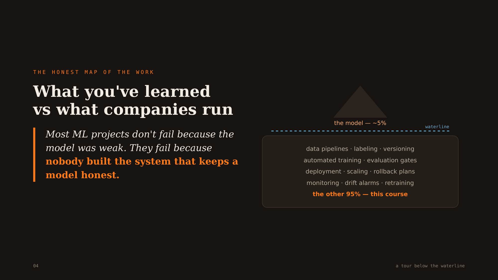
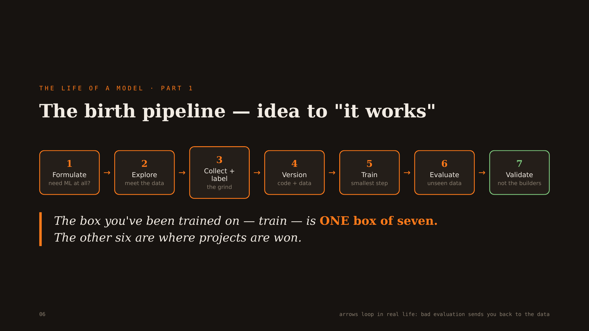
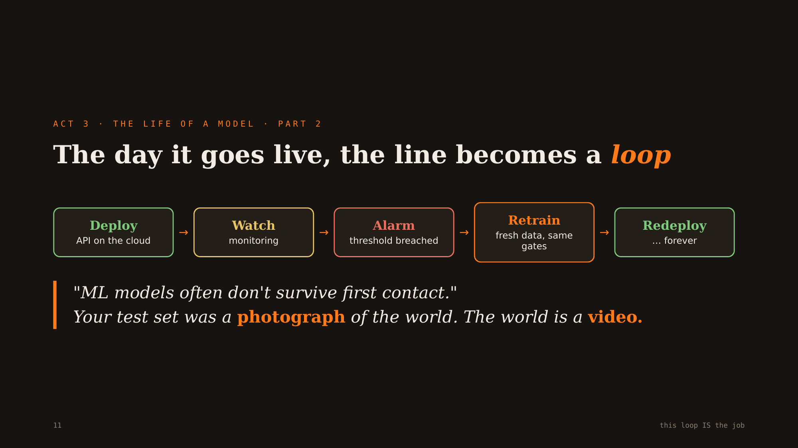
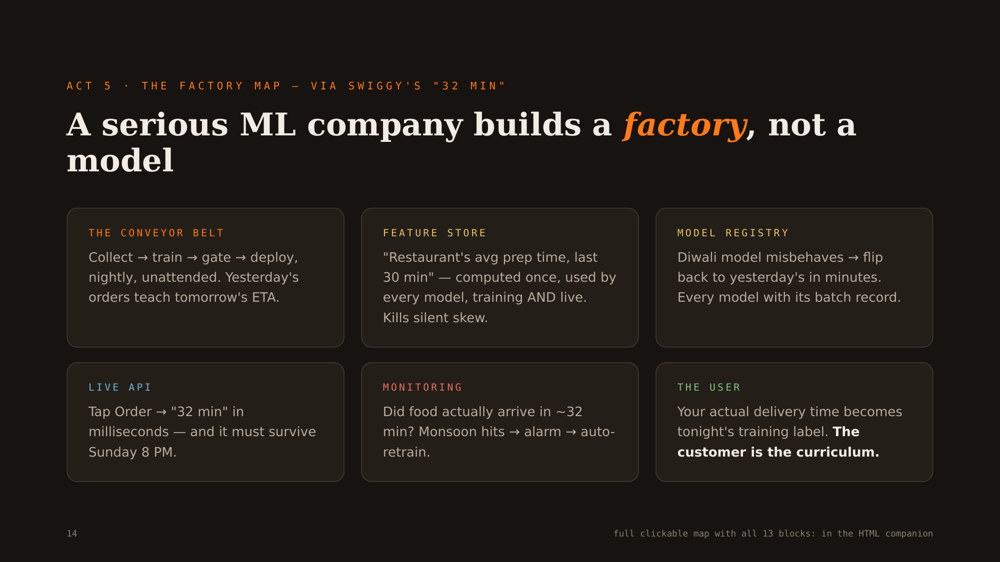

# The Model Is Only 5% — Anatomy of a Production ML System

*Dense, no filler. The mental map of everything that surrounds a model in production — every concept an interviewer (or a 3 AM pager) will probe.*

> **TL;DR.** A notebook that scores 91% is the *opening line* of the story, not the end. In a real ML system the model is roughly **5%** of the work; the other **95%** is the machinery that keeps it honest while the world moves underneath it — data pipelines, versioning, automated training, evaluation **gates**, deployment, monitoring, drift alarms, rollback, and retraining. Most ML projects don't fail because the model was weak; they fail because **nobody built the system**. The one sentence to carry out of this note: *a model can be perfectly **UP** and perfectly **WRONG** at the same time* — and the job of a Production ML Engineer is to build the factory that notices, before the customer does.

**Where it fits:** Session 01 of the **Production ML Track** (Scaler, *Future with Shivank*) — the map before the hands-on. This is the MLOps overview that later sessions (containers, Kubernetes, pipelines, feature stores, GenAI/RAG) build *on top of*, not instead of.
**Prereqs:** you can already train + evaluate a model — see [Classification Metrics](../Supervised%20ML/Classification%20Metrics.md) (precision/recall live at the heart of this note), [Object Detection](../Computer%20Vision/Object%20Detection.md) and [Transfer Learning](../Computer%20Vision/Transfer%20Learning.md) (the ID-card project), and [Ensemble Methods that Trade Off Bias vs Variance](../Supervised%20ML/Ensemble%20Methods%20that%20Trade%20Off%20Bias%20vs%20Variance.md) (imbalanced-fraud handling). No code to write yet — this session is the *architecture*; the wrench-work starts next time.

---

## Table of Contents

- [1. Intuition — Why the Model Is Only 5%](#1-intuition--why-the-model-is-only-5)
- [2. The Birth Pipeline — Idea to "It Works"](#2-the-birth-pipeline--idea-to-it-works)
- [3. The Loop — The Day It Goes Live](#3-the-loop--the-day-it-goes-live)
- [4. Drift and the Two Dashboards](#4-drift-and-the-two-dashboards)
- [5. Worked Example — SwiftPaisa and the ID-Card Reader](#5-worked-example--swiftpaisa-and-the-id-card-reader)
- [6. The Factory Map — 13 Blocks](#6-the-factory-map--13-blocks)
- [7. When It Breaks — The Silent Failures](#7-when-it-breaks--the-silent-failures)
- [8. Production and MLOps Notes — The Machines and the Ladder](#8-production-and-mlops-notes--the-machines-and-the-ladder)
- [9. The Three Pairs of Eyes — Who the Production ML Engineer Is](#9-the-three-pairs-of-eyes--who-the-production-ml-engineer-is)
- [10. Interview Lens](#10-interview-lens)
- [11. Alternatives and How to Choose](#11-alternatives-and-how-to-choose)
- [🧠 Self-Test](#-self-test)

---

## 1. Intuition — Why the Model Is Only 5%

You were trained on **one box** of the system: *train a model on a fixed dataset, report accuracy*. Companies run a **factory** around that box. Picture an iceberg:



```
                    ▲  the model — ~5%   (accuracy, the .fit() call)
                   ╱ ╲
~~~~~~~~~~~~~~~~~~ waterline ~~~~~~~~~~~~~~~~~~~~~~~~~~~~~~~~~~
   data pipelines · labeling · versioning · automated training
   evaluation gates · deployment · scaling · rollback plans
   monitoring · drift alarms · retraining        ← the other 95%
```

**The one analogy that reframes everything: software is a car, a model is a horse.** 🎯 *A car left in the garage behaves identically tomorrow. A horse doesn't — the world that feeds it keeps moving, so it changes even when you touch nothing.* A deployed model's behaviour is a function of **code AND data**; the data half drifts on its own. You can have **zero git commits** and a model that is quietly, steadily degrading. That single property is why normal software engineering rules (write it, test it, ship it, it's done) are *necessary but not sufficient* for ML.

Two consequences follow immediately, and the rest of this note is just their elaboration:

1. **A model is born once but must be re-born forever.** There is a one-time *birth pipeline* (§2) and then an endless *live loop* (§3). The line becomes a circle the day it ships.
2. **Failure is silent.** A crashed server pages you; a *wrong-but-running* model does not. Detecting the silent failure requires a second dashboard that most teams never build (§4).

> **Why "91% accuracy" is only the opening line.** It's a single photograph of one held-out test set on one day. It says nothing about: whether that test set still resembles today's users, what a wrong answer *costs* in each direction, whether the feature you computed in the notebook is computed the same way live, or who flips the switch back when it misbehaves at 9 PM. Those are the questions this note answers.

---

## 2. The Birth Pipeline — Idea to "It Works"

Before a model can live, it is *born* through seven stages. The famous one — **Train** — is exactly **one box of seven**. The other six are where projects are actually won or lost.



```
1 Formulate → 2 Explore → 3 Collect+label → 4 Version → 5 Train → 6 Evaluate → 7 Validate
  need ML?     meet data    the grind         code+data   1 night   unseen data   NOT the builders
      └──────────────────── arrows loop: a bad evaluation sends you back to the data ────────────┘
```

| # | Stage | What actually happens | The trap it prevents |
|---|-------|----------------------|----------------------|
| 1 | **Problem formulation** | Ask *is ML even needed?* then agree the **success metric with the business, in one sentence, before any code**. | Building a perfect answer to the wrong question — discovered last, paid for longest. |
| 2 | **Explore the data** | Look reality in the eye: sample real inputs and count how ugly they are. (In the ID project, only **~11%** of user photos were "clean"; a model trained on neat scans would fail 9 of 10 real users.) | A model trained on lab conditions that never sees a blurry, tilted, 2 AM photo. |
| 3 | **Collect, prepare & label** | The grind: gather thousands of examples, have humans **annotate** the answer key, then split into **train / validation / test**. Where real cases are scarce (fraud), generate **synthetic** ones with a domain expert. | "We'll get data later." Labels are the most expensive, most decisive, least glamorous asset. |
| 4 | **Version the data** | Code → Git; the **dataset gets its own versions** too (v3 fixed 214 bad labels, v4 added Indonesian cards). Every training run records *which* data version it used. | "Accuracy jumped/crashed — which dataset was that?" and the auditor's "why did you reject this card in March?" with no answer. |
| 5 | **Train the model** | Fine-tune a pretrained model; fire **several experiments in parallel** overnight, each auto-logged with its exact config + data version. The most *hands-off* box. | The whole journey's fame concentrated on its shortest step — one night of compute. |
| 6 | **Evaluate the model** | Score on **held-out photos it never saw**. For a fraud gate, weigh **precision vs recall** by their real costs (a miss usually hurts more than a false alarm — decided back in stage 1). | Reporting training-set accuracy; optimizing a metric the business never agreed to. |
| 7 | **Validate the model** | 🎯 **The board exam: people who did *not* build the model attack it** with nightmare cases (laminated cards with glare, photocopies, a photo of a card *on a screen*). Only *their* sign-off promotes it. | Grading your own homework. The builder approving the builder's own work is not validation. |

**Boards-exam analogy (holds all seven at once).** You've already run this pipeline — for board exams: *(1)* decide coaching is even worth it, *(2)* analyze past papers before studying, *(3)* grind question banks and mark every attempt, *(4)* keep dated organized notebooks, *(5)* the actual studying — famous, but one slice, *(6)* mock tests on unseen questions checked honestly, *(7)* the board exam graded by people who didn't teach you. **The production twist:** a deployed model re-sits its board exam *every single day* — and the syllabus keeps changing. That twist is §3.

> **Rules vs models, resolved (a classic interview trap).** 🎯 *"A regex can check whether a **string** is a PAN number. It cannot find the PAN **card** on your bedsheet."* A photo is ~12 million brightness numbers — no letters, no "card", no shapes — so there is no text for a rule to search *yet*. Use a **learned model for what nobody can write down** (find the card in a messy photo) and **simple rules for what anybody can** (validate the format `[A-Z]{5}[0-9]{4}[A-Z]`). Real KYC systems use **both — rules AFTER models**, never instead of them. "A rule you can never finish writing" *is* the definition of "the pattern is too complex," which is precisely when a model earns its place.

---

## 3. The Loop — The Day It Goes Live

The moment the model ships, the **line becomes a loop**. Deployment is not the finish line — it's the start of the part nobody warned you about.



```
   ┌────────────────────────── forever ──────────────────────────┐
   ▼                                                              │
 Deploy ──► Watch ──► Alarm ──► Retrain ──► Redeploy ─────────────┘
 API up    monitor   threshold  fresh data,   with the SAME
           2 dashes  breached   SAME gates     eval gates armed
```

🎯 **"Your test set was a *photograph* of the world. The world is a *video*."** The model froze one frame; reality keeps playing. *"ML models often don't survive first contact"* with live traffic — not because the math was wrong, but because the distribution the math assumed is already moving.

The loop's stages, and what each one really means in production:

1. **Deploy** — wrap the model in a **live API** (request → prediction in milliseconds) and put it behind autoscaling. This is a *software* job the data scientist usually can't do alone (§9).
2. **Watch** — run **two** dashboards, not one (§4). One asks *is it up?*, the other asks *is it right?*
3. **Alarm** — a monitored metric crosses a threshold (drift, business KPI, error rate). The alarm should be able to **auto-trigger** the retrain pipeline, not just email a human.
4. **Retrain** — rebuild on **fresh data**, but push the candidate through the **exact same evaluation + validation gates** as the original. Automation without gates just ships mistakes faster.
5. **Redeploy** — promote the winner (ideally via a safe rollout — canary/shadow, §8) with **rollback armed**. Then go back to Watch. The loop never ends; that endlessness is *why it must be automated*.

> **Retraining triggers — the follow-up you'll get.** Two schools: **scheduled** (retrain every N days — simple, wasteful, can lag a sudden shift) and **triggered** (retrain when drift/KPI breaches a threshold — responsive, needs solid monitoring). Mature systems do **both**: a cadence floor plus event-driven catch-ups. Retraining is not free — compute cost, label latency, and the risk of learning from a **feedback loop** you created (§7) all bound how aggressively you can loop.

---

## 4. Drift and the Two Dashboards

This is the single most important idea in the session, so state it flatly: 🎯 **a model can be perfectly UP and perfectly WRONG at the same time.** That is only visible if you run *two* dashboards.

```
 DASHBOARD A · SYSTEM HEALTH          DASHBOARD B · MODEL HEALTH
 ─────────────────────────           ────────────────────────────
 uptime 99.99%                        data drift ↑
 latency 41 ms                        approval rate 62% → 81%
 errors 0                             portfolio quality decaying
 "Is the kitchen open?"  ✅ green      "Does the food taste right?"  🔴 screaming
```

- **Dashboard A (system health)** is what every backend team already builds: uptime, latency, error rate, health checks. It answers *is the service running?*
- **Dashboard B (model health)** is the one ML teams forget: **data drift**, prediction distribution, business KPIs (approval rate, portfolio quality). It answers *is the service still correct?*

🎯 **Drift is a slow clock.** A wall clock with a weak battery keeps *ticking* (looks up) while losing five minutes a day (is wrong). A *stopped* clock announces its own failure — you'd catch that instantly. Drift is worse precisely because it *keeps running*. This is exactly the Zillow failure below: **Dashboard A was green throughout.**

**Vocabulary you must not blur (interviewers love this):**

| Term | What moved | Example (SwiftPaisa) |
|------|-----------|----------------------|
| **Data / covariate drift** | The input distribution `P(x)` | Gig-economy boom → applicant income patterns the model barely saw. |
| **Concept drift** | The input→output relationship `P(y\|x)` | A rate cycle changes *who repays* — the same profile now defaults. |
| **Label / prior drift** | The target distribution `P(y)` | Recession pushes the base default rate up. |
| **Training-serving skew** | Not drift at all — a **bug** (§7) | The "same" feature computed two different ways offline vs online. |

**How you actually *measure* drift (the part slides skip).** You don't eyeball it. Compare live feature distributions against the training reference with **PSI (Population Stability Index)** or a **KS test** per feature; watch the **prediction distribution** and, when labels arrive, the realized metric. The catch is **label latency**: a loan's true label ("did they repay?") takes *months*, so you often can't measure accuracy live — you monitor *proxies* (drift, approval rate, early-payment signals) and confirm with delayed ground truth. (Contrast Swiggy's ETA in §6, where the true label — actual delivery time — arrives **free, ~40 minutes later**.)

> **The canonical $500M failure — Zillow (Nov 2021).** America's biggest real-estate site used its famous price model to *actually buy houses*. The market turned faster than the model; it kept confidently buying homes at prices they could never be resold for — thousands of times, nobody caught it in time. **$500M+ written off, ~2,000 jobs (≈25% of the company), the division shut for good.** The model *wasn't wrong the day it shipped — it became wrong while it was running.* That is drift, undetected, at company-ending scale. Same movie plays daily, smaller, in UPI fraud (millisecond decisions on billions of transactions), instant lending (COVID made historical repayment patterns *fiction overnight*), and FASTag toll OCR (plates in rain, dust and fog).

---

## 5. Worked Example — SwiftPaisa and the ID-Card Reader

**SwiftPaisa** — a fictional instant personal-loan app. A user applies; within 10 minutes a model decides **approve or reject**. Every diagram in this note is read "through SwiftPaisa's eyes" because the two ways to be wrong have *wildly asymmetric* price tags — and that asymmetry is where evaluation, thresholds, and monitoring all come from.

### 5.1 The error-cost asymmetry (why you tune the threshold, not just accuracy)

```
                       MODEL SAYS APPROVE        MODEL SAYS REJECT
 Applicant is a        ✅ correct                 ❌ FALSE POSITIVE (fraud flag)
   GOOD customer                                    → competitor's app in minutes
                                                     → lose ₹8,000 margin
 Applicant is a        ❌ FALSE NEGATIVE           ✅ correct
   FRAUDSTER              → lose entire principal
                          → ₹2,00,000
```

Map it to metrics (see [Classification Metrics](../Supervised%20ML/Classification%20Metrics.md); "positive" = *fraud caught / rejected*):
- **Missing a fraudster** (approve a defaulter) costs **₹2,00,000** — a *recall* failure on the fraud class.
- **Wrongly rejecting a genuine customer** costs **₹8,000** of margin *and* goodwill — a *false positive*; "minimize false positives" is literally the second requirement in the business sentence.

A tiny cost model shows why a single threshold is a **business decision, made in stage 1**, that evaluation (stage 6) merely *checks*. Suppose a day brings **30 fraudsters and 970 genuine** applicants:

```
 Very LENIENT gate:  catch few fraudsters → many ₹2,00,000 misses → bleed slowly, quietly
 Very STRICT gate:   reject many genuine → each installs the competitor → "this app rejects everyone"
 SWEET SPOT:         where marginal fraud-loss saved = marginal customer-margin lost
```

🎯 **The threshold that minimizes total expected cost is `cost(FN)/cost(FP)`-weighted, not the 0.5 your notebook defaults to.** Here `cost(FN) ≈ 25 × cost(FP)`, so you lean *strict* — but not so strict you torch the funnel. For imbalanced fraud specifically, don't optimize raw accuracy (predicting "all genuine" scores 97%): use **precision-recall AUC**, **class weights / resampling**, and **probability calibration** so the score you threshold means what it says — the fraud-handling toolkit lives in [Ensemble Methods that Trade Off Bias vs Variance](../Supervised%20ML/Ensemble%20Methods%20that%20Trade%20Off%20Bias%20vs%20Variance.md) and [Anomaly Detection](../Unsupervised%20ML/Anomaly%20Detection.md).

### 5.2 Project 1 — the ID-card reader is really a fraud weapon

A KYC upload step that looks like plumbing is the fraud **gate** — fraud's favourite entry point is a fake identity, and *speed is the money*:

```
   FIND ───────────► READ ───────────► VERIFY
   the card in a     pixels →          against
   messy photo       "ABCDE1234F"      issuer records
  (object detection) (OCR)             (rules / lookup)
   ── all in seconds, while the user watches a spinner ──
```

1. **FIND** — an [object-detection](../Computer%20Vision/Object%20Detection.md) model locates the card inside a random phone photo (recall §2: no rule can do this). Typically a pretrained detector **fine-tuned** on labeled cards — see [Transfer Learning](../Computer%20Vision/Transfer%20Learning.md).
2. **READ** — OCR turns the card-number pixels into the string `ABCDE1234F`.
3. **VERIFY** — *now* a rule/lookup checks the format and the issuer records. Rules AFTER models.

**Why speed *is* the money:** catch the fake at **minute 0** and loss = **₹0** (the fraudster shrugs and leaves; nobody even notices). Miss it, and the loan is paid in 10 minutes; weeks pass, EMIs never arrive, the "customer" never existed — **₹2,00,000 gone.** The same fraudster, the same gate, two endings decided by whether the gate held.

---

## 6. The Factory Map — 13 Blocks

A serious ML company builds a **factory, not a model**. Here's the whole platform on one screen, read through the most familiar Indian ML feature there is — **Swiggy's "32 min" delivery estimate**.



```
 ① Problem def ──┐                                    ⑨ Data warehouse (outside)
 ② Architecture  │                                    Ⓓ Feature store  ← one truth for features
        │        │                                          │
        ▼   ┌────── Ⓐ PIPELINE ORCHESTRATION (the conveyor belt) ──────┐
            │  ③ Collect → ④ Train → ⑤ Evaluate&validate → ⑥ Deploy  │
             └────────────────────────────────────────────────────────┘
        Ⓒ Experiment tracking   Ⓑ Model registry (staging→prod, rollback = flip a pointer)
                                        │
                                 ⑦ Live API service Ⓔ ──► ⑧ Monitoring+logging ──► 🧑 User
                                                                                     │
                              (the user's real outcome becomes tomorrow's label) ◄───┘
```

Each block earns its place because *someone, somewhere, lost money without it.* The "what breaks without it" column is the real lesson:

| Block | What it is (plain words) | In Swiggy's "32 min" | What breaks without it |
|-------|--------------------------|----------------------|------------------------|
| ① Problem definition | Humans decide *what* to solve, whether ML is needed, and what "success" means — in numbers, before code. | "Predict ETA within ±5 min" — a wrong promise = angry customer / cancelled order. | A perfect answer to the wrong question. |
| ② Model architecture | Choose the model family. Almost nobody invents one — you **reuse and adapt** proven ones. | A proven tabular model, tuned. Innovation budget goes *around* the model. | Quarters burned building custom architectures a standard one would beat. |
| ③ Collect & prepare | Automated dataset building: pull, clean, shape — **on schedule, identically every time**. | Nightly assembly of yesterday's orders; **labels arrive free, ~40 min later** (actual delivery time). | Every retrain re-does cleaning slightly differently; reproducibility dies at step one. |
| ④ Train | Automated training inside the belt, every run logged with exact data + settings. | Retrains on fresh orders overnight — new restaurants, new traffic reach the model before lunch. | Training lives on someone's laptop; they take leave, model-making takes leave. |
| ⑤ Evaluate & validate | The automated **quality gate**: candidate must beat the live model on unseen data + pass business checks. | Tonight's candidate must beat production on yesterday's unseen orders, or the pipeline stops. | A bad retrain sails straight to prod — automation shipping mistakes faster. |
| ⑥ Deploy | Package the winner and roll it out automatically (container → registry → cluster). | 2 AM winner serves your 7 AM ETA; no human copied a file. Deployment as a non-event. | Deploying feels scary → done rarely → models go stale → **staleness *is* drift.** |
| ⑦ Live API service | The customer-facing organ: request → prediction in ms, at any load. | Tap Order → "32 min" before the screen finishes loading; must survive Sunday 8 PM. | The best model in the world hiding behind a spinner, earning nothing. |
| ⑧ Monitoring + logging | The **two dashboards** (§4); breaches can auto-fire retraining. | *Did food actually arrive in ~32 min?* Monsoon hits → alarm → retrain with rain data. | The Zillow failure — every day of the disaster looks green on system health. |
| ⑨ Data warehouse | Batch + streaming data the company already runs. **Outside** the platform — ours to *tap*, not build. | Every past order, prep time, rider GPS ping — stored for ops anyway. | The ML team drowns trying to *own* all company data instead of consuming it. |
| Ⓐ Pipeline orchestration | The conveyor belt that wires ③→⑥ into one scheduled, unattended flow. | The nightly ETA-model assembly line. | Steps run by hand, out of order, un-reproducibly. |
| Ⓑ Model registry | Versioned home of models + metadata; promotion staging→prod; **rollback = flip a pointer**. | Diwali model over-promises → flip to yesterday's in **minutes**, not a war room. | "Does anyone have the old model file?" — asked while orders cancel. |
| Ⓒ Experiment tracking | The factory's logbook: each run's data version, params, metrics, lineage. | "Which run made *today's* model?" → one query, re-runnable identically. | "We had a better model last month but can't reproduce it." |
| Ⓓ Feature store | Curated features computed **once**, served to **both** training and live serving — kills skew *by design*. | "Restaurant's avg prep time, last 30 min" — computed once, used by ETA, rider-assignment AND surge models. | The two-cooks bug (§7): training vs serving compute the "same" feature differently. |
| Ⓔ / 🧑 Live serving & the User | The point of it all — and the loop's fuel: user outcomes flow back as tomorrow's training data. | Your actual delivery time becomes tonight's labeled example. **The customer is the curriculum.** | You optimize metrics instead of outcomes; the model "improves" while dinners arrive late. |

---

## 7. When It Breaks — The Silent Failures

Loud failures (500 errors, crashes) are *easy* — they page you. Production ML's characteristic danger is the **silent** failure: wrong answers behind a green health check.

- **Training-serving skew — the two-cooks bug.** 🎯 *The most expensive bug that throws zero errors.* Two teams implement the "same" feature twice: training computes `monthly_income = avg(last 6 months, bonus included)`; the live API computes `avg(last 3 months, bonus excluded)`. Test accuracy **91%**, live accuracy **73%**, **0 errors in the logs** — every applicant just looks poorer to the live model than to the trained one. Weeks to hunt down. **A feature store (Ⓓ) makes this entire bug class impossible** by serving one feature definition from one place to both sides.
- **Drift (§4)** — covariate/concept/label. Detected with PSI/KS + business KPIs, not vibes. Untreated, it's Zillow.
- **No data versioning.** Accuracy jumps and you can't say which dataset did it; an auditor asks "why this decision in March?" and you have no reproducible answer. (Stage 4 exists for exactly this.)
- **Grading your own homework.** The builder validating the builder's model. Real validation is by a *different* team with adversarial cases (stage 7).
- **No rollback plan.** A bad model in prod with no fast way back = a war room per incident. Registry + a pointer-flip (Ⓑ) turns a crisis into a two-minute fix.
- **Degenerate feedback loops.** The model's own outputs become its future training data, amplifying its biases: reject a segment → collect no repayment data for them → "learn" they're unapprovable → reject harder. Watch for it wherever the model *gates* the very outcomes it later trains on.
- **Data-quality drift at the source.** An upstream team renames a column, changes units (₹ → paise), or starts sending nulls; the model doesn't crash, it just quietly ingests garbage. Schema/values **data validation** at ingestion (the "Great Expectations" idea) catches it before training does.
- **Optimizing the metric, not the outcome.** 99.99% uptime on a model that gives wrong answers is a *worse* outcome than honest downtime, because nobody knows to act.

---

## 8. Production and MLOps Notes — The Machines and the Ladder

**The maturity ladder — how ML orgs are actually graded (by how much of the loop is automated):**

```
 LEVEL 0 · HOME COOK      manual, heroic, mood-driven. "Deploy" = a person copies a file.
                          Most of the industry secretly lives here.
 LEVEL 1 · CLOUD KITCHEN  you deploy a RETRAINING PIPELINE, not a model. Gates, triggers,
                          train/serve symmetry. (This is CI + CD + Continuous Training.)
 LEVEL 2 · FRANCHISE      even pipelines ship through automation; the system opens new
                          "outlets" (models, regions) on its own.
```

🎯 The jump from Level 0 → 1 is the whole game: **you stop shipping a model and start shipping the *factory that produces models*.** Software CI/CD becomes ML's **CI + CD + CT** (Continuous Training) — the extra "T" is the horse (§1) that a car never needed.

**The machines under the floor** (a sneak peek — hands-on next session):

| Tool | The analogy | What it does | The leftover problem it fixes |
|------|-------------|--------------|-------------------------------|
| **Docker** | the tiffin box | Seals model + *every* dependency in one box that runs identically anywhere. | "Works on my machine" ceases to exist. |
| **Kubernetes** | the catering manager | Keeps N copies running; a pod dies at 3 AM → replaced, nobody paged; traffic spikes → scales up. | One box can't self-heal or scale. |
| **Helm** | the wedding package | A whole system installed with one command; upgrading a model = changing one line. | Wiring dozens of K8s pieces by hand. |

The endgame: **one `git push` → a monitored, live, self-healing model, zero humans in between.**

> **Kubernetes' one big idea — *desired state*.** You *declare* "I want 4 replicas of this model." The controller continuously compares **desired vs actual** and fights reality to close the gap: crash a pod → it launches a replacement automatically; a cricket-ad traffic spike → autoscaling raises desired 4→8; spike passes → scale back to 4 (paying for 8 pods at midnight is wasted money — elasticity matters *both* ways). 🎯 *You declare the goal; the system maintains it, at 3 AM, with no one awake.*

**Safe rollout — the deployment vocabulary interviews probe.** Don't flip 100% of traffic to a new model. **Shadow**: run the candidate silently alongside prod, compare, serve nothing from it. **Canary**: send it 1–5% of traffic, watch live metrics, ramp or roll back. **Blue-green**: two identical environments, switch the pointer, instant rollback. **Champion/challenger (A/B)**: measure the new model against the incumbent on a real **business** KPI, not offline accuracy. All of these lean on the registry (Ⓑ) and monitoring (⑧).

> **Governance is a first-class production concern, not paperwork** *(likely, for regulated domains like lending)*. A credit-decision model in India sits under **RBI digital-lending** norms and **DPDP** data rules: you may owe the applicant an **adverse-action reason** (→ explainability/SHAP), you must guard against **disparate impact** across protected groups (fairness auditing), and you need **lineage + model cards** so a regulator can reconstruct *which model, on which data, made this decision*. Build these into the factory; they're extremely expensive to retrofit. Next session picks up the wrench: **containers → Kubernetes → the pipeline engine** — see the forthcoming [[Containers, Kubernetes & the Pipeline Engine]] note.

---

## 9. The Three Pairs of Eyes — Who the Production ML Engineer Is

The role becomes obvious through one incident. **Friday, 9:04 PM:** SwiftPaisa's approval rate has silently crept 62% → 81% over six months. An alarm fires. Three people see three different movies:

```
 👩‍🔬 DATA SCIENTIST        🧑‍💻 SOFTWARE ENGINEER      🦾 PRODUCTION ML ENGINEER
 "Population shifted —      "Service is flawless,       "Alarm retrained Friday night,
  retrain on 90 days."       99.99% up, 0 errors,        gates passed, risk team validated,
                             nothing to fix."            deployed with rollback armed.
 Right diagnosis.          Can ship anything.            Here's the one-page report."
 Can't ship.               Can't see the disease.        ← that whole sentence is the job.
```

- The **data scientist** checks distributions and diagnoses *correctly* — but has no deploy access, no pipeline, no rollback. Her fix lives in a notebook until someone else productionises it. **Right, and stuck.**
- The **software engineer** checks uptime/latency/errors — all green — and *correctly* concludes it's not infra. But every instrument he owns measures whether the system is **UP**, none whether it is **RIGHT**. The disease is invisible on his dashboard. **Right, and stuck.**
- The **production ML engineer** isn't smarter than either. 🎯 *She stands exactly where the two halves meet — system + model, science + engineering — with a factory built **before** the incident.* System green + drift red = it's the model, not the machines; and the machinery (alarm → retrain → gate → validate → deploy-with-rollback) was already running while everyone slept.

> **How this scales to GenAI (the trailer).** GenAI does **not** replace this foundation — it's *built on it*. The foundation (pipelines · feature store · registry · deployment · monitoring loop) *survives*; the GenAI wing adds new skills to the **same** engineer: embeddings & vector search ([RAG](../../AI%20Engineering/RAG.md), [Embeddings](../../AI%20Engineering/Embeddings.md)), guardrails, cost routing & caching, jailbreak red-teaming, and [LLM evaluation](../../AI%20Engineering/Evaluating%20LLMs.md) (which is *harder* than a precision number — see [LLM](../../AI%20Engineering/LLM.md)). Same building, more floors.

---

## 10. Interview Lens

The question behind every production-ML question is: **do you understand that shipping a model is the *start*, and can you name the machinery that keeps it honest?** Kill-shots:

- 🎯 *"The model is ~5% of the system; the other 95% — pipelines, versioning, gates, deployment, monitoring, retraining — is where projects are won or lost."*
- 🎯 *"A model can be perfectly UP and perfectly WRONG at the same time; that's why you run two dashboards — system health **and** model health."*
- 🎯 *"Your test set is a photograph; the world is a video. Drift is a slow clock — it keeps ticking while losing time, which is why it's more dangerous than a crash."*
- 🎯 *"Training-serving skew is the most expensive bug that throws zero errors; a feature store kills it by design."*
- 🎯 *"A regex validates a PAN string; it can't find the PAN card in a photo. Learn what nobody can write down; rule what anybody can — rules **after** models."*

**Likely follow-ups (crisp answers):**
- *Data drift vs concept drift?* — Drift = inputs `P(x)` moved; concept = the input→label relationship `P(y|x)` moved. Same monitoring, different fix (reweight/retrain vs re-label/redefine). *(certain)*
- *How do you detect drift without labels?* — Monitor input distributions (PSI/KS) and the prediction distribution as proxies; confirm with delayed ground truth when labels arrive (label latency). *(certain)*
- *How do you deploy safely?* — Shadow → canary → blue-green, with A/B on a business KPI and one-pointer rollback via the registry. *(certain)*
- *CI/CD for ML — what's different?* — Add **CT** (Continuous Training): behaviour depends on data, not just code, so you version data, gate retrains, and monitor correctness in prod. *(certain)*
- *Why not just rules for fraud?* — Rules can't express high-dimensional patterns (a photo, a fraud ring's behaviour); models learn them. Production uses both, models first. *(certain)*

---

## 11. Alternatives and How to Choose

The full factory is a *cost*. A senior engineer knows when **not** to build it:

| Situation | Lean version | Why |
|-----------|--------------|-----|
| **Prototype / one-off analysis** | A notebook. No pipeline. | The model really *is* 100% of the job; nobody's life or money rides on it running tomorrow. |
| **Low-stakes, stable-world prediction** | Batch scoring on a schedule; simple monitoring. | No millisecond latency, slow-moving distribution → the loop can be weekly and manual. |
| **The pattern is writable** | **Rules, no model.** | If an analyst can state the logic, a model adds cost, opacity and a drift surface for nothing. |
| **Small team, don't build MLOps** | **Buy** managed platforms (SageMaker / Vertex / Databricks; managed feature stores; W&B/MLflow for tracking). | The factory blueprint is universal; you don't have to forge every machine yourself. |
| **High-stakes, real-time, moving world** (lending, fraud, ETA) | **The full factory.** | Exactly the Zillow/SwiftPaisa regime — silent drift here is company-ending. |

🎯 The decision rule: **build machinery in proportion to (stakes × how fast the world moves × how silently it can fail).** Low on all three → notebook. High on all three → factory.

---

## 🧠 Self-Test

1. Why is "the model is only 5%"? Name five things in the other 95%.
   <details><summary>answer</summary> The model (the <code>.fit()</code> + accuracy) is one box; the 95% is the machinery that keeps it honest as the world moves: data pipelines, labeling, **data/model versioning**, automated training, **evaluation gates**, deployment/serving, scaling, **rollback**, **monitoring (drift)**, retraining. Most projects fail because nobody built this, not because the model was weak. </details>

2. A model's API shows 99.99% uptime, 41 ms latency, 0 errors — is it healthy? What's the trap?
   <details><summary>answer</summary> Unknown — that's only **system health (Dashboard A)**. A model can be perfectly **UP** and perfectly **WRONG**. You also need **model health (Dashboard B)**: drift, prediction/approval distributions, business KPIs. Zillow's system dashboard was green while it lost $500M+. Drift is a slow clock: it keeps ticking while losing time. </details>

3. What is training-serving skew, why is it so dangerous, and what fixes it by design?
   <details><summary>answer</summary> Training and serving compute the "same" feature *differently* (e.g. income over 6 months w/ bonus offline vs 3 months w/o bonus online). It throws **zero errors** — test accuracy looks fine, live accuracy silently tanks (91% → 73%). A **feature store** fixes it by design: one feature definition, computed once, served to both training and inference. </details>

4. Walk the seven birth-pipeline stages. Which is the *least* work, and which does a *different team* have to sign off?
   <details><summary>answer</summary> Formulate → Explore → Collect+label → Version → Train → Evaluate → Validate. **Train** is the least work (one night, hands-off, parallel experiments). **Validate** must be signed off by people who did **not** build the model, attacking it with adversarial/nightmare cases — grading your own homework doesn't count. A bad *evaluate* loops you back to the data. </details>

5. SwiftPaisa loses ₹2,00,000 approving a fraudster but ₹8,000 rejecting a good customer. What does that asymmetry decide, and in which pipeline stage?
   <details><summary>answer</summary> It decides the **decision threshold** (and that you optimize a **cost-weighted** objective / precision-recall, not raw accuracy) — a **business decision made in stage 1 (problem formulation)**, that **stage 6 (evaluation)** then verifies the trained model honours. `cost(FN) ≈ 25 × cost(FP)` → lean strict, but not so strict you reject genuine users into the competitor's app. </details>

6. What's Kubernetes' "desired state," and why does it matter for an ML model at 3 AM?
   <details><summary>answer</summary> You declare the goal (e.g. "4 replicas"); the controller continuously reconciles **desired vs actual** and fights reality to maintain it — a pod OOM-crashes at 3 AM → auto-replaced, nobody paged; traffic spikes → autoscale up; spike ends → scale down (cost). Self-healing + elastic serving with zero humans awake — that's why serious serving runs on it. </details>

7. *(Synthesis)* Friday 9:04 PM: approval rate crept 62%→81% over six months, alarm fires. Why are the data scientist and the software engineer each *right and stuck*, and what makes the third person unstuck?
   <details><summary>answer</summary> The data scientist diagnoses correctly (population shifted, retrain 90 days) but **can't ship** — no deploy/pipeline/rollback. The software engineer sees all-green infra and correctly says "not my problem" but his instruments measure **UP**, never **RIGHT** — the disease is invisible to him. The production ML engineer stands where the two halves meet **with a factory built before the incident**: system-green + drift-red ⇒ it's the model; the alarm already auto-retrained, passed the same gates, was validated, and deployed with rollback armed. That whole sentence is the job. </details>
