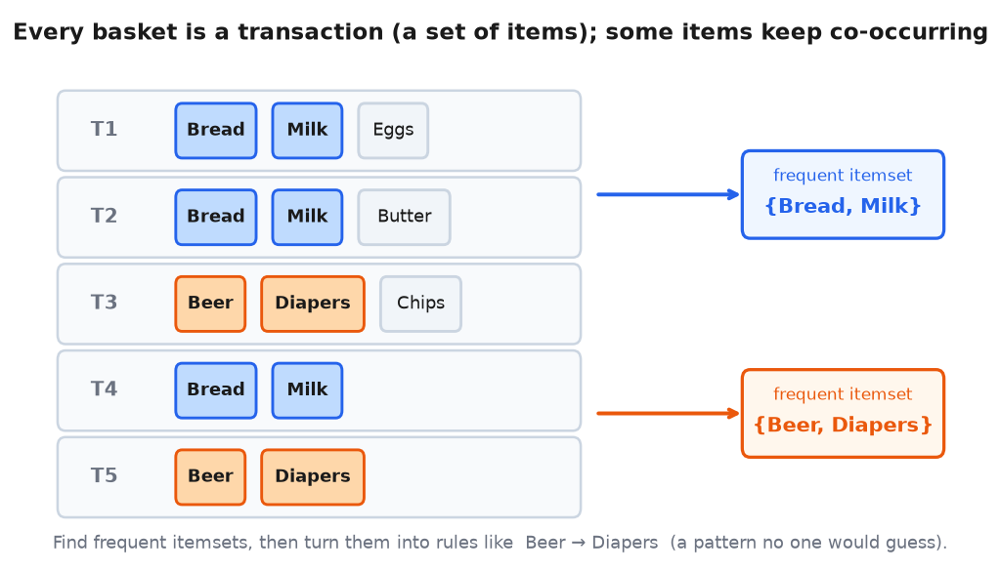

# Association Rules & Market Basket Analysis — What Gets Bought Together

> **TL;DR.** Market Basket Analysis mines transaction data to find items **frequently bought together** ("beer → diapers"), so you can place, bundle, and recommend them. The classic engine is **Apriori**: instead of checking all `2ⁿ` possible itemsets, it uses **minimum support** + the **downward-closure** property (if an itemset is rare, every superset is rarer → prune it) to find frequent itemsets, then extracts **association rules** `X → Y`. Judge each rule with **support** (how often), **confidence** (`P(Y|X)`), and — because confidence is fooled by popular items — **lift** (co-occurrence vs chance; >1 = real association), plus leverage/conviction. Apriori is `O(2ⁿ·m)` worst-case, so it's for **offline retail** (hundreds of items), not e-commerce → that's what [Recommendation Systems](Recommendation%20Systems.md) solve.

**Where it fits:** Unsupervised **pattern mining** on transaction data — the lead-in to [Recommendation Systems](Recommendation%20Systems.md). Related to frequent-pattern mining in bioinformatics, medicine, and web-usage mining.
**Prereqs:** basic probability (conditional probability, independence), sets/subsets.

> 🧠 **Start here, not at the top.** Jump straight to the [Self-Test](#-self-test), answer cold, then read **only** the sections you missed — a 5-minute pass instead of 30. *([why](../../_STUDY%20LOOP.md))*

---

## Table of Contents
1. [Intuition / Mental Model](#1-intuition--mental-model)
2. [The Problem & the Apriori Algorithm](#2-the-problem--the-apriori-algorithm)
3. [Association Rules — X → Y](#3-association-rules--x--y)
4. [The Metrics — Support, Confidence, Lift, Leverage, Conviction](#4-the-metrics--support-confidence-lift-leverage-conviction)
5. [Worked Example — Why Lift Beats Confidence](#5-worked-example--why-lift-beats-confidence)
6. [Code / Implementation](#6-code--implementation)
7. [When It Breaks & Applications](#7-when-it-breaks--applications)
8. [Interview Lens](#8-interview-lens)
- [🧠 Self-Test](#-self-test)

---

## 1. Intuition / Mental Model

Every checkout basket is a **transaction** — a set of items. Across millions of baskets, some items keep showing up together. Find those patterns and you can act: put them on adjacent shelves, bundle them, or recommend one when the other is in the cart.

```
Items D = {1..n}   Transactions (baskets):  T1={1,3,6,8}  T2={1,3,7,12}  T3={1,3,7,16} …
                                                 ↑ item 1 and item 3 keep co-occurring → itemset {1,3}
famous find: {beer} → {diapers}  (young dads, 5–7pm) — a pattern no human would have guessed.
```



- A **transaction** `T ⊆ D` (which items were bought; quantity ignored). An **itemset** is a set of items; a **frequent itemset** appears in many transactions. `(certain)`
- The goal: find frequent itemsets, then turn them into **rules** ("if X in the basket, then Y is likely too") ranked by how *strong* and *surprising* they are.

---

## 2. The Problem & the Apriori Algorithm

**The naive approach is hopeless.** With `n` items there are `2ⁿ` possible itemsets, and you'd scan all `m` transactions for each → `O(2ⁿ·m)`. For `n=100`, `2¹⁰⁰` is astronomical. `(certain)`

**Apriori's optimization: minimum support + downward closure.** Set a **minimum support** threshold `c`. Then use the key property: `(certain)`

> 🎯 **Downward closure (anti-monotone):** if an itemset is infrequent, *every superset of it is also infrequent* — so you can prune it and all its supersets without checking them.

```
Apriori (level-wise):
1. count all size-1 itemsets → keep only those with support ≥ c
2. build size-2 candidates ONLY from frequent size-1 items → count → keep frequent
3. build size-3 candidates ONLY from frequent size-2 itemsets → … repeat
   (any candidate containing an infrequent subset is skipped — that's the pruning)
```


Example (`c=100`): if `{4}` occurs 50 times (<c), drop `{4}` and every itemset containing it. This slashes the candidate space — but the **worst case is still `O(2ⁿ·m)`**, so Apriori only works when `n` is small (offline stores). `(certain)`

**FP-Growth** improves on it with a compact prefix-tree (a **trie** / "FP-tree") that mines frequent patterns in fewer data scans and no candidate generation — faster, but still frequent-itemset mining, still not scalable to e-commerce's millions of items. `(likely)`

---

## 3. Association Rules — X → Y

From frequent itemsets, extract **rules**. If `{1,2,3,4,6}` is frequent, split it into `X → Y` (e.g. `X={1,2,3} → Y={4,6}`): *"people who buy X tend to also buy Y."* `(certain)`

- **Antecedent** = the "if" side (`X`, what's in the basket). **Consequent** = the "then" side (`Y`, what they'll likely add).
- 🎯 **Direction matters:** `X → Y ≠ Y → X`. "Beer → diapers" (diaper-buyers grab beer) is not the same as "diapers → beer." A metric is needed to say which rules are actually *strong*.

---

## 4. The Metrics — Support, Confidence, Lift, Leverage, Conviction

Let `N` = total transactions. `(certain)`

```
Support(X)        = count(X) / N                         # how frequent X is  →  P(X)
Confidence(X→Y)   = support(X ∪ Y) / support(X)          # of X-baskets, how many have Y  →  P(Y|X)
Lift(X→Y)         = support(X ∪ Y) / (support(X)·support(Y))  =  Confidence(X→Y) / support(Y)
Leverage(X→Y)     = support(X ∪ Y) − support(X)·support(Y)
Conviction(X→Y)   = (1 − support(Y)) / (1 − Confidence(X→Y))
```


- **Support** = probability an itemset appears; sets the Apriori threshold. High support ≠ useful rule (could be two unrelated popular items).
- **Confidence** = `P(Y | X)`. **Its flaw:** it's inflated whenever `Y` is *popular* — `{toothbrush} → {milk}` gets high confidence just because almost everyone buys milk, not because of any real link. `(certain)`
- **Lift** fixes that by comparing observed co-occurrence to what you'd expect *if X and Y were independent* (`P(X)·P(Y)`): `(certain)`
  - `lift = 1` → independent (no association).
  - `lift > 1` → **positive** association (bought together more than chance).
  - `lift < 1` → **negative** association (rarely bought together).
  - Range `[0, ∞)`. 🎯 Lift is the metric that separates a *real* pattern from a *popular-item artifact*.
- **Leverage** = the *difference* between observed and expected co-occurrence; `0` = independence, positive = positive association. Bounded and easier to read than lift (an absolute gap rather than a ratio).
- **Conviction** = how much the rule would be *wrong* if X and Y were independent; `1` = independence, higher = the consequent depends more strongly on the antecedent.

---

## 5. Worked Example — Why Lift Beats Confidence

**`{Bread} → {Milk}`** — 600,000 transactions: Bread in 7,500 (1.25%), Milk in 60,000 (10%), both in 6,000 (1%).
```
Confidence = 6000/7500 = 0.80         → 80% of bread-buyers also buy milk
Lift       = 0.80 / 0.10 = 8          → 8× more likely than chance → STRONG real association ✅
```

**`{Toothbrush} → {Milk}`** — 100 transactions: Milk in 80, Toothbrush in 14, both in 10.
```
Confidence = 10/14 ≈ 0.71             → looks high!
Lift       = 0.71 / 0.80 ≈ 0.89       → < 1 → actually a NEGATIVE association ❌
```

Same-looking high confidence (0.80 vs 0.71), opposite truth: bread↔milk is real (lift 8), toothbrush↔milk is a mirage created by milk's popularity (lift 0.89). **That's exactly why you rank rules by lift, not confidence.** `(certain)`


---

## 6. Code / Implementation

`mlxtend` gives Apriori + rules directly. Encode baskets as a one-hot (transaction × item) matrix of 0/1: `(certain)`

```python
from mlxtend.frequent_patterns import apriori, association_rules

# `basket` = one-hot DataFrame: rows = InvoiceNo, columns = items, values 1 (bought) / 0
freq = apriori(basket, min_support=0.03, use_colnames=True)     # frequent itemsets (support ≥ 3%)

rules = association_rules(freq, metric="lift", min_threshold=1)  # keep lift ≥ 1
rules.sort_values("lift", ascending=False).head()               # strongest associations first
#  columns: antecedents, consequents, support, confidence, lift, leverage, conviction
```

Read the top rule (highest lift), confirm the direction (antecedent support > consequent support), then act: **item placement**, **bundling**, or **checkout recommendation/discount**.

---

## 7. When It Breaks & Applications

- **Doesn't scale to e-commerce.** `O(2ⁿ·m)` worst case → fine for a supermarket's few hundred items, useless for Amazon's millions. That scale gap is *why* [Recommendation Systems](Recommendation%20Systems.md) (collaborative filtering, matrix factorization) exist. `(certain)`
- **Threshold sensitivity:** too-high `min_support` misses niche-but-valuable rules; too-low explodes the candidate count. Tune it.
- **Correlation, not causation:** a rule is a co-occurrence pattern, not proof X *causes* Y buying.
- **Beyond retail** — the same frequent-pattern mining applies to **bioinformatics** (co-occurring gene/protein sequences), **medicine** (drug combinations frequently co-prescribed), and **web-usage mining** (pages visited together in a session).

---

## 8. Interview Lens

**"Why isn't confidence enough — why do you need lift?"** → 🎯 *"Confidence `P(Y|X)` is inflated when Y is popular — `{toothbrush}→{milk}` scores high just because everyone buys milk. Lift divides by `P(Y)`, comparing observed co-occurrence to independence: >1 is a real positive association, <1 is negative. It filters out popular-item artifacts."*

**"How does Apriori avoid checking all 2ⁿ itemsets?"** → 🎯 *"Minimum support + the downward-closure property: if an itemset is infrequent, every superset is too, so it prunes those branches. It builds frequent itemsets level by level from smaller frequent ones — though the worst case is still `O(2ⁿ·m)`."*

**Likely follow-ups:**
- *Support vs confidence vs lift?* → Support = `P(X)` (frequency); confidence = `P(Y|X)`; lift = `P(X,Y)/(P(X)P(Y))` (vs chance).
- *Is `X→Y` the same as `Y→X`?* → No — confidence/conviction are directional (lift is symmetric).
- *What does lift = 1 / <1 / >1 mean?* → independent / negative association / positive association.
- *Apriori vs FP-Growth?* → FP-Growth uses a prefix tree (FP-tree), avoids candidate generation, fewer scans → faster; both mine frequent itemsets.
- *Why doesn't this work for e-commerce?* → Exponential in item count; millions of items → use collaborative filtering / matrix factorization instead.
- *Leverage vs lift?* → Leverage is a difference (0 = independence, bounded, easy to read); lift is a ratio (unbounded above).

---

## 🧠 Self-Test
*Cover the answers; retrieve first.*

1. What property lets Apriori prune the search space, and what's the worst-case complexity anyway?
   <details><summary>answer</summary>Downward closure (anti-monotonicity): if an itemset is infrequent, all its supersets are too → prune them. Worst case is still `O(2ⁿ·m)`, so it only suits small item counts.</details>
2. Write confidence and lift, and say why lift is needed.
   <details><summary>answer</summary>`Confidence(X→Y)=support(X∪Y)/support(X)=P(Y|X)`; `Lift=Confidence/support(Y)=P(X,Y)/(P(X)P(Y))`. Confidence is inflated by popular consequents; lift corrects by comparing to independence.</details>
3. A rule has confidence 0.7 but lift 0.9. Ship it?
   <details><summary>answer</summary>No — lift < 1 means the items co-occur *less* than chance (negative association); the high confidence is just because the consequent is popular.</details>
4. Interpret lift = 1, lift = 8, lift = 0.5.
   <details><summary>answer</summary>1 = independent (no association); 8 = strong positive (8× more than chance); 0.5 = negative association (bought together half as often as chance).</details>
5. Why can't Apriori power an e-commerce recommender?
   <details><summary>answer</summary>It's exponential in the number of items (`2ⁿ`); with millions of items it's infeasible. E-commerce uses collaborative filtering / matrix factorization instead.</details>
6. Antecedent vs consequent, and does direction matter?
   <details><summary>answer</summary>Antecedent = the "if"/left side (in the basket); consequent = the "then"/right side (likely added). Direction matters — `X→Y ≠ Y→X` for confidence/conviction.</details>

---

*Covers: transactions & frequent itemsets, the 2ⁿ blow-up, Apriori (minimum support + downward-closure pruning), FP-Growth, association rules (antecedent/consequent, directionality), support/confidence/lift/leverage/conviction with formulas and the confidence-vs-lift trap, mlxtend implementation, scalability limits (→ recommendation systems), and cross-domain applications. Sourced from the Scaler Recommendation Systems lecture (market-basket portion).*
