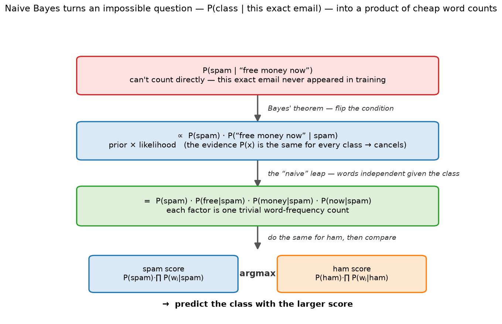

# Naive Bayes — Probabilistic Classification via Bayes' Theorem

> **TL;DR.** Naive Bayes picks the class with the highest **posterior** `P(y | features) ∝ P(y) · Πⱼ P(featureⱼ | y)` — a class **prior** times the product of per-feature **likelihoods**. The "naive" part is assuming features are **conditionally independent given the class** — usually false, but it makes the math trivially cheap and works shockingly well, especially for **text** (spam, sentiment). It trains in a single count-and-divide pass, needs no scaling, thrives in high dimensions and on small data — but its probability estimates are overconfident, and a never-seen feature zeroes the whole product unless you apply **Laplace smoothing**.

**Where it fits:** Supervised **classification**, the classic **text** baseline (spam, topic, sentiment). It's the **generative** counterpart to [Logistic Regression](Logistic%20Regression.md)'s discriminative approach — models how the data is generated per class, rather than the boundary directly.
**Prereqs:** conditional probability & Bayes' theorem, [Classification Metrics](Classification%20Metrics.md), bag-of-words/tokenization (see [Text Preprocessing](../NLP/Text%20Preprocessing.md)).

> 🧠 **Start here, not at the top.** Jump straight to the [Self-Test](#-self-test), answer cold, then read **only** the sections you missed — a 5-minute pass instead of 30. *([why](../../_STUDY%20LOOP.md))*

---

## Table of Contents
1. [Intuition / Mental Model](#1-intuition--mental-model)
2. [The Formal Core — Bayes + the naive assumption](#2-the-formal-core--bayes--the-naive-assumption)
3. [How It Works](#3-how-it-works)
4. [Worked Example](#4-worked-example)
5. [Laplace Smoothing — the zero-frequency fix](#5-laplace-smoothing--the-zero-frequency-fix)
6. [Bias–Variance via α](#6-biasvariance-via-α)
7. [The Variants — Bernoulli, Multinomial, Gaussian](#7-the-variants--bernoulli-multinomial-gaussian)
8. [When It Breaks](#8-when-it-breaks)
9. [Production & MLOps Notes](#9-production--mlops-notes)
10. [Interview Lens](#10-interview-lens)
11. [Alternatives & How to Choose](#11-alternatives--how-to-choose)
- [🧠 Self-Test](#-self-test)

---

## 1. Intuition / Mental Model

You know "*Nigerian prince*", "*lottery*", "*free money*" scream **spam**. Naive Bayes formalises that hunch: for a new email, ask *"how likely is this exact bag of words if it were spam? if it were ham?"* — weight each by how common spam/ham are overall — and pick the winner.

```
                                    P(words | spam) · P(spam)
   P(spam | words)  =  ───────────────────────────────────────────
                                        P(words)        ← same for both classes → ignore

   compare  P(spam)·∏ P(wordⱼ|spam)   vs   P(ham)·∏ P(wordⱼ|ham)   → predict the larger
```

- **Bayes' theorem flips the hard question into easy ones.** `P(spam | words)` is impossible to count directly (that exact email never appeared), but `P(word | spam)` is a trivial word-frequency count. `(certain)`
- **The naive leap:** treat each word's presence as **independent given the class**, so the joint likelihood factorises into a product of single-word likelihoods. That turns an intractable joint probability into `d` cheap counts. `(certain)`



---

## 2. The Formal Core — Bayes + the naive assumption

**Bayes' theorem** applied to classification:

```
P(y | x) = P(x | y) · P(y) / P(x)
           └likelihood┘ └prior┘  └evidence: identical across classes → drop it┘
```

Since we only **compare** classes, the shared denominator `P(x)` cancels. We predict:

```
ŷ = argmax_y  P(y) · P(x | y)
```

- **Prior `P(y)`** = class frequency: `P(spam) = (#spam) / (#total)`. `(certain)`
- **Likelihood `P(x | y)`** is the joint `P(w₁, w₂, …, w_d | y)` — intractable to count directly (you'd need emails with that exact word combination).

**The naive assumption — conditional independence:**

```
P(w₁, w₂, …, w_d | y)  ≈  P(w₁|y) · P(w₂|y) · … · P(w_d|y)   =  Πⱼ P(wⱼ | y)
```

🎯 **Why "naive," and the interview trap:** words obviously aren't independent ("Nigerian" and "prince" co-occur). But the assumption is that they're independent **conditioned on the class** — *not* marginally independent. People confuse the two; it's conditional independence given `y`. `(certain)`

Each word likelihood is a count: `P(wⱼ | y=1) = (# class-1 texts containing wⱼ) / (# class-1 texts)`.

---

## 3. How It Works

**Training** — one counting pass, no iteration, no gradient descent: `(certain)`

```
1. Priors:      P(y=k) = count(y=k) / N          for each class
2. Likelihoods: P(wⱼ | y=k) = count(wⱼ, y=k) / count(y=k)   for every word × class
   (+ Laplace smoothing, §5)
```

**Prediction** — multiply prior × likelihoods for each class, take the argmax:

```
score(y=k) = P(y=k) · Πⱼ P(wⱼ | y=k)   → predict argmax
```

**Use logs in practice.** Multiplying hundreds of small probabilities underflows to 0. Work in **log-space** — products become sums, which is numerically stable and faster: `(certain)`

```
log score(y=k) = log P(y=k) + Σⱼ log P(wⱼ | y=k)
```

**No feature scaling** — Naive Bayes is *information/count-based*, not distance-based, so standardization does nothing for it. `(certain)`

---

## 4. Worked Example

Training set: **4 spam, 6 ham** (N=10). Priors: `P(spam)=0.4`, `P(ham)=0.6`.

Word counts (texts containing the word): `"free"` → 3/4 spam, 1/6 ham; `"meeting"` → 0/4 spam, 4/6 ham.

**Query = "free meeting"**, naively `score ∝ P(y)·P(free|y)·P(meeting|y)`:

```
Without smoothing:
  P(meeting | spam) = 0/4 = 0   →  spam score = 0.4·0.75·0 = 0   ← the zero-frequency problem!
```

One unseen (here, zero-count) word nukes the whole class. Apply **Laplace smoothing** (α=1, C=2 possible states):

```
P(free|spam)=(3+1)/(4+2)=0.667   P(meeting|spam)=(0+1)/(4+2)=0.167
P(free|ham) =(1+1)/(6+2)=0.25    P(meeting|ham) =(4+1)/(6+2)=0.625

spam score ∝ 0.4·0.667·0.167 = 0.0446
ham  score ∝ 0.6·0.25 ·0.625 = 0.0938   →  HAM wins
```

Smoothing rescued the maths, and the strong ham signal ("meeting") correctly wins.


---

## 5. Laplace Smoothing — the zero-frequency fix

**The problem:** any word never seen with a class gives `P(word | class) = 0`, and one zero in the product makes the *entire* class score 0 — a single unknown word can veto everything. `(certain)`

**The fix (additive / Laplace smoothing):** add `α` to every numerator and `α·C` to the denominator (`C` = number of possible values the feature can take, e.g. vocabulary size or 2 for present/absent):

```
P(wⱼ | y=k) = (count(wⱼ, y=k) + α) / (count(y=k) + α·C)
```

Now no probability is ever exactly 0 — an unseen word gets a small non-zero likelihood instead of a veto. `α = 1` is classic Laplace; `α` is a **hyperparameter** (tune it). `(certain)`

---

## 6. Bias–Variance via α

`α` is the single knob, and it trades off exactly like a regularizer: `(certain)`

```
α → very large   likelihoods get swamped by α → all ≈ 0.5 → they cancel in the comparison
                 → prediction depends ONLY on the class prior → UNDERFIT (high bias)
α → very small   smoothing ≈ off → likelihoods ≈ raw counts → memorises training words
                 → OVERFIT (high variance)
α = α_best       tune on validation (GridSearchCV over e.g. [0.01, 0.1, 1, 10])
```

🎯 *"Large α underfits (predictions collapse to the prior); small α overfits (raw counts). It's the smoothing/regularization strength."*

---

## 7. The Variants — Bernoulli, Multinomial, Gaussian

Same Bayes machinery, different likelihood model per feature type: `(certain)`

| Variant | Feature model | Use for |
|---|---|---|
| **Bernoulli NB** | word **present / absent** (binary) | short texts where presence matters, not counts |
| **Multinomial NB** | word **counts / frequencies** | text classification — the standard choice (bag-of-words / TF-IDF) |
| **Gaussian NB** | continuous features, per-class **Gaussian** `P(x|y)=N(μ_yₖ, σ²_yₖ)` | numeric features (not text) |

Multinomial keeps *how many times* a word appears (richer signal than Bernoulli's yes/no), at slightly more cost — it's the default for text. Gaussian handles continuous inputs by assuming each feature is normally distributed within a class (estimate per-class mean & variance). `(certain)`


---

## 8. When It Breaks

- **Correlated features** — the independence assumption is violated when features co-occur (e.g. "New" + "York"), and NB **double-counts** the shared evidence, skewing scores. 🎯 **Yet it often still classifies well** — because it only needs the *right class to have the highest score* (correct argmax), not accurate probabilities. So NB is a strong *classifier* even when its *probabilities* are wrong. `(certain)`
- **Overconfident probabilities.** Multiplying "independent" evidence pushes `predict_proba` toward 0/1 — **poorly calibrated**. Use it for ranking/argmax, not as literal probabilities; calibrate if you need trustworthy scores. `(certain)`
- **Zero-frequency** — unseen feature values zero the product; always smooth (§5).
- **Continuous features** — plain (multinomial/Bernoulli) NB expects discrete/count features; for numeric data use **Gaussian NB** or bin the values, and know Gaussian NB assumes normality per class.
- **Not for regression** — it's inherently a classifier (models discrete class posteriors).

---

## 9. Production & MLOps Notes

- **Blazingly fast & tiny.** Training is a single counting pass — `O(N·d)` once — and inference is a few table lookups + a sum of logs. It scales to huge vocabularies and streams/updates incrementally (`partial_fit`). A great **baseline** and a fine production model for text at scale. `(certain)`
- **Text pipeline:** `CountVectorizer` (or `TfidfVectorizer`) → sparse count matrix → `MultinomialNB`. **Fit the vectorizer on train only**, transform test — same leakage discipline as everywhere. The matrix is sparse (each doc has a handful of the thousands of vocab words), which NB handles natively.
- **Generative model.** NB learns `P(x|y)` and `P(y)`, so it can in principle *generate* data and cope with missing features by dropping their terms — unlike discriminative [Logistic Regression](Logistic%20Regression.md), which models `P(y|x)` directly and usually wins when you have enough data.
- **Imbalance:** the class prior already encodes base rates; still evaluate with F1/PR-AUC not accuracy ([Classification Metrics](Classification%20Metrics.md)), and note Multinomial NB is fairly robust because likelihoods, not just priors, drive the decision.
- **Log-space always** in production to avoid underflow (§3).

---

## 10. Interview Lens

**"Why is Naive Bayes 'naive'?"** → 🎯 *"It assumes features are conditionally independent **given the class** — not marginally independent. That's usually false (words co-occur), but it factorises the joint likelihood into cheap per-feature counts, and the argmax is often still correct."*

**"How does it handle a word it never saw in training?"** → 🎯 *"Without smoothing its likelihood is 0 and zeroes the whole class score. Laplace smoothing adds α to counts so nothing is ever exactly zero."*

**Likely follow-ups:**
- *Priors vs likelihoods?* → Prior = class frequency `P(y)`; likelihood = per-feature `P(wⱼ|y)`; posterior ∝ prior × Π likelihoods.
- *Why does it work despite the false independence assumption?* → It needs only the correct class to score highest, not calibrated probabilities; argmax is robust to the assumption being wrong.
- *Bernoulli vs Multinomial vs Gaussian?* → presence/absence, counts, continuous-Gaussian respectively.
- *What does α do to bias/variance?* → Large α → underfit (collapses to prior); small α → overfit (raw counts).
- *Generative or discriminative?* → Generative (models `P(x|y)`, `P(y)`); logistic regression is discriminative.
- *Does it need feature scaling?* → No — it's count/information-based, not distance-based.
- *Why work in log-space?* → Products of many small probabilities underflow; logs turn them into stable sums.
- *Are its probabilities reliable?* → Often overconfident/poorly calibrated — trust the ranking/argmax more than the raw probability.

---

## 11. Alternatives & How to Choose

| Situation | Reach for | Why |
|---|---|---|
| Text classification (spam/topic/sentiment), fast baseline | **Multinomial Naive Bayes** | trains in one pass, strong on bag-of-words, tiny |
| Same task, more data, want a stronger boundary | **[Logistic Regression](Logistic%20Regression.md)** | discriminative; usually beats NB given enough data |
| Continuous numeric features | **Gaussian NB** or **[trees](Decision%20Trees.md)** | NB variants assume a feature distribution; trees don't |
| Highly correlated features matter | **[Logistic Regression](Logistic%20Regression.md) / [trees](Decision%20Trees.md)** | NB double-counts correlated evidence |
| Need calibrated probabilities | **[Logistic Regression](Logistic%20Regression.md)** (or calibrate NB) | NB probabilities are overconfident |
| Top tabular accuracy | **[Gradient-boosted trees](Ensemble%20Methods%20that%20Trade%20Off%20Bias%20vs%20Variance.md)** | capture interactions NB assumes away |

**Decision rule:** reach for Naive Bayes as the **fast, cheap text baseline** — it's often within a few points of much heavier models and trains instantly. Move to logistic regression or trees when you have enough data, when features are strongly correlated, or when you need calibrated probabilities.

---

## 🧠 Self-Test
*Cover the answers; force retrieval first.*

1. Write the quantity Naive Bayes maximises and name each part.
   <details><summary>answer</summary>`ŷ = argmax_y P(y)·Πⱼ P(wⱼ|y)` — class **prior** `P(y)` times the product of per-feature **likelihoods** `P(wⱼ|y)`; the evidence `P(x)` cancels across classes.</details>
2. What exactly is the "naive" assumption, and what's the common mistake about it?
   <details><summary>answer</summary>Features are **conditionally independent given the class**, so the joint likelihood factorises. The mistake is calling it *marginal* independence — it's independence conditioned on `y`.</details>
3. A test email contains a word never seen in training. What happens, and what fixes it?
   <details><summary>answer</summary>Its likelihood is 0, which zeroes the whole class score (zero-frequency problem). Laplace smoothing — add α to numerators and α·C to denominators — prevents any zero.</details>
4. How does α trade off bias and variance?
   <details><summary>answer</summary>Large α → likelihoods swamped toward 0.5, they cancel, prediction depends only on the prior → underfit. Small α → raw counts → overfit. Tune α on validation.</details>
5. Bernoulli vs Multinomial vs Gaussian NB?
   <details><summary>answer</summary>Bernoulli = word present/absent (binary); Multinomial = word counts (standard for text); Gaussian = continuous features modelled as per-class normals.</details>
6. Why does NB classify well even though the independence assumption is usually false?
   <details><summary>answer</summary>Classification only needs the correct class to have the highest score, not accurate probabilities; the argmax is robust even when the estimated probabilities are off.</details>
7. Why compute scores in log-space, and does NB need scaling?
   <details><summary>answer</summary>Multiplying many small probabilities underflows to 0; logs turn the product into a stable sum. No scaling needed — NB is count/information-based, not distance-based.</details>

---

*Covers: Bayes' theorem for classification, priors & likelihoods, the conditional-independence assumption (and why it still works), argmax decision, log-space computation, Laplace smoothing & the zero-frequency problem, α as the bias-variance/regularization knob, Bernoulli/Multinomial/Gaussian variants, calibration caveats, generative-vs-discriminative, and the text pipeline (CountVectorizer/TF-IDF). Sourced from the Scaler Naive Bayes lecture.*
